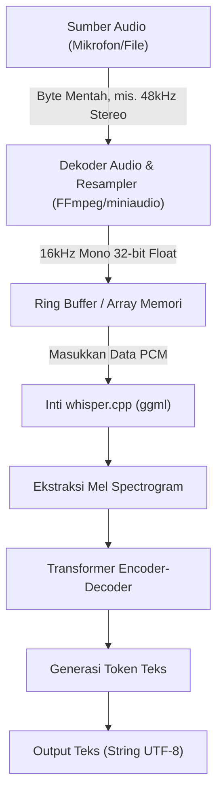
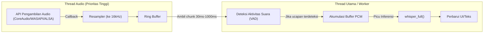

## 1. Pengantar: Mengapa Menggunakan C++ untuk Pengenalan Suara?

Model pengenalan suara berakurasi tinggi "Whisper" yang dikembangkan oleh OpenAI telah dimanfaatkan dalam berbagai aplikasi sejak dijadikan sumber terbuka (open-source). Penggunaannya dalam lingkungan Python (berbasis PyTorch) memang umum, tetapi jika diintegrasikan ke dalam **perangkat edge (ponsel pintar, perangkat IoT, sistem tertanam)** atau **aplikasi C++ native yang membutuhkan real-time tinggi** (mesin game, perangkat lunak DAW, robotika, dll.), ketergantungan pada interpreter Python akan menjadi hambatan kinerja (bottleneck) yang signifikan.

Di sinilah **[whisper.cpp](https://github.com/ggerganov/whisper.cpp)** yang dikembangkan oleh Georgi Gerganov hadir sebagai penyelamat. Pustaka ini berbasis `ggml`, sebuah pustaka komputasi tensor untuk pembelajaran mesin, yang meminimalkan dependensi hingga batas maksimal dan mewujudkan inferensi Whisper hanya dengan menggunakan C/C++.

Pada artikel ini, kami akan menjelaskan secara menyeluruh cara mengintegrasikan fitur pengenalan suara terbaik ke dalam proyek C++ Anda sendiri menggunakan `whisper.cpp`. Penjelasan mencakup dasar-dasar pemrosesan sinyal suara, cara terperinci menggunakan API, manajemen memori, optimasi multi-threading, hingga pola implementasi pemrosesan real-time.

---

## 2. Pemrosesan Sinyal Audio dan Persyaratan Input Whisper

Agar AI dapat memahami suara, sinyal analog berupa "suara" perlu diubah menjadi data digital dan diformat ke dalam bentuk yang dapat diproses oleh model AI (tensor). Format audio yang diminta oleh Whisper sangat ketat.

### 2.1 Format Audio yang Diminta oleh Whisper

Model Whisper menerima data audio dengan spesifikasi berikut sebagai input:

* **Frekuensi Sampling (Sample Rate)**: 16.000 Hz (16 kHz)
* **Jumlah Saluran (Channels)**: 1 (Mono)
* **Tipe Data (Data Type)**: Angka floating-point 32-bit (`float` dalam C/C++)
* **Normalisasi (Normalization)**: Nilai diskalakan ke rentang $[-1.0, 1.0]$

Misalnya, jika Anda menggunakan file audio kualitas CD (44.1kHz, Stereo, 16-bit PCM) sebagai input, Anda harus melakukan downsampling, mixdown saluran, dan konversi format terlebih dahulu.

Rumus untuk menghitung kecepatan transfer data adalah sebagai berikut:

$$ \text{Data Rate (bytes/sec)} = \text{Sample Rate} \times \text{Channels} \times \frac{\text{Bit Depth}}{8} $$

Ukuran data untuk 1 detik dengan persyaratan Whisper (16kHz, 1ch, 32-bit Float) adalah:

$$ 16000 \times 1 \times \frac{32}{8} = 64,000 \text{ bytes/sec (64 KB/s)} $$

Karena ukurannya sangat ringan, buffering dapat dilakukan dengan mudah bahkan pada perangkat edge dengan bandwidth memori yang terbatas.

### 2.2 Matematika Transformasi Mel-Spectrogram

Secara internal, Whisper tidak memproses data bentuk gelombang audio 1D (Raw Waveform) secara langsung. Data tersebut dikonversi ke **Mel-Spectrogram**, sebuah representasi frekuensi yang mendekati karakteristik pendengaran manusia, sebelum dimasukkan ke model Transformer. Pustaka `whisper.cpp` menyertakan proses konversi ini di dalam implementasi C++-nya, namun memahami cara kerjanya akan berguna untuk mitigasi noise dan optimasi prapemrosesan.

Rumus aproksimasi untuk mengubah frekuensi normal $f$ (Hz) ke skala Mel $m$ adalah sebagai berikut:

$$ m = 2595 \log_{10} \left( 1 + \frac{f}{700} \right) $$

Sebaliknya, transformasi balik dari skala Mel ke frekuensi adalah:

$$ f = 700 \left( 10^{\frac{m}{2595}} - 1 \right) $$

Selanjutnya, bentuk gelombang audio diubah ke domain waktu-frekuensi menggunakan **Short-Time Fourier Transform (STFT)**. Bentuk diskret STFT menggunakan fungsi jendela $w(n)$ direpresentasikan sebagai berikut:

$$ X(m, k) = \sum_{n=0}^{N-1} x(n + mH) w(n) e^{-j \frac{2\pi}{N} k n} $$
*(Di mana $N$ adalah ukuran jendela FFT, $H$ adalah ukuran hop, dan $w(n)$ adalah fungsi jendela seperti jendela Hann)*

Model Whisper biasanya menggunakan ukuran jendela $N = 400$ (25ms), ukuran hop $H = 160$ (10ms), dan 80 dimensi filter bank Mel. Ekstraksi fitur ini dijalankan secara otomatis (dan dengan cepat menggunakan instruksi SIMD) saat memanggil `whisper_full()` di dalam `whisper.cpp`.

---

## 3. Arsitektur dan Desain Pipeline

Mari kita merancang pipeline pemrosesan audio dalam aplikasi C++. Prosesnya dimulai dari input file atau mikrofon, berlanjut ke prapemrosesan, inferensi oleh `whisper.cpp`, hingga menghasilkan output teks.



Bagian yang menjadi tanggung jawab aplikasi Anda adalah **zona dari A hingga C pada diagram di atas (dekode dan resample audio)**. Karena `whisper.cpp` sendiri tidak menyertakan dekoder file audio, praktik terbaiknya adalah dengan mengombinasikannya dengan pustaka seperti FFmpeg atau `miniaudio`.

---

## 4. Build dan Integrasi whisper.cpp

Berikut adalah langkah-langkah untuk mengintegrasikan `whisper.cpp` ke dalam proyek Anda. Menggunakan CMake adalah metode yang paling serbaguna.

### Konfigurasi CMakeLists.txt

Anda dapat menyertakan `whisper.cpp` sebagai kode sumber (source code) ke dalam proyek Anda, atau menambahkannya sebagai submodule lalu menautkannya.

```cmake
cmake_minimum_required(VERSION 3.14)
project(WhisperApp C CXX)

set(CMAKE_CXX_STANDARD 17)
set(CMAKE_CXX_STANDARD_REQUIRED ON)

# Mengaktifkan ekstensi instruksi CPU (AVX, F16C, dll.)
# Pada MacOS, framework NEON/Accelerate akan diaktifkan secara otomatis
set(WHISPER_SUPPORT_SDL2 OFF CACHE BOOL "" FORCE)
add_subdirectory(whisper.cpp)

add_executable(whisper_app main.cpp)
target_link_libraries(whisper_app PRIVATE whisper)
```

Konfigurasi ini akan mem-build backend `ggml` dari `whisper.cpp` yang sangat dioptimalkan, lalu menautkannya secara statis ke aplikasi Anda.

---

## 5. Detail dan Langkah-langkah Implementasi C++ API

Selanjutnya, kami akan menjelaskan cara menggunakan API dengan melihat kode C++ yang sebenarnya.

### 5.1 Inisialisasi Konteks dan Memuat Model

Dalam `whisper.cpp`, semua status dan alokasi memori dikelola oleh struktur `whisper_context`.

```cpp
#include "whisper.h"
#include <iostream>
#include <vector>
#include <string>

int main() {
    // 1. Inisialisasi parameter
    struct whisper_context_params cparams = whisper_context_default_params();
    cparams.use_gpu = true; // Gunakan akselerasi GPU (CuBLAS/Metal) jika tersedia

    // 2. Memuat model (model biner dalam format ggml)
    const std::string model_path = "models/ggml-base.bin";
    struct whisper_context * ctx = whisper_init_from_file_with_params(model_path.c_str(), cparams);

    if (ctx == nullptr) {
        std::cerr << "Error: Gagal memuat model - " << model_path << std::endl;
        return 1;
    }
    
    std::cout << "Model berhasil dimuat." << std::endl;
```

File model memiliki format `.bin` yang dikuantisasi secara khusus. Anda dapat menggunakan skrip konversi di repositori resminya, atau mengunduhnya langsung dari HuggingFace. Pada lingkungan dengan memori terbatas, menggunakan model kuantisasi 4-bit (misalnya `ggml-base-q4_0.bin`) dapat mengurangi konsumsi RAM hingga sekitar 1/4.

### 5.2 Pengaturan Parameter Inferensi

Selanjutnya, atur `whisper_full_params` untuk mengontrol perilaku inferensi.

```cpp
    // 3. Mengatur parameter untuk full inferensi (menggunakan Greedy Sampling)
    struct whisper_full_params wparams = whisper_full_default_params(WHISPER_SAMPLING_GREEDY);
    
    // Pengaturan jumlah thread (paling ideal disamakan dengan jumlah core fisik CPU)
    wparams.n_threads = 4;
    
    // Pengaturan bahasa ("auto" untuk deteksi otomatis, "id" untuk bahasa Indonesia, "ja" untuk bahasa Jepang)
    wparams.language = "ja";
    
    // Menekan standard output hasil sementara (untuk dikontrol di dalam aplikasi)
    wparams.print_progress = false;
    wparams.print_realtime = false;
    
    // Fitur terjemahan (set ke true jika ingin menerjemahkan suara langsung ke teks bahasa Inggris)
    wparams.translate = false;
```

### 5.3 Persiapan Data Audio dan Eksekusi Inferensi

Di sini, kita asumsikan bahwa data audio 16kHz telah disimpan di dalam `std::vector<float>`.

```cpp
    // Data audio virtual (pada kenyataannya data PCM didapat dari file atau mikrofon)
    // 3 detik (16000 Hz * 3 detik = 48000 sampel)
    std::vector<float> pcmf32(48000, 0.0f); 

    // 4. Eksekusi inferensi
    if (whisper_full(ctx, wparams, pcmf32.data(), pcmf32.size()) != 0) {
        std::cerr << "Error: Eksekusi whisper_full gagal." << std::endl;
        whisper_free(ctx);
        return 1;
    }
```

### 5.4 Ekstraksi Hasil

Setelah `whisper_full` selesai dieksekusi, hasil pengenalan suara akan disimpan per segmen di dalam konteks.

```cpp
    // 5. Mengambil dan menampilkan hasil
    const int n_segments = whisper_full_n_segments(ctx);
    
    for (int i = 0; i < n_segments; ++i) {
        const char * text = whisper_full_get_segment_text(ctx, i);
        
        // Mendapatkan timestamp (satuan: 10ms)
        const int64_t t0 = whisper_full_get_segment_t0(ctx, i);
        const int64_t t1 = whisper_full_get_segment_t1(ctx, i);
        
        std::cout << "[" << (t0 * 10.0) << " ms -> " << (t1 * 10.0) << " ms]: " 
                  << text << std::endl;
    }

    // 6. Pembebasan memori
    whisper_free(ctx);
    return 0;
}
```

Blok kode ini merupakan template paling mendasar untuk menggunakan Whisper di C++.

---

## 6. Implementasi Lanjutan untuk Pengenalan Suara Real-time

Memproses rekaman file memang mudah, tetapi untuk meningkatkan UX aplikasi, diperlukan "pengenalan suara real-time (streaming)" dari input mikrofon.

Untuk mengimplementasikannya, arsitektur multi-threading dan manajemen aliran audio melalui ring buffer (Ring Buffer) sangatlah penting.



### 6.1 Pentingnya Voice Activity Detection (VAD)

Dalam pemrosesan real-time, mengeksekusi inferensi pada bagian tanpa suara akan membuang-buang sumber daya komputasi. Dengan menempatkan algoritma VAD (seperti pemrosesan threshold berbasis energi sederhana atau WebRTC VAD) di tahapan awal, Anda dapat menerapkan sistem kontrol di mana **"buffering hanya dimulai ketika ucapan terdeteksi, dan `whisper_full` dieksekusi ketika ucapan berakhir (setelah periode tanpa suara tertentu)".**

### 6.2 Pendekatan Jendela Geser (Sliding Window)

Jika ucapan berlangsung lama, digunakan metode "jendela geser" di mana inferensi dilakukan dengan memotong (chunking) audio setiap beberapa detik. Namun, jika Anda memotong audio secara asal, kata-kata mungkin terpotong di tengah dan akurasi pengenalan suara akan menurun drastis.

Sebagai solusinya, digunakan metode **"overlap"**, di mana inferensi selalu menyertakan konteks dari N detik terakhir. Pustaka `whisper.cpp` juga memiliki fitur `wparams.prompt_tokens` yang meneruskan token teks sebelumnya sebagai prompt, memungkinkan pengenalan suara streaming dengan akurasi tinggi sambil mempertahankan konteks pembicaraan.

---

## 7. Manajemen Memori dan Optimasi untuk Perangkat Edge

Mari kita gali lebih dalam mengenai efisiensi performa dan memori, yang merupakan keunggulan terbesar dari `whisper.cpp`.

### 7.1 Kehebatan Pustaka Tensor ggml

Backend dari `whisper.cpp`, yaitu `ggml`, adalah pustaka tensor berbasis C tanpa dependensi eksternal. Fitur terbesarnya adalah dukungannya untuk **kuantisasi dinamis (Quantization) dari data bobot (weight)**.

Misalnya, mari kita hitung ukuran memori dari model Whisper `Small` (sekitar 240 juta parameter).
Untuk ukuran normal (Float 16-bit = 2 byte):

$$ \text{Memory (FP16)} \approx 244,000,000 \times 2 \text{ bytes} \approx 488 \text{ MB} $$

Jika dikonversi ke kuantisasi 4-bit (format Q4_0), ukuran rata-rata setiap parameternya menjadi 0,5 byte (sekitar 0,56 byte termasuk overhead koefisien penskalaan).

$$ \text{Memory (Q4\_0)} \approx 244,000,000 \times 0.56 \text{ bytes} \approx 137 \text{ MB} $$

Pada lingkungan yang memiliki RAM sangat terbatas seperti perangkat iOS atau Raspberry Pi, pengurangan memori ini berkorelasi langsung dengan stabilitas keseluruhan aplikasi.

### 7.2 Pemanfaatan Akselerasi Perangkat Keras

Meskipun instruksi AVX2 atau NEON pada CPU tunggal sudah cukup cepat, `whisper.cpp` juga mendukung berbagai bentuk akselerasi perangkat keras GPU dan NPU pada backend-nya.

* **Apple Silicon (Mac/iOS)**: Dukungan API Metal melalui `ggml-metal`. Inferensi super cepat menggunakan GPU.
* **GPU NVIDIA (Windows/Linux)**: Dukungan `cuBLAS`. Tetapkan `-DWHISPER_CUBLAS=ON` saat build menggunakan CMake.
* **Intel (Windows/Linux)**: Mendukung backend `OpenVINO`. Anda dapat memanfaatkan NPU pada prosesor Intel Core terbaru.

Saat menggunakan akselerator tersebut dalam proyek C++, pada dasarnya Anda tidak perlu mengubah kode sumber. Selama `cparams.use_gpu = true;` disetel saat inisialisasi konteks, pemrosesan akan otomatis dioffload ke perangkat keras berdasarkan backend yang dibuild.

### 7.3 Tuning Cache dan Jumlah Thread

Pengaturan `wparams.n_threads` sangat krusial. Menambah jumlah thread secara berlebihan tidak akan meningkatkan performa karena adanya bottleneck (Memory Bound) pada bandwidth memori.

Sebagai aturan praktis, sangat ideal untuk menentukan jumlah thread dengan rumus berikut:

$$ N_{\text{threads}} = \min(\text{Jumlah Core Fisik CPU}, 4 \sim 8) $$

Sangat disarankan untuk menyetel ke **jumlah core fisik**, karena menyertakan core logis (seperti pada Hyper-Threading) sering kali memicu kompetisi cache yang justru memperlambat laju inferensi. Jika Anda memanggil `std::thread::hardware_concurrency()` dari C++11, nilai yang dikembalikan adalah jumlah core logis. Karena itu, direkomendasikan untuk melakukan hard-coding yang sesuai dengan lingkungan, atau mendapatkan informasi core fisik melalui API pada tingkat OS.

---

## 8. Kesimpulan

Pada artikel ini, kami telah menjelaskan secara rinci tentang cara memanfaatkan `whisper.cpp` untuk mengintegrasikan AI pengenalan suara canggih ke dalam proyek C++, mulai dari teori, praktik, hingga langkah-langkah optimasinya.

* **Memenuhi Persyaratan Input**: Memastikan penggunaan 16kHz, 1ch, 32-bit Float.
* **Penggunaan API yang Intuitif**: Desain yang sederhana di mana inferensi diselesaikan hanya dengan `whisper_init_from_file_with_params` dan `whisper_full`.
* **Pemrosesan Real-time**: Kontrol multi-threading dengan VAD dan metode Jendela Geser.
* **Optimasi yang Luar Biasa**: Manfaat kuantisasi 4-bit oleh `ggml` dan backend perangkat keras seperti Metal/cuBLAS.

Silakan manfaatkan `whisper.cpp` untuk memutus ketergantungan pada lingkungan Python yang berat atau API cloud, serta mewujudkan pengembangan aplikasi pemrosesan suara yang dapat beroperasi secara cepat dan aman di lingkungan native. AI yang berjalan secara lokal niscaya akan menjadi teknologi kunci dalam pengembangan perangkat lunak masa depan, terutama dari sisi perlindungan privasi dan latensi.

