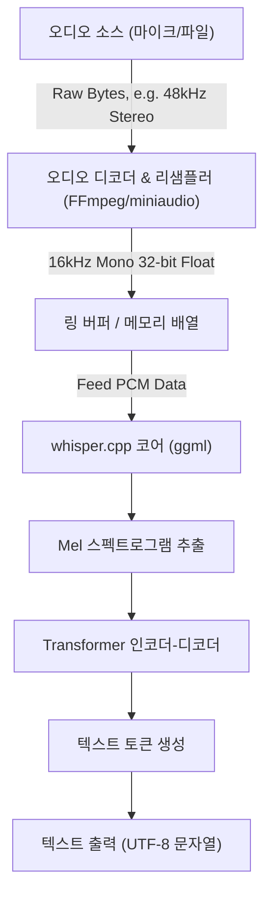
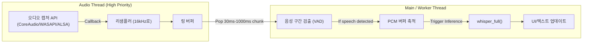

## 1. 시작하며: 왜 C++로 음성 인식을 하는가

OpenAI가 개발한 고정밀 음성 인식 모델 'Whisper'는 오픈 소스화된 이후 다양한 애플리케이션에서 활용되고 있습니다. Python 환경(PyTorch 기반)에서의 사용이 일반적이지만, **에지 디바이스(스마트폰, IoT 기기, 임베디드 시스템)** 나 **높은 실시간성이 요구되는 네이티브 C++ 애플리케이션**(게임 엔진, DAW 소프트웨어, 로보틱스 등)에 통합할 경우 Python 인터프리터에 대한 의존성은 성능상 큰 병목 현상이 됩니다.

그래서 구세주가 되는 것이 Georgi Gerganov 씨가 개발한 **[whisper.cpp](https://github.com/ggerganov/whisper.cpp)** 입니다. 이 라이브러리는 머신러닝을 위한 텐서 연산 라이브러리인 `ggml`을 기반으로 의존성을 극한으로 줄이고, C/C++만으로 Whisper의 추론을 구현하고 있습니다.

본 기사에서는 이 `whisper.cpp`를 사용하여 독자적인 C++ 프로젝트에 최고 수준의 음성 인식 기능을 통합하는 방법을 음성 신호 처리의 기초, API의 상세한 사용법, 메모리 관리, 멀티스레딩 최적화, 그리고 실시간 처리 구현 패턴에 이르기까지 철저하게 해설합니다.

---

## 2. 음성 신호 처리와 Whisper의 입력 요건

AI가 음성을 이해하게 하려면 아날로그 신호인 '소리'를 디지털 데이터로 변환하여 AI 모델이 처리할 수 있는 형식(텐서)으로 만들어야 합니다. Whisper가 요구하는 오디오 형식은 매우 엄격합니다.

### 2.1 Whisper가 요구하는 오디오 형식

Whisper 모델은 다음 스펙의 오디오 데이터를 입력으로 받습니다.

* **샘플링 주파수 (Sample Rate)**: 16,000 Hz (16 kHz)
* **채널 수 (Channels)**: 1 (모노럴)
* **데이터 타입 (Data Type)**: 32-bit 부동 소수점 (`float` in C/C++)
* **정규화 (Normalization)**: $[-1.0, 1.0]$ 범위로 스케일링된 값

예를 들어, CD 음질(44.1kHz, 스테레오, 16-bit PCM)의 오디오 파일을 입력으로 할 경우 사전에 다운샘플링과 채널의 믹스다운, 포맷 변환을 수행해야 합니다.

데이터 전송 속도 계산식은 다음과 같습니다.

$$ \text{Data Rate (bytes/sec)} = \text{Sample Rate} \times \text{Channels} \times \frac{\text{Bit Depth}}{8} $$

Whisper의 요건(16kHz, 1ch, 32-bit Float)에서의 1초간 데이터 크기는:

$$ 16000 \times 1 \times \frac{32}{8} = 64,000 \text{ bytes/sec (64 KB/s)} $$

매우 가볍기 때문에 메모리 대역폭이 제한된 에지 디바이스에서도 충분히 버퍼링이 가능합니다.

### 2.2 Mel 스펙트로그램 변환의 수학적 원리

Whisper의 내부에서는 1차원 음성 파형 데이터(Raw Waveform)를 직접 처리하는 것이 아닙니다. 인간의 청각 특성에 가까운 주파수 표현인 **Mel 스펙트로그램 (Mel-Spectrogram)** 으로 변환한 후 Transformer 모델에 입력됩니다. `whisper.cpp`는 이 변환 처리를 C++ 구현 내에 포함하고 있지만, 원리를 이해해 두는 것은 노이즈 대책이나 전처리 최적화에 도움이 됩니다.

일반적인 주파수 $f$ (Hz)를 Mel 척도 $m$으로 변환하는 수식은 다음과 같이 근사됩니다.

$$ m = 2595 \log_{10} \left( 1 + \frac{f}{700} \right) $$

반대로 Mel 척도에서 주파수로의 역변환은 다음과 같습니다.

$$ f = 700 \left( 10^{\frac{m}{2595}} - 1 \right) $$

또한, 음성 파형은 **단시간 푸리에 변환 (STFT: Short-Time Fourier Transform)** 에 의해 시간-주파수 영역으로 변환됩니다. 윈도우 함수 $w(n)$을 사용한 STFT의 이산 형식은 다음과 같이 표현됩니다.

$$ X(m, k) = \sum_{n=0}^{N-1} x(n + mH) w(n) e^{-j \frac{2\pi}{N} k n} $$
*(여기서 $N$은 FFT 윈도우 크기, $H$는 홉 크기, $w(n)$은 해닝 윈도우 등의 윈도우 함수)*

Whisper 모델에서는 보통 윈도우 크기 $N = 400$ (25ms), 홉 크기 $H = 160$ (10ms), 80차원의 Mel 필터 뱅크를 사용합니다. 이 특징 추출은 `whisper.cpp` 내의 `whisper_full()` 호출 시에 자동으로 (그리고 SIMD 명령을 사용하여 고속으로) 실행됩니다.

---

## 3. 아키텍처 및 파이프라인 설계

C++ 애플리케이션에서의 오디오 처리 파이프라인을 설계해 보겠습니다. 파일 입력 또는 마이크 입력에서 시작하여 전처리를 거쳐 `whisper.cpp`에 의한 추론, 그리고 텍스트 출력에 이르는 흐름입니다.



애플리케이션 측에서 책임져야 할 부분은 위 그림에서의 **A에서 C까지의 구간(오디오의 디코딩 및 리샘플링)** 입니다. `whisper.cpp` 자체는 오디오 파일 디코더를 포함하고 있지 않으므로 FFmpeg나 `miniaudio` 같은 라이브러리를 조합하여 사용하는 것이 모범 사례입니다.

---

## 4. whisper.cpp의 빌드 및 도입

프로젝트에 `whisper.cpp`를 통합하는 절차입니다. CMake를 사용하는 것이 가장 범용성이 높습니다.

### CMakeLists.txt 설정

`whisper.cpp`는 소스 코드로 프로젝트에 가져오거나 서브 모듈로 추가하여 링크합니다.

```cmake
cmake_minimum_required(VERSION 3.14)
project(WhisperApp C CXX)

set(CMAKE_CXX_STANDARD 17)
set(CMAKE_CXX_STANDARD_REQUIRED ON)

# CPU 확장 명령 활성화 (AVX, F16C 등)
# MacOS의 경우 NEON/Accelerate 프레임워크가 자동으로 활성화됩니다
set(WHISPER_SUPPORT_SDL2 OFF CACHE BOOL "" FORCE)
add_subdirectory(whisper.cpp)

add_executable(whisper_app main.cpp)
target_link_libraries(whisper_app PRIVATE whisper)
```

이 설정을 통해 `whisper.cpp`의 고도로 최적화된 `ggml` 백엔드가 빌드되어 애플리케이션에 정적으로 링크됩니다.

---

## 5. C++ API 상세 및 구현 절차

그러면 실제 C++ 코드를 보면서 API 호출 방법을 설명하겠습니다.

### 5.1 컨텍스트 초기화 및 모델 로드

`whisper.cpp`에서는 모든 상태와 메모리 할당이 `whisper_context` 구조체로 관리됩니다.

```cpp
#include "whisper.h"
#include <iostream>
#include <vector>
#include <string>

int main() {
    // 1. 파라미터 초기화
    struct whisper_context_params cparams = whisper_context_default_params();
    cparams.use_gpu = true; // GPU 가속(CuBLAS/Metal)을 사용할 수 있는 경우 사용

    // 2. 모델 로드 (ggml 형식의 바이너리 모델)
    const std::string model_path = "models/ggml-base.bin";
    struct whisper_context * ctx = whisper_init_from_file_with_params(model_path.c_str(), cparams);

    if (ctx == nullptr) {
        std::cerr << "에러: 모델을 로드하는 데 실패했습니다 - " << model_path << std::endl;
        return 1;
    }
    
    std::cout << "모델을 정상적으로 로드했습니다." << std::endl;
```

모델 파일은 자체적으로 양자화된 `.bin` 형식입니다. 공식 리포지토리에 있는 변환 스크립트를 사용하거나 HuggingFace에서 직접 다운로드합니다. 메모리 제한이 엄격한 환경에서는 4-bit 양자화 모델(예: `ggml-base-q4_0.bin`)을 사용함으로써 RAM 소비량을 약 1/4로 줄일 수 있습니다.

### 5.2 추론 파라미터 설정

다음으로 추론의 동작을 제어하는 `whisper_full_params`를 설정합니다.

```cpp
    // 3. 풀 추론용 파라미터 설정 (Greedy Sampling 사용)
    struct whisper_full_params wparams = whisper_full_default_params(WHISPER_SAMPLING_GREEDY);
    
    // 스레드 수 설정 (CPU의 물리적 코어 수에 맞추는 것이 최적)
    wparams.n_threads = 4;
    
    // 언어 설정 (자동 판별은 "auto", 일본어 지정은 "ja")
    wparams.language = "ja";
    
    // 중간 결과의 표준 출력을 억제 (앱 내에서 제어하기 위해)
    wparams.print_progress = false;
    wparams.print_realtime = false;
    
    // 번역 기능 (일본어 음성을 영어 텍스트로 직접 번역할 경우 true)
    wparams.translate = false;
```

### 5.3 오디오 데이터 준비 및 추론 실행

여기서는 이미 `std::vector<float>`에 16kHz의 오디오 데이터가 저장되어 있다고 가정합니다.

```cpp
    // 가상의 오디오 데이터 (실제로는 파일이나 마이크에서 가져온 PCM 데이터)
    // 3초간 (16000 Hz * 3 sec = 48000 samples)
    std::vector<float> pcmf32(48000, 0.0f); 

    // 4. 추론 실행
    if (whisper_full(ctx, wparams, pcmf32.data(), pcmf32.size()) != 0) {
        std::cerr << "에러: whisper_full 실행에 실패했습니다." << std::endl;
        whisper_free(ctx);
        return 1;
    }
```

### 5.4 결과 추출

`whisper_full`이 완료되면 컨텍스트 내에 인식 결과가 세그먼 단위로 저장됩니다.

```cpp
    // 5. 결과 가져오기 및 표시
    const int n_segments = whisper_full_n_segments(ctx);
    
    for (int i = 0; i < n_segments; ++i) {
        const char * text = whisper_full_get_segment_text(ctx, i);
        
        // 타임스탬프 가져오기 (단위: 10ms)
        const int64_t t0 = whisper_full_get_segment_t0(ctx, i);
        const int64_t t1 = whisper_full_get_segment_t1(ctx, i);
        
        std::cout << "[" << (t0 * 10.0) << " ms -> " << (t1 * 10.0) << " ms]: " 
                  << text << std::endl;
    }

    // 6. 메모리 해제
    whisper_free(ctx);
    return 0;
}
```

이 코드 블록이 C++에서 Whisper를 사용하기 위한 가장 기본적인 템플릿이 됩니다.

---

## 6. 실시간 음성 인식의 고급 구현

녹음된 파일을 처리하는 것은 간단하지만, 애플리케이션의 UX를 향상시키기 위해서는 마이크 입력으로부터의 '실시간 음성 인식(스트리밍 인식)'이 필요합니다.

이를 구현하기 위해서는 멀티스레드 아키텍처와 링 버퍼(Ring Buffer)를 통한 오디오 스트림 관리가 필수적입니다.



### 6.1 Voice Activity Detection (VAD)의 중요성

실시간 처리에서 무음 부분에 대해서도 항상 추론을 실행하는 것은 계산 자원의 낭비입니다. VAD 알고리즘(단순한 에너지 기반 임계값 처리나 WebRTC VAD 등)을 앞단에 삽입하여 **"발화가 시작되었을 때만 버퍼링을 시작하고 발화가 종료된(일정 시간 무음) 시점에 `whisper_full`을 킥(kick)한다"** 는 제어를 수행합니다.

### 6.2 슬라이딩 윈도우 접근법

발화가 길게 이어지는 경우 몇 초마다 청크(chunk)를 잘라내어 추론을 수행하는 '슬라이딩 윈도우' 기법을 사용합니다. 하지만 단순히 음성을 뚝뚝 끊으면 단어 중간에서 잘려 인식 정확도가 현저히 떨어집니다.

이에 대한 대책으로 **"항상 직전 과거 N초간의 문맥을 포함하여 추론을 수행하는"** (오버랩시키는) 기법을 사용합니다. `whisper.cpp`에는 과거 텍스트 토큰을 프롬프트로 이어받는 `wparams.prompt_tokens`라는 기능도 있어서 문맥을 유지한 정확도 높은 스트리밍 인식이 가능합니다.

---

## 7. 메모리 관리 및 에지 디바이스를 위한 최적화

`whisper.cpp`의 가장 큰 장점인 성능과 메모리 효율성에 대해 깊이 파고들어 보겠습니다.

### 7.1 ggml 텐서 라이브러리의 위력

`whisper.cpp`의 백엔드인 `ggml`은 의존성을 갖지 않는 C 언어 텐서 라이브러리입니다. 가장 큰 특징은 **가중치 데이터의 동적 양자화 (Quantization)** 를 지원한다는 점입니다.

예를 들어 Whisper `Small` 모델(약 2억 4천만 파라미터)의 메모리 크기를 계산해 보겠습니다.
일반적인(16-bit Float = 2바이트) 경우:

$$ \text{Memory (FP16)} \approx 244,000,000 \times 2 \text{ bytes} \approx 488 \text{ MB} $$

이를 4-bit 양자화(Q4_0 형식)로 변환할 경우 1 파라미터당 평균 0.5바이트(스케일링 계수 등의 오버헤드를 포함하면 약 0.56바이트)가 됩니다.

$$ \text{Memory (Q4\_0)} \approx 244,000,000 \times 0.56 \text{ bytes} \approx 137 \text{ MB} $$

iOS 기기나 Raspberry Pi 등 RAM에 엄격한 제약이 있는 환경에서는 이 메모리 풋프린트 감소가 애플리케이션 전체의 안정성과 직결됩니다.

### 7.2 하드웨어 가속 활용

CPU 단독으로도 AVX2나 NEON 명령을 통해 충분히 빠르지만, `whisper.cpp`는 각종 GPU·NPU 하드웨어 가속도 백엔드로 지원하고 있습니다.

* **Apple Silicon (Mac/iOS)**: `ggml-metal`을 통한 Metal API 지원. GPU를 활용한 초고속 추론.
* **NVIDIA GPU (Windows/Linux)**: `cuBLAS` 지원. CMake 빌드 시 `-DWHISPER_CUBLAS=ON` 지정.
* **Intel (Windows/Linux)**: `OpenVINO` 백엔드 지원. 최신 Intel Core 프로세서상의 NPU 활용 가능.

C++ 프로젝트에서 이러한 가속기를 이용할 경우 소스 코드를 변경할 필요는 거의 없습니다. 컨텍스트 초기화 시 `cparams.use_gpu = true;`가 설정되어 있으면 빌드된 백엔드에 따라 자동으로 하드웨어로 오프로드됩니다.

### 7.3 캐시 및 스레드 수 튜닝

`wparams.n_threads` 설정은 매우 중요합니다. 무턱대고 스레드 수를 늘려도 메모리 대역폭의 병목 현상(Memory Bound)으로 인해 성능은 향상되지 않습니다.

경험 법칙으로 다음 계산식에 따라 스레드 수를 결정하는 것이 이상적입니다.

$$ N_{\text{threads}} = \min(\text{Physical CPU Cores}, 4 \sim 8) $$

Hyper-Threading 등의 논리 코어를 포함하면 캐시 경합이 발생하여 오히려 추론 속도가 떨어지는 경우가 많으므로 **물리적 코어 수**로 설정하는 것이 철칙입니다. C++11의 `std::thread::hardware_concurrency()`를 사용할 경우 논리 코어 수가 반환되므로 환경에 맞는 하드코딩이나 OS 레벨 API에서 물리적 코어 가져오기를 권장합니다.

---

## 8. 맺음말

본 기사에서는 `whisper.cpp`를 활용하여 C++ 프로젝트에 최고 수준의 음성 인식 AI를 통합하는 방법에 대해 이론부터 실천, 최적화에 이르기까지 자세히 설명했습니다.

* **입력 요건 준수**: 16kHz, 1ch, 32-bit Float의 철저.
* **API의 직관적인 사용**: `whisper_init_from_file_with_params`와 `whisper_full`만으로 추론이 완결되는 심플한 설계.
* **실시간화**: VAD와 슬라이딩 윈도우에 의한 멀티스레드 제어.
* **압도적인 최적화**: `ggml`을 통한 4-bit 양자화 및 Metal/cuBLAS 등 하드웨어 백엔드의 혜택.

거대한 Python 환경이나 클라우드 API에 대한 의존성을 끊어내고 네이티브 환경에서 빠르고 안전하게 동작하는 오디오 처리 애플리케이션 개발에 꼭 `whisper.cpp`를 활용해 보시기 바랍니다. 로컬 완결형 AI는 프라이버시 보호와 지연 시간 관점에서 향후 소프트웨어 개발에 있어 매우 중요한 핵심 기술이 될 것입니다.

