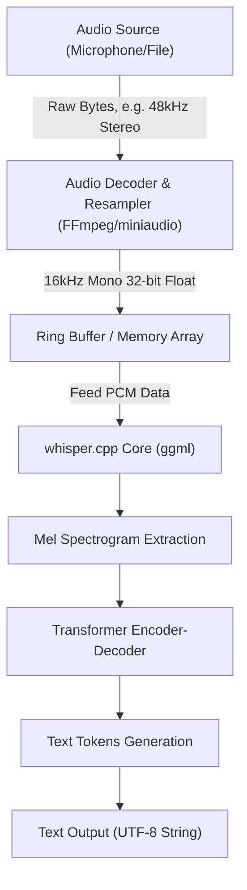
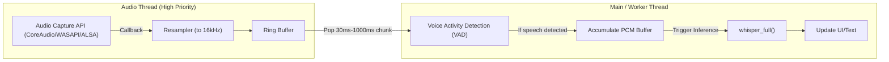

## 1. はじめに：なぜC++で音声認識なのか

OpenAIが開発した高精度な音声認識モデル「Whisper」は、オープンソース化されて以来、様々なアプリケーションで活用されています。Python環境（PyTorchベース）での利用が一般的ですが、**エッジデバイス（スマートフォン、IoT機器、組み込みシステム）** や、**高いリアルタイム性が求められるネイティブC++アプリケーション**（ゲームエンジン、DAWソフトウェア、ロボティクスなど）に組み込む場合、Pythonインタプリタへの依存はパフォーマンス上の大きなボトルネックとなります。

そこで救世主となるのが、Georgi Gerganov氏によって開発された **[whisper.cpp](https://github.com/ggerganov/whisper.cpp)** です。このライブラリは、機械学習向けテンソル計算ライブラリである `ggml` をベースに、依存関係を極限まで減らし、C/C++のみでWhisperの推論を実現しています。

本記事では、この `whisper.cpp` を用いて、独自のC++プロジェクトに最高峰の音声認識機能を組み込むための方法を、音声信号処理の基礎、APIの詳細な使い方、メモリー管理、マルチスレッド最適化、そしてリアルタイム処理の実装パターンに至るまで、徹底的に解説します。

---

## 2. 音声信号処理とWhisperの入力要件

AIに音声を理解させるためには、アナログ信号である「音」をデジタルデータに変換し、AIモデルが処理できる形式（テンソル）に落とし込む必要があります。Whisperが要求する音声フォーマットは非常に厳格です。

### 2.1 Whisperが要求するオーディオフォーマット

Whisperモデルは以下のスペックの音声データを入力として受け付けます。

* **サンプリング周波数 (Sample Rate)**: 16,000 Hz (16 kHz)
* **チャンネル数 (Channels)**: 1 (モノラル)
* **データ型 (Data Type)**: 32-bit 浮動小数点数 (`float` in C/C++)
* **正規化 (Normalization)**: $[-1.0, 1.0]$ の範囲にスケーリングされた値

例えば、CD音質（44.1kHz, ステレオ, 16-bit PCM）の音声ファイルを入力とする場合、事前にダウンサンプリングとチャンネルのミックスダウン、フォーマット変換を行わなければなりません。

データ転送レートの計算式は以下の通りです。

$$ \text{Data Rate (bytes/sec)} = \text{Sample Rate} \times \text{Channels} \times \frac{\text{Bit Depth}}{8} $$

Whisperの要件（16kHz, 1ch, 32-bit Float）における1秒間のデータサイズは：

$$ 16000 \times 1 \times \frac{32}{8} = 64,000 \text{ bytes/sec (64 KB/s)} $$

非常に軽量であるため、メモリ帯域幅が限られたエッジデバイスでも十分にバッファリングが可能です。

### 2.2 Melスペクトログラム変換の数理

Whisperの内部では、1次元の音声波形データ（Raw Waveform）を直接処理するわけではありません。人間の聴覚特性に近い周波数表現である **Melスペクトログラム (Mel-Spectrogram)** に変換してからTransformerモデルに入力されます。`whisper.cpp` はこの変換処理をC++実装内に内包していますが、仕組みを理解しておくことはノイズ対策や前処理の最適化に役立ちます。

通常の周波数 $f$ (Hz) をMel尺度 $m$ に変換する数式は以下の通り近似されます。

$$ m = 2595 \log_{10} \left( 1 + \frac{f}{700} \right) $$

逆に、Mel尺度から周波数への逆変換は以下のようになります。

$$ f = 700 \left( 10^{\frac{m}{2595}} - 1 \right) $$

さらに、音声波形は **短時間フーリエ変換 (STFT: Short-Time Fourier Transform)** によって時間・周波数領域に変換されます。窓関数 $w(n)$ を用いたSTFTの離散形式は次のように表されます。

$$ X(m, k) = \sum_{n=0}^{N-1} x(n + mH) w(n) e^{-j \frac{2\pi}{N} k n} $$
*(ここで、$N$ はFFTウィンドウサイズ、$H$ はホップサイズ、$w(n)$ はハン窓などの窓関数)*

Whisperモデルでは通常、ウィンドウサイズ $N = 400$ (25ms)、ホップサイズ $H = 160$ (10ms)、80次元のMelフィルタバンクを使用します。この特徴抽出は `whisper.cpp` 内の `whisper_full()` 呼び出し時に自動的に（かつSIMD命令を用いて高速に）実行されます。

---

## 3. アーキテクチャとパイプライン設計

C++アプリケーションにおける音声処理のパイプラインを設計してみましょう。ファイル入力またはマイク入力から始まり、前処理を経て `whisper.cpp` による推論、そしてテキスト出力に至るまでの流れです。



アプリケーション側で責任を持つべきは、上記の図における **A から C までの区間（オーディオのデコードとリサンプリング）** です。`whisper.cpp` 自身は音声ファイルのデコーダーを含んでいないため、FFmpegや `miniaudio` などのライブラリを組み合わせて使うのがベストプラクティスです。

---

## 4. whisper.cpp のビルドと導入

プロジェクトに `whisper.cpp` を組み込む手順です。CMakeを使用するのが最も汎用性が高いです。

### CMakeLists.txt の設定

`whisper.cpp` はソースコードとしてプロジェクトに取り込むか、サブモジュールとして追加してリンクします。

```cmake
cmake_minimum_required(VERSION 3.14)
project(WhisperApp C CXX)

set(CMAKE_CXX_STANDARD 17)
set(CMAKE_CXX_STANDARD_REQUIRED ON)

# CPU拡張命令の有効化（AVX, F16Cなど）
# MacOSの場合はNEON/Accelerateフレームワークが自動的に有効になります
set(WHISPER_SUPPORT_SDL2 OFF CACHE BOOL "" FORCE)
add_subdirectory(whisper.cpp)

add_executable(whisper_app main.cpp)
target_link_libraries(whisper_app PRIVATE whisper)
```

この設定により、`whisper.cpp` の高度に最適化された `ggml` バックエンドがビルドされ、アプリケーションに静的リンクされます。

---

## 5. C++ APIの詳細と実装手順

それでは、実際のC++コードを見ながら、APIの叩き方を解説します。

### 5.1 コンテキストの初期化とモデルのロード

`whisper.cpp` では、すべての状態とメモリ割り当ては `whisper_context` 構造体で管理されます。

```cpp
#include "whisper.h"
#include <iostream>
#include <vector>
#include <string>

int main() {
    // 1. パラメータの初期化
    struct whisper_context_params cparams = whisper_context_default_params();
    cparams.use_gpu = true; // GPUアクセラレーション（CuBLAS/Metal）が利用可能な場合は使用

    // 2. モデルのロード (ggml形式のバイナリモデル)
    const std::string model_path = "models/ggml-base.bin";
    struct whisper_context * ctx = whisper_init_from_file_with_params(model_path.c_str(), cparams);

    if (ctx == nullptr) {
        std::cerr << "エラー: モデルの読み込みに失敗しました - " << model_path << std::endl;
        return 1;
    }
    
    std::cout << "モデルを正常にロードしました。" << std::endl;
```

モデルファイルは独自に量子化された `.bin` 形式です。公式リポジトリにある変換スクリプトを使用するか、HuggingFaceから直接ダウンロードします。メモリ制限の厳しい環境では、4-bit量子化モデル（例：`ggml-base-q4_0.bin`）を使用することで、RAM消費量を約1/4に削減できます。

### 5.2 推論パラメータの設定

次に、推論の挙動を制御する `whisper_full_params` を設定します。

```cpp
    // 3. フル推論用パラメータの設定 (Greedy Samplingを使用)
    struct whisper_full_params wparams = whisper_full_default_params(WHISPER_SAMPLING_GREEDY);
    
    // スレッド数の設定 (CPUの物理コア数に合わせるのが最適)
    wparams.n_threads = 4;
    
    // 言語設定 (自動判定は "auto"、日本語指定は "ja")
    wparams.language = "ja";
    
    // 中間結果の標準出力を抑制（アプリ内で制御するため）
    wparams.print_progress = false;
    wparams.print_realtime = false;
    
    // 翻訳機能 (日本語音声を英語テキストに直接翻訳する場合は true)
    wparams.translate = false;
```

### 5.3 音声データの準備と推論の実行

ここでは、既に `std::vector<float>` に16kHzの音声データが格納されていると仮定します。

```cpp
    // 仮想的な音声データ (実際にはファイルやマイクから取得したPCMデータ)
    // 3秒間 (16000 Hz * 3 sec = 48000 samples)
    std::vector<float> pcmf32(48000, 0.0f); 

    // 4. 推論の実行
    if (whisper_full(ctx, wparams, pcmf32.data(), pcmf32.size()) != 0) {
        std::cerr << "エラー: whisper_full の実行に失敗しました。" << std::endl;
        whisper_free(ctx);
        return 1;
    }
```

### 5.4 結果の抽出

`whisper_full` が完了すると、コンテキスト内に認識結果がセグメント単位で保存されます。

```cpp
    // 5. 結果の取得と表示
    const int n_segments = whisper_full_n_segments(ctx);
    
    for (int i = 0; i < n_segments; ++i) {
        const char * text = whisper_full_get_segment_text(ctx, i);
        
        // タイムスタンプの取得 (単位: 10ms)
        const int64_t t0 = whisper_full_get_segment_t0(ctx, i);
        const int64_t t1 = whisper_full_get_segment_t1(ctx, i);
        
        std::cout << "[" << (t0 * 10.0) << " ms -> " << (t1 * 10.0) << " ms]: " 
                  << text << std::endl;
    }

    // 6. メモリの解放
    whisper_free(ctx);
    return 0;
}
```

このコードブロックが、C++でWhisperを使用するための最も基本的なテンプレートとなります。

---

## 6. リアルタイム音声認識の高度な実装

録音済みのファイルを処理するのは簡単ですが、アプリケーションのUXを向上させるためには、マイク入力からの「リアルタイム音声認識（ストリーミング認識）」が必要です。

これを実装するためには、マルチスレッドアーキテクチャとリングバッファ（Ring Buffer）による音声ストリームの管理が不可欠です。



### 6.1 Voice Activity Detection (VAD) の重要性

リアルタイム処理において、無音部分に対しても常に推論を実行するのは計算資源の無駄です。VADアルゴリズム（単純なエネルギーベースのスレッショルド処理や、WebRTC VADなど）を前段に挟むことで、**「発話が開始されたときのみバッファリングを開始し、発話が終了（一定時間の無音）したタイミングで `whisper_full` をキックする」** という制御を行います。

### 6.2 スライディングウィンドウアプローチ

発話が長く続く場合、数秒ごとにチャンクを切り出して推論を行う「スライディングウィンドウ」手法を用います。しかし、単純に音声をぶつ切りにすると、単語の途中で切れてしまい認識精度が著しく低下します。

対策として、**「常に直前の過去N秒間のコンテキストを含めて推論を行う」** （オーバーラップさせる）手法を用います。`whisper.cpp` には過去のテキストトークンをプロンプトとして引き継ぐ `wparams.prompt_tokens` という機能もあり、文脈を維持した精度の高いストリーミング認識が可能です。

---

## 7. メモリ管理とエッジデバイス向けの最適化

`whisper.cpp` 最大の利点であるパフォーマンスとメモリ効率について深く掘り下げます。

### 7.1 ggmlテンソルライブラリの威力

`whisper.cpp` のバックエンドである `ggml` は、依存関係を持たないC言語のテンソルライブラリです。最大の特徴は、**重みデータの動的な量子化 (Quantization)** をサポートしている点です。

例えば、Whisper `Small` モデル（約2億4000万パラメータ）のメモリサイズを計算してみましょう。
通常（16-bit Float = 2バイト）の場合：

$$ \text{Memory (FP16)} \approx 244,000,000 \times 2 \text{ bytes} \approx 488 \text{ MB} $$

これを 4-bit 量子化（Q4_0形式）に変換した場合、1パラメータあたり平均0.5バイト（スケーリング係数などのオーバーヘッドを含むと約0.56バイト）となります。

$$ \text{Memory (Q4\_0)} \approx 244,000,000 \times 0.56 \text{ bytes} \approx 137 \text{ MB} $$

iOSデバイスやRaspberry Piなど、RAMに厳しい制約がある環境では、このメモリフットプリントの削減がアプリケーション全体の安定性に直結します。

### 7.2 ハードウェアアクセラレーションの活用

CPU単体でもAVX2やNEON命令によって十分に高速ですが、`whisper.cpp` は各種GPU・NPUのハードウェアアクセラレーションもバックエンドとしてサポートしています。

* **Apple Silicon (Mac/iOS)**: `ggml-metal` による Metal API サポート。GPUを用いた超高速推論。
* **NVIDIA GPU (Windows/Linux)**: `cuBLAS` サポート。CMakeビルド時に `-DWHISPER_CUBLAS=ON` を指定。
* **Intel (Windows/Linux)**: `OpenVINO` バックエンドをサポート。最新のIntel Coreプロセッサ上のNPUを活用可能。

C++プロジェクトでこれらのアクセラレータを利用する場合、ソースコードを変更する必要はほとんどありません。コンテキスト初期化時の `cparams.use_gpu = true;` が設定されていれば、ビルドされたバックエンドに応じて自動的にハードウェアにオフロードされます。

### 7.3 キャッシュとスレッド数のチューニング

`wparams.n_threads` の設定は非常に重要です。むやみにスレッド数を増やしても、メモリ帯域幅のボトルネック（Memory Bound）によりパフォーマンスは向上しません。

経験則として、以下の計算式でスレッド数を決定するのが理想的です。

$$ N_{\text{threads}} = \min(\text{Physical CPU Cores}, 4 \sim 8) $$

Hyper-Threadingなどの論理コアを含めると、キャッシュの競合が発生して逆に推論速度が低下することが多いため、**物理コア数** に設定するのが鉄則です。C++11の `std::thread::hardware_concurrency()` を使用する場合は論理コア数が返るため、環境に応じたハードコードやOSレベルのAPIでの物理コア取得を推奨します。

---

## 8. まとめ

本記事では、`whisper.cpp` を活用してC++プロジェクトに最高峰の音声認識AIを組み込む方法について、理論から実践、最適化に至るまで詳細に解説しました。

* **入力要件の遵守**: 16kHz, 1ch, 32-bit Float の徹底。
* **APIの直感的な使用**: `whisper_init_from_file_with_params` と `whisper_full` だけで推論が完結するシンプルな設計。
* **リアルタイム化**: VADとスライディングウィンドウによるマルチスレッド制御。
* **圧倒的な最適化**: `ggml` による4-bit量子化と、Metal/cuBLASなどのハードウェアバックエンドの恩恵。

巨大なPython環境やクラウドAPIへの依存を断ち切り、ネイティブ環境で高速かつセキュアに動作する音声処理アプリケーションの開発に、ぜひ `whisper.cpp` を役立ててください。ローカル完結のAIは、プライバシー保護とレイテンシの観点から、今後のソフトウェア開発において極めて重要な要素技術となるでしょう。

