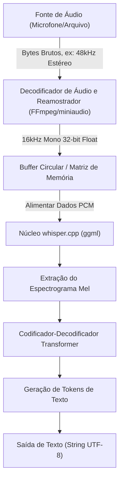
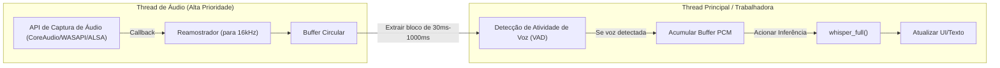

## 1. Introdução: Por que reconhecimento de voz em C++?

A "Whisper", um modelo de reconhecimento de voz de alta precisão desenvolvido pela OpenAI, tem sido utilizada em várias aplicações desde que foi disponibilizada em código aberto. Embora o uso em ambientes Python (baseado em PyTorch) seja comum, quando se trata de integrá-la em **dispositivos edge (smartphones, equipamentos IoT, sistemas embarcados)** ou em **aplicações C++ nativas que exigem alto desempenho em tempo real** (motores de jogos, softwares DAW, robótica, etc.), a dependência do interpretador Python torna-se um grande gargalo de desempenho.

É aí que entra o **[whisper.cpp](https://github.com/ggerganov/whisper.cpp)**, desenvolvido por Georgi Gerganov, como o salvador. Esta biblioteca é baseada na `ggml`, uma biblioteca de cálculos tensoriais para aprendizado de máquina, e reduz ao máximo as dependências, realizando a inferência do Whisper apenas com C/C++.

Neste artigo, explicaremos detalhadamente como usar este `whisper.cpp` para integrar recursos de reconhecimento de voz de ponta em seu próprio projeto C++, cobrindo desde os fundamentos do processamento de sinais de áudio, como usar a API em detalhes, gerenciamento de memória, otimização de multithreading, até os padrões de implementação para processamento em tempo real.

---

## 2. Processamento de Sinais de Áudio e Requisitos de Entrada do Whisper

Para que a IA compreenda a voz, é necessário converter o "som", que é um sinal analógico, em dados digitais e formatá-lo de forma que o modelo de IA possa processar (tensores). O formato de áudio exigido pelo Whisper é muito rigoroso.

### 2.1 Formato de Áudio Exigido pelo Whisper

O modelo Whisper aceita dados de áudio com as seguintes especificações como entrada:

* **Taxa de Amostragem (Sample Rate)**: 16.000 Hz (16 kHz)
* **Número de Canais (Channels)**: 1 (Mono)
* **Tipo de Dados (Data Type)**: Ponto flutuante de 32 bits (`float` em C/C++)
* **Normalização (Normalization)**: Valores escalonados na faixa de $[-1.0, 1.0]$

Por exemplo, se a entrada for um arquivo de áudio com qualidade de CD (44,1 kHz, estéreo, PCM de 16 bits), será necessário realizar previamente a subamostragem (downsampling), a mixagem dos canais (mixdown) e a conversão de formato.

A fórmula para calcular a taxa de transferência de dados é a seguinte:

$$ \text{Data Rate (bytes/sec)} = \text{Sample Rate} \times \text{Channels} \times \frac{\text{Bit Depth}}{8} $$

Para os requisitos do Whisper (16 kHz, 1 ch, Float de 32 bits), o tamanho dos dados para 1 segundo é:

$$ 16000 \times 1 \times \frac{32}{8} = 64,000 \text{ bytes/sec (64 KB/s)} $$

Por ser extremamente leve, mesmo dispositivos edge com largura de banda de memória limitada têm capacidade suficiente para realizar o buffering.

### 2.2 Matemática da Transformação em Espectrograma Mel

Internamente, o Whisper não processa diretamente os dados de forma de onda de áudio unidimensionais (Raw Waveform). Antes de ser introduzido no modelo Transformer, o áudio é convertido em um **Espectrograma Mel (Mel-Spectrogram)**, que é uma representação de frequência próxima às características da audição humana. O `whisper.cpp` inclui este processo de conversão em sua implementação C++, mas entender como ele funciona é útil para lidar com ruídos e otimizar o pré-processamento.

A fórmula para converter a frequência normal $f$ (Hz) na escala Mel $m$ é aproximada da seguinte forma:

$$ m = 2595 \log_{10} \left( 1 + \frac{f}{700} \right) $$

Inversamente, a transformação da escala Mel para a frequência é dada por:

$$ f = 700 \left( 10^{\frac{m}{2595}} - 1 \right) $$

Além disso, a forma de onda de áudio é convertida para o domínio tempo-frequência por meio da **Transformada de Fourier de Tempo Curto (STFT: Short-Time Fourier Transform)**. A forma discreta da STFT usando uma função de janela $w(n)$ é expressa como:

$$ X(m, k) = \sum_{n=0}^{N-1} x(n + mH) w(n) e^{-j \frac{2\pi}{N} k n} $$
*(Onde $N$ é o tamanho da janela FFT, $H$ é o tamanho do salto (hop size), e $w(n)$ é uma função de janela como a janela de Hann)*

No modelo Whisper, geralmente são usados um tamanho de janela $N = 400$ (25ms), um tamanho de salto $H = 160$ (10ms) e um banco de filtros Mel de 80 dimensões. Esta extração de características é executada automaticamente (e de forma rápida usando instruções SIMD) ao chamar a função `whisper_full()` no `whisper.cpp`.

---

## 3. Arquitetura e Design do Pipeline

Vamos projetar o pipeline de processamento de áudio em uma aplicação C++. O fluxo começa com a entrada a partir de um arquivo ou microfone, passa pelo pré-processamento, pela inferência usando o `whisper.cpp` e culmina na saída de texto.



A responsabilidade do lado da aplicação é a seção **de A a C (decodificação e reamostragem do áudio)** na figura acima. Como o próprio `whisper.cpp` não inclui um decodificador de arquivos de áudio, a melhor prática é combiná-lo com bibliotecas como FFmpeg ou `miniaudio`.

---

## 4. Compilação e Introdução do whisper.cpp

Estes são os passos para integrar o `whisper.cpp` no seu projeto. O uso do CMake é o mais versátil.

### Configuração do CMakeLists.txt

O `whisper.cpp` pode ser incorporado ao projeto como código-fonte ou adicionado como um submódulo para ser vinculado.

```cmake
cmake_minimum_required(VERSION 3.14)
project(WhisperApp C CXX)

set(CMAKE_CXX_STANDARD 17)
set(CMAKE_CXX_STANDARD_REQUIRED ON)

# Habilita instruções de extensão da CPU (AVX, F16C, etc.)
# No MacOS, a estrutura NEON/Accelerate é habilitada automaticamente
set(WHISPER_SUPPORT_SDL2 OFF CACHE BOOL "" FORCE)
add_subdirectory(whisper.cpp)

add_executable(whisper_app main.cpp)
target_link_libraries(whisper_app PRIVATE whisper)
```

Com esta configuração, o backend `ggml` altamente otimizado do `whisper.cpp` será compilado e vinculado estaticamente à aplicação.

---

## 5. Detalhes da API C++ e Passos de Implementação

Agora, vamos explicar como usar a API observando o código C++ real.

### 5.1 Inicialização do Contexto e Carregamento do Modelo

No `whisper.cpp`, todos os estados e a alocação de memória são gerenciados pela estrutura `whisper_context`.

```cpp
#include "whisper.h"
#include <iostream>
#include <vector>
#include <string>

int main() {
    // 1. Inicialização dos parâmetros
    struct whisper_context_params cparams = whisper_context_default_params();
    cparams.use_gpu = true; // Usa aceleração via GPU (CuBLAS/Metal) se disponível

    // 2. Carregamento do modelo (modelo binário no formato ggml)
    const std::string model_path = "models/ggml-base.bin";
    struct whisper_context * ctx = whisper_init_from_file_with_params(model_path.c_str(), cparams);

    if (ctx == nullptr) {
        std::cerr << "Erro: Falha ao carregar o modelo - " << model_path << std::endl;
        return 1;
    }
    
    std::cout << "Modelo carregado com sucesso." << std::endl;
```

O arquivo do modelo está em um formato quantizado `.bin` exclusivo. Você pode usar os scripts de conversão no repositório oficial ou baixá-lo diretamente do HuggingFace. Em ambientes com fortes restrições de memória, o uso de um modelo quantizado de 4 bits (ex: `ggml-base-q4_0.bin`) pode reduzir o consumo de RAM para cerca de 1/4.

### 5.2 Configuração dos Parâmetros de Inferência

Em seguida, configure o `whisper_full_params` para controlar o comportamento da inferência.

```cpp
    // 3. Configuração dos parâmetros para inferência completa (Usando Greedy Sampling)
    struct whisper_full_params wparams = whisper_full_default_params(WHISPER_SAMPLING_GREEDY);
    
    // Configuração do número de threads (O ideal é corresponder ao número de núcleos físicos da CPU)
    wparams.n_threads = 4;
    
    // Configuração de idioma ("auto" para detecção automática, "ja" para japonês)
    wparams.language = "ja";
    
    // Suprime a saída padrão dos resultados intermediários (para controlar na aplicação)
    wparams.print_progress = false;
    wparams.print_realtime = false;
    
    // Função de tradução (true se for traduzir o áudio para texto em inglês)
    wparams.translate = false;
```

### 5.3 Preparação dos Dados de Áudio e Execução da Inferência

Aqui, assumimos que os dados de áudio a 16kHz já estão armazenados em um `std::vector<float>`.

```cpp
    // Dados de áudio virtuais (na realidade, dados PCM obtidos de um arquivo ou microfone)
    // 3 segundos (16000 Hz * 3 seg = 48000 amostras)
    std::vector<float> pcmf32(48000, 0.0f); 

    // 4. Execução da inferência
    if (whisper_full(ctx, wparams, pcmf32.data(), pcmf32.size()) != 0) {
        std::cerr << "Erro: Falha ao executar whisper_full." << std::endl;
        whisper_free(ctx);
        return 1;
    }
```

### 5.4 Extração dos Resultados

Quando o `whisper_full` for concluído, os resultados do reconhecimento serão salvos no contexto em segmentos.

```cpp
    // 5. Obtenção e exibição dos resultados
    const int n_segments = whisper_full_n_segments(ctx);
    
    for (int i = 0; i < n_segments; ++i) {
        const char * text = whisper_full_get_segment_text(ctx, i);
        
        // Obtenção do timestamp (Unidade: 10ms)
        const int64_t t0 = whisper_full_get_segment_t0(ctx, i);
        const int64_t t1 = whisper_full_get_segment_t1(ctx, i);
        
        std::cout << "[" << (t0 * 10.0) << " ms -> " << (t1 * 10.0) << " ms]: " 
                  << text << std::endl;
    }

    // 6. Liberação da memória
    whisper_free(ctx);
    return 0;
}
```

Este bloco de código serve como o modelo mais básico para usar o Whisper em C++.

---

## 6. Implementação Avançada de Reconhecimento de Voz em Tempo Real

Processar arquivos pré-gravados é simples, mas para melhorar a experiência do usuário (UX) da aplicação, o "reconhecimento de voz em tempo real (reconhecimento contínuo/streaming)" a partir da entrada do microfone é necessário.

Para implementar isso, o gerenciamento de fluxos de áudio usando uma arquitetura multithread e um buffer circular (Ring Buffer) é essencial.



### 6.1 A Importância da Detecção de Atividade de Voz (VAD)

No processamento em tempo real, executar constantemente a inferência, mesmo para partes silenciosas, é um desperdício de recursos computacionais. Inserir um algoritmo VAD (como limiares baseados em energia simples ou WebRTC VAD) na etapa anterior permite o seguinte controle: **"Iniciar o buffering apenas quando a fala começar e disparar o `whisper_full` no momento em que a fala terminar (após um certo período de silêncio)".**

### 6.2 Abordagem de Janela Deslizante (Sliding Window)

Se a fala continuar por muito tempo, a técnica de "janela deslizante" é usada, extraindo blocos a cada poucos segundos para inferência. No entanto, se o áudio for simplesmente cortado em pedaços, palavras podem ser cortadas no meio, diminuindo significativamente a precisão do reconhecimento.

Como solução, utilizamos um método em que **"a inferência é sempre realizada incluindo o contexto dos últimos N segundos"** (sobreposição). O `whisper.cpp` também tem o recurso `wparams.prompt_tokens` que repassa tokens de texto anteriores como um prompt, permitindo um reconhecimento contínuo altamente preciso enquanto mantém o contexto.

---

## 7. Gerenciamento de Memória e Otimização para Dispositivos Edge

Aprofundaremos as maiores vantagens do `whisper.cpp`: seu desempenho e eficiência de memória.

### 7.1 O Poder da Biblioteca Tensorial ggml

O backend do `whisper.cpp`, `ggml`, é uma biblioteca tensorial em C sem dependências externas. Sua maior característica é que ela suporta a **quantização dinâmica (Quantization) dos dados de peso**.

Por exemplo, vamos calcular o tamanho da memória do modelo Whisper `Small` (cerca de 240 milhões de parâmetros).
No caso normal (16-bit Float = 2 bytes):

$$ \text{Memory (FP16)} \approx 244,000,000 \times 2 \text{ bytes} \approx 488 \text{ MB} $$

Ao convertê-lo para a quantização de 4 bits (formato Q4_0), ele ocupa em média 0,5 bytes por parâmetro (cerca de 0,56 bytes incluindo o custo de sobrecarga, como os fatores de escala).

$$ \text{Memory (Q4\_0)} \approx 244,000,000 \times 0.56 \text{ bytes} \approx 137 \text{ MB} $$

Em ambientes com fortes restrições de RAM, como dispositivos iOS e Raspberry Pi, essa redução no uso da memória (memory footprint) se traduz diretamente na estabilidade de toda a aplicação.

### 7.2 Utilização da Aceleração de Hardware

Embora a CPU sozinha seja suficientemente rápida por meio das instruções AVX2 e NEON, o `whisper.cpp` também suporta aceleração de hardware a partir de várias GPUs e NPUs como backend.

* **Apple Silicon (Mac/iOS)**: Suporte à API Metal através do `ggml-metal`. Inferência ultrarrápida usando a GPU.
* **NVIDIA GPU (Windows/Linux)**: Suporte ao `cuBLAS`. Especifique `-DWHISPER_CUBLAS=ON` durante a compilação no CMake.
* **Intel (Windows/Linux)**: Suporte ao backend `OpenVINO`. É possível utilizar a NPU nos mais recentes processadores Intel Core.

Ao usar esses aceleradores em um projeto C++, quase não há necessidade de modificar o código-fonte. Desde que `cparams.use_gpu = true;` esteja configurado durante a inicialização do contexto, ele será automaticamente descarregado (offloaded) para o hardware de acordo com o backend compilado.

### 7.3 Ajuste Fino de Cache e Número de Threads

A configuração do `wparams.n_threads` é extremamente importante. Aumentar o número de threads indiscriminadamente não melhora o desempenho devido ao gargalo de largura de banda da memória (Memory Bound).

Como regra prática, é ideal determinar o número de threads com a seguinte fórmula:

$$ N_{\text{threads}} = \min(\text{Núcleos Físicos da CPU}, 4 \sim 8) $$

A inclusão de núcleos lógicos, como os de Hyper-Threading, frequentemente causa conflitos de cache e resulta em velocidades de inferência mais baixas. Portanto, é uma regra de ouro configurá-lo para o **número de núcleos físicos**. Ao usar `std::thread::hardware_concurrency()` no C++11, ele retorna o número de núcleos lógicos. Sendo assim, recomenda-se hardcodar o valor de acordo com o ambiente ou adquirir o número de núcleos físicos através de APIs em nível de sistema operacional.

---

## 8. Conclusão

Neste artigo, explicamos em detalhes como usar o `whisper.cpp` para integrar a IA de reconhecimento de voz de ponta em seu projeto C++, desde a teoria até a prática e otimização.

* **Conformidade com os Requisitos de Entrada**: Adoção estrita de 16 kHz, 1 ch, Float de 32 bits.
* **Uso Intuitivo da API**: Design simples em que a inferência é concluída com apenas `whisper_init_from_file_with_params` e `whisper_full`.
* **Processamento em Tempo Real**: Controle multithread com VAD e janela deslizante.
* **Otimização Esmagadora**: Quantização de 4 bits pelo `ggml` e benefícios de backends de hardware como Metal e cuBLAS.

Use o `whisper.cpp` para se libertar das dependências de ambientes Python enormes ou APIs de nuvem e desenvolver aplicativos de processamento de voz que funcionam de forma rápida e segura de maneira nativa. A IA local será uma tecnologia fundamental essencial para o desenvolvimento futuro de software, sob o ponto de vista da proteção da privacidade e latência.

