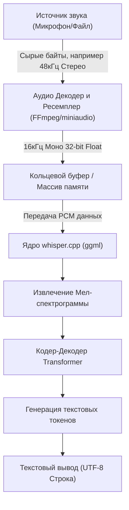
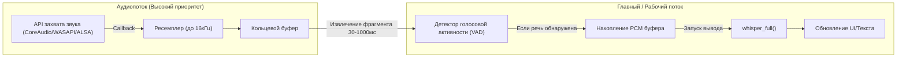

## 1. Введение: Почему C++ для распознавания речи?

Высокоточная модель распознавания речи "Whisper", разработанная OpenAI, используется в различных приложениях с момента ее публикации в открытом доступе. Хотя обычно она используется в среде Python (на базе PyTorch), при интеграции в **граничные устройства (смартфоны, устройства IoT, встроенные системы)** или **нативные C++ приложения, требующие высокой производительности в реальном времени** (игровые движки, программное обеспечение DAW, робототехника и т.д.), зависимость от интерпретатора Python становится серьезным узким местом для производительности.

Здесь на помощь приходит **[whisper.cpp](https://github.com/ggerganov/whisper.cpp)**, разработанный Георгием Гергановым (Georgi Gerganov). Эта библиотека основана на `ggml`, библиотеке тензорных вычислений для машинного обучения, и минимизирует зависимости, реализуя вывод Whisper исключительно на C/C++.

В этой статье мы подробно расскажем, как использовать `whisper.cpp` для интеграции первоклассных функций распознавания речи в ваши собственные проекты на C++, начиная от основ обработки звуковых сигналов, детального использования API, управления памятью, оптимизации многопоточности и заканчивая шаблонами реализации обработки в реальном времени.

---

## 2. Обработка звукового сигнала и требования к входу Whisper

Чтобы ИИ мог понимать речь, необходимо преобразовать "звук", являющийся аналоговым сигналом, в цифровые данные и привести к формату (тензору), который может обрабатывать модель ИИ. Требования к аудиоформату у Whisper очень строгие.

### 2.1 Аудиоформат, требуемый Whisper

Модель Whisper принимает на вход аудиоданные со следующими характеристиками:

* **Частота дискретизации (Sample Rate)**: 16 000 Гц (16 кГц)
* **Количество каналов (Channels)**: 1 (моно)
* **Тип данных (Data Type)**: 32-битное число с плавающей запятой (`float` в C/C++)
* **Нормализация (Normalization)**: Значения, масштабированные в диапазоне $[-1.0, 1.0]$

Например, если в качестве ввода используется аудиофайл качества CD (44,1 кГц, стерео, 16-битный PCM), необходимо предварительно выполнить понижение частоты дискретизации (downsampling), сведение каналов (mixdown) и преобразование формата.

Формула расчета скорости передачи данных выглядит следующим образом:

$$ \text{Data Rate (bytes/sec)} = \text{Sample Rate} \times \text{Channels} \times \frac{\text{Bit Depth}}{8} $$

Размер данных за 1 секунду при требованиях Whisper (16 кГц, 1 канал, 32-bit Float) составляет:

$$ 16000 \times 1 \times \frac{32}{8} = 64,000 \text{ bytes/sec (64 KB/s)} $$

Поскольку это очень мало, буферизация вполне возможна даже на граничных устройствах с ограниченной пропускной способностью памяти.

### 2.2 Математика преобразования в мел-спектрограмму (Mel-Spectrogram)

Внутри Whisper не обрабатывает напрямую одномерные данные звуковой волны (Raw Waveform). Перед подачей в модель Transformer они преобразуются в **Мел-спектрограмму (Mel-Spectrogram)**, частотное представление, близкое к характеристикам человеческого слуха. `whisper.cpp` включает этот процесс преобразования в свою реализацию на C++, но понимание механизма полезно для противодействия шуму и оптимизации предварительной обработки.

Формула аппроксимации для перевода обычной частоты $f$ (Гц) в мел-шкалу $m$ выглядит следующим образом:

$$ m = 2595 \log_{10} \left( 1 + \frac{f}{700} \right) $$

И наоборот, обратное преобразование из мел-шкалы в частоту:

$$ f = 700 \left( 10^{\frac{m}{2595}} - 1 \right) $$

Кроме того, звуковая волна преобразуется во временно-частотную область с помощью **кратковременного преобразования Фурье (STFT: Short-Time Fourier Transform)**. Дискретная форма STFT с использованием оконной функции $w(n)$ выражается следующим образом:

$$ X(m, k) = \sum_{n=0}^{N-1} x(n + mH) w(n) e^{-j \frac{2\pi}{N} k n} $$
*(Где $N$ — размер окна FFT, $H$ — размер шага (hop size), $w(n)$ — оконная функция, такая как окно Ханна (Hann window))*

В модели Whisper обычно используется размер окна $N = 400$ (25 мс), шаг $H = 160$ (10 мс) и 80-мерный банк мел-фильтров. Это извлечение признаков выполняется автоматически (и быстро с использованием SIMD-инструкций) при вызове `whisper_full()` внутри `whisper.cpp`.

---

## 3. Архитектура и проектирование конвейера

Давайте спроектируем конвейер обработки звука в приложении C++. Это поток, начинающийся с ввода файла или микрофона, проходящий через предварительную обработку, вывод через `whisper.cpp` и заканчивающийся выводом текста.



Ответственность приложения — это участок от **A до C на диаграмме выше (декодирование аудио и ресемплинг)**. Поскольку сам `whisper.cpp` не включает декодер аудиофайлов, лучшей практикой является использование в комбинации библиотек, таких как FFmpeg или `miniaudio`.

---

## 4. Сборка и внедрение whisper.cpp

Вот шаги по внедрению `whisper.cpp` в ваш проект. Использование CMake является наиболее универсальным подходом.

### Настройка CMakeLists.txt

`whisper.cpp` можно включить в проект как исходный код или добавить как подмодуль и скомпоновать.

```cmake
cmake_minimum_required(VERSION 3.14)
project(WhisperApp C CXX)

set(CMAKE_CXX_STANDARD 17)
set(CMAKE_CXX_STANDARD_REQUIRED ON)

# Включение расширенных инструкций процессора (AVX, F16C и т.д.)
# В macOS автоматически включается фреймворк NEON/Accelerate
set(WHISPER_SUPPORT_SDL2 OFF CACHE BOOL "" FORCE)
add_subdirectory(whisper.cpp)

add_executable(whisper_app main.cpp)
target_link_libraries(whisper_app PRIVATE whisper)
```

С помощью этих настроек будет собран высокооптимизированный бэкенд `ggml` из `whisper.cpp` и статически скомпонован с вашим приложением.

---

## 5. Подробности C++ API и шаги реализации

Теперь давайте разберем, как использовать API, рассматривая реальный C++ код.

### 5.1 Инициализация контекста и загрузка модели

В `whisper.cpp` все состояния и распределение памяти управляются структурой `whisper_context`.

```cpp
#include "whisper.h"
#include <iostream>
#include <vector>
#include <string>

int main() {
    // 1. Инициализация параметров
    struct whisper_context_params cparams = whisper_context_default_params();
    cparams.use_gpu = true; // Использовать аппаратное ускорение GPU (CuBLAS/Metal), если доступно

    // 2. Загрузка модели (бинарная модель в формате ggml)
    const std::string model_path = "models/ggml-base.bin";
    struct whisper_context * ctx = whisper_init_from_file_with_params(model_path.c_str(), cparams);

    if (ctx == nullptr) {
        std::cerr << "Ошибка: Не удалось загрузить модель - " << model_path << std::endl;
        return 1;
    }
    
    std::cout << "Модель успешно загружена." << std::endl;
```

Файлы моделей имеют специальный квантованный формат `.bin`. Вы можете использовать скрипт преобразования из официального репозитория или скачать их напрямую с HuggingFace. В средах с жесткими ограничениями памяти использование 4-битных квантованных моделей (например, `ggml-base-q4_0.bin`) может сократить потребление оперативной памяти примерно до 1/4.

### 5.2 Настройка параметров вывода

Далее настроим `whisper_full_params`, которые управляют поведением вывода.

```cpp
    // 3. Настройка параметров для полного вывода (используется Greedy Sampling)
    struct whisper_full_params wparams = whisper_full_default_params(WHISPER_SAMPLING_GREEDY);
    
    // Настройка количества потоков (Оптимально соответствовать количеству физических ядер CPU)
    wparams.n_threads = 4;
    
    // Настройка языка ("auto" для автоматического определения, "ja" для японского и т.д.)
    wparams.language = "ja";
    
    // Подавление стандартного вывода промежуточных результатов (для управления внутри приложения)
    wparams.print_progress = false;
    wparams.print_realtime = false;
    
    // Функция перевода (true для прямого перевода японской/другой речи в английский текст)
    wparams.translate = false;
```

### 5.3 Подготовка аудиоданных и выполнение вывода

Здесь мы предполагаем, что аудиоданные с частотой 16 кГц уже сохранены в `std::vector<float>`.

```cpp
    // Виртуальные аудиоданные (в реальности PCM данные, полученные из файла или микрофона)
    // 3 секунды (16000 Гц * 3 сек = 48000 сэмплов)
    std::vector<float> pcmf32(48000, 0.0f); 

    // 4. Выполнение вывода
    if (whisper_full(ctx, wparams, pcmf32.data(), pcmf32.size()) != 0) {
        std::cerr << "Ошибка: Не удалось выполнить whisper_full." << std::endl;
        whisper_free(ctx);
        return 1;
    }
```

### 5.4 Извлечение результатов

По завершении `whisper_full`, результаты распознавания сохраняются сегментами внутри контекста.

```cpp
    // 5. Получение и отображение результатов
    const int n_segments = whisper_full_n_segments(ctx);
    
    for (int i = 0; i < n_segments; ++i) {
        const char * text = whisper_full_get_segment_text(ctx, i);
        
        // Получение временных меток (Единица измерения: 10 мс)
        const int64_t t0 = whisper_full_get_segment_t0(ctx, i);
        const int64_t t1 = whisper_full_get_segment_t1(ctx, i);
        
        std::cout << "[" << (t0 * 10.0) << " ms -> " << (t1 * 10.0) << " ms]: " 
                  << text << std::endl;
    }

    // 6. Освобождение памяти
    whisper_free(ctx);
    return 0;
}
```

Этот блок кода является самым базовым шаблоном для использования Whisper на C++.

---

## 6. Продвинутая реализация распознавания речи в реальном времени

Обрабатывать предварительно записанные файлы легко, но для улучшения пользовательского опыта (UX) приложения необходимо "распознавание речи в реальном времени (потоковое распознавание)" с ввода микрофона.

Для реализации этого необходима многопоточная архитектура и управление аудиопотоком с помощью кольцевого буфера (Ring Buffer).



### 6.1 Важность детектора голосовой активности (Voice Activity Detection - VAD)

При обработке в реальном времени постоянное выполнение вывода даже для участков тишины является пустой тратой вычислительных ресурсов. Вставив на предварительном этапе алгоритм VAD (простая пороговая обработка на основе энергии или WebRTC VAD и т.д.), мы осуществляем следующее управление: **"начинать буферизацию только тогда, когда начинается речь, и запускать `whisper_full` тогда, когда речь заканчивается (определенный период тишины)"**.

### 6.2 Подход со скользящим окном

Если речь продолжается долго, используется метод "скользящего окна", при котором фрагменты вырезаются каждые несколько секунд для выполнения вывода. Однако, если вы просто грубо разрежете звук, он оборвется посреди слова, и точность распознавания значительно упадет.

В качестве контрмеры используется метод, который **"всегда выполняет вывод, включая контекст предыдущих N секунд прошлого"** (перекрытие). В `whisper.cpp` также есть функция `wparams.prompt_tokens`, которая переносит предыдущие текстовые токены в качестве подсказки (prompt), обеспечивая высокоточное потоковое распознавание с сохранением контекста.

---

## 7. Управление памятью и оптимизация для граничных устройств (Edge Devices)

Давайте углубимся в производительность и эффективность памяти, которые являются самыми большими преимуществами `whisper.cpp`.

### 7.1 Мощь тензорной библиотеки ggml

Бэкенд `whisper.cpp`, `ggml` — это библиотека тензоров на языке C, не имеющая зависимостей. Её главная особенность заключается в том, что она поддерживает **динамическое квантование весовых данных (Quantization)**.

Например, давайте рассчитаем объем памяти модели Whisper `Small` (около 240 миллионов параметров).
В обычном случае (16-bit Float = 2 байта):

$$ \text{Memory (FP16)} \approx 244,000,000 \times 2 \text{ bytes} \approx 488 \text{ MB} $$

Если преобразовать это в 4-битное квантование (формат Q4_0), то в среднем на один параметр будет приходиться 0,5 байта (около 0,56 байта, включая накладные расходы, такие как масштабный коэффициент).

$$ \text{Memory (Q4\_0)} \approx 244,000,000 \times 0.56 \text{ bytes} \approx 137 \text{ MB} $$

В средах со строгими ограничениями ОЗУ, таких как устройства iOS или Raspberry Pi, это сокращение объема занимаемой памяти напрямую связано с общей стабильностью приложения.

### 7.2 Использование аппаратного ускорения

Даже на одном только CPU скорость достаточно высока благодаря инструкциям AVX2 и NEON, но `whisper.cpp` также поддерживает аппаратное ускорение различных GPU и NPU в качестве бэкендов.

* **Apple Silicon (Mac/iOS)**: Поддержка Metal API через `ggml-metal`. Сверхбыстрый вывод с использованием GPU.
* **NVIDIA GPU (Windows/Linux)**: Поддержка `cuBLAS`. Укажите `-DWHISPER_CUBLAS=ON` при сборке CMake.
* **Intel (Windows/Linux)**: Поддержка бэкенда `OpenVINO`. Возможность использовать NPU на новейших процессорах Intel Core.

При использовании этих ускорителей в проекте C++ исходный код практически не нужно менять. Пока при инициализации контекста установлено `cparams.use_gpu = true;`, обработка будет автоматически перенесена на оборудование в соответствии со скомпилированным бэкендом.

### 7.3 Настройка кэша и количества потоков

Настройка `wparams.n_threads` чрезвычайно важна. Слепое увеличение количества потоков не улучшит производительность из-за узкого места в пропускной способности памяти (Memory Bound).

Эмпирическое правило — идеальным является определение количества потоков по следующей формуле:

$$ N_{\text{threads}} = \min(\text{Физические ядра CPU}, 4 \sim 8) $$

Если вы включите логические ядра (например, Hyper-Threading), часто будут возникать конфликты кэша, и скорость вывода, наоборот, снизится, поэтому железное правило — устанавливать **количество физических ядер**. Поскольку использование `std::thread::hardware_concurrency()` в C++11 возвращает количество логических ядер, рекомендуется жестко закодировать его в зависимости от среды или получать количество физических ядер через API на уровне ОС.

---

## 8. Заключение

В этой статье мы подробно рассмотрели, как использовать `whisper.cpp` для интеграции первоклассного ИИ распознавания речи в проекты на C++, начиная с теории и заканчивая практикой и оптимизацией.

* **Соблюдение требований к входу**: Строгое соблюдение 16 кГц, 1 канал, 32-bit Float.
* **Интуитивно понятное использование API**: Простой дизайн, где вывод завершается только с помощью `whisper_init_from_file_with_params` и `whisper_full`.
* **Реализация в реальном времени**: Многопоточное управление с использованием VAD и скользящего окна.
* **Потрясающая оптимизация**: Преимущества 4-битного квантования с помощью `ggml` и аппаратных бэкендов, таких как Metal/cuBLAS.

Пожалуйста, используйте `whisper.cpp` для разработки приложений обработки звука, которые работают быстро и безопасно в нативной среде, избавившись от огромных сред Python или зависимости от облачных API. Локальные ИИ, не требующие подключения к интернету, станут чрезвычайно важной базовой технологией в будущей разработке программного обеспечения с точки зрения защиты конфиденциальности и минимизации задержек.
