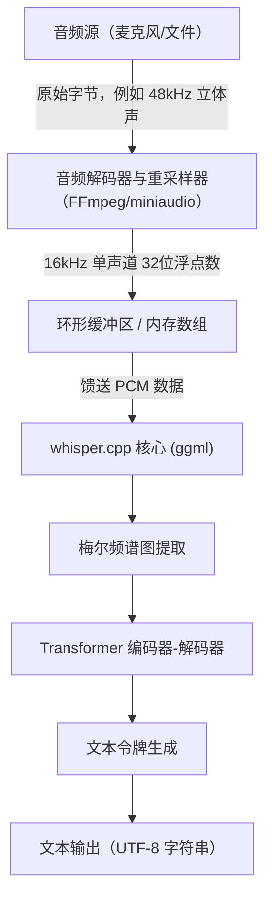
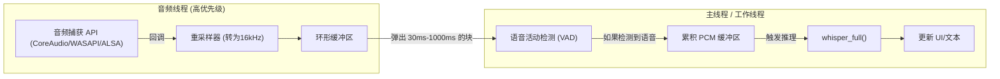

## 1. 简介：为什么选择用C++进行语音识别

OpenAI开发的高精度语音识别模型“Whisper”自开源以来，已被广泛应用于各种应用程序中。虽然在Python环境（基于PyTorch）中使用很常见，但如果要将其集成到**边缘设备（智能手机、IoT设备、嵌入式系统）**或**需要高实时性的原生C++应用程序**（游戏引擎、DAW软件、机器人技术等）中，对Python解释器的依赖将成为性能上的巨大瓶颈。

此时，由Georgi Gerganov开发的**[whisper.cpp](https://github.com/ggerganov/whisper.cpp)**便成为了救星。该库基于面向机器学习的张量计算库`ggml`，在最大程度上减少了依赖关系，仅使用C/C++即可实现Whisper的推理。

本文将深入探讨如何使用`whisper.cpp`将顶级的语音识别功能集成到您自己的C++项目中，内容详尽涵盖音频信号处理的基础知识、API的详细使用方法、内存管理、多线程优化以及实时处理的实现模式。

---

## 2. 音频信号处理与Whisper的输入要求

为了让AI理解语音，必须将模拟信号的“声音”转换为数字数据，并将其转化为AI模型可以处理的格式（张量）。Whisper所要求的音频格式非常严格。

### 2.1 Whisper要求的音频格式

Whisper模型接收具有以下规格的音频数据作为输入：

* **采样率 (Sample Rate)**: 16,000 Hz (16 kHz)
* **声道数 (Channels)**: 1 (单声道)
* **数据类型 (Data Type)**: 32位浮点数 (C/C++中的`float`)
* **归一化 (Normalization)**: 缩放至 $[-1.0, 1.0]$ 范围的值

例如，如果输入CD音质（44.1kHz，立体声，16位PCM）的音频文件，必须事先进行降采样、声道缩混和格式转换。

数据传输速率的计算公式如下：

$$ \text{Data Rate (bytes/sec)} = \text{Sample Rate} \times \text{Channels} \times \frac{\text{Bit Depth}}{8} $$

在Whisper的要求（16kHz，1声道，32位浮点）下，1秒钟的数据大小为：

$$ 16000 \times 1 \times \frac{32}{8} = 64,000 \text{ bytes/sec (64 KB/s)} $$

由于非常轻量，即使在内存带宽有限的边缘设备上，也能进行充分的缓冲。

### 2.2 梅尔频谱图转换的数学原理

在Whisper内部，并不会直接处理一维的音频波形数据（Raw Waveform）。在输入Transformer模型之前，它会先被转换为更接近人类听觉特性的频率表示——**梅尔频谱图 (Mel-Spectrogram)**。`whisper.cpp`在C++实现中包含了这种转换处理，但了解其原理有助于进行噪声对策和预处理的优化。

将普通频率 $f$ (Hz) 转换为梅尔尺度 $m$ 的近似公式如下：

$$ m = 2595 \log_{10} \left( 1 + \frac{f}{700} \right) $$

相反，从梅尔尺度到频率的逆转换为：

$$ f = 700 \left( 10^{\frac{m}{2595}} - 1 \right) $$

此外，音频波形通过**短时傅里叶变换 (STFT: Short-Time Fourier Transform)**被转换到时频域。使用窗函数 $w(n)$ 的STFT离散形式可表示如下：

$$ X(m, k) = \sum_{n=0}^{N-1} x(n + mH) w(n) e^{-j \frac{2\pi}{N} k n} $$
*(这里，$N$ 是FFT窗口大小，$H$ 是跳跃大小（Hop Size），$w(n)$ 是汉宁窗等窗函数)*

在Whisper模型中，通常使用窗口大小 $N = 400$ (25ms)、跳跃大小 $H = 160$ (10ms) 以及 80 维的梅尔滤波器组。这种特征提取在调用 `whisper.cpp` 中的 `whisper_full()` 时会自动（并使用SIMD指令高速地）执行。

---

## 3. 架构与流水线设计

让我们设计一个C++应用程序中的音频处理流水线。流程从文件输入或麦克风输入开始，经过预处理、使用 `whisper.cpp` 进行推理，最后输出文本。



应用程序端需要负责的是上图中的 **A 到 C 区间（音频解码和重采样）**。由于 `whisper.cpp` 自身不包含音频文件解码器，因此最佳实践是结合使用 FFmpeg 或 `miniaudio` 等库。

---

## 4. whisper.cpp 的构建与引入

以下是将 `whisper.cpp` 集成到项目中的步骤。使用 CMake 是最具通用性的方法。

### CMakeLists.txt 配置

可以将 `whisper.cpp` 作为源代码引入项目，或者作为子模块添加并链接。

```cmake
cmake_minimum_required(VERSION 3.14)
project(WhisperApp C CXX)

set(CMAKE_CXX_STANDARD 17)
set(CMAKE_CXX_STANDARD_REQUIRED ON)

# 启用CPU扩展指令集（AVX, F16C等）
# 在MacOS上，NEON/Accelerate框架会自动启用
set(WHISPER_SUPPORT_SDL2 OFF CACHE BOOL "" FORCE)
add_subdirectory(whisper.cpp)

add_executable(whisper_app main.cpp)
target_link_libraries(whisper_app PRIVATE whisper)
```

通过此配置，`whisper.cpp` 的高度优化的 `ggml` 后端将被构建，并静态链接到应用程序中。

---

## 5. C++ API 详解与实现步骤

接下来，我们将结合实际的 C++ 代码，讲解如何调用 API。

### 5.1 上下文初始化与模型加载

在 `whisper.cpp` 中，所有的状态和内存分配都由 `whisper_context` 结构体来管理。

```cpp
#include "whisper.h"
#include <iostream>
#include <vector>
#include <string>

int main() {
    // 1. 参数初始化
    struct whisper_context_params cparams = whisper_context_default_params();
    cparams.use_gpu = true; // 如果可用，则使用GPU加速（CuBLAS/Metal）

    // 2. 加载模型 (ggml格式的二进制模型)
    const std::string model_path = "models/ggml-base.bin";
    struct whisper_context * ctx = whisper_init_from_file_with_params(model_path.c_str(), cparams);

    if (ctx == nullptr) {
        std::cerr << "错误：模型加载失败 - " << model_path << std::endl;
        return 1;
    }
    
    std::cout << "模型已成功加载。" << std::endl;
```

模型文件是经过独有量化的 `.bin` 格式。可以使用官方仓库中的转换脚本，或者直接从 HuggingFace 下载。在内存限制严格的环境中，使用 4-bit 量化模型（例如：`ggml-base-q4_0.bin`）可以将 RAM 消耗减少到约 1/4。

### 5.2 推理参数设置

接下来，设置控制推理行为的 `whisper_full_params`。

```cpp
    // 3. 设置完整推理参数 (使用贪心采样 Greedy Sampling)
    struct whisper_full_params wparams = whisper_full_default_params(WHISPER_SAMPLING_GREEDY);
    
    // 设置线程数 (最好与CPU物理核心数保持一致)
    wparams.n_threads = 4;
    
    // 语言设置 (自动识别为 "auto"，指定日语为 "ja")
    wparams.language = "ja";
    
    // 抑制中间结果的标准输出（为了在应用内进行控制）
    wparams.print_progress = false;
    wparams.print_realtime = false;
    
    // 翻译功能 (如果将日语语音直接翻译为英文文本，则设为 true)
    wparams.translate = false;
```

### 5.3 音频数据准备与执行推理

这里假设 16kHz 的音频数据已经存储在 `std::vector<float>` 中。

```cpp
    // 虚拟音频数据 (实际中为从文件或麦克风获取的PCM数据)
    // 3秒钟 (16000 Hz * 3 sec = 48000 samples)
    std::vector<float> pcmf32(48000, 0.0f); 

    // 4. 执行推理
    if (whisper_full(ctx, wparams, pcmf32.data(), pcmf32.size()) != 0) {
        std::cerr << "错误：whisper_full 执行失败。" << std::endl;
        whisper_free(ctx);
        return 1;
    }
```

### 5.4 提取结果

当 `whisper_full` 完成后，识别结果会按段（segment）保存在上下文中。

```cpp
    // 5. 获取并显示结果
    const int n_segments = whisper_full_n_segments(ctx);
    
    for (int i = 0; i < n_segments; ++i) {
        const char * text = whisper_full_get_segment_text(ctx, i);
        
        // 获取时间戳 (单位: 10ms)
        const int64_t t0 = whisper_full_get_segment_t0(ctx, i);
        const int64_t t1 = whisper_full_get_segment_t1(ctx, i);
        
        std::cout << "[" << (t0 * 10.0) << " ms -> " << (t1 * 10.0) << " ms]: " 
                  << text << std::endl;
    }

    // 6. 释放内存
    whisper_free(ctx);
    return 0;
}
```

这个代码块是使用 C++ 调用 Whisper 的最基础模板。

---

## 6. 实时语音识别的高级实现

处理已录制好的文件很简单，但为了提升应用程序的用户体验（UX），来自麦克风输入的“实时语音识别（流式识别）”是必不可少的。

要实现这一点，不可或缺的是多线程架构以及通过环形缓冲区（Ring Buffer）来管理音频流。



### 6.1 语音活动检测 (VAD) 的重要性

在实时处理时，不断对静音部分执行推理是对计算资源的浪费。通过在前端加入 VAD 算法（简单的基于能量的阈值处理，或 WebRTC VAD 等），可以实现如下控制：**“仅在开始说话时启动缓冲，在说话结束（持续一定时间的静音）时触发 `whisper_full`”**。

### 6.2 滑动窗口方法

如果说话持续时间很长，可以使用“滑动窗口”技术，每隔几秒截取一段进行推理。然而，如果仅仅是简单地切断音频，可能会在单词中途被切断，导致识别精度显著下降。

作为对策，可以采用 **“总是包含过去 N 秒上下文进行推理”**（使其重叠）的方法。`whisper.cpp` 也提供了 `wparams.prompt_tokens` 功能来继承过去的文本令牌作为提示词（prompt），从而实现保持上下文的高精度流式识别。

---

## 7. 内存管理与面向边缘设备的优化

让我们深入探讨 `whisper.cpp` 最大的优势——性能与内存效率。

### 7.1 ggml 张量库的威力

`whisper.cpp` 的后端 `ggml` 是一个零依赖的 C 语言张量库。其最大的特点在于支持 **权重数据的动态量化 (Quantization)**。

例如，让我们计算一下 Whisper `Small` 模型（约 2.4 亿个参数）的内存大小。
在通常情况下（16-bit Float = 2 字节）：

$$ \text{Memory (FP16)} \approx 244,000,000 \times 2 \text{ bytes} \approx 488 \text{ MB} $$

如果将其转换为 4-bit 量化（Q4_0 格式），每个参数平均约为 0.5 字节（包含缩放因子等开销后约 0.56 字节）。

$$ \text{Memory (Q4\_0)} \approx 244,000,000 \times 0.56 \text{ bytes} \approx 137 \text{ MB} $$

在 iOS 设备或 Raspberry Pi 等对 RAM 有严格限制的环境中，这种内存占用的减少将直接关乎整个应用程序的稳定性。

### 7.2 利用硬件加速

虽然仅使用 CPU 结合 AVX2 或 NEON 指令就已经足够快了，但 `whisper.cpp` 同时也支持各种 GPU 和 NPU 的硬件加速作为后端。

* **Apple Silicon (Mac/iOS)**: 通过 `ggml-metal` 支持 Metal API。利用 GPU 进行超高速推理。
* **NVIDIA GPU (Windows/Linux)**: 支持 `cuBLAS`。在 CMake 构建时指定 `-DWHISPER_CUBLAS=ON`。
* **Intel (Windows/Linux)**: 支持 `OpenVINO` 后端。可利用最新 Intel Core 处理器上的 NPU。

如果在 C++ 项目中使用这些加速器，几乎不需要修改源代码。只要在上下文初始化时设置了 `cparams.use_gpu = true;`，它就会根据编译的后端自动卸载（offload）到硬件上。

### 7.3 缓存与线程数的调优

`wparams.n_threads` 的设置非常重要。盲目增加线程数，由于内存带宽瓶颈（Memory Bound），性能并不会提升。

根据经验法则，理想的线程数决定公式如下：

$$ N_{\text{threads}} = \min(\text{Physical CPU Cores}, 4 \sim 8) $$

如果包含超线程（Hyper-Threading）等逻辑核心，往往会产生缓存竞争，反而导致推理速度下降，因此铁律是将其设置为 **物理核心数**。如果使用 C++11 的 `std::thread::hardware_concurrency()`，它返回的是逻辑核心数，建议根据环境进行硬编码或使用操作系统级别的 API 来获取物理核心数。

---

## 8. 总结

本文从理论到实践，再到优化，详细讲解了如何利用 `whisper.cpp` 将顶级的语音识别 AI 集成到 C++ 项目中。

* **遵守输入要求**: 严格遵守 16kHz，单声道，32位浮点数。
* **直观的 API 使用**: 仅用 `whisper_init_from_file_with_params` 和 `whisper_full` 就能完成推理的简洁设计。
* **实时化**: 利用 VAD 和滑动窗口进行多线程控制。
* **压倒性的优化**: 得益于 `ggml` 的 4-bit 量化，以及 Metal/cuBLAS 等硬件后端的支持。

请务必使用 `whisper.cpp` 来开发在原生环境中高速且安全运行的语音处理应用程序，摆脱对庞大的 Python 环境和云端 API 的依赖。从隐私保护和延迟的角度来看，本地完全闭环的 AI 必将成为未来软件开发中极其重要的核心技术。
