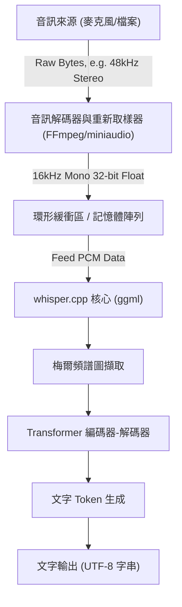
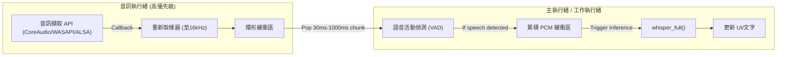

## 1. 簡介：為什麼選擇在C++中進行語音辨識

OpenAI開發的高精度語音辨識模型「Whisper」自開源以來，已被廣泛應用於各種應用程式中。雖然在Python環境（基於PyTorch）中使用非常普遍，但若要將其整合至**邊緣裝置（智慧型手機、IoT設備、嵌入式系統）**，或是**要求高度即時性的原生C++應用程式**（遊戲引擎、DAW軟體、機器人技術等）時，對Python直譯器的依賴會成為效能上的重大瓶頸。

這時候的救星，就是由Georgi Gerganov所開發的 **[whisper.cpp](https://github.com/ggerganov/whisper.cpp)**。該函式庫以機器學習專用的張量運算函式庫 `ggml` 為基礎，將依賴關係降至最低，僅使用C/C++便實現了Whisper的推論。

本文將徹底解說如何使用這個 `whisper.cpp`，將最高水準的語音辨識功能整合至您專屬的C++專案中，內容涵蓋語音訊號處理基礎、API詳細使用方法、記憶體管理、多執行緒最佳化，以及即時處理的實作模式。

---

## 2. 語音訊號處理與Whisper的輸入要求

為了讓AI理解語音，必須將作為類比訊號的「聲音」轉換為數位資料，並落實為AI模型可以處理的格式（張量）。Whisper所要求的語音格式非常嚴格。

### 2.1 Whisper要求的音訊格式

Whisper模型接受符合以下規格的語音資料作為輸入：

* **取樣率 (Sample Rate)**: 16,000 Hz (16 kHz)
* **聲道數 (Channels)**: 1 (單聲道)
* **資料型態 (Data Type)**: 32-bit 浮點數 (`float` in C/C++)
* **正規化 (Normalization)**: 縮放至 $[-1.0, 1.0]$ 範圍的值

舉例來說，若將CD音質（44.1kHz, 立體聲, 16-bit PCM）的語音檔案作為輸入，必須事先進行降取樣（Downsampling）、聲道混合（Mixdown）以及格式轉換。

資料傳輸率的計算公式如下：

$$ \text{Data Rate (bytes/sec)} = \text{Sample Rate} \times \text{Channels} \times \frac{\text{Bit Depth}}{8} $$

在Whisper的要求（16kHz, 1ch, 32-bit Float）下，1秒鐘的資料大小為：

$$ 16000 \times 1 \times \frac{32}{8} = 64,000 \text{ bytes/sec (64 KB/s)} $$

由於非常輕量，即使在記憶體頻寬受限的邊緣裝置上，也能夠游刃有餘地進行緩衝（Buffering）。

### 2.2 梅爾頻譜圖轉換的數學原理

在Whisper內部，並非直接處理一維的語音波形資料（Raw Waveform）。而是會先轉換為接近人類聽覺特性的頻率表示方式——**梅爾頻譜圖 (Mel-Spectrogram)**，再輸入至Transformer模型。`whisper.cpp` 在其C++實作中已內含了此轉換處理，但了解其機制有助於對策雜訊與最佳化前處理。

將一般頻率 $f$ (Hz) 轉換為梅爾尺度 $m$ 的公式近似如下：

$$ m = 2595 \log_{10} \left( 1 + \frac{f}{700} \right) $$

反之，從梅爾尺度轉換回頻率的逆轉換如下：

$$ f = 700 \left( 10^{\frac{m}{2595}} - 1 \right) $$

此外，語音波形會透過**短時距傅立葉變換 (STFT: Short-Time Fourier Transform)** 轉換至時間-頻率域。使用窗函數 $w(n)$ 的STFT離散形式可表示為：

$$ X(m, k) = \sum_{n=0}^{N-1} x(n + mH) w(n) e^{-j \frac{2\pi}{N} k n} $$
*(在此，$N$ 為FFT的視窗大小，$H$ 為平移大小 (Hop Size)，$w(n)$ 為漢明窗 (Hann Window) 等窗函數)*

Whisper模型通常使用視窗大小 $N = 400$ (25ms)、平移大小 $H = 160$ (10ms)，以及80維的梅爾濾波器組。這項特徵提取會在呼叫 `whisper.cpp` 內的 `whisper_full()` 時自動（並且使用SIMD指令高速地）執行。

---

## 3. 架構與管線設計

讓我們來設計C++應用程式中的語音處理管線。流程從檔案輸入或麥克風輸入開始，經過前處理，接著使用 `whisper.cpp` 進行推論，最後輸出文字。



應用程式端應負責的是上圖中 **A 到 C 的區段（音訊解碼與重新取樣）**。由於 `whisper.cpp` 本身不包含語音檔案的解碼器，因此搭配 FFmpeg 或 `miniaudio` 等函式庫使用是最佳實務。

---

## 4. whisper.cpp 的建置與導入

將 `whisper.cpp` 整合至專案的步驟。使用CMake是通用性最高的方式。

### CMakeLists.txt 的設定

可以將 `whisper.cpp` 作為原始碼納入專案，或作為子模組 (submodule) 加入並連結。

```cmake
cmake_minimum_required(VERSION 3.14)
project(WhisperApp C CXX)

set(CMAKE_CXX_STANDARD 17)
set(CMAKE_CXX_STANDARD_REQUIRED ON)

# 啟用CPU擴充指令集（AVX, F16C等）
# 若在MacOS上，會自動啟用NEON/Accelerate框架
set(WHISPER_SUPPORT_SDL2 OFF CACHE BOOL "" FORCE)
add_subdirectory(whisper.cpp)

add_executable(whisper_app main.cpp)
target_link_libraries(whisper_app PRIVATE whisper)
```

透過此設定，將會建置 `whisper.cpp` 高度最佳化過的 `ggml` 後端，並靜態連結至應用程式中。

---

## 5. C++ API詳細說明與實作步驟

接下來我們一邊看實際的C++程式碼，一邊解說API的呼叫方式。

### 5.1 內容初始化與模型載入

在 `whisper.cpp` 中，所有的狀態與記憶體配置皆由 `whisper_context` 結構體進行管理。

```cpp
#include "whisper.h"
#include <iostream>
#include <vector>
#include <string>

int main() {
    // 1. 初始化參數
    struct whisper_context_params cparams = whisper_context_default_params();
    cparams.use_gpu = true; // 當可使用GPU硬體加速（CuBLAS/Metal）時啟用

    // 2. 載入模型 (ggml格式的二進位模型)
    const std::string model_path = "models/ggml-base.bin";
    struct whisper_context * ctx = whisper_init_from_file_with_params(model_path.c_str(), cparams);

    if (ctx == nullptr) {
        std::cerr << "錯誤: 模型載入失敗 - " << model_path << std::endl;
        return 1;
    }
    
    std::cout << "已成功載入模型。" << std::endl;
```

模型檔案為專門量化過的 `.bin` 格式。可以使用官方儲存庫中的轉換腳本，或直接從HuggingFace下載。在記憶體限制嚴格的環境中，透過使用4-bit量化模型（例如：`ggml-base-q4_0.bin`），可將RAM消耗量減少至約1/4。

### 5.2 推論參數設定

接著設定控制推論行為的 `whisper_full_params`。

```cpp
    // 3. 設定完整推論用參數 (使用Greedy Sampling)
    struct whisper_full_params wparams = whisper_full_default_params(WHISPER_SAMPLING_GREEDY);
    
    // 設定執行緒數量 (配合CPU實體核心數為最佳)
    wparams.n_threads = 4;
    
    // 語言設定 (自動判斷為 "auto"，指定日文為 "ja")
    wparams.language = "ja";
    
    // 抑制中間結果的標準輸出（為了在應用程式內控制）
    wparams.print_progress = false;
    wparams.print_realtime = false;
    
    // 翻譯功能 (若要將日文語音直接翻譯為英文文字則設為 true)
    wparams.translate = false;
```

### 5.3 語音資料準備與推論執行

此處假設16kHz的語音資料已經儲存在 `std::vector<float>` 中。

```cpp
    // 虛擬的語音資料 (實際上是從檔案或麥克風取得的PCM資料)
    // 3秒鐘 (16000 Hz * 3 sec = 48000 samples)
    std::vector<float> pcmf32(48000, 0.0f); 

    // 4. 執行推論
    if (whisper_full(ctx, wparams, pcmf32.data(), pcmf32.size()) != 0) {
        std::cerr << "錯誤: whisper_full 執行失敗。" << std::endl;
        whisper_free(ctx);
        return 1;
    }
```

### 5.4 結果擷取

當 `whisper_full` 完成後，辨識結果將會以片段 (Segment) 為單位儲存於 context 中。

```cpp
    // 5. 取得並顯示結果
    const int n_segments = whisper_full_n_segments(ctx);
    
    for (int i = 0; i < n_segments; ++i) {
        const char * text = whisper_full_get_segment_text(ctx, i);
        
        // 取得時間戳記 (單位: 10ms)
        const int64_t t0 = whisper_full_get_segment_t0(ctx, i);
        const int64_t t1 = whisper_full_get_segment_t1(ctx, i);
        
        std::cout << "[" << (t0 * 10.0) << " ms -> " << (t1 * 10.0) << " ms]: " 
                  << text << std::endl;
    }

    // 6. 釋放記憶體
    whisper_free(ctx);
    return 0;
}
```

此程式碼區塊將是在C++中使用Whisper的最基本樣板。

---

## 6. 即時語音辨識的進階實作

處理已錄製完成的檔案很簡單，但為了提升應用程式的UX，從麥克風輸入的「即時語音辨識（串流辨識）」是不可或缺的。

要實作這項功能，多執行緒架構以及透過環形緩衝區（Ring Buffer）來管理語音串流是必要的。



### 6.1 語音活動偵測 (VAD) 的重要性

在即時處理中，不斷對無音部分執行推論會浪費運算資源。透過在前端加入VAD演算法（簡單的基於能量閾值處理，或WebRTC VAD等），可以進行**「僅在開始說話時才開始緩衝，並在說話結束（一定時間的無音）時觸發 `whisper_full`」** 的控制。

### 6.2 滑動視窗 (Sliding Window) 策略

當語音持續較長時，會採用每隔幾秒裁切區塊進行推論的「滑動視窗」手法。然而，若單純將語音直接切斷，可能會在單字中途被切斷，導致辨識精準度顯著下降。

作為對策，會使用**「推論時始終包含過去N秒的上下文」**（使其重疊）的手法。`whisper.cpp` 中也有一項名為 `wparams.prompt_tokens` 的功能，可以將過去的文字 Token 作為提示 (Prompt) 繼承下來，從而實現維持上下文的高精準度串流辨識。

---

## 7. 記憶體管理與邊緣裝置的最佳化

接著我們將深入探討 `whisper.cpp` 最大的優勢——效能與記憶體效率。

### 7.1 ggml 張量函式庫的威力

`whisper.cpp` 的後端 `ggml` 是一個不具依賴關係的C語言張量函式庫。它最大的特色，在於支援**權重資料的動態量化 (Quantization)**。

舉例來說，我們來計算 Whisper `Small` 模型（約2億4000萬個參數）的記憶體大小。
在一般情況下（16-bit Float = 2 bytes）：

$$ \text{Memory (FP16)} \approx 244,000,000 \times 2 \text{ bytes} \approx 488 \text{ MB} $$

若將其轉換為 4-bit 量化（Q4_0 格式），每個參數平均為0.5 bytes（包含縮放係數等額外開銷後約為0.56 bytes）。

$$ \text{Memory (Q4\_0)} \approx 244,000,000 \times 0.56 \text{ bytes} \approx 137 \text{ MB} $$

在 iOS 裝置或 Raspberry Pi 等 RAM 限制嚴格的環境中，減少這種記憶體佔用量會直接關係到應用程式整體的穩定性。

### 7.2 活用硬體加速

雖然單靠 CPU 搭配 AVX2 或 NEON 指令集就已足夠快速，但 `whisper.cpp` 也支援各種 GPU、NPU 的硬體加速作為後端。

* **Apple Silicon (Mac/iOS)**: 透過 `ggml-metal` 支援 Metal API。使用 GPU 進行超高速推論。
* **NVIDIA GPU (Windows/Linux)**: 支援 `cuBLAS`。在 CMake 建置時指定 `-DWHISPER_CUBLAS=ON`。
* **Intel (Windows/Linux)**: 支援 `OpenVINO` 後端。可活用最新 Intel Core 處理器上的 NPU。

若要在 C++ 專案中使用這些加速器，幾乎不需要修改原始碼。只要在上下文初始化時設定了 `cparams.use_gpu = true;`，系統就會根據建置好的後端，自動將運算卸載 (Offload) 至硬體。

### 7.3 快取與執行緒數量的調校

`wparams.n_threads` 的設定非常重要。即使盲目增加執行緒數量，也會因為記憶體頻寬的瓶頸 (Memory Bound) 而無法提升效能。

根據經驗法則，理想情況是使用以下計算公式來決定執行緒數量：

$$ N_{\text{threads}} = \min(\text{實體 CPU 核心數}, 4 \sim 8) $$

若包含 Hyper-Threading 等邏輯核心，通常會發生快取爭用而導致推論速度反而下降，因此設定為**實體核心數**是鐵則。由於使用 C++11 的 `std::thread::hardware_concurrency()` 會回傳邏輯核心數，建議根據環境寫死數值 (Hardcode)，或是透過作業系統層級的 API 來取得實體核心數。

---

## 8. 總結

本文中，我們從理論到實踐，再到最佳化，詳細解說了如何活用 `whisper.cpp` 將最高水準的語音辨識 AI 整合至 C++ 專案中。

* **遵守輸入要求**: 徹底執行 16kHz, 1ch, 32-bit Float。
* **直覺的 API 使用**: 僅靠 `whisper_init_from_file_with_params` 與 `whisper_full` 就能完成推論的簡潔設計。
* **即時處理化**: 透過 VAD 與滑動視窗進行的多執行緒控制。
* **壓倒性的最佳化**: 透過 `ggml` 進行 4-bit 量化，以及受惠於 Metal/cuBLAS 等硬體後端。

請務必在開發能夠擺脫對龐大 Python 環境或雲端 API 的依賴，並在原生環境中高速且安全運作的語音處理應用程式時，善用 `whisper.cpp`。從隱私保護與低延遲的角度來看，完全在地端運行的 AI 必將成為未來軟體開發中極為重要的關鍵技術。
