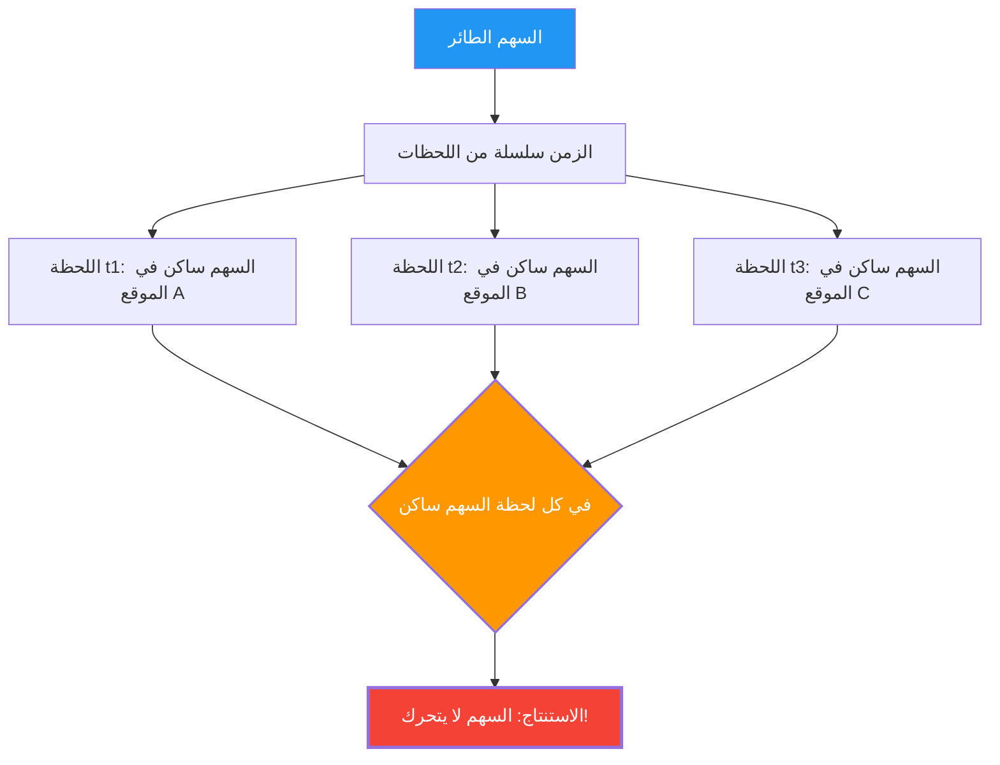

ينطلق السهم من القوس ويطير في الهواء. هذا السهم يتحرك بالتأكيد.
ولكن، قدم الفيلسوف اليوناني زينون في القرن الخامس قبل الميلاد حجة منطقية مروعة كالتالي:

**"السهم الطائر، في الواقع، ساكن"**

هذه ليست مزحة أو مغالطة، بل هي **"مفارقة السهم الطائر"** التي استمر علماء الرياضيات والفلاسفة في مناقشتها بجدية لمدة 2500 عام.

## حجة زينون

تبدأ حجة زينون من مفهوم "لحظات الزمن".

1. الزمن هو سلسلة من "اللحظات".
2. إذا قمنا بالتقاط لحظة واحدة (نقطة زمنية طولها صفر) مثل "صورة"، فإن السهم "موجود" في نقطة معينة من الفضاء.
3. في تلك اللحظة، السهم "يشغل" ذلك المكان فقط، و**لا يتحرك**. (إذا كان يتحرك، فإنه سيحتاج إلى "فترة زمنية" وليس "لحظة").
4. هذا ينطبق على أي لحظة نأخذها.
5. إذا كان السهم ساكنًا في جميع لحظات الزمن، فمتى يتحرك السهم إذن؟

## الحدس مقابل المنطق

"هذا سخيف. السهم يطير بالفعل." ربما يكون هذا هو رد الفعل الأول لمعظم الناس.
ولكن، من الصعب جدًا تحديد الخطأ **منطقياً** في حجة زينون.

في الواقع، يُروى أن الفيلسوف اليوناني القديم ديوجينيس نهض ببساطة ومشى في الغرفة أمام زينون، وقال: "انظر، إنه يتحرك". ومع ذلك، هذا لا يعد **دحضًا** لمنطق زينون. لأن زينون لم يكن يسأل "هل يمكنه التحرك أم لا"، بل كان يسأل "هل يمكننا أن نشرح معنى أن يتحرك دون تناقض في منطقنا؟".

## الحل بواسطة التفاضل والتكامل (محاولة)

قدم **التفاضل والتكامل** الذي ابتكره نيوتن ولايبنيتز في القرن السابع عشر إجابة رياضية (جزئية على الأقل) لهذه المفارقة.

في التفاضل والتكامل، يتم تعريف "السرعة في لحظة معينة (السرعة اللحظية)" على النحو التالي:

$$ v(t) = \lim_{\Delta t \to 0} \frac{\Delta x}{\Delta t} $$

بمعنى آخر، نقسم التغير في الموقع $\Delta x$ على التغير في الزمن $\Delta t$، ونعرّف السرعة كـ "نهاية" عندما يقترب $\Delta t$ من الصفر قدر الإمكان.

النقطة المهمة هنا هي أن **"السرعة اللحظية" ليست مسافة الحركة خلال فترة زمنية صفرية**.
إنها الكمية المعرّفة كـ "اتجاه" أو **"نهاية"** للتغير الضئيل قبل وبعد ذلك الوقت.

وبالتالي، الإجابة من وجهة نظر التفاضل والتكامل هي كالتالي:

"بالتأكيد، إذا أخذنا لحظة طولها صفر، فإن السهم لا يتحرك "داخل" تلك اللحظة. ومع ذلك، يمتلك السهم خاصية "السرعة اللحظية (قيمة نهاية غير صفرية)" حتى في تلك اللحظة. عبارة "ساكن" تعني أن "السرعة اللحظية تساوي صفر"، وبما أن السرعة اللحظية للسهم الطائر ليست صفرًا، فلا يمكن القول إن السهم "ساكن"."

## الأسئلة الفلسفية المتبقية

على الرغم من أن التفاضل والتكامل قدم حلًا عمليًا لمفارقة زينون، إلا أنه لم يتم حسم الأمر فلسفيًا بالكامل.

ذلك لأن مفهوم "النهاية" هو مجرد أداة رياضية (إجراء حسابي)، ولا يقدم إجابات دقيقة على أسئلة جوهرية مثل: **"ما هي الوحدة الصغرى للزمن (اللحظة) فيزيائيًا؟" "ما هو المتصل؟" "ما هو جوهر الحركة؟"**

في الفيزياء الحديثة (ميكانيكا الكم)، يتم مناقشة إمكانية وجود وحدة صغرى للزمان والمكان (زمن بلانك، طول بلانك)، وإذا كان الزمن "منفصلاً (رقميًا)" وليس "متصلًا"، فقد يلزم إعادة تقييم مفارقة زينون في سياق مختلف تمامًا.

بعد 2500 عام، لا يزال سهم زينون يطرح علينا أسئلة: "ما هي الحركة؟" و "ما هو الزمن؟".
