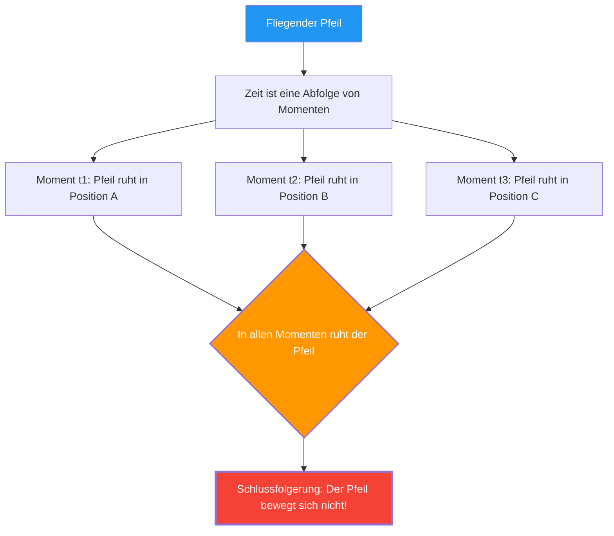

---
title: "Steht der fliegende Pfeil still?: Zenons Paradoxon vom fliegenden Pfeil"
description: "Ein fliegender Pfeil ruht in jedem Moment. Gibt es dann keine Bewegung? Das größte logische Rätsel des antiken Griechenlands."
date: 2026-09-10T21:00:00+09:00
draft: false
slug: "zenos-arrow"
image: "img/zenos_arrow.jpg"
math: true
mermaid: true
categories: ["Mathematische Paradoxa", "Philosophie", "Physik"]
tags: ["Paradoxon", "Zenon", "Bewegung", "Unendlichkeit", "Infinitesimalrechnung"]
---

Ein von einem Bogen abgeschossener Pfeil fliegt durch die Luft. Dieser Pfeil bewegt sich zweifellos.
Jedoch entwickelte der griechische Philosoph Zenon im 5. Jahrhundert v. Chr. die folgende furchteinflößende Logik:

**"Ein fliegender Pfeil steht in Wirklichkeit still."**

Dies ist weder ein Scherz noch eine Sophisterei, sondern das **"Paradoxon des fliegenden Pfeils"**, über das Mathematiker und Philosophen seit 2500 Jahren ernsthaft debattieren.

## Zenons Argumentation

Zenons Argumentation geht von dem Konzept des "Zeitpunkts" (Moment) aus.

1. Die Zeit ist eine Abfolge von "Momenten".
2. Wenn man einen einzigen Moment (einen Zeitpunkt mit der Dauer Null) wie ein "Foto" herausgreift, "befindet" sich der Pfeil an einem bestimmten Punkt im Raum.
3. In diesem Moment "nimmt" der Pfeil nur diesen Raum "ein" und **bewegt sich nicht**. (Wenn er sich bewegen würde, würde dies eine "Zeitspanne" erfordern, nicht einen "Moment".)
4. Dies gilt für jeden beliebigen Moment, den man herausgreift.
5. Wenn der Pfeil in jedem Moment der Zeit ruht, **wann bewegt sich der Pfeil dann?**

## Intuition vs. Logik

"Lächerlich. Der Pfeil fliegt doch tatsächlich" ist wahrscheinlich die erste Reaktion der meisten Menschen.
Es ist jedoch tatsächlich sehr schwierig, in Zenons Argumentation **logisch** aufzuzeigen, was falsch ist.

Es wird überliefert, dass der antike griechische Philosoph Diogenes gegenüber Zenon einfach aufstand, im Raum umherging und zeigte: "Sieh her, er bewegt sich." Dies ist jedoch keine **Widerlegung** von Zenons Logik. Was Zenon in Frage stellt, ist nicht, "ob er sich bewegen kann", sondern "ob wir mit unserer Logik widerspruchsfrei erklären können, was es bedeutet, sich zu bewegen".

## (Versuch einer) Lösung durch die Infinitesimalrechnung

Die im 17. Jahrhundert von Newton und Leibniz erfundene **Infinitesimalrechnung** lieferte eine mathematische Antwort (zumindest teilweise) auf dieses Paradoxon.

In der Infinitesimalrechnung wird die "Geschwindigkeit in einem Moment (Momentangeschwindigkeit)" wie folgt definiert:

$$ v(t) = \lim_{\Delta t \to 0} \frac{\Delta x}{\Delta t} $$

Das heißt, die Geschwindigkeit ist definiert als der "Grenzwert", wenn die Positionsänderung $\Delta x$ durch die Zeitänderung $\Delta t$ geteilt wird und $\Delta t$ sich unendlich nahe Null nähert.

Der Punkt hierbei ist, dass **"Momentangeschwindigkeit" nicht die zurückgelegte Strecke in einem Zeitfenster von Null ist**.
Sie ist eine Größe, die als "Tendenz" von winzigen Änderungen vor und nach diesem Zeitpunkt definiert ist, also als **"Grenzwert"**.

Daher lautet die Antwort aus Sicht der Infinitesimalrechnung wie folgt:

"Zwar bewegt sich der Pfeil 'innerhalb' des Moments nicht, wenn man einen Moment der Länge Null herausgreift. Jedoch besitzt der Pfeil auch in diesem Moment die Eigenschaft einer 'Momentangeschwindigkeit (eines Grenzwertes ungleich Null)'. 'In Ruhe sein' bedeutet, dass die 'Momentangeschwindigkeit Null ist', aber da die Momentangeschwindigkeit des fliegenden Pfeils nicht Null ist, kann man nicht sagen, dass der Pfeil 'ruht'."

## Die verbleibenden philosophischen Fragen

Obwohl die Infinitesimalrechnung eine praktische Lösung für Zenons Paradoxon lieferte, ist sie philosophisch gesehen noch nicht vollständig geklärt.

Das Konzept des "Grenzwertes" ist lediglich ein mathematisches Werkzeug (Rechenverfahren) und beantwortet streng genommen keine grundlegenden Fragen wie: **"Was ist die physikalisch kleinste Zeiteinheit (der Moment)?", "Was ist Kontinuität?" oder "Was ist das Wesen der Bewegung?"**.

In der modernen Physik (Quantenmechanik) wird diskutiert, dass auch in Zeit und Raum möglicherweise kleinste Einheiten (Planck-Zeit, Planck-Länge) existieren. Wenn die Zeit nicht "kontinuierlich", sondern "diskret (digital)" wäre, müsste Zenons Paradoxon in einem völlig anderen Kontext neu bewertet werden.

Zenons Pfeil fragt uns auch 2500 Jahre später immer noch: "Was bedeutet es, sich zu bewegen?" und "Was ist Zeit?".
