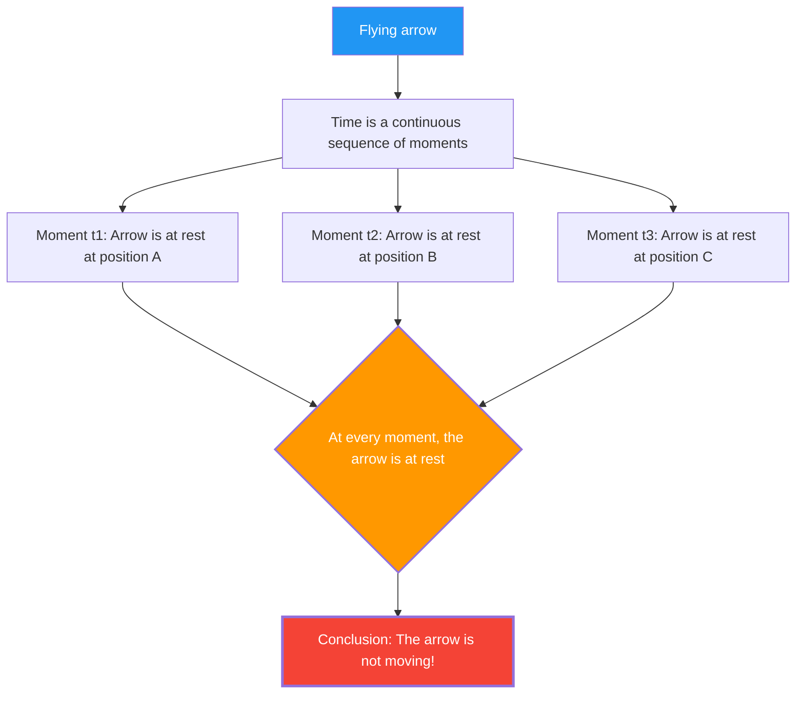

An arrow shot from a bow is flying through the sky. This arrow is certainly moving.
However, Zeno, a Greek philosopher from the 5th century BC, developed the following terrifying logic.

**"The flying arrow is actually at rest."**

This is neither a joke nor sophistry, but the **"Arrow Paradox"** that mathematicians and philosophers have seriously debated for 2500 years.

## Zeno's Argument

Zeno's argument starts with the concept of a "moment in time."

1. Time is a sequence of "moments."
2. If you capture a single moment (a point where the length of time is zero) like a "photograph," the arrow "is" at a specific point in space.
3. At that moment, the arrow is merely "occupying" that space and is **not moving**. (If it were moving, it would require a "duration of time" rather than a "moment.")
4. This holds true no matter which moment you pick out.
5. If the arrow is at rest at every moment in time, **when does it move?**

## Intuition vs. Logic

"Ridiculous. The arrow is actually flying, isn't it?" This is probably most people's first reaction.
However, it is actually extremely difficult to point out **logically** where Zeno's argument is flawed.

In fact, the ancient Greek philosopher Diogenes is said to have simply stood up and walked around the room in response to Zeno, showing him, "Look, it is moving." However, this does not constitute a **refutation** of Zeno's logic. What Zeno is questioning is not "whether it can move," but rather, "can we logically explain what it means to move without contradiction?"

## Resolution by Calculus (An Attempt)

**Calculus**, invented by Newton and Leibniz in the 17th century, provided a mathematical answer (at least partially) to this paradox.

In calculus, "the velocity at a certain moment (instantaneous velocity)" is defined as follows:

$$ v(t) = \lim_{\Delta t \to 0} \frac{\Delta x}{\Delta t} $$

In other words, velocity is defined as the "limit" where the change in position $\Delta x$ is divided by the change in time $\Delta t$, as $\Delta t$ approaches infinitely close to zero.

The point here is that **"instantaneous velocity" is not the distance traveled within a zero-time duration.**
It is a quantity defined as the "tendency," or **"limit,"** of minute changes before and after that time.

Therefore, the answer from the perspective of calculus is as follows:

"Indeed, if you capture a moment of zero length, the arrow has not moved 'within' that moment. However, even at that moment, the arrow has the property of 'instantaneous velocity (a non-zero limit value).' Being 'at rest' means having an 'instantaneous velocity of zero,' but since the instantaneous velocity of a flying arrow is not zero, the arrow cannot be said to be 'at rest.'"

## Remaining Philosophical Questions

While calculus provided a practical solution to Zeno's paradox, it hasn't completely settled the philosophical debate.

The concept of a "limit" is strictly a mathematical tool (calculation procedure), and it does not rigorously answer fundamental questions such as **"what physically is the smallest unit of time (moment)," "what is continuity," and "what is the essence of motion."**

In modern physics (quantum mechanics), the possibility that minimum units for time and space (Planck time, Planck length) exist is discussed. If time is not "continuous" but "discrete (digital)," Zeno's paradox might need to be re-evaluated in a completely different context.

Even after 2500 years, Zeno's arrow continues to ask us, "What does it mean to move?" and "What is time?"
