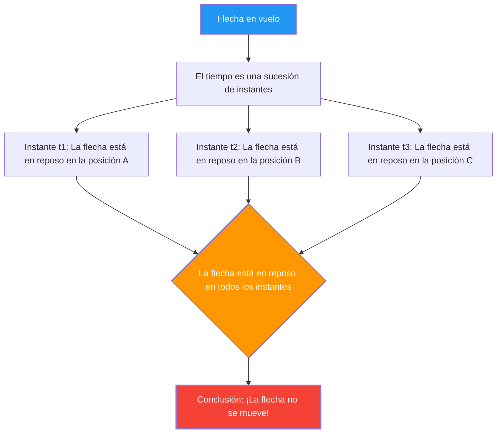

Una flecha disparada por un arco vuela por el cielo. Ciertamente, esta flecha se está moviendo.
Sin embargo, Zenón, un filósofo griego del siglo V a. C., desarrolló la siguiente temible lógica:

**"La flecha que vuela, en realidad, está quieta"**

Esto no es una broma ni un sofisma, sino la **"Paradoja de la flecha"**, que matemáticos y filósofos han estado debatiendo seriamente durante 2.500 años.

## El argumento de Zenón

El argumento de Zenón toma el concepto del "instante de tiempo" como su punto de partida.

1. El tiempo es una sucesión de "instantes".
2. Si capturamos un solo instante (un punto donde la duración del tiempo es cero) como si fuera una "fotografía", la flecha "está" en un punto específico del espacio.
3. En ese instante, la flecha solo "ocupa" ese lugar y **no se mueve**. (Si se estuviera moviendo, requeriría un "lapso de tiempo", no un "instante").
4. Esto es igual sin importar qué instante se tome.
5. Si la flecha está en reposo en todos los instantes del tiempo, **¿cuándo se mueve la flecha?**

## Intuición vs Lógica

"Qué absurdo. La flecha realmente está volando, ¿no es así?", sería la primera reacción de la mayoría de las personas.
Sin embargo, señalar **lógicamente** dónde se equivoca el argumento de Zenón es, de hecho, extremadamente difícil.

Se dice que Diógenes, otro filósofo de la antigua Grecia, respondió a Zenón simplemente poniéndose de pie, caminando por la habitación y demostrando: "Mira, se mueve". Sin embargo, esto no constituye una **refutación** de la lógica de Zenón. Lo que Zenón está cuestionando no es "si podemos movernos o no", sino "si podemos explicar sin contradicciones qué significa moverse usando nuestra lógica".

## La solución (o intento) mediante el cálculo

El **cálculo**, inventado por Newton y Leibniz en el siglo XVII, proporcionó una respuesta matemática (al menos parcialmente) a esta paradoja.

En el cálculo, la "velocidad en un instante dado (velocidad instantánea)" se define de la siguiente manera:

$$ v(t) = \lim_{\Delta t \to 0} \frac{\Delta x}{\Delta t} $$

Es decir, la velocidad se define como el "límite" en el que la cantidad de cambio en la posición $\Delta x$ se divide por la cantidad de cambio en el tiempo $\Delta t$, acercando $\Delta t$ a cero tanto como sea posible.

El punto clave aquí es que **la "velocidad instantánea" no es la distancia recorrida dentro de un lapso de tiempo de cero**.
Es una cantidad definida como la "tendencia" o **"límite"** de los cambios minúsculos antes y después de ese momento.

Por lo tanto, la respuesta desde el punto de vista del cálculo sería la siguiente:

"Ciertamente, si extraes un instante de longitud cero, la flecha no se mueve 'dentro' de ese instante. Sin embargo, incluso en ese instante, la flecha posee la propiedad de 'velocidad instantánea (un valor límite distinto de cero)'. Estar 'en reposo' significa que la 'velocidad instantánea es cero', pero como la velocidad instantánea de una flecha en vuelo no es cero, no se puede decir que la flecha esté 'en reposo'."

## Preguntas filosóficas restantes

Aunque el cálculo proporcionó una solución práctica a la paradoja de Zenón, la cuestión no se ha resuelto filosóficamente por completo.

El concepto de "límite" es estrictamente una herramienta matemática (un procedimiento de cálculo) y no responde rigurosamente a preguntas fundamentales como **"¿Qué es físicamente la unidad mínima de tiempo (instante)?"**, **"¿Qué es la continuidad?"** o **"¿Cuál es la esencia del movimiento?"**.

En la física moderna (mecánica cuántica), se debate la posibilidad de que existan unidades mínimas también para el tiempo y el espacio (tiempo de Planck, longitud de Planck). Si el tiempo es "discreto (digital)" en lugar de "continuo", la paradoja de Zenón tal vez deba ser reevaluada en un contexto completamente diferente.

Incluso después de 2.500 años, la flecha de Zenón sigue preguntándonos: "¿Qué es el movimiento?" y "¿Qué es el tiempo?".
