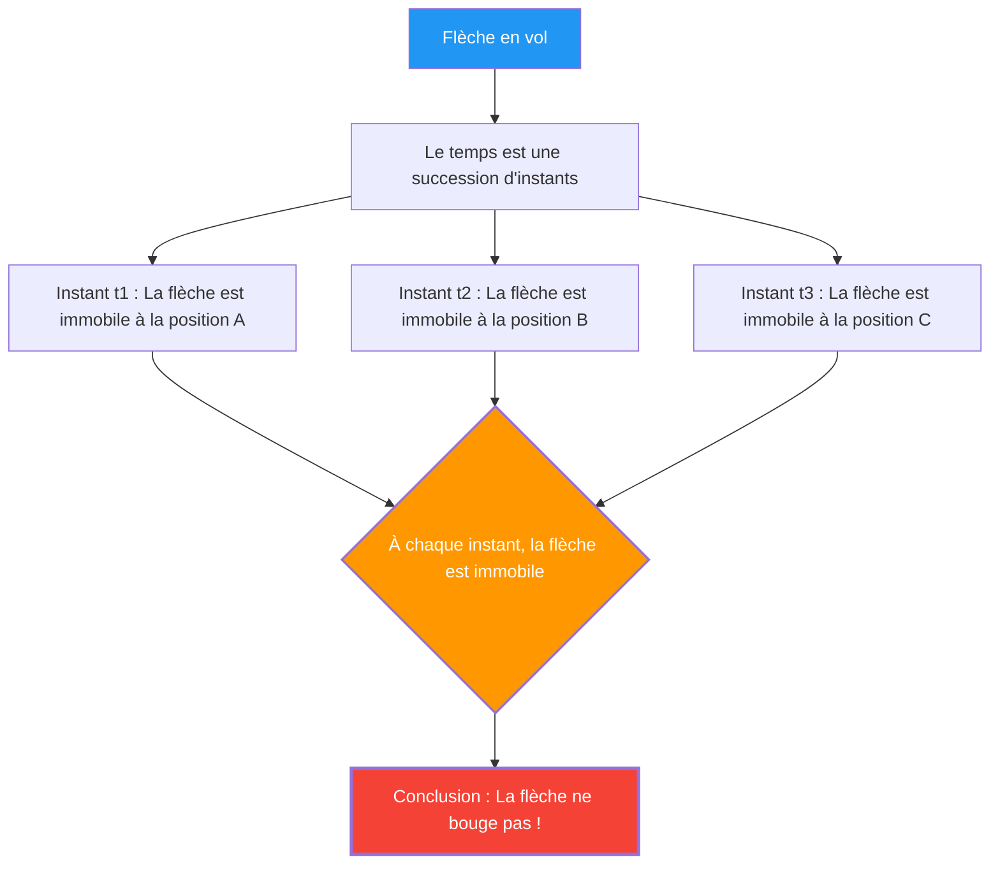

---
title: "Une flèche en plein vol est-elle immobile ? : Le paradoxe de la flèche de Zénon"
description: "Une flèche en vol est au repos à chaque instant. Dès lors, le mouvement n'existe-t-il pas ? Le plus grand casse-tête logique de la Grèce antique."
date: 2026-09-10T21:00:00+09:00
draft: false
slug: "zenos-arrow"
image: "img/zenos_arrow.jpg"
math: true
mermaid: true
categories: ["Paradoxes mathématiques", "Philosophie", "Physique"]
tags: ["Paradoxe", "Zénon", "Mouvement", "Infini", "Calcul"]
---

Une flèche tirée par un arc vole dans les airs. Cette flèche est certainement en mouvement.
Cependant, le philosophe grec du 5ème siècle avant J.-C., Zénon, a développé la logique redoutable suivante :

**« Une flèche en plein vol est en réalité immobile »**

Ce n'est ni une blague ni un sophisme, mais le **« Paradoxe de la flèche »**, débattu sérieusement par les mathématiciens et les philosophes depuis 2500 ans.

## L'argument de Zénon

L'argument de Zénon prend pour point de départ le concept d'« instant du temps ».

1. Le temps est une succession d'« instants ».
2. Si l'on isole un instant (un point où la durée est de zéro) comme une « photographie », la flèche se « trouve » à un point précis de l'espace.
3. À cet instant, la flèche ne fait qu'« occuper » cet espace et **ne bouge pas**. (Si elle bougeait, cela nécessiterait un « intervalle de temps » et non un « instant »).
4. Cela est vrai pour n'importe quel instant.
5. Si la flèche est immobile à chaque instant du temps, **quand bouge-t-elle ?**

## Intuition contre Logique

« C'est ridicule. La flèche vole bel et bien », telle serait la première réaction de la plupart des gens.
Cependant, il est en réalité très difficile de pointer **logiquement** où réside l'erreur dans l'argument de Zénon.

En fait, on raconte que le philosophe grec antique Diogène s'est contenté de se lever et de faire les cent pas dans la pièce pour montrer à Zénon : « Regarde, ça bouge ». Toutefois, cela ne **réfute** pas la logique de Zénon. Ce que demande Zénon n'est pas « s'il est possible de bouger », mais « si nous pouvons expliquer sans contradiction avec notre logique ce que signifie bouger ».

## La (tentative de) solution par le calcul infinitésimal

Le **calcul infinitésimal**, inventé par Newton et Leibniz au 17ème siècle, a fourni une réponse mathématique (du moins en partie) à ce paradoxe.

Dans le calcul infinitésimal, la « vitesse à un instant donné (vitesse instantanée) » est définie comme suit :

$$ v(t) = \lim_{\Delta t \to 0} \frac{\Delta x}{\Delta t} $$

C'est-à-dire que la vitesse est définie comme la « limite » où l'on divise la variation de position $\Delta x$ par la variation de temps $\Delta t$, alors que $\Delta t$ s'approche infiniment de zéro.

Le point clé ici est que la **« vitesse instantanée » n'est pas la distance parcourue dans un intervalle de temps nul**.
C'est une quantité définie comme la « tendance » d'un changement infime juste avant et après cet instant, en d'autres termes, une **« limite »**.

Par conséquent, la réponse du point de vue du calcul infinitésimal serait la suivante :

« Il est vrai que si l'on isole un instant de durée nulle, la flèche ne se déplace pas 'dans' cet instant. Toutefois, même à cet instant, la flèche possède la propriété de 'vitesse instantanée (une valeur limite non nulle)'. 'Être au repos' signifie que la 'vitesse instantanée est nulle', mais comme la vitesse instantanée d'une flèche en vol n'est pas nulle, on ne peut pas dire que la flèche est 'au repos'. »

## Questions philosophiques restantes

Le calcul infinitésimal a apporté une solution pratique au paradoxe de Zénon, mais d'un point de vue philosophique, la question n'est pas totalement réglée.

Le concept de « limite » n'est qu'un outil mathématique (une procédure de calcul) et ne répond pas strictement aux questions fondamentales telles que **« qu'est-ce physiquement que la plus petite unité de temps (un instant) ? », « qu'est-ce que la continuité ? » ou « quelle est l'essence du mouvement ? »**.

En physique moderne (mécanique quantique), la possibilité qu'il existe également des unités minimales pour le temps et l'espace (le temps de Planck, la longueur de Planck) est débattue, et si le temps est « discret (numérique) » plutôt que « continu », le paradoxe de Zénon pourrait nécessiter d'être réévalué dans un contexte complètement différent.

La flèche de Zénon, même après 2500 ans, continue de nous interroger sur « ce qu'est le mouvement » et « ce qu'est le temps ».
