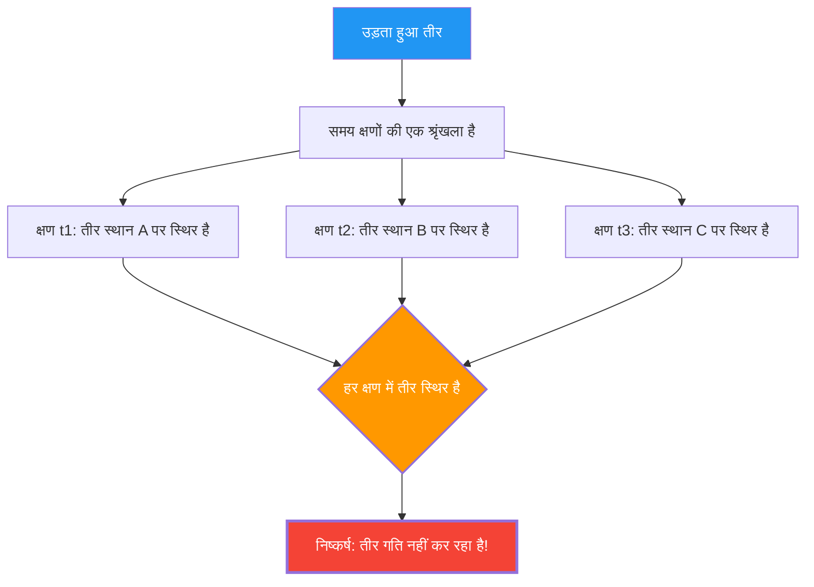

धनुष से छूटा एक तीर हवा में उड़ रहा है। यह तीर निश्चित रूप से गति कर रहा है।
लेकिन 5वीं शताब्दी ईसा पूर्व के ग्रीक दार्शनिक ज़ेनो (Zeno) ने निम्नलिखित भयानक तर्क प्रस्तुत किया:

**"उड़ता हुआ तीर वास्तव में स्थिर है"**

यह कोई मज़ाक या कुतर्क नहीं है, बल्कि **"उड़ते हुए तीर का विरोधाभास" (Arrow paradox)** है, जिस पर 2500 वर्षों से गणितज्ञों और दार्शनिकों द्वारा गंभीरता से बहस की जाती रही है।

## ज़ेनो का तर्क (Zeno's Argument)

ज़ेनो का तर्क "समय के क्षण" (instant of time) की अवधारणा से शुरू होता है।

1. समय "क्षणों" की एक श्रृंखला है।
2. यदि आप एक ही क्षण (शून्य समय लंबाई वाला एक बिंदु) को एक "तस्वीर" की तरह काटते हैं, तो तीर अंतरिक्ष के एक विशिष्ट बिंदु पर "स्थित" होता है।
3. उस क्षण, तीर केवल उस स्थान को "घेर" रहा होता है और **चल नहीं रहा होता है**। (यदि यह चल रहा होता, तो इसे एक "क्षण" नहीं बल्कि एक "समय अंतराल" की आवश्यकता होती)
4. आप जो भी क्षण लेते हैं, यह वही रहता है।
5. यदि समय के हर क्षण में तीर स्थिर है, तो **तीर गति कब करता है?**

## अंतर्ज्ञान (Intuition) बनाम तर्क (Logic)

"यह बेतुका है। तीर तो सच में उड़ रहा है, है ना?" यह शायद ज़्यादातर लोगों की पहली प्रतिक्रिया होगी।
हालाँकि, ज़ेनो के तर्क में **तार्किक रूप से** क्या गलत है, यह बताना वास्तव में बहुत मुश्किल है।

कहा जाता है कि प्राचीन यूनानी दार्शनिक डायोजनीज (Diogenes) ने ज़ेनो के सामने केवल खड़े होकर और कमरे में घूम कर यह दिखाया कि "देखो, मैं चल रहा हूँ।" लेकिन यह ज़ेनो के तर्क का **खंडन** नहीं था। ज़ेनो यह नहीं पूछ रहा है कि "क्या हम गति कर सकते हैं?", बल्कि "क्या हम बिना किसी विरोधाभास के अपने तर्क से समझा सकते हैं कि गति करने का क्या अर्थ है?"।

## कैलकुलस (Calculus) द्वारा समाधान (का प्रयास)

17वीं शताब्दी में न्यूटन और लाइबनिज़ द्वारा आविष्कृत **कैलकुलस** ने इस विरोधाभास का गणितीय उत्तर (कम से कम आंशिक रूप से) प्रदान किया।

कैलकुलस में, "एक निश्चित क्षण में वेग (तात्कालिक वेग)" को निम्नानुसार परिभाषित किया गया है:

$$ v(t) = \lim_{\Delta t \to 0} \frac{\Delta x}{\Delta t} $$

यानी, वेग को एक "सीमा" (limit) के रूप में परिभाषित किया जाता है जहां स्थिति में परिवर्तन $\Delta x$ को समय में परिवर्तन $\Delta t$ से विभाजित किया जाता है, और $\Delta t$ शून्य के असीमित रूप से करीब पहुंचता है।

यहाँ महत्वपूर्ण बात यह है कि **"तात्कालिक वेग" शून्य समय अंतराल में तय की गई दूरी नहीं है**।
यह एक मात्रा है जिसे उस समय के आसपास सूक्ष्म परिवर्तनों की "प्रवृत्ति" के रूप में परिभाषित किया गया है, अर्थात **"सीमा" (limit)**।

इसलिए, कैलकुलस के दृष्टिकोण से उत्तर इस प्रकार है:

"यह सच है कि यदि आप शून्य लंबाई वाले एक क्षण को काटते हैं, तो उस क्षण के 'भीतर' तीर नहीं चल रहा है। लेकिन उस क्षण में भी तीर में 'तात्कालिक वेग (एक गैर-शून्य सीमा मूल्य)' का गुण होता है। 'स्थिर होने' का अर्थ है 'तात्कालिक वेग शून्य होना', लेकिन चूंकि उड़ते हुए तीर का तात्कालिक वेग शून्य नहीं होता है, इसलिए यह नहीं कहा जा सकता कि तीर 'स्थिर' है।"

## शेष दार्शनिक प्रश्न (Remaining Philosophical Questions)

यद्यपि कैलकुलस ने ज़ेनो के विरोधाभास का एक व्यावहारिक समाधान प्रदान किया, लेकिन दार्शनिक रूप से यह पूरी तरह से सुलझा नहीं है।

क्योंकि "सीमा" (limit) की अवधारणा केवल एक गणितीय उपकरण (एक गणना प्रक्रिया) है, यह वास्तव में मूलभूत सवालों का उत्तर नहीं देती है जैसे **"भौतिक रूप से समय (क्षण) की सबसे छोटी इकाई क्या है?"**, **"निरंतरता (continuity) क्या है?"**, और **"गति का सार क्या है?"**।

आधुनिक भौतिकी (क्वांटम यांत्रिकी) में, इस संभावना पर चर्चा की जाती है कि समय और स्थान में भी न्यूनतम इकाइयाँ (प्लैंक समय, प्लैंक लंबाई) मौजूद हैं, और यदि समय "निरंतर" के बजाय "असतत (डिजिटल)" है, तो ज़ेनो के विरोधाभास को पूरी तरह से अलग संदर्भ में पुनर्मूल्यांकन करने की आवश्यकता हो सकती है।

2500 साल बाद भी, ज़ेनो का तीर हमसे यह पूछना जारी रखता है कि "गति करने का क्या अर्थ है?" और "समय क्या है?"।
