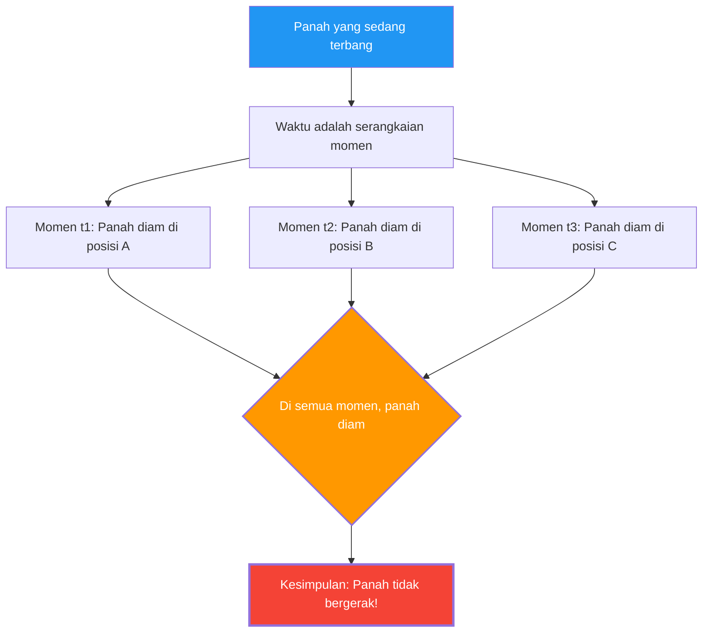

Sebuah panah yang dilepaskan dari busur sedang terbang di udara. Panah ini pasti bergerak.
Namun, filsuf Yunani abad ke-5 SM, Zeno, mengajukan argumen logis yang menakutkan berikut:

**"Panah yang sedang terbang sebenarnya berhenti."**

Ini bukan lelucon atau tipu muslihat, melainkan **"Paradoks Panah Terbang"** yang telah diperdebatkan secara serius oleh para ahli matematika dan filsuf selama 2500 tahun.

## Argumen Zeno

Argumen Zeno bertitik tolak dari konsep "momen waktu".

1. Waktu adalah serangkaian "momen".
2. Jika kita mengambil satu momen (sebuah titik dengan durasi waktu nol) layaknya sebuah "foto", panah tersebut "berada" pada satu titik tertentu di ruang.
3. Pada momen tersebut, panah hanya "menempati" tempat itu dan **tidak bergerak**. (Jika panah itu bergerak, maka hal itu membutuhkan "rentang waktu", bukan sebuah "momen".)
4. Ini berlaku untuk momen mana pun yang kita ambil.
5. Jika pada setiap momen waktu panah tersebut diam, **kapan panah itu bergerak?**

## Intuisi vs Logika

"Konyol. Panah itu kan nyatanya terbang." Itulah reaksi pertama kebanyakan orang.
Namun, untuk menunjukkan secara **logis** di mana letak kesalahan argumen Zeno, sebenarnya sangatlah sulit.

Faktanya, filsuf Yunani Kuno, Diogenes, diceritakan menanggapi Zeno hanya dengan berdiri dan berjalan memutari ruangan untuk menunjukkan, "Lihat, benda bergerak." Namun, tindakan ini tidak lantas **membantah** logika Zeno. Hal yang dipertanyakan Zeno bukanlah "apakah bisa bergerak?", melainkan "bisakah kita menjelaskan arti bergerak secara logis tanpa adanya kontradiksi?".

## (Upaya) Penyelesaian dengan Kalkulus

**Kalkulus** yang ditemukan oleh Newton dan Leibniz pada abad ke-17 telah memberikan jawaban matematis (setidaknya secara parsial) atas paradoks ini.

Dalam kalkulus, "kecepatan pada momen tertentu (kecepatan sesaat)" didefinisikan sebagai berikut:

$$ v(t) = \lim_{\Delta t \to 0} \frac{\Delta x}{\Delta t} $$

Artinya, kecepatan didefinisikan sebagai "limit" dari perubahan posisi $\Delta x$ dibagi dengan perubahan waktu $\Delta t$, dengan $\Delta t$ mendekati nol.

Poin pentingnya di sini adalah, **"kecepatan sesaat" bukanlah jarak tempuh dalam durasi waktu nol**.
Kecepatan itu adalah besaran yang didefinisikan sebagai "kecenderungan" atau **"limit"** dari perubahan kecil sebelum dan sesudah waktu tersebut.

Oleh karena itu, jawaban dari sudut pandang kalkulus adalah sebagai berikut:

"Memang benar, jika kita memotong sebuah momen dengan panjang nol, panah tidak berpindah 'di dalam' momen tersebut. Namun, panah tersebut memiliki sifat 'kecepatan sesaat (nilai limit bukan nol)' pada momen itu. 'Diam' berarti 'kecepatan sesaatnya adalah nol', tetapi karena kecepatan sesaat dari panah yang sedang terbang bukanlah nol, maka panah tersebut tidak bisa dikatakan 'diam'."

## Pertanyaan Filosofis yang Tersisa

Meskipun kalkulus memberikan solusi praktis untuk paradoks Zeno, secara filosofis perdebatan belum sepenuhnya selesai.

Konsep "limit" hanyalah sebuah alat bantu matematika (prosedur perhitungan), dan tidak benar-benar menjawab pertanyaan mendasar seperti **"apa wujud fisik dari unit waktu terkecil (momen)?", "apa itu kontinuitas?",** dan **"apa hakikat dari sebuah gerakan?"**.

Dalam fisika modern (mekanika kuantum), sedang diperdebatkan kemungkinan bahwa ruang dan waktu juga memiliki unit terkecil (Waktu Planck, Panjang Planck). Jika waktu ternyata tidak "kontinu" melainkan "diskrit (digital)", maka paradoks Zeno mungkin perlu dievaluasi kembali dalam konteks yang sepenuhnya berbeda.

Setelah 2500 tahun berlalu, panah Zeno masih terus bertanya kepada kita: "Apa itu bergerak?" dan "Apa itu waktu?".
