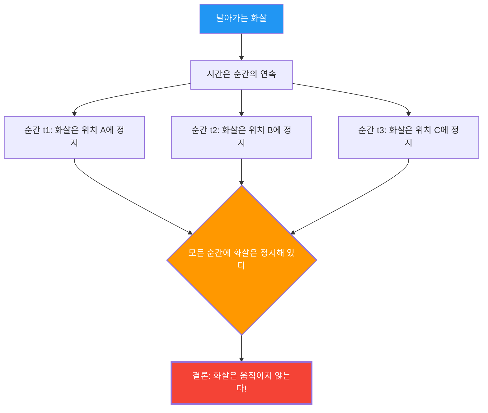

---
title: "날아가는 화살은 멈춰 있을까? 제논의 '날아가는 화살'의 역설"
description: "날아가는 화살은 모든 순간에 정지해 있다. 그렇다면 운동이란 존재하지 않는 것일까? 고대 그리스 최대의 논리 퍼즐."
date: 2026-09-10T21:00:00+09:00
draft: false
slug: "zenos-arrow"
image: "img/zenos_arrow.jpg"
math: true
mermaid: true
categories: ["수학 역설", "철학", "물리학"]
tags: ["역설", "제논", "운동", "무한", "미적분"]
---

활에서 쏘아진 화살이 하늘을 날아가고 있습니다. 이 화살은 분명히 움직이고 있습니다.
하지만 기원전 5세기 그리스의 철학자 제논은 다음과 같은 무서운 논리를 전개했습니다.

**"날아가는 화살은 사실 멈춰 있다"**

이것은 농담이나 궤변이 아니며, 2500년 동안 수학자와 철학자들이 진지하게 논쟁해 온 **"날아가는 화살의 역설"**입니다.

## 제논의 논증

제논의 논의는 '시간의 순간'이라는 개념을 출발점으로 삼습니다.

1. 시간은 '순간'의 연속이다.
2. 어떤 한 순간(시간의 길이가 0인 한 점)을 '사진'처럼 잘라내면, 화살은 공간의 특정 한 점에 '있다'.
3. 그 순간, 화살은 그 장소를 '차지하고' 있을 뿐이며, **움직이지 않는다**. (만약 움직이고 있다면, 그것은 '순간'이 아니라 '시간의 폭'을 필요로 할 것이다)
4. 이것은 어떤 순간을 꺼내도 마찬가지이다.
5. 시간의 모든 순간에 화살이 정지해 있다면, **화살은 언제 움직이는가?**

## 직관 vs 논리

"말도 안 돼. 화살은 실제로 날아가고 있잖아"라는 것이 대부분의 사람들의 첫 반응일 것입니다.
하지만 제논의 논의에 대해 **논리적으로** 어디가 틀렸는지 지적하는 것은 사실 매우 어렵습니다.

실제로 고대 그리스의 철학자 디오게네스는 제논을 향해 그저 일어나 방 안을 걸어 다니며 "보아라, 움직이고 있다"라고 보여주었다고 전해집니다. 하지만 이것은 제논의 논리를 **반박**한 것이 아닙니다. 제논이 묻고 있는 것은 '움직일 수 있는가'가 아니라, '움직인다는 것이 무엇인가를 우리의 논리로 모순 없이 설명할 수 있는가'이기 때문입니다.

## 미적분학을 통한 해결 (시도)

17세기에 뉴턴과 라이프니츠가 발명한 **미적분학**은 이 역설에 대한 수학적인 해답을 (적어도 부분적으로) 제공했습니다.

미적분학에서는 '어떤 순간의 속도(순간 속도)'를 다음과 같이 정의합니다.

$$ v(t) = \lim_{\Delta t \to 0} \frac{\Delta x}{\Delta t} $$

즉, 위치의 변화량 $\Delta x$ 를 시간의 변화량 $\Delta t$ 로 나누고, $\Delta t$ 를 한없이 0에 가깝게 만든 '극한'으로서 속도를 정의하는 것입니다.

여기서 핵심은 **'순간의 속도'는 시간 폭이 0인 상태에서의 이동 거리가 아니다**라는 것입니다.
그것은 그 시간 전후의 미세한 변화의 '경향', 즉 **'극한'**으로서 정의되는 양인 것입니다.

따라서 미적분학의 입장에서 본 해답은 다음과 같습니다.

"확실히 길이가 0인 순간을 잘라내면, 그 순간 '안'에서 화살은 이동하지 않는다. 하지만 화살은 그 순간에도 '순간 속도(0이 아닌 극한값)'라는 성질을 가지고 있다. '정지해 있다'는 것은 '순간 속도가 0'임을 의미하지만, 날아가는 화살의 순간 속도는 0이 아니기 때문에 화살은 '정지해 있다'고 말할 수 없다."

## 남겨진 철학적 질문

미적분학은 제논의 역설에 대한 실용적인 해결책을 제공했지만, 철학적으로 완전히 결론이 난 것은 아닙니다.

'극한'이라는 개념은 어디까지나 수학적인 도구(계산 절차)이며, **'시간의 최소 단위(순간)란 물리적으로 무엇인가', '연속이란 무엇인가', '운동의 본질이란 무엇인가'**와 같은 근원적인 질문에는 엄밀히 말해 대답하지 않기 때문입니다.

현대 물리학(양자 역학)에서는 시간과 공간에도 최소 단위(플랑크 시간, 플랑크 길이)가 존재할 가능성이 논의되고 있으며, 만약 시간이 '연속'이 아니라 '이산적(디지털)'이라면, 제논의 역설은 전혀 다른 맥락에서 재평가되어야 할지도 모릅니다.

제논의 화살은 2500년이 지난 지금도 우리에게 "움직인다는 것은 무엇인가", "시간이란 무엇인가"를 묻고 있습니다.
