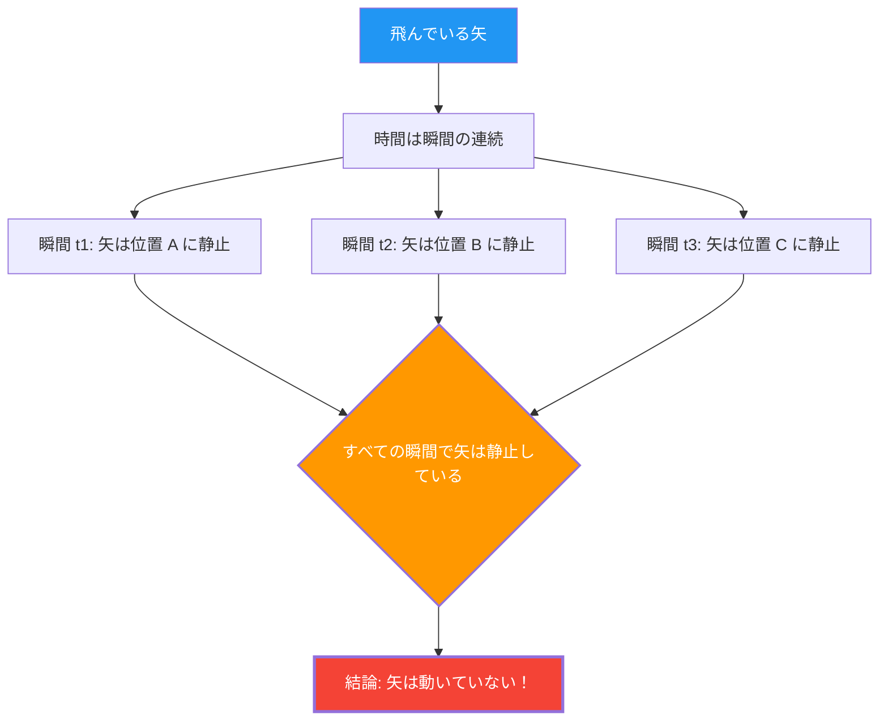

弓から放たれた矢が空を飛んでいます。この矢は確かに動いています。
しかし、紀元前5世紀のギリシャの哲学者ゼノンは、次のような恐るべき論理を展開しました。

**「飛んでいる矢は、実は止まっている」**

これは冗談でも詭弁でもなく、2500年もの間、数学者や哲学者が真剣に議論し続けてきた**「飛ぶ矢のパラドックス」**です。

## ゼノンの論証

ゼノンの議論は、「時間の瞬間」という概念を出発点にしています。

1. 時間は「瞬間」の連続である。
2. ある1つの瞬間（時間の長さがゼロの一点）を「写真」のように切り取ると、矢は空間の特定の1点に「ある」。
3. その瞬間、矢はその場所を「占めている」だけであり、**動いていない**。（もし動いているなら、それは「瞬間」ではなく「時間幅」を必要とするはずだ）
4. これはどの瞬間を取り出しても同じである。
5. 時間のすべての瞬間において矢が静止しているのなら、**矢はいつ動くのか？**

## 直感 vs 論理

「馬鹿馬鹿しい。矢は実際に飛んでいるではないか」というのが、ほとんどの人の最初の反応でしょう。
しかしゼノンの議論に対して、**論理的に**どこが間違っているかを指摘するのは、実は非常に困難です。

実際に古代ギリシャの哲学者ディオゲネスは、ゼノンに対してただ立ち上がって部屋の中を歩き回り、「ほら、動いている」と示したと伝えられています。しかし、これはゼノンの論理を**反駁**したことにはなりません。ゼノンが問うているのは、「動けるかどうか」ではなく、「動くとはどういうことか、を私たちの論理で矛盾なく説明できるか」ということだからです。

## 微積分学による解決（の試み）

17世紀にニュートンとライプニッツが発明した**微積分学**は、このパラドックスに対する数学的な回答を（少なくとも部分的に）与えました。

微積分学では、「ある瞬間の速度（瞬間速度）」を次のように定義します。

$$ v(t) = \lim_{\Delta t \to 0} \frac{\Delta x}{\Delta t} $$

つまり、位置の変化量 $\Delta x$ を時間の変化量 $\Delta t$ で割り、 $\Delta t$ を限りなくゼロに近づけた「極限」として速度を定義するのです。

ここでのポイントは、**「瞬間の速度」は、ゼロ時間幅の中での移動距離ではない**ということです。
それは、その時刻の前後の微小な変化の「傾向」、つまり**「極限」**として定義される量なのです。

したがって、微積分学の立場からの回答は次のようになります。

「確かに、長さゼロの瞬間を切り取れば、その瞬間『内』で矢は移動していない。しかし、矢はその瞬間においても『瞬間速度（ゼロでない極限値）』という性質を持っている。『静止している』とは『瞬間速度がゼロ』であることを意味するが、飛んでいる矢の瞬間速度はゼロではないため、矢は『静止している』とは言えない」

## 残された哲学的問い

微積分学はゼノンのパラドックスに対する実用的な解決策を与えましたが、哲学的には完全な決着がついたわけではありません。

「極限」という概念は、あくまで数学的な道具（計算手続き）であり、**「時間の最小単位（瞬間）とは物理的に何なのか」「連続とは何か」「運動の本質とは何か」**といった根源的な問いには、厳密には答えていないからです。

現代物理学（量子力学）では、時間や空間にも最小単位（プランク時間、プランク長）が存在する可能性が議論されており、もし時間が「連続」ではなく「離散的（デジタル）」であるなら、ゼノンのパラドックスは全く異なる文脈で再評価される必要があるかもしれません。

ゼノンの矢は2500年経った今も、私たちに「動くとは何か」「時間とは何か」を問い続けています。
