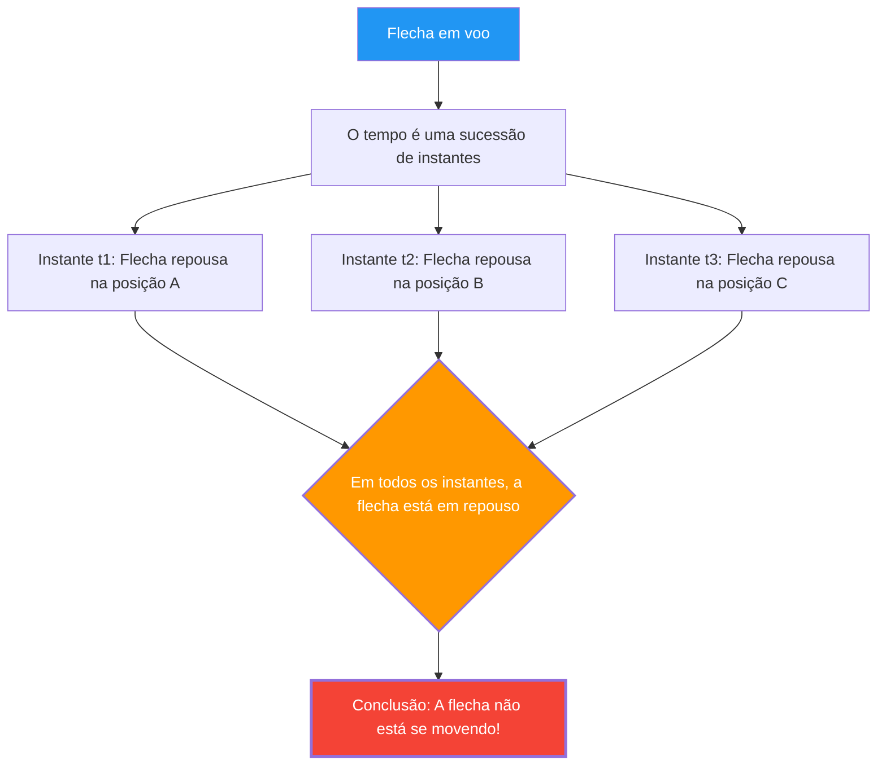

---
title: "A flecha em voo está parada? O Paradoxo da 'Flecha em Voo' de Zenão"
description: "Uma flecha em voo está em repouso em todos os instantes. Então, o movimento não existe? O maior quebra-cabeça lógico da Grécia Antiga."
date: 2026-09-10T21:00:00+09:00
draft: false
slug: "zenos-arrow"
image: "img/zenos_arrow.jpg"
math: true
mermaid: true
categories: ["Paradoxos Matemáticos", "Filosofia", "Física"]
tags: ["Paradoxo", "Zenão", "Movimento", "Infinito", "Cálculo"]
---

Uma flecha disparada de um arco voa pelo céu. Esta flecha está certamente em movimento.
No entanto, no século V a.C., o filósofo grego Zenão desenvolveu a seguinte e temível lógica:

**"A flecha em voo, na verdade, está parada."**

Isto não é uma piada nem um sofisma, mas o **"Paradoxo da Flecha em Voo"**, que tem sido seriamente debatido por matemáticos e filósofos ao longo de 2500 anos.

## O Argumento de Zenão

O argumento de Zenão tem como ponto de partida o conceito de um "instante de tempo".

1. O tempo é uma sucessão de "instantes".
2. Se recortarmos um único instante (um ponto no qual a duração do tempo é zero) como uma "fotografia", a flecha "está" em um ponto específico do espaço.
3. Naquele instante, a flecha apenas "ocupa" aquele lugar e **não está se movendo**. (Se estivesse se movendo, isso exigiria uma "duração" de tempo e não um "instante".)
4. O mesmo ocorre em qualquer instante que seja escolhido.
5. Se a flecha está em repouso em todos os instantes de tempo, **quando a flecha se move?**

## Intuição vs. Lógica

"Que absurdo. A flecha está realmente voando, não está?", seria a primeira reação da maioria das pessoas.
No entanto, apontar onde o argumento de Zenão está **logicamente** errado é, na verdade, extremamente difícil.

De fato, conta-se que o filósofo grego antigo Diógenes, em resposta a Zenão, simplesmente se levantou, andou pela sala e demonstrou: "Veja, está se movendo". Contudo, isso não **refuta** a lógica de Zenão. O que Zenão questiona não é "se é possível mover-se", mas sim "se podemos explicar o que significa mover-se de forma lógica e sem contradições".

## A (Tentativa de) Solução Através do Cálculo

O **cálculo diferencial e integral**, inventado por Newton e Leibniz no século XVII, forneceu (pelo menos parcialmente) uma resposta matemática a esse paradoxo.

No cálculo, a "velocidade em um dado instante (velocidade instantânea)" é definida da seguinte forma:

$$ v(t) = \lim_{\Delta t \to 0} \frac{\Delta x}{\Delta t} $$

Ou seja, a velocidade é definida como o "limite" quando dividimos a variação da posição $\Delta x$ pela variação do tempo $\Delta t$, e fazemos $\Delta t$ se aproximar de zero infinitamente.

O ponto aqui é que a **"velocidade instantânea" não é a distância percorrida num intervalo de tempo zero**.
Ela é uma grandeza definida como a "tendência" da variação infinitesimal antes e depois daquele momento, isto é, o **"limite"**.

Portanto, a resposta sob a perspectiva do cálculo seria a seguinte:

"De fato, se recortarmos um instante de duração zero, a flecha não se move 'dentro' daquele instante. No entanto, mesmo naquele instante, a flecha possui a propriedade de uma 'velocidade instantânea (um valor limite não nulo)'. 'Estar em repouso' significa que 'a velocidade instantânea é zero', mas como a velocidade instantânea da flecha em voo não é zero, não podemos dizer que a flecha 'está em repouso'."

## As Questões Filosóficas Restantes

O cálculo forneceu uma solução prática para o paradoxo de Zenão, mas filosoficamente a questão não foi totalmente encerrada.

Isso ocorre porque o conceito de "limite" é, em última análise, uma ferramenta matemática (um procedimento de cálculo), e não responde rigorosamente a questões fundamentais como: **"O que é fisicamente a menor unidade de tempo (o instante)?", "O que é contínuo?" e "Qual é a essência do movimento?"**

Na física moderna (mecânica quântica), discute-se a possibilidade de que o tempo e o espaço também possuam unidades mínimas (o Tempo de Planck, o Comprimento de Planck). Se o tempo for "discreto (digital)" e não "contínuo", o paradoxo de Zenão talvez precise ser reavaliado num contexto completamente diferente.

Mesmo após 2500 anos, a flecha de Zenão continua a nos questionar: "O que é o movimento?" e "O que é o tempo?".
