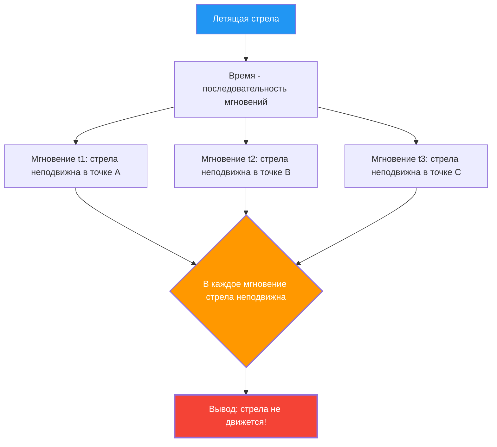

Стрела, выпущенная из лука, летит по воздуху. Эта стрела определенно движется.
Однако в V веке до нашей эры греческий философ Зенон выдвинул следующую пугающую логику:

**«Летящая стрела на самом деле неподвижна»**

Это не шутка и не софизм, а **«парадокс летящей стрелы»**, который математики и философы всерьез обсуждают вот уже 2500 лет.

## Аргумент Зенона

В основе аргумента Зенона лежит понятие «мгновение времени».

1. Время состоит из последовательности «мгновений».
2. Если мы «сфотографируем» одно конкретное мгновение (точку во времени с нулевой продолжительностью), стрела «находится» в определенной точке пространства.
3. В это мгновение стрела лишь «занимает» это место и **не движется**. (Если бы она двигалась, для этого потребовалась бы не «точка во времени», а «промежуток времени»).
4. Это верно для любого мгновения, какое бы мы ни выбрали.
5. Если в каждое мгновение времени стрела неподвижна, то **когда же она движется?**

## Интуиция против логики

«Что за чушь. Ведь стрела действительно летит» — такой, вероятно, будет первая реакция большинства людей.
Однако указать, в чем **логически** ошибочен аргумент Зенона, на самом деле чрезвычайно сложно.

Рассказывают, что древнегреческий философ Диоген в ответ Зенону просто встал и начал ходить по комнате, демонстрируя: «Смотри, я двигаюсь». Однако это не является **опровержением** логики Зенона. Ведь вопрос Зенона заключается не в том, «можем ли мы двигаться», а в том, «можем ли мы непротиворечиво объяснить с помощью нашей логики, что такое движение».

## Попытка решения с помощью математического анализа

**Математический анализ (исчисление бесконечно малых)**, изобретенный в XVII веке Ньютоном и Лейбницем, дал (по крайней мере частично) математический ответ на этот парадокс.

В математическом анализе «скорость в определенное мгновение (мгновенная скорость)» определяется следующим образом:

$$ v(t) = \lim_{\Delta t \to 0} \frac{\Delta x}{\Delta t} $$

То есть скорость определяется как «предел», где изменение координаты $\Delta x$ делится на изменение времени $\Delta t$, а $\Delta t$ стремится к нулю.

Ключевой момент здесь заключается в том, что **«мгновенная скорость» — это не пройденное расстояние за нулевой промежуток времени**.
Это величина, определяемая как «тенденция» мельчайших изменений до и после этого момента времени, то есть как **«предел»**.

Следовательно, ответ с точки зрения математического анализа будет таким:

«Действительно, если вырезать мгновение нулевой продолжительности, 'внутри' этого мгновения стрела не перемещается. Однако даже в это мгновение стрела обладает таким свойством, как 'мгновенная скорость (ненулевое предельное значение)'. 'Быть в состоянии покоя' означает, что 'мгновенная скорость равна нулю', но поскольку мгновенная скорость летящей стрелы не равна нулю, нельзя сказать, что стрела 'покоится'».

## Оставшиеся философские вопросы

Математический анализ предоставил практическое решение парадокса Зенона, но с философской точки зрения вопрос не был закрыт окончательно.

Концепция «предела» — это всего лишь математический инструмент (вычислительная процедура), который не дает строгого ответа на такие фундаментальные вопросы, как: **«чем физически является минимальная единица времени (мгновение)?», «что такое непрерывность?» и «в чем суть движения?»**

В современной физике (квантовой механике) обсуждается возможность того, что время и пространство также имеют минимальные единицы (планковское время, планковская длина). И если время является не «непрерывным», а «дискретным (цифровым)», парадокс Зенона, возможно, придется переосмыслить в совершенно ином контексте.

Спустя 2500 лет стрела Зенона всё ещё продолжает задавать нам вопросы: «что значит двигаться?» и «что такое время?».
