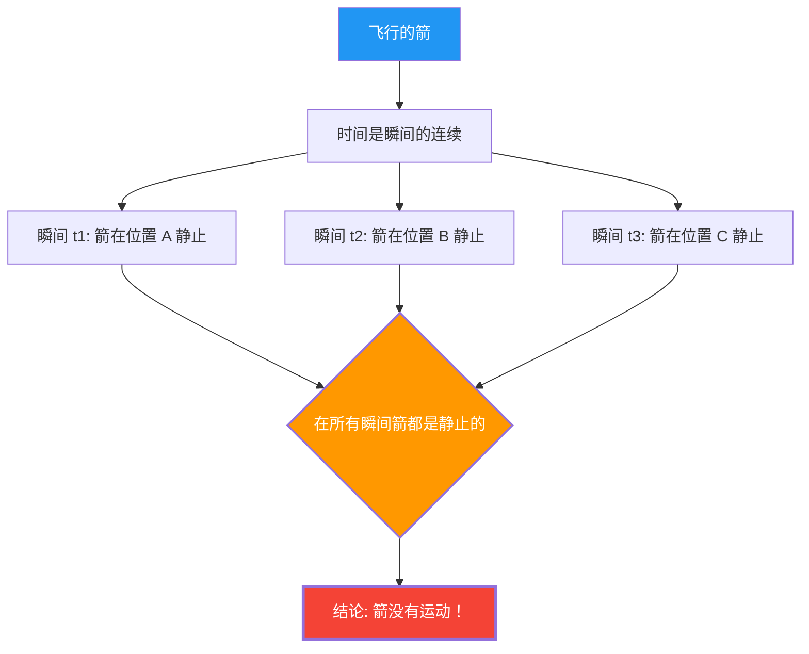

从弓中射出的箭在空中飞行。这支箭确实在运动。
然而，公元前5世纪的希腊哲学家芝诺，展开了如下可怕的逻辑推理。

**“飞行的箭，实际上是静止的”**

这不是玩笑也不是诡辩，而是2500年来，数学家和哲学家们一直在认真讨论的**“飞矢悖论”**。

## 芝诺的论证

芝诺的论证，是以“时间的瞬间”这一概念为出发点的。

1. 时间是“瞬间”的连续。
2. 像“照片”一样截取某个瞬间（时间长度为零的一点），箭在空间中的特定一点“存在”。
3. 在那个瞬间，箭只是“占据”着那个位置，**并没有运动**。（如果它在运动，那它应该需要一个“时间段”而不是“瞬间”）
4. 这对于提取出的任何一个瞬间都是一样的。
5. 如果在时间的所有瞬间箭都是静止的，那么**箭什么时候运动呢？**

## 直觉 vs 逻辑

“太荒谬了。箭不是实际在飞吗？”，这应该是大多数人的第一反应。
然而，要指出芝诺的论证在**逻辑上**错在哪里，实际上是非常困难的。

据说，古希腊哲学家第欧根尼在面对芝诺时，只是站起来在房间里走来走去，以此来表示“看，在动”。然而，这并不能算作对芝诺逻辑的**反驳**。因为芝诺所问的，不是“能不能动”，而是“我们能否用我们的逻辑毫无矛盾地解释‘运动到底是怎么回事’”。

## 微积分学的解决（尝试）

17世纪牛顿和莱布尼茨发明的**微积分学**，为这个悖论提供了数学上的回答（至少是部分地）。

在微积分学中，将“某个瞬间的速度（瞬时速度）”定义如下：

$$ v(t) = \lim_{\Delta t \to 0} \frac{\Delta x}{\Delta t} $$

也就是说，将位置的变化量 $\Delta x$ 除以时间的变化量 $\Delta t$，并将 $\Delta t$ 无限趋近于零的“极限”定义为速度。

这里的关键点在于，**“瞬时速度”并不是在零时间段内的移动距离**。
它是作为该时刻前后微小变化的“趋势”，即被定义为**“极限”**的量。

因此，从微积分学立场的回答如下：

“确实，如果截取长度为零的瞬间，在那个瞬间‘内’箭是没有移动的。但是，箭在那个瞬间也具有‘瞬时速度（非零的极限值）’这一属性。‘静止’意味着‘瞬时速度为零’，由于飞行的箭的瞬时速度并不为零，所以不能说箭是‘静止的’。”

## 遗留的哲学问题

微积分学为芝诺的悖论提供了实用的解决方案，但在哲学上并没有完全了结。

因为“极限”这个概念，归根结底只是一个数学工具（计算程序），并没有严格地回答诸如**“时间的最小单位（瞬间）在物理上到底是什么”“什么是连续”“运动的本质是什么”**这些根本性的问题。

在现代物理学（量子力学）中，人们正在讨论时间和空间也可能存在最小单位（普朗克时间、普朗克长度）的可能性。如果时间不是“连续的”而是“离散的（数字化的）”，那么芝诺的悖论可能需要在完全不同的语境下被重新评估。

芝诺的箭在2500年后的今天，仍在不断地向我们发出追问：“什么是运动？”“什么是时间？”
