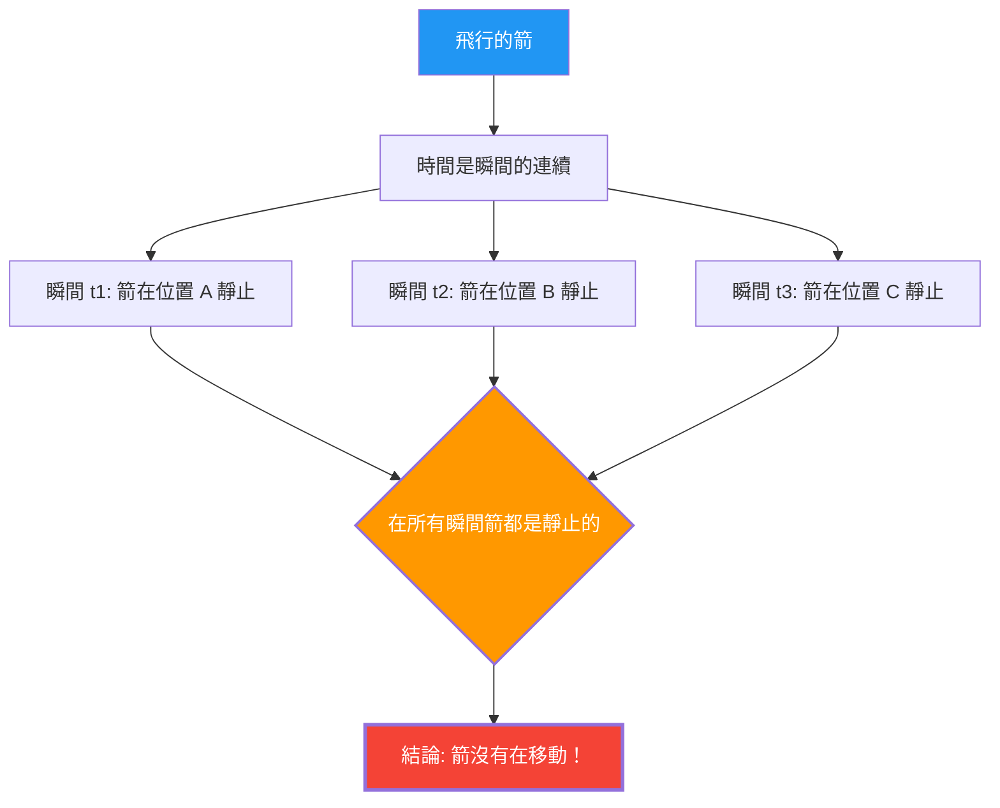

---
title: "飛行的箭是靜止的？：芝諾的「飛矢」悖論"
description: "飛行的箭在每一個瞬間都是靜止的。那麼，運動不存在嗎？古希臘最大的邏輯謎題。"
date: 2026-09-10T21:00:00+09:00
draft: false
slug: "zenos-arrow"
image: "img/zenos_arrow.jpg"
math: true
mermaid: true
categories: ["數學悖論", "哲學", "物理學"]
tags: ["悖論", "芝諾", "運動", "無限", "微積分"]
---

從弓射出的箭正在空中飛行。這支箭確實是在移動。
然而，西元前5世紀的希臘哲學家芝諾（Zeno），卻提出了以下令人畏懼的邏輯：

**「飛行的箭，其實是靜止的」**

這不是開玩笑，也不是詭辯，而是2500年來數學家和哲學家們持續認真討論的**「飛矢悖論」**。

## 芝諾的論證

芝諾的論證是以「時間的瞬間」這個概念為出發點。

1. 時間是「瞬間」的連續。
2. 若將某一個瞬間（時間長度為零的一點）像「照片」一樣截取下來，箭在空間中「存在」於特定的一點。
3. 在那個瞬間，箭只是「佔據」著那個位置，**並沒有在移動**。（如果它在移動，那應該需要「時間段」而不是「瞬間」）
4. 無論取出哪個瞬間，情況都是一樣的。
5. 如果在時間的所有瞬間箭都是靜止的，**那麼箭何時在移動呢？**

## 直覺 vs 邏輯

「太荒謬了。箭實際上不是正在飛嗎？」這大概是大多數人最初的反應。
然而，面對芝諾的論述，要**在邏輯上**指出他哪裡錯了，其實是非常困難的。

據說古希臘哲學家第歐根尼（Diogenes）對芝諾的反應，只是站起來在房間裡走來走去，以此展示「你看，在動啊」。然而，這並沒有**反駁**芝諾的邏輯。因為芝諾所問的不是「能不能動」，而是「我們能否用邏輯毫無矛盾地解釋『移動』究竟是什麼意思」。

## 微積分的解決方案（嘗試）

17世紀由牛頓和萊布尼茲發明的**微積分學**，為這個悖論提供了（至少部分的）數學解答。

在微積分中，「某一瞬間的速度（瞬時速度）」被定義如下：

$$ v(t) = \lim_{\Delta t \to 0} \frac{\Delta x}{\Delta t} $$

也就是說，將位置的變化量 $\Delta x$ 除以時間的變化量 $\Delta t$，並將 $\Delta t$ 趨近於無限小（極限），以此來定義速度。

這裡的重點在於，**「瞬時速度」並不是在零時間長度內的移動距離**。
它是一個作為該時刻前後微小變化「趨勢」，也就是作為**「極限」**來定義的量。

因此，從微積分立場出發的回答如下：

「確實，如果截取長度為零的瞬間，在那個瞬間『內』箭是沒有移動的。但是，箭即使在那個瞬間也具有『瞬時速度（非零極限值）』這樣的性質。『靜止』意味著『瞬時速度為零』，但由於飛行中的箭其瞬時速度並非為零，因此不能說箭是『靜止』的。」

## 遺留的哲學問題

微積分學雖然給予了芝諾悖論一個實用的解決方案，但在哲學上並未完全塵埃落定。

「極限」這個概念終究只是一個數學工具（計算程序），對於**「時間的最小單位（瞬間）在物理上究竟是什麼」「連續是什麼」「運動的本質是什麼」**等根本問題，嚴格來說並沒有解答。

在現代物理學（量子力學）中，正在探討時間和空間是否也存在最小單位（普朗克時間、普朗克長度）。如果時間不是「連續」而是「離散（數位）」的，那麼芝諾悖論或許需要在完全不同的脈絡下重新評估。

芝諾的箭經過了2500年的今天，依然不斷地在質問我們：「什麼是移動」、「什麼是時間」。
