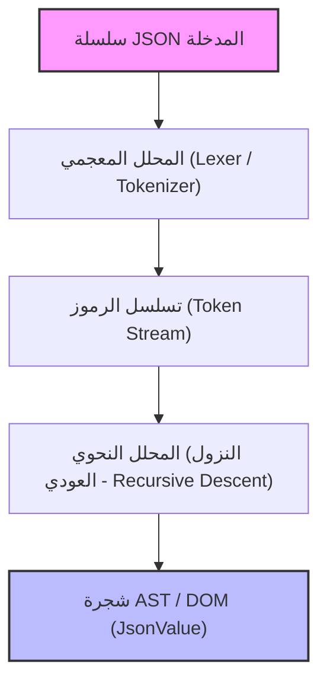
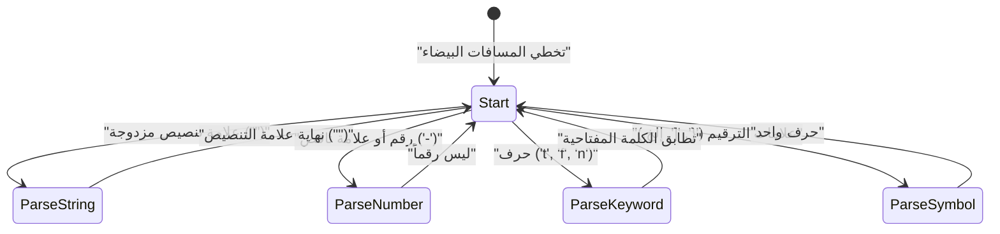

في تطوير الويب والتواصل بين الأنظمة، تعد **JSON (JavaScript Object Notation)** بلا شك أكثر لغات وصف البيانات استخدامًا في وقتنا الحالي. توجد بالفعل محللات JSON ممتازة وسريعة جدًا مثل `RapidJSON` و `simdjson`. في الحياة العملية، قد يكون من النادر إدخال محلل مبني من الصفر في كود الإنتاج (production code)، ولكن **"بناء محلل JSON من الصفر"** يعد موضوعًا ممتازًا جدًا لتعلم التحليل النحوي (Parsing)، وإدارة الذاكرة، ومعالجة السلاسل النصية، وتحسين الأداء.

في هذه المقالة، سنشرح بالتفصيل عملية بناء محلل JSON سريع وعالي الكفاءة في استخدام الذاكرة من الصفر، باستخدام ميزات C++17/C++20 الحديثة (مثل `std::string_view` و `std::variant` و `std::from_chars`).

---

## 1. مراجعة مواصفات JSON (RFC 8259)

تم تعريف مواصفات JSON بدقة في [RFC 8259](https://tools.ietf.org/html/rfc8259). لكتابة محلل، يجب عليك أولاً فهم المواصفات بشكل صحيح.

تقتصر أنواع بيانات JSON على الأنواع الستة التالية:

1. **الكائن (Object)**: مجموعة غير مرتبة من أزواج المفاتيح (النصية) والقيم. محاطة بـ `{}`، وكل زوج مفصول بـ `,`.
2. **المصفوفة (Array)**: قائمة مرتبة من القيم. محاطة بـ `[]`، والقيم مفصولة بـ `,`.
3. **السلسلة النصية (String)**: تسلسل من أحرف Unicode محاط بعلامات تنصيص مزدوجة `""`. يتضمن ذلك الهروب (escaping) باستخدام الشرطة المائلة العكسية `\`.
4. **الرقم (Number)**: رقم صحيح أو رقم عشري (فاصلة عائمة). لا يُسمح باللانهاية (`Infinity`) أو القيم غير الرقمية (`NaN`).
5. **القيمة المنطقية (Boolean)**: `true` أو `false`.
6. **العدم (Null)**: `null`.

وفقًا للمواصفات، يمكن إدراج المسافات البيضاء (Space, Horizontal Tab, Line Feed, Carriage Return) في أي مكان بين الرموز (tokens)، ويجب تحليل البنية (Syntax) مع تجاهل هذه المسافات البيضاء.

---

## 2. بنية المحلل (Parser Architecture)

بشكل عام، تنقسم عملية التحليل (Parsing) إلى مرحلتين: **التحليل المعجمي (Lexical Analysis)** و **التحليل النحوي (Syntactic Analysis)**.



1. **المحلل المعجمي (Lexer / Tokenizer)**: يقرأ السلسلة النصية الخام المدخلة (مصفوفة من الأحرف) من البداية ويقسمها إلى "أصغر وحدات ذات معنى (رموز/tokens)".
2. **المحلل النحوي (Parser)**: يقرأ سلسلة الرموز المستلمة من المحلل المعجمي، ويبني هيكلًا شجريًا (شجرة DOM: نموذج كائن المستند) وفقًا للقواعد النحوية.

في هذا التنفيذ، لزيادة كفاءة الذاكرة، تم تصميم المحلل المعجمي بحيث لا ينسخ السلاسل النصية، بل يحتفظ بمؤشر (pointer) وطول (`std::string_view`) يشير إلى سلسلة الإدخال الأصلية.

---

## 3. تصميم نموذج AST (DOM) و C++ الحديثة

لتمثيل أنواع بيانات JSON المختلفة في C++، سنستفيد من `std::variant` الذي تم تقديمه في C++17. يعد `std::variant` اتحادًا (Union) آمنًا للأنواع، وهو مثالي لتمثيل بيانات JSON التي تمتلك كتابة ديناميكية (dynamic typing).

```cpp
#include <string>
#include <vector>
#include <map>
#include <variant>
#include <memory>
#include <string_view>

// إعلان مسبق
class JsonValue;

// تعريف أنواع بيانات JSON
using JsonNull   = std::nullptr_t;
using JsonBool   = bool;
using JsonNumber = double;
using JsonString = std::string;
using JsonArray  = std::vector<JsonValue>;
using JsonObject = std::map<std::string, JsonValue>;

// استخدام std::variant للسماح بالاحتفاظ بأحد هذه الأنواع
using JsonVariant = std::variant<
    JsonNull,
    JsonBool,
    JsonNumber,
    JsonString,
    JsonArray,
    JsonObject
>;

class JsonValue {
public:
    // المنشئ الافتراضي يستهل بـ Null
    JsonValue() : m_value(nullptr) {}
    
    // منشئ يسمح بالتحويل الضمني من كل نوع
    template <typename T>
    JsonValue(T&& val) : m_value(std::forward<T>(val)) {}

    // طرق مساعدة للتحقق من النوع
    bool isNull() const { return std::holds_alternative<JsonNull>(m_value); }
    bool isBool() const { return std::holds_alternative<JsonBool>(m_value); }
    bool isNumber() const { return std::holds_alternative<JsonNumber>(m_value); }
    bool isString() const { return std::holds_alternative<JsonString>(m_value); }
    bool isArray() const { return std::holds_alternative<JsonArray>(m_value); }
    bool isObject() const { return std::holds_alternative<JsonObject>(m_value); }

    // طريقة مساعدة للحصول على القيمة
    template <typename T>
    const T& get() const {
        return std::get<T>(m_value);
    }

private:
    JsonVariant m_value;
};
```

من خلال هذا التصميم، يمكننا التعبير ببساطة وأمان عن هياكل البيانات العودية (recursive data structures) مثل `JsonArray` و `JsonObject` (في بعض تطبيقات مكتبات C++ القياسية، قد يكون استخدام الأنواع غير المكتملة داخل `std::variant` مقيدًا، مما يتطلب تخصيصًا في الكومة (heap allocation) باستخدام المؤشرات الذكية، ولكن في المجمعات (compilers) الأحدث، يعمل الكود أعلاه بنجاح في كثير من الأحيان).

---

## 4. تنفيذ المحلل المعجمي (Lexer)

يتمثل دور المحلل المعجمي في قراءة السلسلة النصية وتقطيعها إلى رموز (tokens). أولاً، سنحدد أنواع الرموز.

```cpp
enum class TokenType {
    Null,
    True,
    False,
    Number,
    String,
    LBrace,    // {
    RBrace,    // }
    LBracket,  // [
    RBracket,  // ]
    Colon,     // :
    Comma,     // ,
    EndOfFile  // EOF
};

struct Token {
    TokenType type;
    std::string_view value;
};
```

إذا قمنا بتصور انتقالات الحالة الداخلية للمحلل المعجمي باستخدام Mermaid، فستبدو كما يلي:



سيكون التنفيذ الفعلي للمحلل المعجمي كما يلي. يتم تخطي المسافات البيضاء، ويتم التفرع (باستخدام عبارة switch أو if) بناءً على الحرف الحالي.

```cpp
class Lexer {
public:
    explicit Lexer(std::string_view source) : m_source(source), m_position(0) {}

    Token nextToken() {
        skipWhitespace();

        if (isAtEnd()) {
            return { TokenType::EndOfFile, "" };
        }

        char c = peek();

        switch (c) {
            case '{': advance(); return { TokenType::LBrace, "{" };
            case '}': advance(); return { TokenType::RBrace, "}" };
            case '[': advance(); return { TokenType::LBracket, "[" };
            case ']': advance(); return { TokenType::RBracket, "]" };
            case ':': advance(); return { TokenType::Colon, ":" };
            case ',': advance(); return { TokenType::Comma, "," };
            case '"': return lexString();
            default:
                if (c == '-' || std::isdigit(c)) {
                    return lexNumber();
                } else if (std::isalpha(c)) {
                    return lexKeyword();
                }
                throw std::runtime_error("Unexpected character");
        }
    }

private:
    std::string_view m_source;
    size_t m_position;

    bool isAtEnd() const { return m_position >= m_source.length(); }
    char peek() const { return m_source[m_position]; }
    void advance() { m_position++; }

    void skipWhitespace() {
        while (!isAtEnd()) {
            char c = peek();
            if (c == ' ' || c == '\t' || c == '\n' || c == '\r') {
                advance();
            } else {
                break;
            }
        }
    }

    Token lexString() {
        advance(); // تخطي علامة التنصيص الابتدائية
        size_t start = m_position;
        while (!isAtEnd() && peek() != '"') {
            // معالجة أحرف الهروب (مثل \" أو \\) يجب أن تتم هنا بدقة
            if (peek() == '\\') {
                advance(); // تخطي الشرطة المائلة العكسية للهروب
            }
            advance();
        }
        
        if (isAtEnd()) throw std::runtime_error("Unterminated string");
        
        std::string_view strVal = m_source.substr(start, m_position - start);
        advance(); // تخطي علامة التنصيص النهائية
        return { TokenType::String, strVal };
    }

    Token lexNumber() {
        size_t start = m_position;
        while (!isAtEnd() && (std::isdigit(peek()) || peek() == '.' || peek() == 'e' || peek() == 'E' || peek() == '+' || peek() == '-')) {
            advance();
        }
        return { TokenType::Number, m_source.substr(start, m_position - start) };
    }

    Token lexKeyword() {
        size_t start = m_position;
        while (!isAtEnd() && std::isalpha(peek())) {
            advance();
        }
        std::string_view word = m_source.substr(start, m_position - start);
        
        if (word == "true") return { TokenType::True, word };
        if (word == "false") return { TokenType::False, word };
        if (word == "null") return { TokenType::Null, word };
        
        throw std::runtime_error("Unknown keyword");
    }
};
```

النقطة المهمة هنا هي استخراج قيم السلاسل النصية (String) والأرقام (Number) كـ `std::string_view`. نتيجة لذلك، **لا يحدث أي تخصيص ديناميكي للذاكرة (heap allocation) أو نسخ على الإطلاق** في مرحلة المحلل المعجمي. هذا تصميم مهم يرتبط ارتباطًا مباشرًا بالأداء.

---

## 5. تنفيذ المحلل النحوي (Parser): التحليل النحوي بالنزول العودي

بمجرد اكتمال المحلل المعجمي، تأتي خطوة المحلل النحوي. نظرًا لأن قواعد JSON هي من نوع LL(1)، فهي تتوافق بشكل ممتاز مع **التحليل النحوي بالنزول العودي (Recursive Descent Parsing)**، حيث يمكنك تحديد الدالة التي يجب استدعاؤها تاليًا بمجرد "النظر إلى الرمز الحالي فقط".

```cpp
class Parser {
public:
    explicit Parser(std::string_view source) : m_lexer(source) {
        m_currentToken = m_lexer.nextToken();
    }

    JsonValue parse() {
        JsonValue result = parseValue();
        if (m_currentToken.type != TokenType::EndOfFile) {
            throw std::runtime_error("Extra tokens after root element");
        }
        return result;
    }

private:
    Lexer m_lexer;
    Token m_currentToken;

    void consumeToken() {
        m_currentToken = m_lexer.nextToken();
    }

    void expectAndConsume(TokenType expectedType) {
        if (m_currentToken.type != expectedType) {
            throw std::runtime_error("Unexpected token");
        }
        consumeToken();
    }

    JsonValue parseValue() {
        switch (m_currentToken.type) {
            case TokenType::Null:
                consumeToken();
                return JsonValue(nullptr);
            case TokenType::True:
                consumeToken();
                return JsonValue(true);
            case TokenType::False:
                consumeToken();
                return JsonValue(false);
            case TokenType::Number:
                return parseNumber();
            case TokenType::String:
                return parseString();
            case TokenType::LBrace:
                return parseObject();
            case TokenType::LBracket:
                return parseArray();
            default:
                throw std::runtime_error("Invalid value");
        }
    }

    JsonValue parseNumber() {
        std::string_view numStr = m_currentToken.value;
        consumeToken();
        
        double value = 0.0;
        // استخدام std::from_chars من C++17 للتحليل السريع
        auto [ptr, ec] = std::from_chars(numStr.data(), numStr.data() + numStr.size(), value);
        if (ec != std::errc()) {
            throw std::runtime_error("Invalid number format");
        }
        return JsonValue(value);
    }

    JsonValue parseString() {
        // في الأساس، يجب تنفيذ معالجة فك تشفير تسلسلات الهروب (مثل \n، \uXXXX) هنا،
        // وبناء الكائن الفعلي std::string.
        std::string str(m_currentToken.value);
        consumeToken();
        return JsonValue(str);
    }

    JsonValue parseArray() {
        consumeToken(); // استهلاك '['
        JsonArray array;
        
        if (m_currentToken.type == TokenType::RBracket) {
            consumeToken(); // مصفوفة فارغة
            return JsonValue(array);
        }

        while (true) {
            array.push_back(parseValue());
            if (m_currentToken.type == TokenType::Comma) {
                consumeToken();
            } else if (m_currentToken.type == TokenType::RBracket) {
                consumeToken();
                break;
            } else {
                throw std::runtime_error("Expected ',' or ']' in array");
            }
        }
        return JsonValue(array);
    }

    JsonValue parseObject() {
        consumeToken(); // استهلاك '{'
        JsonObject object;

        if (m_currentToken.type == TokenType::RBrace) {
            consumeToken(); // كائن فارغ
            return JsonValue(object);
        }

        while (true) {
            if (m_currentToken.type != TokenType::String) {
                throw std::runtime_error("Expected string key in object");
            }
            
            std::string key(m_currentToken.value);
            consumeToken();
            
            expectAndConsume(TokenType::Colon);
            
            JsonValue value = parseValue();
            object[key] = value;
            
            if (m_currentToken.type == TokenType::Comma) {
                consumeToken();
            } else if (m_currentToken.type == TokenType::RBrace) {
                consumeToken();
                break;
            } else {
                throw std::runtime_error("Expected ',' or '}' in object");
            }
        }
        return JsonValue(object);
    }
};
```

في محلل النزول العودي، يقابل هيكل الكود قواعد JSON (BNF) بنسبة 1:1، مما يجعله كودًا بديهيًا وسهل القراءة. على سبيل المثال، في `parseObject`، يتم تحليل البنية بترتيب: المفتاح (String) -> النقطتان (Colon) -> القيمة (Value).

---

## 6. تقنيات تحسين الأداء

مجرد تنفيذ محلل بسيط لن يتفوق على المكتبات العملية. إليك بعض تقنيات التحسين الخاصة بـ C++.

### 6.1. معمارية النسخ الصفري (Zero-Copy) و `std::string_view`
يكمن معظم عنق الزجاجة في أداء المحلل في "نسخ السلاسل النصية" و"التخصيص الديناميكي لذاكرة الكومة (Heap Memory)".
إذا تم استخدام `std::string` بكثرة، فسيحدث تخصيص للذاكرة في كل مرة يتم فيها إنشاء سلسلة فرعية. لمنع ذلك، استخدمنا `std::string_view` بدقة في المحلل المعجمي.
وقت بناء `std::string_view` لا يعتمد على طول السلسلة $L$، ويكتمل في $O(1)$.

### 6.2. تحسين تحليل الأرقام (`std::from_chars`)
تعتمد الدوال القياسية مثل `std::stod` و `sscanf` على إعدادات اللغة الحالية (Locale)، مما يتسبب في الحصول على أقفال (locks) للتحكم المتبادل داخليًا وإضافة عبء (overhead) للأقلمة (localization).
تم تقديم `std::from_chars` في C++17، وهو مستقل عن اللغة ولا يتطلب نسخًا للذاكرة، لذلك فهو يوفر أداءً ساحقًا في تحليل الأرقام. التعقيد الزمني هو $O(M)$ حيث $M$ هو عدد الأرقام (الخانات).

### 6.3. تخصيص الذاكرة و `std::pmr` (موارد الذاكرة متعددة الأشكال)
عند بناء AST، ينتج عدد كبير من التخصيصات الصغيرة (تجزئة - fragmentation) بسبب إنشاء عقد `std::vector` و `std::map`.
لتجنب ذلك، من الفعال استخدام `std::pmr::monotonic_buffer_resource` من C++17 كمخصص مخصص (custom allocator). من خلال تخصيص كتلة ذاكرة كبيرة مرة واحدة مسبقًا وتقطيع الذاكرة بمجرد تحريك المؤشر، تصبح تكلفة التخصيص شبه معدومة.

### 6.4. الاستفادة من SIMD (متقدم)
في أحدث المحللات مثل `simdjson`، يتم استخدام تعليمات SIMD مثل AVX2 و NEON لمسح سلاسل من 32 بايت أو 64 بايت دفعة واحدة. هذا يسرع بشكل كبير من عملية تخطي المسافات البيضاء والبحث عن علامات الاقتباس. على الرغم من أن التنفيذ في هذه المقالة يتم مسحه حرفًا بحرف، إلا أنه إذا كنت تطمح للوصول إلى أقصى الحدود، فإن البرمجة الخالية من الفروع (branchless) و SIMD ستكون ضرورية.

---

## 7. تقييم التعقيد والخوارزمية

سنقوم بتقييم التعقيد الخوارزمي لهذا المحلل.
لنفترض أن الطول الإجمالي لسلسلة JSON المدخلة هو $N$ بايت.

**التعقيد الزمني (Time Complexity):**
يصل المحلل المعجمي إلى كل حرف لعدد ثابت من المرات (عادةً مرة واحدة)، وينفذ المحلل النحوي عددًا ثابتًا من العمليات لكل رمز. لا يوجد أي تراجع (backtracking - إعادة قراءة) على الإطلاق. لذلك، التعقيد الزمني الإجمالي هو وقت خطي (linear time).

$$
T(N) = O(N)
$$

**تعقيد المساحة (Space Complexity):**
يتناسب مقدار الذاكرة المخصصة لبناء شجرة AST (DOM) مع عدد عناصر سلسلة JSON. حتى عند الأخذ في الاعتبار أسوأ الحالات (مثل: مصفوفة ضخمة متداخلة `[[[[...]]]]`)، فإن مقدار الذاكرة المطلوبة سيبقى ضمن مضاعف ثابت لا يتجاوز حجم الإدخال $N$.

$$
Space(N) \le C \times N \implies O(N)
$$

ومع ذلك، في التحليل النحوي بالنزول العودي، يتم استهلاك مكدس الاستدعاءات (call stack) بالتناسب مع عمق التداخل (Depth) لـ JSON. لعمق $D$، تكون ذاكرة المكدس المطلوبة $O(D)$. نظرًا لوجود خطر حدوث طفح المكدس (Stack Overflow) إذا تم تقديم JSON ضار بمتداخلات لا نهائية، يجب على المحلل العملي وضع حد أقصى لعمق التداخل (مثل: 256 أو 512) أو تفريغ التداخل (recursion) إلى حلقة تكرارية (loop).

---

## 8. الخاتمة

شرحت هذه المقالة خطوات بناء محلل JSON من الصفر باستخدام C++.
- يقوم **المحلل المعجمي (Lexer)** بتقسيم السلسلة إلى رموز باستخدام `std::string_view` لتجنب النسخ غير الضروري.
- يقوم **المحلل النحوي (Parser)** بتحويل الرموز إلى AST (`std::variant`) باستخدام التحليل النحوي بالنزول العودي.
- تم تطبيق `std::from_chars` واستراتيجيات إدارة الذاكرة مع التركيز على **الأداء**.

إن تجربة قراءة وفهم مواصفات اللغة وترجمتها إلى كود سترتقي بمهاراتك كمبرمج إلى مستوى جديد. بناءً على هذه المقالة، حاول توسيع هذا لتشمل محللًا مخصصًا أو مُسلسِلًا (serializer - لتوليد سلاسل JSON) بنفسك، وتحدَّ نفسك في المزيد من التحسينات (مثل إدخال المخصصات المخصصة أو استخدام SIMD).
