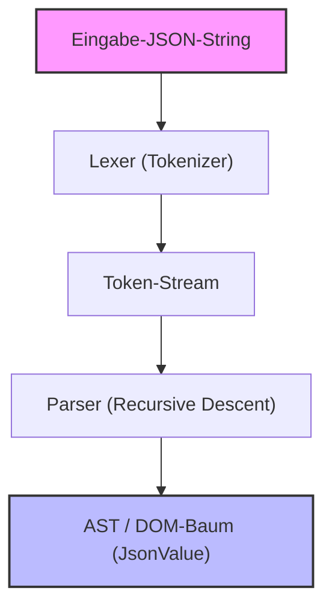
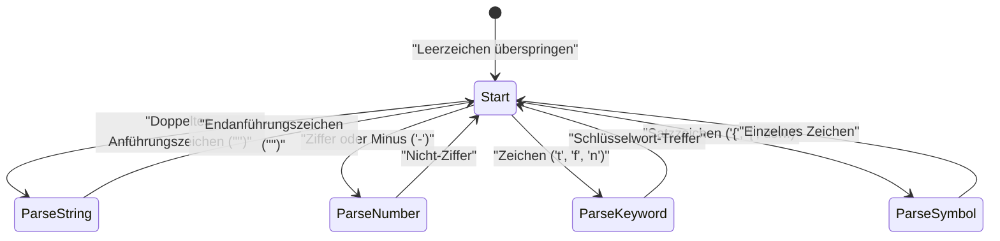

In der Webentwicklung und bei der Kommunikation zwischen Systemen ist die derzeit am weitesten verbreitete Datenbeschreibungssprache zweifellos **JSON (JavaScript Object Notation)**. In der Welt existieren bereits sehr hervorragende und schnelle JSON-Parser wie `RapidJSON` oder `simdjson`. In der Praxis mag es selten vorkommen, dass man einen selbst geschriebenen Parser in den Produktionscode integriert, aber **"das eigene Schreiben eines JSON-Parsers"** ist ein hervorragendes Thema, um Parsing, Speicherverwaltung, Zeichenkettenverarbeitung und Performance-Tuning zu erlernen.

In diesem Artikel erklären wir detailliert den Prozess, einen schnellen und speichereffizienten JSON-Parser von Grund auf neu zu erstellen, indem wir moderne Features von C++17/C++20 (wie `std::string_view`, `std::variant`, `std::from_chars` usw.) voll ausschöpfen.

---

## 1. Wiederholung der JSON-Spezifikation (RFC 8259)

Die JSON-Spezifikation ist in [RFC 8259](https://tools.ietf.org/html/rfc8259) streng definiert. Um einen Parser zu schreiben, müssen wir zunächst die Spezifikation richtig verstehen.

Die JSON-Datentypen sind auf die folgenden 6 Arten beschränkt.

1. **Object (Objekt)**: Eine ungeordnete Sammlung von Schlüssel-Wert-Paaren, wobei die Schlüssel Zeichenketten sind. Eingeschlossen in `{}` und jedes Paar ist durch `,` getrennt.
2. **Array**: Eine geordnete Liste von Werten. Eingeschlossen in `[]` und die Werte sind durch `,` getrennt.
3. **String (Zeichenkette)**: Eine Sequenz von Unicode-Zeichen, eingeschlossen in doppelte Anführungszeichen `""`. Enthält Escaping mit dem Backslash `\`.
4. **Number (Zahl)**: Ganzzahl oder Gleitkommazahl. Unendlich (`Infinity`) oder keine Zahl (`NaN`) sind nicht zulässig.
5. **Boolean (Wahrheitswert)**: `true` oder `false`.
6. **Null**: `null`.

Laut Spezifikation können Leerzeichen (Space, Horizontal Tab, Line Feed, Carriage Return) an beliebiger Stelle zwischen Token eingefügt werden, und das Parsing muss erfolgen, während diese ignoriert werden.

---

## 2. Architektur des Parsers

Der Parsing-Prozess (syntaktische Analyse) wird im Allgemeinen in zwei Phasen unterteilt: **lexikalische Analyse (Lexical Analysis)** und **syntaktische Analyse (Syntactic Analysis)**.



1. **Lexer (Tokenizer)**: Liest den rohen Eingabe-String (Zeichen-Array) von Anfang an und teilt ihn in "sinnvolle kleinste Einheiten (Token)".
2. **Parser**: Liest die vom Lexer erhaltene Token-Sequenz und baut gemäß den Grammatikregeln eine Baumstruktur (DOM-Baum: Document Object Model) auf.

In dieser Implementierung wird der Lexer so konzipiert, dass er keine Kopien von Zeichenketten erstellt, sondern Zeiger und Länge auf den ursprünglichen Eingabe-String (`std::string_view`) speichert, um die Speichereffizienz zu erhöhen.

---

## 3. Entwurf des AST- (DOM-) Modells und modernes C++

Um die verschiedenen Datentypen von JSON in C++ darzustellen, nutzen wir das in C++17 eingeführte `std::variant`. `std::variant` ist eine typsichere Union und eignet sich ideal für die Darstellung von JSON-Daten mit dynamischer Typisierung.

```cpp
#include <string>
#include <vector>
#include <map>
#include <variant>
#include <memory>
#include <string_view>

// Vorwärtsdeklaration
class JsonValue;

// Datentypen für JSON definieren
using JsonNull   = std::nullptr_t;
using JsonBool   = bool;
using JsonNumber = double;
using JsonString = std::string;
using JsonArray  = std::vector<JsonValue>;
using JsonObject = std::map<std::string, JsonValue>;

// std::variant verwenden, um genau einen der Typen zu speichern
using JsonVariant = std::variant<
    JsonNull,
    JsonBool,
    JsonNumber,
    JsonString,
    JsonArray,
    JsonObject
>;

class JsonValue {
public:
    // Standardkonstruktor initialisiert mit Null
    JsonValue() : m_value(nullptr) {}
    
    // Konstruktor, der implizite Konvertierungen aus jedem Typ erlaubt
    template <typename T>
    JsonValue(T&& val) : m_value(std::forward<T>(val)) {}

    // Hilfsmethoden zur Typprüfung
    bool isNull() const { return std::holds_alternative<JsonNull>(m_value); }
    bool isBool() const { return std::holds_alternative<JsonBool>(m_value); }
    bool isNumber() const { return std::holds_alternative<JsonNumber>(m_value); }
    bool isString() const { return std::holds_alternative<JsonString>(m_value); }
    bool isArray() const { return std::holds_alternative<JsonArray>(m_value); }
    bool isObject() const { return std::holds_alternative<JsonObject>(m_value); }

    // Hilfsmethode zum Abrufen von Werten
    template <typename T>
    const T& get() const {
        return std::get<T>(m_value);
    }

private:
    JsonVariant m_value;
};
```

Durch dieses Design können rekursive Datenstrukturen wie `JsonArray` und `JsonObject` prägnant und sicher dargestellt werden (in einigen Implementierungen der C++-Standardbibliothek ist die Verwendung unvollständiger Typen innerhalb von `std::variant` eingeschränkt, weshalb eine Heap-Zuweisung mit Smart Pointern erforderlich sein kann, aber in den neuesten Compilern funktioniert der obige Code oft reibungslos).

---

## 4. Implementierung des Lexers (Lexikalische Analyse)

Die Aufgabe des Lexers ist es, Zeichenketten zu lesen und in Token zu zerlegen. Zunächst definieren wir die Arten von Token.

```cpp
enum class TokenType {
    Null,
    True,
    False,
    Number,
    String,
    LBrace,    // {
    RBrace,    // }
    LBracket,  // [
    RBracket,  // ]
    Colon,     // :
    Comma,     // ,
    EndOfFile  // EOF
};

struct Token {
    TokenType type;
    std::string_view value;
};
```

Wenn wir die internen Zustandsübergänge des Lexers mit Mermaid visualisieren, sieht das wie folgt aus.



Die Hauptimplementierung des Lexers sieht folgendermaßen aus. Während Leerzeichen übersprungen werden, wird abhängig vom aktuellen Zeichen verzweigt (mit einer switch- oder if-Anweisung).

```cpp
class Lexer {
public:
    explicit Lexer(std::string_view source) : m_source(source), m_position(0) {}

    Token nextToken() {
        skipWhitespace();

        if (isAtEnd()) {
            return { TokenType::EndOfFile, "" };
        }

        char c = peek();

        switch (c) {
            case '{': advance(); return { TokenType::LBrace, "{" };
            case '}': advance(); return { TokenType::RBrace, "}" };
            case '[': advance(); return { TokenType::LBracket, "[" };
            case ']': advance(); return { TokenType::RBracket, "]" };
            case ':': advance(); return { TokenType::Colon, ":" };
            case ',': advance(); return { TokenType::Comma, "," };
            case '"': return lexString();
            default:
                if (c == '-' || std::isdigit(c)) {
                    return lexNumber();
                } else if (std::isalpha(c)) {
                    return lexKeyword();
                }
                throw std::runtime_error("Unexpected character"); // Unerwartetes Zeichen
        }
    }

private:
    std::string_view m_source;
    size_t m_position;

    bool isAtEnd() const { return m_position >= m_source.length(); }
    char peek() const { return m_source[m_position]; }
    void advance() { m_position++; }

    void skipWhitespace() {
        while (!isAtEnd()) {
            char c = peek();
            if (c == ' ' || c == '\t' || c == '\n' || c == '\r') {
                advance();
            } else {
                break;
            }
        }
    }

    Token lexString() {
        advance(); // Anfängliches Anführungszeichen überspringen
        size_t start = m_position;
        while (!isAtEnd() && peek() != '"') {
            // Die Verarbeitung von Escape-Zeichen (wie \" oder \\) sollte hier strikt erfolgen
            if (peek() == '\\') {
                advance(); // Den Backslash des Escapes überspringen
            }
            advance();
        }
        
        if (isAtEnd()) throw std::runtime_error("Unterminated string"); // Nicht beendeter String
        
        std::string_view strVal = m_source.substr(start, m_position - start);
        advance(); // Abschließendes Anführungszeichen überspringen
        return { TokenType::String, strVal };
    }

    Token lexNumber() {
        size_t start = m_position;
        while (!isAtEnd() && (std::isdigit(peek()) || peek() == '.' || peek() == 'e' || peek() == 'E' || peek() == '+' || peek() == '-')) {
            advance();
        }
        return { TokenType::Number, m_source.substr(start, m_position - start) };
    }

    Token lexKeyword() {
        size_t start = m_position;
        while (!isAtEnd() && std::isalpha(peek())) {
            advance();
        }
        std::string_view word = m_source.substr(start, m_position - start);
        
        if (word == "true") return { TokenType::True, word };
        if (word == "false") return { TokenType::False, word };
        if (word == "null") return { TokenType::Null, word };
        
        throw std::runtime_error("Unknown keyword"); // Unbekanntes Schlüsselwort
    }
};
```

Der entscheidende Punkt hier ist, dass die Werte von Zeichenketten (String) und Zahlen (Number) als `std::string_view` extrahiert werden. Dadurch **treten auf der Lexer-Stufe keinerlei dynamische Speicherzuweisungen (Heap-Allocation) oder Kopien auf**. Dies ist ein wichtiges Design, das sich direkt auf die Performance auswirkt.

---

## 5. Implementierung des Parsers (Syntaktische Analyse): Recursive Descent Parsing

Sobald der Lexer fertig ist, ist der Parser an der Reihe. Da die JSON-Grammatik eine LL(1)-Grammatik ist, passt sie sehr gut zum **Recursive Descent Parsing (rekursiver absteigender Parser)**, bei dem "nur durch Betrachtung eines aktuellen Tokens" entschieden werden kann, welche Funktion als Nächstes aufgerufen werden soll.

```cpp
class Parser {
public:
    explicit Parser(std::string_view source) : m_lexer(source) {
        m_currentToken = m_lexer.nextToken();
    }

    JsonValue parse() {
        JsonValue result = parseValue();
        if (m_currentToken.type != TokenType::EndOfFile) {
            throw std::runtime_error("Extra tokens after root element"); // Zusätzliche Token nach dem Wurzelelement
        }
        return result;
    }

private:
    Lexer m_lexer;
    Token m_currentToken;

    void consumeToken() {
        m_currentToken = m_lexer.nextToken();
    }

    void expectAndConsume(TokenType expectedType) {
        if (m_currentToken.type != expectedType) {
            throw std::runtime_error("Unexpected token"); // Unerwartetes Token
        }
        consumeToken();
    }

    JsonValue parseValue() {
        switch (m_currentToken.type) {
            case TokenType::Null:
                consumeToken();
                return JsonValue(nullptr);
            case TokenType::True:
                consumeToken();
                return JsonValue(true);
            case TokenType::False:
                consumeToken();
                return JsonValue(false);
            case TokenType::Number:
                return parseNumber();
            case TokenType::String:
                return parseString();
            case TokenType::LBrace:
                return parseObject();
            case TokenType::LBracket:
                return parseArray();
            default:
                throw std::runtime_error("Invalid value"); // Ungültiger Wert
        }
    }

    JsonValue parseNumber() {
        std::string_view numStr = m_currentToken.value;
        consumeToken();
        
        double value = 0.0;
        // std::from_chars von C++17 verwenden für schnelles Parsen
        auto [ptr, ec] = std::from_chars(numStr.data(), numStr.data() + numStr.size(), value);
        if (ec != std::errc()) {
            throw std::runtime_error("Invalid number format"); // Ungültiges Zahlenformat
        }
        return JsonValue(value);
    }

    JsonValue parseString() {
        // Eigentlich sollte hier die Dekodierung von Escape-Sequenzen (\n, \uXXXX usw.) erfolgen
        // und der tatsächliche std::string aufgebaut werden.
        std::string str(m_currentToken.value);
        consumeToken();
        return JsonValue(str);
    }

    JsonValue parseArray() {
        consumeToken(); // '[' konsumieren
        JsonArray array;
        
        if (m_currentToken.type == TokenType::RBracket) {
            consumeToken(); // Leeres Array
            return JsonValue(array);
        }

        while (true) {
            array.push_back(parseValue());
            if (m_currentToken.type == TokenType::Comma) {
                consumeToken();
            } else if (m_currentToken.type == TokenType::RBracket) {
                consumeToken();
                break;
            } else {
                throw std::runtime_error("Expected ',' or ']' in array"); // Erwartet ',' oder ']' im Array
            }
        }
        return JsonValue(array);
    }

    JsonValue parseObject() {
        consumeToken(); // '{' konsumieren
        JsonObject object;

        if (m_currentToken.type == TokenType::RBrace) {
            consumeToken(); // Leeres Objekt
            return JsonValue(object);
        }

        while (true) {
            if (m_currentToken.type != TokenType::String) {
                throw std::runtime_error("Expected string key in object"); // Erwartet String-Schlüssel im Objekt
            }
            
            std::string key(m_currentToken.value);
            consumeToken();
            
            expectAndConsume(TokenType::Colon);
            
            JsonValue value = parseValue();
            object[key] = value;
            
            if (m_currentToken.type == TokenType::Comma) {
                consumeToken();
            } else if (m_currentToken.type == TokenType::RBrace) {
                consumeToken();
                break;
            } else {
                throw std::runtime_error("Expected ',' or '}' in object"); // Erwartet ',' oder '}' im Objekt
            }
        }
        return JsonValue(object);
    }
};
```

Da bei einem Recursive Descent Parser die Codestruktur und die JSON-Grammatik (BNF) eins zu eins übereinstimmen, wird der Code intuitiv und leicht lesbar. Bei `parseObject` wird beispielsweise die Syntax in der Reihenfolge Schlüssel (String) -> Doppelpunkt (Colon) -> Wert (Value) analysiert.

---

## 6. Techniken zur Performance-Optimierung

Allein durch die Implementierung eines einfachen Parsers kann man keine praktischen Bibliotheken schlagen. Wir stellen einige Optimierungstechniken vor, die spezifisch für C++ sind.

### 6.1. Zero-Copy-Architektur und `std::string_view`
Der Großteil der Performance-Engpässe eines Parsers liegt in der "Kopie von Zeichenketten" und der "dynamischen Allokation von Heap-Speicher".
Wenn `std::string` häufig verwendet wird, tritt bei jeder Erstellung von Teilstrings eine Speicherzuweisung auf. Um dies zu verhindern, haben wir im Lexer konsequent `std::string_view` verwendet.
Die Erstellungszeit von `std::string_view` hängt nicht von der Stringlänge $L$ ab und wird in $O(1)$ abgeschlossen.

### 6.2. Optimierung des Zahlen-Parsings (`std::from_chars`)
Standardfunktionen wie `std::stod` oder `sscanf` arbeiten abhängig von den aktuellen Locale-Einstellungen. Dadurch erhalten sie intern Sperren für gegenseitigen Ausschluss und erzeugen Lokalisierungs-Overheads.
Das in C++17 eingeführte `std::from_chars` ist locale-unabhängig und erfordert keine Speicherkopien. Daher bietet es eine überwältigende Performance beim Parsen von Zahlen. Die Zeitkomplexität beträgt $O(M)$, wobei $M$ die Anzahl der Ziffern ist.

### 6.3. Speicherzuweisung und `std::pmr` (Polymorphic Memory Resources)
Während der Erstellung des AST entstehen durch die Knotengenerierung von `std::vector` oder `std::map` zahlreiche kleine Allokationen (Fragmentierungen).
Um dies zu vermeiden, ist es effektiv, in C++17 `std::pmr::monotonic_buffer_resource` als benutzerdefinierten Allokator zu verwenden. Indem ein großer Speicherblock im Voraus nur einmal reserviert wird und Speicher durch einfaches Weiterrücken eines Zeigers ausgeschnitten wird, sinken die Allokationskosten auf fast null.

### 6.4. Nutzung von SIMD (Fortgeschritten)
Fortschrittliche Parser wie `simdjson` verwenden SIMD-Anweisungen wie AVX2 oder NEON, um Zeichenketten von 32 oder 64 Byte auf einmal zu scannen. Dadurch wird das Überspringen von Leerzeichen und die Suche nach Anführungszeichen drastisch beschleunigt. Die Implementierung in diesem Artikel verwendet zeichenweises Scannen, aber wenn man nach dem ultimativen Ziel strebt, sind branchless (verzweigungsfreie) Programmierung und SIMD unerlässlich.

---

## 7. Bewertung von Komplexität und Algorithmus

Wir bewerten die algorithmische Komplexität dieses Parsers.
Angenommen, die Gesamtlänge der eingegebenen JSON-Zeichenkette beträgt $N$ Bytes.

**Zeitkomplexität (Time Complexity):**
Der Lexer referenziert jedes Zeichen nur eine konstante Anzahl von Malen (normalerweise einmal), und der Parser führt eine konstante Anzahl von Operationen pro Token durch. Es gibt absolut kein Backtracking (Neu-Lesen). Daher ist die allgemeine Zeitkomplexität linear.

$$
T(N) = O(N)
$$

**Speicherkomplexität (Space Complexity):**
Der zugewiesene Speicher für den Aufbau des AST (DOM-Baum) ist proportional zur Anzahl der Elemente im JSON-String. Selbst im schlimmsten Fall (z.B. stark verschachteltes Array `[[[[...]]]]`) liegt die erforderliche Speichermenge innerhalb eines konstanten Vielfachen, das die Eingabegröße $N$ nicht überschreitet.

$$
Space(N) \le C \times N \implies O(N)
$$

Beim Recursive Descent Parsing wird der Aufrufstapel (Call Stack) jedoch proportional zur Verschachtelungstiefe (Depth) von JSON verbraucht. Für die Tiefe $D$ wird ein Stapelspeicher von $O(D)$ benötigt. Wenn böswillig endlos verschachteltes JSON eingegeben wird, besteht die Gefahr eines Stack Overflow. Daher müssen praktische Parser eine Grenze für die Rekursionstiefe festlegen (z. B. 256 oder 512) oder die Rekursion in Schleifen auflösen.

---

## 8. Zusammenfassung

In diesem Artikel haben wir die Schritte erläutert, um mit C++ einen JSON-Parser von Grund auf neu zu erstellen.
- Trennen des Strings in Token mithilfe eines **Lexers** und Reduzieren unnötiger Kopien durch `std::string_view`.
- Konvertieren der Token in einen AST (`std::variant`) mithilfe eines Recursive Descent **Parsers**.
- Anwenden von `std::from_chars` und Speicherverwaltungsstrategien unter Berücksichtigung der **Performance**.

Die Erfahrung, die Spezifikationen einer Sprache zu verstehen und in Code umzusetzen, hebt die Fähigkeiten als Programmierer auf die nächste Stufe. Nutzen Sie diesen Artikel als Sprungbrett, um Ihre eigenen Parser und Serialisierer (Generierung von JSON-Strings) zu erweitern und fordern Sie sich selbst zu weiteren Optimierungen (wie die Einführung von benutzerdefinierten Allokatoren oder SIMD-Nutzung) heraus.
