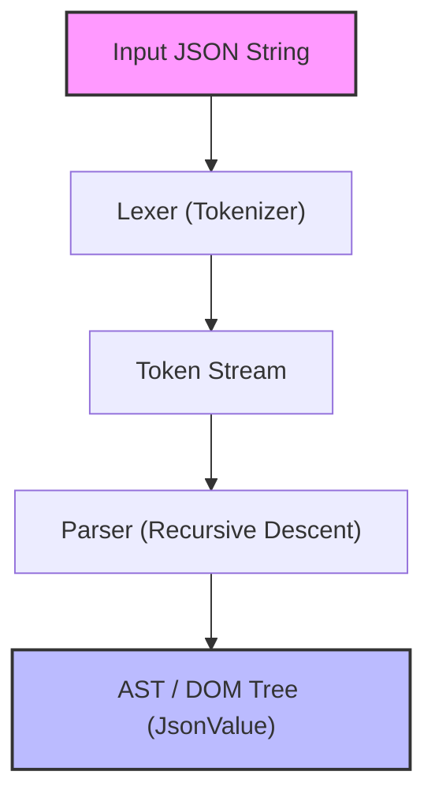
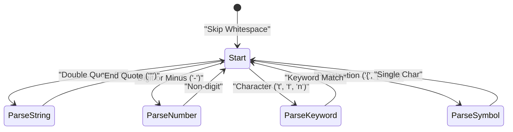

In web development and inter-system communication, the most widely used data description language today is undoubtedly **JSON (JavaScript Object Notation)**. There are already highly excellent and fast JSON parsers in the world, such as `RapidJSON` and `simdjson`. While you might rarely have the opportunity to deploy a custom-built parser in production code in practice, **"building a JSON parser from scratch"** is an excellent subject for learning parsing, memory management, string manipulation, and performance tuning.

In this article, we will explain in detail the process of building a fast and memory-efficient JSON parser from scratch by fully utilizing modern C++17/C++20 features (such as `std::string_view`, `std::variant`, and `std::from_chars`).

---

## 1. Review of the JSON Specification (RFC 8259)

The JSON specification is strictly defined in [RFC 8259](https://tools.ietf.org/html/rfc8259). To write a parser, you must first understand the specification correctly.

JSON data types are limited to the following 6 types:

1. **Object (オブジェクト)**: An unordered collection of string key-value pairs. Enclosed in `{}`, with each pair separated by `,`.
2. **Array (配列)**: An ordered list of values. Enclosed in `[]`, with values separated by `,`.
3. **String (文字列)**: A sequence of Unicode characters enclosed in double quotes `""`. This includes escaping with a backslash `\`.
4. **Number (数値)**: An integer or a floating-point number. Infinity (`Infinity`) and Not-a-Number (`NaN`) are not allowed.
5. **Boolean (真偽値)**: `true` or `false`.
6. **Null**: `null`.

According to the specification, whitespace characters (Space, Horizontal Tab, Line Feed, Carriage Return) can be inserted anywhere between tokens, and we need to parse the syntax while ignoring these.

---

## 2. Parser Architecture

The parsing process is generally divided into two phases: **Lexical Analysis** and **Syntactic Analysis**.



1. **Lexer (Tokenizer)**: Reads the input raw string (character array) from the beginning and splits it into "minimum meaningful units (tokens)".
2. **Parser**: Reads the sequence of tokens received from the lexer and builds a tree structure (DOM Tree: Document Object Model) according to the grammar rules.

In this implementation, to improve memory efficiency, the lexer is designed to hold a pointer and length (`std::string_view`) to the original input string without copying the string.

---

## 3. Designing the AST (DOM) Model and Modern C++

To represent various JSON data types in C++, we utilize `std::variant` introduced in C++17. `std::variant` is a type-safe union, making it ideal for representing JSON data that has dynamic typing.

```cpp
#include <string>
#include <vector>
#include <map>
#include <variant>
#include <memory>
#include <string_view>

// Forward declaration
class JsonValue;

// Define JSON data types
using JsonNull   = std::nullptr_t;
using JsonBool   = bool;
using JsonNumber = double;
using JsonString = std::string;
using JsonArray  = std::vector<JsonValue>;
using JsonObject = std::map<std::string, JsonValue>;

// Use std::variant to hold one of the types
using JsonVariant = std::variant<
    JsonNull,
    JsonBool,
    JsonNumber,
    JsonString,
    JsonArray,
    JsonObject
>;

class JsonValue {
public:
    // Default constructor initializes to Null
    JsonValue() : m_value(nullptr) {}
    
    // Constructors allowing implicit conversion from each type
    template <typename T>
    JsonValue(T&& val) : m_value(std::forward<T>(val)) {}

    // Helper methods for type checking
    bool isNull() const { return std::holds_alternative<JsonNull>(m_value); }
    bool isBool() const { return std::holds_alternative<JsonBool>(m_value); }
    bool isNumber() const { return std::holds_alternative<JsonNumber>(m_value); }
    bool isString() const { return std::holds_alternative<JsonString>(m_value); }
    bool isArray() const { return std::holds_alternative<JsonArray>(m_value); }
    bool isObject() const { return std::holds_alternative<JsonObject>(m_value); }

    // Helper method for value retrieval
    template <typename T>
    const T& get() const {
        return std::get<T>(m_value);
    }

private:
    JsonVariant m_value;
};
```

By designing it this way, recursive data structures like `JsonArray` and `JsonObject` can be represented concisely and safely (in some implementations of the C++ standard library, the use of incomplete types in `std::variant` is restricted, which may require heap allocation using smart pointers, but it often works as above with the latest compilers).

---

## 4. Implementing the Lexer (Lexical Analyzer)

The role of the lexer is to read strings and cut them into tokens. First, let's define the token types.

```cpp
enum class TokenType {
    Null,
    True,
    False,
    Number,
    String,
    LBrace,    // {
    RBrace,    // }
    LBracket,  // [
    RBracket,  // ]
    Colon,     // :
    Comma,     // ,
    EndOfFile  // EOF
};

struct Token {
    TokenType type;
    std::string_view value;
};
```

Visualizing the internal state transition of the lexer with Mermaid looks like this:



The main implementation of the lexer is as follows. It branches based on the current character (using a switch statement or if statement) while skipping whitespace.

```cpp
class Lexer {
public:
    explicit Lexer(std::string_view source) : m_source(source), m_position(0) {}

    Token nextToken() {
        skipWhitespace();

        if (isAtEnd()) {
            return { TokenType::EndOfFile, "" };
        }

        char c = peek();

        switch (c) {
            case '{': advance(); return { TokenType::LBrace, "{" };
            case '}': advance(); return { TokenType::RBrace, "}" };
            case '[': advance(); return { TokenType::LBracket, "[" };
            case ']': advance(); return { TokenType::RBracket, "]" };
            case ':': advance(); return { TokenType::Colon, ":" };
            case ',': advance(); return { TokenType::Comma, "," };
            case '"': return lexString();
            default:
                if (c == '-' || std::isdigit(c)) {
                    return lexNumber();
                } else if (std::isalpha(c)) {
                    return lexKeyword();
                }
                throw std::runtime_error("Unexpected character");
        }
    }

private:
    std::string_view m_source;
    size_t m_position;

    bool isAtEnd() const { return m_position >= m_source.length(); }
    char peek() const { return m_source[m_position]; }
    void advance() { m_position++; }

    void skipWhitespace() {
        while (!isAtEnd()) {
            char c = peek();
            if (c == ' ' || c == '\t' || c == '\n' || c == '\r') {
                advance();
            } else {
                break;
            }
        }
    }

    Token lexString() {
        advance(); // Skip initial quote
        size_t start = m_position;
        while (!isAtEnd() && peek() != '"') {
            // Processing of escape characters (such as \" or \\) should strictly be done here
            if (peek() == '\\') {
                advance(); // Skip the escape backslash
            }
            advance();
        }
        
        if (isAtEnd()) throw std::runtime_error("Unterminated string");
        
        std::string_view strVal = m_source.substr(start, m_position - start);
        advance(); // Skip closing quote
        return { TokenType::String, strVal };
    }

    Token lexNumber() {
        size_t start = m_position;
        while (!isAtEnd() && (std::isdigit(peek()) || peek() == '.' || peek() == 'e' || peek() == 'E' || peek() == '+' || peek() == '-')) {
            advance();
        }
        return { TokenType::Number, m_source.substr(start, m_position - start) };
    }

    Token lexKeyword() {
        size_t start = m_position;
        while (!isAtEnd() && std::isalpha(peek())) {
            advance();
        }
        std::string_view word = m_source.substr(start, m_position - start);
        
        if (word == "true") return { TokenType::True, word };
        if (word == "false") return { TokenType::False, word };
        if (word == "null") return { TokenType::Null, word };
        
        throw std::runtime_error("Unknown keyword");
    }
};
```

The key point here is that the values for Strings and Numbers are extracted as `std::string_view`. As a result, **no dynamic memory allocation (heap allocation) or copying occurs at all** at the lexer stage. This is an important design choice directly tied to performance.

---

## 5. Implementing the Parser: Recursive Descent Parsing

Once the lexer is complete, the next step is the parser. Since the JSON grammar is an LL(1) grammar, it is highly compatible with **Recursive Descent Parsing**, where you can determine which function to call next just by "looking at the current single token".

```cpp
class Parser {
public:
    explicit Parser(std::string_view source) : m_lexer(source) {
        m_currentToken = m_lexer.nextToken();
    }

    JsonValue parse() {
        JsonValue result = parseValue();
        if (m_currentToken.type != TokenType::EndOfFile) {
            throw std::runtime_error("Extra tokens after root element");
        }
        return result;
    }

private:
    Lexer m_lexer;
    Token m_currentToken;

    void consumeToken() {
        m_currentToken = m_lexer.nextToken();
    }

    void expectAndConsume(TokenType expectedType) {
        if (m_currentToken.type != expectedType) {
            throw std::runtime_error("Unexpected token");
        }
        consumeToken();
    }

    JsonValue parseValue() {
        switch (m_currentToken.type) {
            case TokenType::Null:
                consumeToken();
                return JsonValue(nullptr);
            case TokenType::True:
                consumeToken();
                return JsonValue(true);
            case TokenType::False:
                consumeToken();
                return JsonValue(false);
            case TokenType::Number:
                return parseNumber();
            case TokenType::String:
                return parseString();
            case TokenType::LBrace:
                return parseObject();
            case TokenType::LBracket:
                return parseArray();
            default:
                throw std::runtime_error("Invalid value");
        }
    }

    JsonValue parseNumber() {
        std::string_view numStr = m_currentToken.value;
        consumeToken();
        
        double value = 0.0;
        // Fast parsing using std::from_chars from C++17
        auto [ptr, ec] = std::from_chars(numStr.data(), numStr.data() + numStr.size(), value);
        if (ec != std::errc()) {
            throw std::runtime_error("Invalid number format");
        }
        return JsonValue(value);
    }

    JsonValue parseString() {
        // Here, the decoding process for escape sequences (\n, \uXXXX, etc.) should essentially be performed,
        // constructing the actual std::string.
        std::string str(m_currentToken.value);
        consumeToken();
        return JsonValue(str);
    }

    JsonValue parseArray() {
        consumeToken(); // Consume '['
        JsonArray array;
        
        if (m_currentToken.type == TokenType::RBracket) {
            consumeToken(); // Empty array
            return JsonValue(array);
        }

        while (true) {
            array.push_back(parseValue());
            if (m_currentToken.type == TokenType::Comma) {
                consumeToken();
            } else if (m_currentToken.type == TokenType::RBracket) {
                consumeToken();
                break;
            } else {
                throw std::runtime_error("Expected ',' or ']' in array");
            }
        }
        return JsonValue(array);
    }

    JsonValue parseObject() {
        consumeToken(); // Consume '{'
        JsonObject object;

        if (m_currentToken.type == TokenType::RBrace) {
            consumeToken(); // Empty object
            return JsonValue(object);
        }

        while (true) {
            if (m_currentToken.type != TokenType::String) {
                throw std::runtime_error("Expected string key in object");
            }
            
            std::string key(m_currentToken.value);
            consumeToken();
            
            expectAndConsume(TokenType::Colon);
            
            JsonValue value = parseValue();
            object[key] = value;
            
            if (m_currentToken.type == TokenType::Comma) {
                consumeToken();
            } else if (m_currentToken.type == TokenType::RBrace) {
                consumeToken();
                break;
            } else {
                throw std::runtime_error("Expected ',' or '}' in object");
            }
        }
        return JsonValue(object);
    }
};
```

A recursive descent parser provides intuitive and readable code because its structure corresponds one-to-one with the JSON grammar (BNF). For example, in `parseObject`, the syntax is parsed in the order of Key (String) -> Colon (Colon) -> Value (Value).

---

## 6. Performance Optimization Techniques

Just implementing a simple parser isn't enough to beat practical libraries. We introduce a few optimization techniques unique to C++.

### 6.1. Zero-Copy Architecture and `std::string_view`
The majority of performance bottlenecks in parsers lie in "string copying" and "dynamic heap memory allocation".
Heavy use of `std::string` causes a memory allocation every time a substring is created. To prevent this, we strictly used `std::string_view` in the lexer.
The construction time of `std::string_view` is $O(1)$ and does not depend on the length of the string $L$.

### 6.2. Number Parsing Optimization (`std::from_chars`)
Standard `std::stod` or `sscanf` operate dependent on current Locale settings, leading to internal exclusive lock acquisitions or localization overhead.
`std::from_chars` introduced in C++17 is locale-independent and involves no memory copies, boasting overwhelming performance in number parsing. Its time complexity is $O(M)$, where $M$ is the number of digits.

### 6.3. Memory Allocation and `std::pmr` (Polymorphic Memory Resources)
During AST construction, a massive amount of small allocations (fragmentation) occurs due to node creation in `std::vector` or `std::map`.
To avoid this, adopting `std::pmr::monotonic_buffer_resource` from C++17 as a custom allocator is effective. By pre-allocating a large memory block once and merely advancing a pointer to carve out memory, allocation cost drops to near zero.

### 6.4. Utilizing SIMD (Advanced)
State-of-the-art parsers like `simdjson` use SIMD instructions like AVX2 or NEON to scan 32 bytes or 64 bytes of strings at once. This drastically speeds up whitespace skipping and quotation searching. The implementation in this article scans character by character, but if you aim for the absolute extreme, branchless programming and SIMD become essential.

---

## 7. Complexity and Algorithm Evaluation

Let's evaluate the algorithmic complexity of this parser.
Assume the total length of the input JSON string is $N$ bytes.

**Time Complexity:**
The lexer references each character a constant number of times (usually once), and the parser performs constant operations for each token. Backtracking (re-reading) never occurs. Therefore, the overall time complexity is linear time.

$$
T(N) = O(N)
$$

**Space Complexity:**
The memory allocated to build the AST (DOM tree) is proportional to the number of elements in the JSON string. Even considering the worst-case scenario (e.g., heavily nested arrays `[[[[...]]]]`), the required memory falls within a constant multiple that does not exceed the input size $N$.

$$
Space(N) \le C \times N \implies O(N)
$$

However, in recursive descent parsing, the call stack is consumed proportionally to the depth of the JSON nesting. For a depth of $D$, stack memory of $O(D)$ is required. Supplying a maliciously infinitely nested JSON poses the risk of causing a Stack Overflow, so a practical parser needs mechanisms like imposing a limit on recursion depth (e.g., 256 or 512) or expanding recursion into loops.

---

## 8. Summary

In this article, we explained the steps to build a JSON parser from scratch using C++.
- Split strings into tokens with the **Lexer**, reducing unnecessary copying with `std::string_view`.
- Convert tokens into the AST (`std::variant`) in the **Parser** using recursive descent parsing.
- Apply `std::from_chars` and memory management strategies with **Performance** in mind.

The experience of deciphering language specifications and dropping them into code elevates your skills as a programmer to the next level. Using this article as a stepping stone, we encourage you to try expanding this into your own custom parser or serializer (generating JSON strings) and challenge yourself with further optimizations (like introducing custom allocators or SIMD vectorization).
