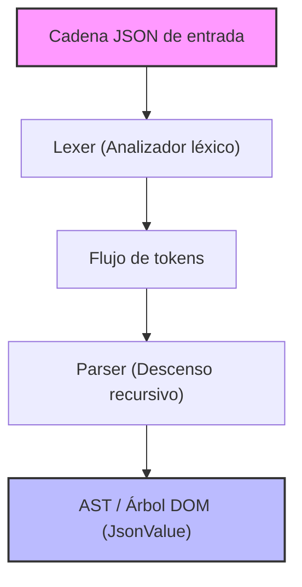
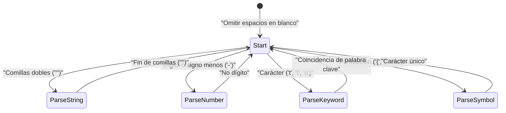

En el desarrollo web y la comunicación entre sistemas, el lenguaje de descripción de datos más utilizado en la actualidad es sin duda **JSON (JavaScript Object Notation)**. Ya existen analizadores (parsers) JSON extremadamente excelentes y rápidos en el mundo, como `RapidJSON` y `simdjson`. Aunque es posible que en la práctica haya pocas oportunidades de implementar un analizador propio en código de producción, **"escribir tu propio analizador JSON"** es un material de aprendizaje excelente para estudiar análisis sintáctico (parsing), gestión de memoria, procesamiento de cadenas y optimización de rendimiento.

En este artículo, explicaremos en detalle el proceso de construcción de un analizador JSON rápido y eficiente en memoria desde cero, aprovechando las funciones modernas de C++17/C++20 (como `std::string_view`, `std::variant`, `std::from_chars`, etc.).

---

## 1. Repaso de la especificación JSON (RFC 8259)

La especificación JSON está estrictamente definida en el [RFC 8259](https://tools.ietf.org/html/rfc8259). Para escribir un analizador, primero es necesario entender la especificación correctamente.

Los tipos de datos JSON se limitan a los siguientes 6 tipos:

1. **Object (Objeto)**: Una colección no ordenada de pares clave-valor de cadenas. Encerrada por `{}`, y cada par está separado por `,`.
2. **Array (Arreglo)**: Una lista ordenada de valores. Encerrada por `[]`, y los valores están separados por `,`.
3. **String (Cadena de caracteres)**: Una secuencia de caracteres Unicode encerrada entre comillas dobles `""`. Incluye escapes con barra invertida `\`.
4. **Number (Número)**: Un número entero o de punto flotante. No se permite el infinito (`Infinity`) ni "no numérico" (`NaN`).
5. **Boolean (Booleano)**: `true` o `false`.
6. **Null**: `null`.

Según la especificación, los caracteres de espacio en blanco (Space, Horizontal Tab, Line Feed, Carriage Return) pueden insertarse en cualquier lugar entre los tokens, y la sintaxis debe analizarse ignorándolos.

---

## 2. Arquitectura del analizador

El proceso de análisis (Parsing) generalmente se divide en dos fases: **Análisis léxico (Lexical Analysis)** y **Análisis sintáctico (Syntactic Analysis)**.



1. **Lexer (Analizador léxico / Tokenizer)**: Lee la cadena sin procesar de entrada (arreglo de caracteres) desde el principio y la divide en las "unidades mínimas significativas (tokens)".
2. **Parser (Analizador sintáctico)**: Lee la secuencia de tokens recibida del lexer y construye una estructura de árbol (Árbol DOM: Document Object Model) de acuerdo con las reglas gramaticales.

En esta implementación, para mejorar la eficiencia de la memoria, el lexer está diseñado para mantener un puntero y una longitud (`std::string_view`) de la cadena de entrada original, sin copiar la cadena.

---

## 3. Diseño del modelo AST (DOM) y C++ moderno

Para representar los distintos tipos de datos JSON en C++, aprovecharemos `std::variant`, introducido en C++17. `std::variant` es una unión con seguridad de tipos (type-safe union), ideal para representar datos JSON que tienen tipos dinámicos.

```cpp
#include <string>
#include <vector>
#include <map>
#include <variant>
#include <memory>
#include <string_view>

// Declaración anticipada
class JsonValue;

// Definición de tipos de datos JSON
using JsonNull   = std::nullptr_t;
using JsonBool   = bool;
using JsonNumber = double;
using JsonString = std::string;
using JsonArray  = std::vector<JsonValue>;
using JsonObject = std::map<std::string, JsonValue>;

// Uso de std::variant para contener uno de los tipos
using JsonVariant = std::variant<
    JsonNull,
    JsonBool,
    JsonNumber,
    JsonString,
    JsonArray,
    JsonObject
>;

class JsonValue {
public:
    // El constructor por defecto inicializa a Null
    JsonValue() : m_value(nullptr) {}
    
    // Constructor que permite conversiones implícitas desde cada tipo
    template <typename T>
    JsonValue(T&& val) : m_value(std::forward<T>(val)) {}

    // Métodos de ayuda para comprobación de tipos
    bool isNull() const { return std::holds_alternative<JsonNull>(m_value); }
    bool isBool() const { return std::holds_alternative<JsonBool>(m_value); }
    bool isNumber() const { return std::holds_alternative<JsonNumber>(m_value); }
    bool isString() const { return std::holds_alternative<JsonString>(m_value); }
    bool isArray() const { return std::holds_alternative<JsonArray>(m_value); }
    bool isObject() const { return std::holds_alternative<JsonObject>(m_value); }

    // Método de ayuda para obtener valores
    template <typename T>
    const T& get() const {
        return std::get<T>(m_value);
    }

private:
    JsonVariant m_value;
};
```

Al diseñar de la manera anterior, estructuras de datos recursivas como `JsonArray` y `JsonObject` pueden expresarse de forma concisa y segura (dado que algunas implementaciones de la biblioteca estándar de C++ restringen el uso de tipos incompletos dentro de `std::variant`, a veces se requiere asignación en el heap usando punteros inteligentes, pero suele funcionar en compiladores recientes como se muestra arriba).

---

## 4. Implementación del Lexer (Analizador léxico)

El papel del lexer es leer la cadena y dividirla en tokens. Primero, definimos los tipos de tokens.

```cpp
enum class TokenType {
    Null,
    True,
    False,
    Number,
    String,
    LBrace,    // {
    RBrace,    // }
    LBracket,  // [
    RBracket,  // ]
    Colon,     // :
    Comma,     // ,
    EndOfFile  // EOF
};

struct Token {
    TokenType type;
    std::string_view value;
};
```

Si visualizamos la transición del estado interno del lexer con Mermaid, se ve así:



El cuerpo principal de la implementación del lexer es el siguiente. Realiza una bifurcación (sentencia switch o if) según el carácter actual mientras salta los espacios en blanco.

```cpp
class Lexer {
public:
    explicit Lexer(std::string_view source) : m_source(source), m_position(0) {}

    Token nextToken() {
        skipWhitespace();

        if (isAtEnd()) {
            return { TokenType::EndOfFile, "" };
        }

        char c = peek();

        switch (c) {
            case '{': advance(); return { TokenType::LBrace, "{" };
            case '}': advance(); return { TokenType::RBrace, "}" };
            case '[': advance(); return { TokenType::LBracket, "[" };
            case ']': advance(); return { TokenType::RBracket, "]" };
            case ':': advance(); return { TokenType::Colon, ":" };
            case ',': advance(); return { TokenType::Comma, "," };
            case '"': return lexString();
            default:
                if (c == '-' || std::isdigit(c)) {
                    return lexNumber();
                } else if (std::isalpha(c)) {
                    return lexKeyword();
                }
                throw std::runtime_error("Carácter inesperado");
        }
    }

private:
    std::string_view m_source;
    size_t m_position;

    bool isAtEnd() const { return m_position >= m_source.length(); }
    char peek() const { return m_source[m_position]; }
    void advance() { m_position++; }

    void skipWhitespace() {
        while (!isAtEnd()) {
            char c = peek();
            if (c == ' ' || c == '\t' || c == '\n' || c == '\r') {
                advance();
            } else {
                break;
            }
        }
    }

    Token lexString() {
        advance(); // Omitir comilla inicial
        size_t start = m_position;
        while (!isAtEnd() && peek() != '"') {
            // El procesamiento de caracteres de escape (como \" o \\) debería realizarse estrictamente aquí
            if (peek() == '\\') {
                advance(); // Omitir la barra invertida de escape
            }
            advance();
        }
        
        if (isAtEnd()) throw std::runtime_error("Cadena no terminada");
        
        std::string_view strVal = m_source.substr(start, m_position - start);
        advance(); // Omitir comilla de cierre
        return { TokenType::String, strVal };
    }

    Token lexNumber() {
        size_t start = m_position;
        while (!isAtEnd() && (std::isdigit(peek()) || peek() == '.' || peek() == 'e' || peek() == 'E' || peek() == '+' || peek() == '-')) {
            advance();
        }
        return { TokenType::Number, m_source.substr(start, m_position - start) };
    }

    Token lexKeyword() {
        size_t start = m_position;
        while (!isAtEnd() && std::isalpha(peek())) {
            advance();
        }
        std::string_view word = m_source.substr(start, m_position - start);
        
        if (word == "true") return { TokenType::True, word };
        if (word == "false") return { TokenType::False, word };
        if (word == "null") return { TokenType::Null, word };
        
        throw std::runtime_error("Palabra clave desconocida");
    }
};
```

El punto clave aquí es que los valores de cadena (String) y numéricos (Number) se extraen como `std::string_view`. Como resultado, **no ocurre ninguna asignación de memoria dinámica (asignación en el heap) ni copias durante la fase del lexer**. Este es un diseño crítico que afecta directamente el rendimiento.

---

## 5. Implementación del analizador sintáctico (Parser): Análisis de Descenso Recursivo

Una vez completado el lexer, el siguiente paso es finalmente el parser. Dado que la gramática JSON es LL(1), es muy compatible con el **análisis de descenso recursivo (Recursive Descent Parsing)**, donde "solo mirando el token actual" se puede decidir a qué función llamar a continuación.

```cpp
class Parser {
public:
    explicit Parser(std::string_view source) : m_lexer(source) {
        m_currentToken = m_lexer.nextToken();
    }

    JsonValue parse() {
        JsonValue result = parseValue();
        if (m_currentToken.type != TokenType::EndOfFile) {
            throw std::runtime_error("Tokens adicionales después del elemento raíz");
        }
        return result;
    }

private:
    Lexer m_lexer;
    Token m_currentToken;

    void consumeToken() {
        m_currentToken = m_lexer.nextToken();
    }

    void expectAndConsume(TokenType expectedType) {
        if (m_currentToken.type != expectedType) {
            throw std::runtime_error("Token inesperado");
        }
        consumeToken();
    }

    JsonValue parseValue() {
        switch (m_currentToken.type) {
            case TokenType::Null:
                consumeToken();
                return JsonValue(nullptr);
            case TokenType::True:
                consumeToken();
                return JsonValue(true);
            case TokenType::False:
                consumeToken();
                return JsonValue(false);
            case TokenType::Number:
                return parseNumber();
            case TokenType::String:
                return parseString();
            case TokenType::LBrace:
                return parseObject();
            case TokenType::LBracket:
                return parseArray();
            default:
                throw std::runtime_error("Valor inválido");
        }
    }

    JsonValue parseNumber() {
        std::string_view numStr = m_currentToken.value;
        consumeToken();
        
        double value = 0.0;
        // Uso de std::from_chars de C++17 para análisis rápido
        auto [ptr, ec] = std::from_chars(numStr.data(), numStr.data() + numStr.size(), value);
        if (ec != std::errc()) {
            throw std::runtime_error("Formato de número inválido");
        }
        return JsonValue(value);
    }

    JsonValue parseString() {
        // Originalmente, el procesamiento de decodificación de secuencias de escape (como \n, \uXXXX) se realiza aquí,
        // para construir la entidad std::string.
        std::string str(m_currentToken.value);
        consumeToken();
        return JsonValue(str);
    }

    JsonValue parseArray() {
        consumeToken(); // Consumir '['
        JsonArray array;
        
        if (m_currentToken.type == TokenType::RBracket) {
            consumeToken(); // Arreglo vacío
            return JsonValue(array);
        }

        while (true) {
            array.push_back(parseValue());
            if (m_currentToken.type == TokenType::Comma) {
                consumeToken();
            } else if (m_currentToken.type == TokenType::RBracket) {
                consumeToken();
                break;
            } else {
                throw std::runtime_error("Se esperaba ',' o ']' en el arreglo");
            }
        }
        return JsonValue(array);
    }

    JsonValue parseObject() {
        consumeToken(); // Consumir '{'
        JsonObject object;

        if (m_currentToken.type == TokenType::RBrace) {
            consumeToken(); // Objeto vacío
            return JsonValue(object);
        }

        while (true) {
            if (m_currentToken.type != TokenType::String) {
                throw std::runtime_error("Se esperaba una clave de cadena en el objeto");
            }
            
            std::string key(m_currentToken.value);
            consumeToken();
            
            expectAndConsume(TokenType::Colon);
            
            JsonValue value = parseValue();
            object[key] = value;
            
            if (m_currentToken.type == TokenType::Comma) {
                consumeToken();
            } else if (m_currentToken.type == TokenType::RBrace) {
                consumeToken();
                break;
            } else {
                throw std::runtime_error("Se esperaba ',' o '}' en el objeto");
            }
        }
        return JsonValue(object);
    }
};
```

Un analizador de descenso recursivo tiene una correspondencia uno a uno entre la estructura del código y la gramática JSON (BNF), lo que da como resultado un código intuitivo y fácil de leer. Por ejemplo, en `parseObject`, la sintaxis se analiza en el orden de Clave (String) -> Dos puntos (Colon) -> Valor (Value).

---

## 6. Técnicas de optimización de rendimiento

Implementar un analizador simple por sí solo no superará a las bibliotecas prácticas. Aquí introduciremos algunas técnicas de optimización exclusivas de C++.

### 6.1. Arquitectura Zero-Copy y `std::string_view`
La mayor parte del cuello de botella en el rendimiento de los analizadores reside en la "copia de cadenas" y la "asignación dinámica de memoria en el heap".
Si se usa intensivamente `std::string`, se produce una asignación de memoria cada vez que se crea una subcadena. Para prevenir esto, utilizamos exhaustivamente `std::string_view` en el lexer.
El tiempo de construcción de un `std::string_view` se completa en $O(1)$, independiente de la longitud de la cadena $L$.

### 6.2. Optimización del análisis numérico (`std::from_chars`)
Funciones estándar como `std::stod` y `sscanf` operan dependiendo de la configuración regional (Locale) actual, lo que ocasiona bloqueos internos por exclusión mutua y sobrecargas de localización.
`std::from_chars`, introducido en C++17, es independiente de la configuración regional y no involucra copias de memoria, por lo que cuenta con un rendimiento abrumador en el análisis de números. La complejidad temporal es de $O(M)$ donde $M$ es el número de dígitos.

### 6.3. Asignación de memoria y `std::pmr` (Polymorphic Memory Resources)
Al construir el AST, ocurre una gran cantidad de pequeñas asignaciones de memoria (fragmentación) debido a la creación de nodos de `std::vector` y `std::map`.
Para evitar esto, es efectivo adoptar `std::pmr::monotonic_buffer_resource` de C++17 como un asignador (allocator) personalizado. Al reservar un gran bloque de memoria de antemano una sola vez, y simplemente avanzar un puntero para extraer memoria, el costo de asignación se vuelve casi nulo.

### 6.4. Uso de SIMD (Avanzado)
Analizadores de vanguardia como `simdjson` escanean de 32 a 64 bytes de cadena a la vez utilizando instrucciones SIMD como AVX2 o NEON. Esto acelera drásticamente la omisión de espacios en blanco y la búsqueda de comillas. La implementación de este artículo realiza el escaneo carácter por carácter, pero si se busca la máxima perfección, la programación sin bifurcaciones (branchless) y SIMD son esenciales.

---

## 7. Evaluación de la complejidad y del algoritmo

Evaluaremos la complejidad algorítmica de este analizador.
Sea $N$ la longitud total en bytes de la cadena JSON de entrada.

**Complejidad temporal (Time Complexity):**
El lexer hace referencia a cada carácter un número constante de veces (generalmente 1 vez), y el parser realiza un procesamiento constante para cada token. No ocurre ningún retroceso (backtracking / relectura). Por lo tanto, la complejidad temporal global es lineal.

$$
T(N) = O(N)
$$

**Complejidad espacial (Space Complexity):**
La memoria asignada para construir el AST (árbol DOM) es proporcional al número de elementos en la cadena JSON. Incluso considerando el peor de los casos (por ejemplo, un arreglo anidado masivo `[[[[...]]]]`), la cantidad de memoria requerida permanece dentro de un múltiplo constante que no excede el tamaño de entrada $N$.

$$
Space(N) \le C \times N \implies O(N)
$$

Sin embargo, en el análisis sintáctico de descenso recursivo, se consume memoria de la pila de llamadas (call stack) proporcionalmente a la profundidad (Depth) de anidamiento de JSON. Se necesita memoria de pila $O(D)$ para la profundidad $D$. Si se proporciona un JSON anidado infinitamente de manera maliciosa, existe el peligro de causar un desbordamiento de pila (Stack Overflow), por lo que en los analizadores prácticos, se deben tomar medidas como establecer un límite superior en la profundidad de recursión (por ejemplo, 256 o 512) o desenrollar la recursión en un bucle.

---

## 8. Resumen

En este artículo, hemos explicado el procedimiento para crear tu propio analizador JSON en C++ desde cero.
- Dividir cadenas en tokens a través del **lexer** y suprimir copias innecesarias con `std::string_view`.
- Convertir tokens en AST (`std::variant`) usando análisis sintáctico de descenso recursivo en el **parser**.
- Aplicar estrategias de gestión de memoria y `std::from_chars` considerando el **rendimiento**.

La experiencia de descifrar las especificaciones de un lenguaje e implementarlas en código eleva tus habilidades como programador. Utilizando este artículo como punto de apoyo, intenta desafiarte a ampliar tu propio analizador o serializador (generación de cadenas JSON) y realizar más optimizaciones (como introducir asignadores personalizados o uso de SIMD).
