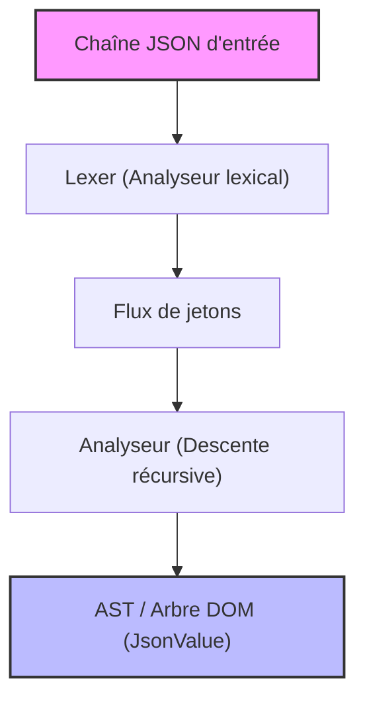
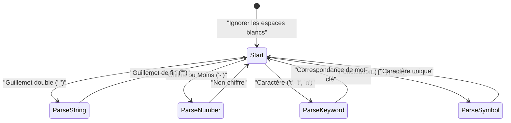

Dans le développement web et la communication entre systèmes, le langage de description de données le plus utilisé aujourd'hui est sans aucun doute **JSON (JavaScript Object Notation)**. Il existe déjà d'excellents analyseurs JSON très rapides comme `RapidJSON` ou `simdjson`. Bien que vous ayez rarement l'occasion d'utiliser un analyseur fait maison en production dans votre travail, **"créer un analyseur JSON soi-même"** est un excellent exercice pour apprendre l'analyse syntaxique, la gestion de la mémoire, le traitement des chaînes de caractères et l'optimisation des performances.

Dans cet article, nous expliquerons en détail le processus de création d'un analyseur JSON rapide et efficace en mémoire à partir de zéro, en exploitant les fonctionnalités modernes de C++17/C++20 (comme `std::string_view`, `std::variant`, `std::from_chars`, etc.).

---

## 1. Rappel de la spécification JSON (RFC 8259)

La spécification de JSON est strictement définie dans la [RFC 8259](https://tools.ietf.org/html/rfc8259). Pour écrire un analyseur, il faut d'abord comprendre correctement cette spécification.

Les types de données JSON sont limités aux 6 suivants :

1. **Object (Objet)** : Une collection non ordonnée de paires clé-valeur de type chaîne de caractères. Entouré de `{}`, et chaque paire est séparée par `,`.
2. **Array (Tableau)** : Une liste ordonnée de valeurs. Entouré de `[]`, et les valeurs sont séparées par `,`.
3. **String (Chaîne de caractères)** : Une séquence de caractères Unicode entourée de guillemets doubles `""`. Inclut les échappements avec une barre oblique inversée `\`.
4. **Number (Nombre)** : Un nombre entier ou à virgule flottante. L'infini (`Infinity`) et le "non-nombre" (`NaN`) ne sont pas autorisés.
5. **Boolean (Booléen)** : `true` ou `false`.
6. **Null** : `null`.

Selon la spécification, les espaces blancs (Espace, Tabulation horizontale, Saut de ligne, Retour chariot) peuvent être insérés n'importe où entre les jetons (tokens), et nous devons analyser la syntaxe tout en les ignorant.

---

## 2. Architecture de l'analyseur

Le processus d'analyse syntaxique (Parsing) est généralement divisé en deux phases : **l'analyse lexicale (Lexical Analysis)** et **l'analyse syntaxique (Syntactic Analysis)**.



1. **Lexer (Analyseur lexical / Tokenizer)** : Lit la chaîne brute en entrée (tableau de caractères) depuis le début et la divise en "plus petites unités significatives (jetons / tokens)".
2. **Parser (Analyseur syntaxique)** : Lit la séquence de jetons reçue du lexer et construit une structure arborescente (Arbre DOM : Document Object Model) selon les règles grammaticales.

Dans cette implémentation, pour améliorer l'efficacité de la mémoire, le lexer est conçu pour ne pas copier de chaînes de caractères, mais pour conserver un pointeur et une longueur (`std::string_view`) par rapport à la chaîne d'entrée d'origine.

---

## 3. Conception du modèle AST (DOM) et C++ moderne

Pour représenter les différents types de données JSON en C++, nous utilisons `std::variant`, introduit dans C++17. `std::variant` est une union (Union) sûre au niveau du typage, idéale pour représenter des données JSON à typage dynamique.

```cpp
#include <string>
#include <vector>
#include <map>
#include <variant>
#include <memory>
#include <string_view>

// Déclaration anticipée
class JsonValue;

// Définition des types de données JSON
using JsonNull   = std::nullptr_t;
using JsonBool   = bool;
using JsonNumber = double;
using JsonString = std::string;
using JsonArray  = std::vector<JsonValue>;
using JsonObject = std::map<std::string, JsonValue>;

// Utilisation de std::variant pour stocker l'un de ces types
using JsonVariant = std::variant<
    JsonNull,
    JsonBool,
    JsonNumber,
    JsonString,
    JsonArray,
    JsonObject
>;

class JsonValue {
public:
    // Le constructeur par défaut initialise à Null
    JsonValue() : m_value(nullptr) {}
    
    // Constructeur autorisant la conversion implicite depuis chaque type
    template <typename T>
    JsonValue(T&& val) : m_value(std::forward<T>(val)) {}

    // Méthodes d'aide pour vérifier le type
    bool isNull() const { return std::holds_alternative<JsonNull>(m_value); }
    bool isBool() const { return std::holds_alternative<JsonBool>(m_value); }
    bool isNumber() const { return std::holds_alternative<JsonNumber>(m_value); }
    bool isString() const { return std::holds_alternative<JsonString>(m_value); }
    bool isArray() const { return std::holds_alternative<JsonArray>(m_value); }
    bool isObject() const { return std::holds_alternative<JsonObject>(m_value); }

    // Méthode d'aide pour obtenir la valeur
    template <typename T>
    const T& get() const {
        return std::get<T>(m_value);
    }

private:
    JsonVariant m_value;
};
```

En concevant de cette manière, les structures de données récursives comme `JsonArray` et `JsonObject` peuvent être représentées de manière concise et sûre (bien que certaines implémentations de la bibliothèque standard C++ restreignent l'utilisation de types incomplets dans `std::variant`, nécessitant parfois une allocation sur le tas avec des pointeurs intelligents, les compilateurs récents fonctionnent généralement avec le code ci-dessus).

---

## 4. Implémentation du lexer (Analyseur lexical)

Le rôle du lexer est de lire une chaîne de caractères et de la découper en jetons (tokens). Définissons d'abord les types de jetons.

```cpp
enum class TokenType {
    Null,
    True,
    False,
    Number,
    String,
    LBrace,    // {
    RBrace,    // }
    LBracket,  // [
    RBracket,  // ]
    Colon,     // :
    Comma,     // ,
    EndOfFile  // EOF
};

struct Token {
    TokenType type;
    std::string_view value;
};
```

Si nous visualisons la transition d'état interne du lexer avec Mermaid, cela donne ceci :



Le corps de l'implémentation du lexer est le suivant. Tout en ignorant les espaces, il bifurque (avec un `switch` ou `if`) en fonction du caractère actuel.

```cpp
class Lexer {
public:
    explicit Lexer(std::string_view source) : m_source(source), m_position(0) {}

    Token nextToken() {
        skipWhitespace();

        if (isAtEnd()) {
            return { TokenType::EndOfFile, "" };
        }

        char c = peek();

        switch (c) {
            case '{': advance(); return { TokenType::LBrace, "{" };
            case '}': advance(); return { TokenType::RBrace, "}" };
            case '[': advance(); return { TokenType::LBracket, "[" };
            case ']': advance(); return { TokenType::RBracket, "]" };
            case ':': advance(); return { TokenType::Colon, ":" };
            case ',': advance(); return { TokenType::Comma, "," };
            case '"': return lexString();
            default:
                if (c == '-' || std::isdigit(c)) {
                    return lexNumber();
                } else if (std::isalpha(c)) {
                    return lexKeyword();
                }
                throw std::runtime_error("Unexpected character");
        }
    }

private:
    std::string_view m_source;
    size_t m_position;

    bool isAtEnd() const { return m_position >= m_source.length(); }
    char peek() const { return m_source[m_position]; }
    void advance() { m_position++; }

    void skipWhitespace() {
        while (!isAtEnd()) {
            char c = peek();
            if (c == ' ' || c == '\t' || c == '\n' || c == '\r') {
                advance();
            } else {
                break;
            }
        }
    }

    Token lexString() {
        advance(); // Ignorer le guillemet initial
        size_t start = m_position;
        while (!isAtEnd() && peek() != '"') {
            // Le traitement des caractères d'échappement (comme \" ou \\) devrait idéalement être fait ici de manière stricte
            if (peek() == '\\') {
                advance(); // Ignorer la barre oblique inversée d'échappement
            }
            advance();
        }
        
        if (isAtEnd()) throw std::runtime_error("Unterminated string");
        
        std::string_view strVal = m_source.substr(start, m_position - start);
        advance(); // Ignorer le guillemet de fermeture
        return { TokenType::String, strVal };
    }

    Token lexNumber() {
        size_t start = m_position;
        while (!isAtEnd() && (std::isdigit(peek()) || peek() == '.' || peek() == 'e' || peek() == 'E' || peek() == '+' || peek() == '-')) {
            advance();
        }
        return { TokenType::Number, m_source.substr(start, m_position - start) };
    }

    Token lexKeyword() {
        size_t start = m_position;
        while (!isAtEnd() && std::isalpha(peek())) {
            advance();
        }
        std::string_view word = m_source.substr(start, m_position - start);
        
        if (word == "true") return { TokenType::True, word };
        if (word == "false") return { TokenType::False, word };
        if (word == "null") return { TokenType::Null, word };
        
        throw std::runtime_error("Unknown keyword");
    }
};
```

Le point important ici est que les valeurs de chaîne (String) et de nombre (Number) sont extraites en tant que `std::string_view`. Ainsi, **aucune allocation dynamique de mémoire (allocation sur le tas) ni copie ne se produit** au stade du lexer. C'est un choix de conception important directement lié aux performances.

---

## 5. Implémentation de l'analyseur syntaxique (Parser) : Analyse par descente récursive

Une fois le lexer terminé, c'est au tour du parser. La grammaire de JSON étant une grammaire LL(1), elle est parfaitement adaptée à l'**analyse par descente récursive (Recursive Descent Parsing)**, où l'on peut déterminer quelle fonction appeler ensuite simplement en "regardant le jeton actuel".

```cpp
class Parser {
public:
    explicit Parser(std::string_view source) : m_lexer(source) {
        m_currentToken = m_lexer.nextToken();
    }

    JsonValue parse() {
        JsonValue result = parseValue();
        if (m_currentToken.type != TokenType::EndOfFile) {
            throw std::runtime_error("Extra tokens after root element");
        }
        return result;
    }

private:
    Lexer m_lexer;
    Token m_currentToken;

    void consumeToken() {
        m_currentToken = m_lexer.nextToken();
    }

    void expectAndConsume(TokenType expectedType) {
        if (m_currentToken.type != expectedType) {
            throw std::runtime_error("Unexpected token");
        }
        consumeToken();
    }

    JsonValue parseValue() {
        switch (m_currentToken.type) {
            case TokenType::Null:
                consumeToken();
                return JsonValue(nullptr);
            case TokenType::True:
                consumeToken();
                return JsonValue(true);
            case TokenType::False:
                consumeToken();
                return JsonValue(false);
            case TokenType::Number:
                return parseNumber();
            case TokenType::String:
                return parseString();
            case TokenType::LBrace:
                return parseObject();
            case TokenType::LBracket:
                return parseArray();
            default:
                throw std::runtime_error("Invalid value");
        }
    }

    JsonValue parseNumber() {
        std::string_view numStr = m_currentToken.value;
        consumeToken();
        
        double value = 0.0;
        // Analyse rapide avec std::from_chars de C++17
        auto [ptr, ec] = std::from_chars(numStr.data(), numStr.data() + numStr.size(), value);
        if (ec != std::errc()) {
            throw std::runtime_error("Invalid number format");
        }
        return JsonValue(value);
    }

    JsonValue parseString() {
        // Idéalement, c'est ici qu'on décoderait les séquences d'échappement (\n, \uXXXX, etc.)
        // et construirait la std::string réelle.
        std::string str(m_currentToken.value);
        consumeToken();
        return JsonValue(str);
    }

    JsonValue parseArray() {
        consumeToken(); // Consommer '['
        JsonArray array;
        
        if (m_currentToken.type == TokenType::RBracket) {
            consumeToken(); // Tableau vide
            return JsonValue(array);
        }

        while (true) {
            array.push_back(parseValue());
            if (m_currentToken.type == TokenType::Comma) {
                consumeToken();
            } else if (m_currentToken.type == TokenType::RBracket) {
                consumeToken();
                break;
            } else {
                throw std::runtime_error("Expected ',' or ']' in array");
            }
        }
        return JsonValue(array);
    }

    JsonValue parseObject() {
        consumeToken(); // Consommer '{'
        JsonObject object;

        if (m_currentToken.type == TokenType::RBrace) {
            consumeToken(); // Objet vide
            return JsonValue(object);
        }

        while (true) {
            if (m_currentToken.type != TokenType::String) {
                throw std::runtime_error("Expected string key in object");
            }
            
            std::string key(m_currentToken.value);
            consumeToken();
            
            expectAndConsume(TokenType::Colon);
            
            JsonValue value = parseValue();
            object[key] = value;
            
            if (m_currentToken.type == TokenType::Comma) {
                consumeToken();
            } else if (m_currentToken.type == TokenType::RBrace) {
                consumeToken();
                break;
            } else {
                throw std::runtime_error("Expected ',' or '}' in object");
            }
        }
        return JsonValue(object);
    }
};
```

L'analyseur par descente récursive rend le code intuitif et facile à lire, car la structure du code correspond 1:1 à la grammaire (BNF) de JSON. Par exemple, dans `parseObject`, la syntaxe est analysée dans l'ordre suivant : clé (String) -> deux-points (Colon) -> valeur (Value).

---

## 6. Techniques d'optimisation des performances

L'implémentation d'un simple analyseur ne suffit pas pour rivaliser avec les bibliothèques pratiques. Voici quelques techniques d'optimisation spécifiques à C++.

### 6.1. Architecture "Zéro Copie" et `std::string_view`
Le goulot d'étranglement de la plupart des analyseurs réside dans la "copie de chaînes" et "l'allocation dynamique de mémoire sur le tas".
Si vous utilisez souvent `std::string`, une allocation de mémoire se produit chaque fois que vous créez une sous-chaîne. Pour éviter cela, nous avons utilisé de manière exhaustive `std::string_view` dans le lexer.
Le temps de construction de `std::string_view` est de $O(1)$, indépendant de la longueur $L$ de la chaîne.

### 6.2. Optimisation de l'analyse des nombres (`std::from_chars`)
Les fonctions standard telles que `std::stod` ou `sscanf` dépendent des paramètres de la locale (Locale) actuelle. En interne, elles acquièrent des verrous pour l'exclusion mutuelle ou ont un surcoût dû à la localisation.
`std::from_chars`, introduit dans C++17, est indépendant des locales et n'implique aucune copie de mémoire, offrant ainsi des performances exceptionnelles pour l'analyse des nombres. La complexité temporelle est de $O(M)$ où $M$ est le nombre de chiffres.

### 6.3. Allocation de mémoire et `std::pmr` (Polymorphic Memory Resources)
Lors de la construction de l'AST, de nombreuses petites allocations (fragmentation) se produisent en raison de la création de nœuds pour `std::vector` et `std::map`.
Pour éviter cela, il est efficace d'utiliser `std::pmr::monotonic_buffer_resource` de C++17 comme allocateur personnalisé. En allouant d'abord un grand bloc de mémoire une seule fois, puis en avançant simplement un pointeur pour en découper la mémoire, le coût d'allocation devient presque nul.

### 6.4. Utilisation de SIMD (Avancé)
Les analyseurs de pointe comme `simdjson` utilisent des instructions SIMD telles que AVX2 ou NEON pour scanner 32 ou 64 octets de chaînes à la fois. Cela accélère considérablement l'ignorance des espaces ou la recherche de guillemets. Notre implémentation scanne caractère par caractère, mais si vous visez les sommets, la programmation sans branchement (branchless) et le SIMD sont essentiels.

---

## 7. Évaluation de la complexité algorithmique

Évaluons la complexité algorithmique de cet analyseur.
Soit $N$ la longueur totale en octets de la chaîne JSON en entrée.

**Complexité temporelle (Time Complexity) :**
Le lexer se réfère à chaque caractère un nombre constant de fois (généralement une fois), et l'analyseur effectue un traitement en temps constant pour chaque jeton. Aucun retour sur trace (backtracking / relecture) n'a lieu. Par conséquent, la complexité temporelle globale est linéaire.

$$
T(N) = O(N)
$$

**Complexité spatiale (Space Complexity) :**
La mémoire allouée pour construire l'AST (arbre DOM) est proportionnelle au nombre d'éléments dans la chaîne JSON. Même dans le pire des cas (par exemple, un énorme tableau imbriqué `[[[[...]]]]`), la quantité de mémoire requise se limite à un multiple constant qui ne dépasse pas la taille de l'entrée $N$.

$$
Space(N) \le C \times N \implies O(N)
$$

Cependant, dans l'analyse par descente récursive, la pile d'appels (call stack) est consommée proportionnellement à la profondeur (Depth) d'imbrication du JSON. Pour une profondeur $D$, une mémoire de pile de $O(D)$ est requise. Si on lui fournit un JSON malveillant infiniment imbriqué, cela risque de provoquer un débordement de pile (Stack Overflow). Dans un analyseur pratique, il est nécessaire de limiter la profondeur de récursion (par exemple, 256 ou 512) ou de transformer la récursion en boucle.

---

## 8. Conclusion

Dans cet article, nous avons expliqué les étapes pour créer un analyseur JSON à partir de zéro en utilisant C++.
- **Le Lexer** divise la chaîne en jetons, supprimant les copies inutiles avec `std::string_view`.
- **Le Parser** convertit les jetons en AST (`std::variant`) en utilisant l'analyse par descente récursive.
- **Conscient des performances**, on applique `std::from_chars` et des stratégies de gestion de mémoire.

L'expérience de comprendre les spécifications d'un langage et de les traduire en code élèvera vos compétences en tant que programmeur. En vous basant sur cet article, essayez d'étendre votre propre analyseur ou sérialiseur (génération de chaînes JSON) et de relever le défi de nouvelles optimisations (comme l'introduction d'un allocateur personnalisé ou la vectorisation SIMD).
