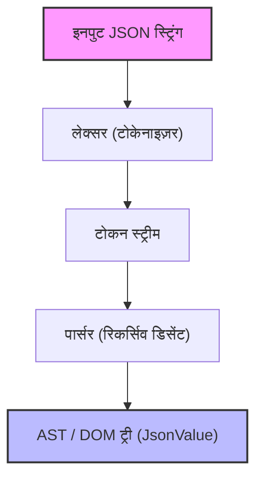
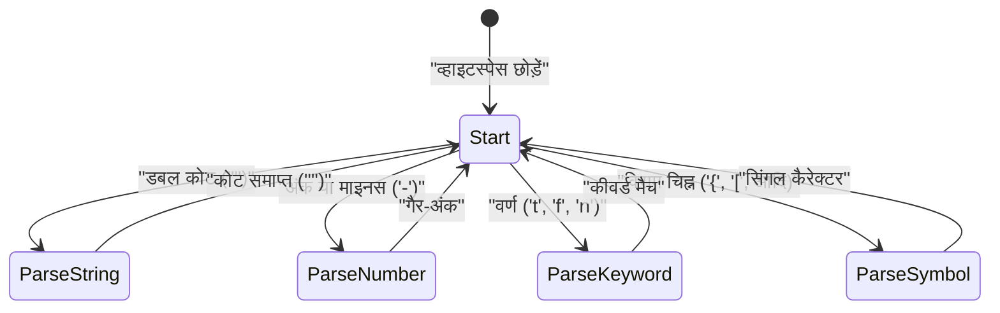

Web development और system-to-system संचार में, वर्तमान में सबसे व्यापक रूप से उपयोग की जाने वाली डेटा विवरण भाषा (data description language) निस्संदेह **JSON (JavaScript Object Notation)** है। दुनिया में `RapidJSON` और `simdjson` जैसे बहुत अच्छे और तेज़ JSON पार्सर पहले से मौजूद हैं। व्यावहारिक रूप से, आपको अपने स्वयं के पार्सर को प्रोडक्शन कोड में उपयोग करने के अवसर कम ही मिल सकते हैं, लेकिन **"अपना खुद का JSON पार्सर बनाना"** सिंटैक्स विश्लेषण (parsing), मेमोरी प्रबंधन, स्ट्रिंग प्रोसेसिंग और परफॉरमेंस ट्यूनिंग सीखने के लिए एक बहुत ही बेहतरीन विषय है।

इस लेख में, हम C++17/C++20 के आधुनिक फीचर्स (जैसे `std::string_view`, `std::variant`, `std::from_chars`) का उपयोग करके खरोंच (scratch) से एक तेज़ और मेमोरी-कुशल JSON पार्सर बनाने की प्रक्रिया को विस्तार से समझाएंगे।

---

## 1. JSON विशिष्टता (RFC 8259) का पुनरावलोकन

JSON की विशिष्टता (specification) [RFC 8259](https://tools.ietf.org/html/rfc8259) में सख्ती से परिभाषित है। पार्सर लिखने के लिए, आपको पहले विशिष्टता को सही ढंग से समझना होगा।

JSON के डेटा प्रकार केवल निम्नलिखित 6 प्रकारों तक सीमित हैं।

1. **Object (ऑब्जेक्ट)**: स्ट्रिंग की (key) और वैल्यू (value) के जोड़ों का एक अव्यवस्थित (unordered) संग्रह। इसे `{}` के अंदर रखा जाता है, और प्रत्येक जोड़े को `,` से अलग किया जाता है।
2. **Array (ऐरे)**: मानों (values) की एक क्रमित (ordered) सूची। इसे `[]` के अंदर रखा जाता है, और मानों को `,` से अलग किया जाता है।
3. **String (स्ट्रिंग)**: डबल कोट्स `""` में संलग्न यूनिकोड वर्णों का एक अनुक्रम (sequence)। इसमें बैकस्लैश `\` के माध्यम से एस्केप वर्ण शामिल हो सकते हैं।
4. **Number (संख्या)**: एक पूर्णांक (integer) या फ्लोटिंग-पॉइंट संख्या। इन्फिनिटी (`Infinity`) और नॉट-ए-नंबर (`NaN`) की अनुमति नहीं है।
5. **Boolean (बूलियन)**: `true` या `false`।
6. **Null**: `null`।

विशिष्टता के अनुसार, खाली स्थान वर्ण (Space, Horizontal Tab, Line Feed, Carriage Return) टोकन के बीच कहीं भी डाले जा सकते हैं, और सिंटैक्स का विश्लेषण करते समय इन्हें अनदेखा किया जाना चाहिए।

---

## 2. पार्सर का आर्किटेक्चर

पार्सिंग (Parsing) प्रक्रिया को आम तौर पर दो चरणों में विभाजित किया जाता है: **लेक्सिकल एनालिसिस (Lexical Analysis)** और **सिंटैक्स एनालिसिस (Syntactic Analysis)**।



1. **लेक्सर (Lexer / Tokenizer)**: यह इनपुट रॉ स्ट्रिंग (कैरेक्टर ऐरे) को शुरुआत से पढ़ता है और इसे "सार्थक न्यूनतम इकाइयों (टोकन)" में विभाजित करता है।
2. **पार्सर (Parser)**: यह लेक्सर से प्राप्त टोकन के अनुक्रम (sequence) को पढ़ता है, और व्याकरण के नियमों के अनुसार एक ट्री संरचना (DOM ट्री: Document Object Model) बनाता है।

इस कार्यान्वयन (implementation) में, मेमोरी दक्षता में सुधार करने के लिए, लेक्सर को इस तरह से डिज़ाइन किया गया है कि यह स्ट्रिंग की प्रतिलिपि (copy) नहीं बनाता है, बल्कि मूल इनपुट स्ट्रिंग के लिए एक पॉइंटर और लंबाई (`std::string_view`) रखता है।

---

## 3. AST (DOM) मॉडल का डिज़ाइन और आधुनिक C++

C++ में विभिन्न JSON डेटा प्रकारों का प्रतिनिधित्व करने के लिए, हम C++17 में पेश किए गए `std::variant` का उपयोग करेंगे। `std::variant` एक प्रकार-सुरक्षित (type-safe) यूनियन (Union) है, जो डायनामिक टाइपिंग वाले JSON डेटा का प्रतिनिधित्व करने के लिए आदर्श है।

```cpp
#include <string>
#include <vector>
#include <map>
#include <variant>
#include <memory>
#include <string_view>

// फॉरवर्ड डिक्लेरेशन (Forward declaration)
class JsonValue;

// JSON डेटा प्रकारों को परिभाषित करें
using JsonNull   = std::nullptr_t;
using JsonBool   = bool;
using JsonNumber = double;
using JsonString = std::string;
using JsonArray  = std::vector<JsonValue>;
using JsonObject = std::map<std::string, JsonValue>;

// std::variant का उपयोग करके किसी भी एक प्रकार को धारण करने की अनुमति दें
using JsonVariant = std::variant<
    JsonNull,
    JsonBool,
    JsonNumber,
    JsonString,
    JsonArray,
    JsonObject
>;

class JsonValue {
public:
    // डिफ़ॉल्ट कंस्ट्रक्टर Null से इनिशियलाइज़ होता है
    JsonValue() : m_value(nullptr) {}
    
    // प्रत्येक प्रकार से अंतर्निहित (implicit) रूपांतरण की अनुमति देने वाला कंस्ट्रक्टर
    template <typename T>
    JsonValue(T&& val) : m_value(std::forward<T>(val)) {}

    // प्रकार जांच के लिए हेल्पर मेथड्स
    bool isNull() const { return std::holds_alternative<JsonNull>(m_value); }
    bool isBool() const { return std::holds_alternative<JsonBool>(m_value); }
    bool isNumber() const { return std::holds_alternative<JsonNumber>(m_value); }
    bool isString() const { return std::holds_alternative<JsonString>(m_value); }
    bool isArray() const { return std::holds_alternative<JsonArray>(m_value); }
    bool isObject() const { return std::holds_alternative<JsonObject>(m_value); }

    // वैल्यू प्राप्त करने के लिए हेल्पर मेथड्स
    template <typename T>
    const T& get() const {
        return std::get<T>(m_value);
    }

private:
    JsonVariant m_value;
};
```

इस तरह से डिज़ाइन करने पर, हम `JsonArray` और `JsonObject` जैसी रिकर्सिव डेटा संरचनाओं को आसानी से और सुरक्षित रूप से व्यक्त कर सकते हैं (हालांकि कुछ C++ मानक लाइब्रेरी के कार्यान्वयन में `std::variant` के भीतर अपूर्ण प्रकारों (incomplete types) के उपयोग पर प्रतिबंध है, जिसके लिए स्मार्ट पॉइंटर्स का उपयोग करके हीप आवंटन (heap allocation) की आवश्यकता हो सकती है, लेकिन नवीनतम कंपाइलरों में ऊपर दिया गया कोड आमतौर पर काम करता है)।

---

## 4. लेक्सर (Lexical Analyzer) का कार्यान्वयन

लेक्सर की भूमिका स्ट्रिंग को पढ़ना और उसे टोकन में काटना है। सबसे पहले, हम टोकन के प्रकारों को परिभाषित करेंगे।

```cpp
enum class TokenType {
    Null,
    True,
    False,
    Number,
    String,
    LBrace,    // {
    RBrace,    // }
    LBracket,  // [
    RBracket,  // ]
    Colon,     // :
    Comma,     // ,
    EndOfFile  // EOF
};

struct Token {
    TokenType type;
    std::string_view value;
};
```

लेक्सर के आंतरिक स्टेट ट्रांज़िशन (state transition) को Mermaid का उपयोग करके इस प्रकार देखा जा सकता है:



लेक्सर का मुख्य कार्यान्वयन इस प्रकार है। रिक्त स्थान को छोड़ते हुए, यह वर्तमान वर्ण (character) के आधार पर शाखाएँ (switch या if स्टेटमेंट के माध्यम से) बनाता है।

```cpp
class Lexer {
public:
    explicit Lexer(std::string_view source) : m_source(source), m_position(0) {}

    Token nextToken() {
        skipWhitespace();

        if (isAtEnd()) {
            return { TokenType::EndOfFile, "" };
        }

        char c = peek();

        switch (c) {
            case '{': advance(); return { TokenType::LBrace, "{" };
            case '}': advance(); return { TokenType::RBrace, "}" };
            case '[': advance(); return { TokenType::LBracket, "[" };
            case ']': advance(); return { TokenType::RBracket, "]" };
            case ':': advance(); return { TokenType::Colon, ":" };
            case ',': advance(); return { TokenType::Comma, "," };
            case '"': return lexString();
            default:
                if (c == '-' || std::isdigit(c)) {
                    return lexNumber();
                } else if (std::isalpha(c)) {
                    return lexKeyword();
                }
                throw std::runtime_error("Unexpected character");
        }
    }

private:
    std::string_view m_source;
    size_t m_position;

    bool isAtEnd() const { return m_position >= m_source.length(); }
    char peek() const { return m_source[m_position]; }
    void advance() { m_position++; }

    void skipWhitespace() {
        while (!isAtEnd()) {
            char c = peek();
            if (c == ' ' || c == '\t' || c == '\n' || c == '\r') {
                advance();
            } else {
                break;
            }
        }
    }

    Token lexString() {
        advance(); // प्रारंभिक कोट छोड़ें
        size_t start = m_position;
        while (!isAtEnd() && peek() != '"') {
            // एस्केप कैरेक्टर्स (जैसे \" या \\) की प्रोसेसिंग यहाँ सख्ती से की जानी चाहिए
            if (peek() == '\\') {
                advance(); // एस्केप बैकस्लैश छोड़ें
            }
            advance();
        }
        
        if (isAtEnd()) throw std::runtime_error("Unterminated string");
        
        std::string_view strVal = m_source.substr(start, m_position - start);
        advance(); // क्लोजिंग कोट छोड़ें
        return { TokenType::String, strVal };
    }

    Token lexNumber() {
        size_t start = m_position;
        while (!isAtEnd() && (std::isdigit(peek()) || peek() == '.' || peek() == 'e' || peek() == 'E' || peek() == '+' || peek() == '-')) {
            advance();
        }
        return { TokenType::Number, m_source.substr(start, m_position - start) };
    }

    Token lexKeyword() {
        size_t start = m_position;
        while (!isAtEnd() && std::isalpha(peek())) {
            advance();
        }
        std::string_view word = m_source.substr(start, m_position - start);
        
        if (word == "true") return { TokenType::True, word };
        if (word == "false") return { TokenType::False, word };
        if (word == "null") return { TokenType::Null, word };
        
        throw std::runtime_error("Unknown keyword");
    }
};
```

यहाँ मुख्य बात यह है कि हम स्ट्रिंग (String) और संख्या (Number) के मानों को `std::string_view` के रूप में निकालते हैं। परिणामस्वरूप, लेक्सर चरण के दौरान **कोई डायनामिक मेमोरी एलोकेशन (हीप एलोकेशन) या कॉपी नहीं होती है**। यह एक महत्वपूर्ण डिज़ाइन है जो सीधे प्रदर्शन (performance) को प्रभावित करता है।

---

## 5. सिंटैक्स एनालाइज़र (पार्सर) का कार्यान्वयन: रिकर्सिव डिसेंट पार्सिंग

लेक्सर के पूरा होने के बाद, अगला कदम पार्सर है। चूंकि JSON का व्याकरण LL(1) व्याकरण है, यह **रिकर्सिव डिसेंट पार्सिंग (Recursive Descent Parsing)** के लिए अत्यधिक उपयुक्त है, जहां आप "केवल वर्तमान टोकन को देखकर" यह तय कर सकते हैं कि आगे किस फ़ंक्शन को कॉल करना है।

```cpp
class Parser {
public:
    explicit Parser(std::string_view source) : m_lexer(source) {
        m_currentToken = m_lexer.nextToken();
    }

    JsonValue parse() {
        JsonValue result = parseValue();
        if (m_currentToken.type != TokenType::EndOfFile) {
            throw std::runtime_error("Extra tokens after root element");
        }
        return result;
    }

private:
    Lexer m_lexer;
    Token m_currentToken;

    void consumeToken() {
        m_currentToken = m_lexer.nextToken();
    }

    void expectAndConsume(TokenType expectedType) {
        if (m_currentToken.type != expectedType) {
            throw std::runtime_error("Unexpected token");
        }
        consumeToken();
    }

    JsonValue parseValue() {
        switch (m_currentToken.type) {
            case TokenType::Null:
                consumeToken();
                return JsonValue(nullptr);
            case TokenType::True:
                consumeToken();
                return JsonValue(true);
            case TokenType::False:
                consumeToken();
                return JsonValue(false);
            case TokenType::Number:
                return parseNumber();
            case TokenType::String:
                return parseString();
            case TokenType::LBrace:
                return parseObject();
            case TokenType::LBracket:
                return parseArray();
            default:
                throw std::runtime_error("Invalid value");
        }
    }

    JsonValue parseNumber() {
        std::string_view numStr = m_currentToken.value;
        consumeToken();
        
        double value = 0.0;
        // तेज़ी से पार्स करने के लिए C++17 के std::from_chars का उपयोग करें
        auto [ptr, ec] = std::from_chars(numStr.data(), numStr.data() + numStr.size(), value);
        if (ec != std::errc()) {
            throw std::runtime_error("Invalid number format");
        }
        return JsonValue(value);
    }

    JsonValue parseString() {
        // आदर्श रूप से, यहाँ एस्केप सीक्वेंस (\n, \uXXXX, आदि) को डीकोड किया जाना चाहिए,
        // और वास्तविक std::string का निर्माण किया जाना चाहिए।
        std::string str(m_currentToken.value);
        consumeToken();
        return JsonValue(str);
    }

    JsonValue parseArray() {
        consumeToken(); // '[' का उपयोग करें
        JsonArray array;
        
        if (m_currentToken.type == TokenType::RBracket) {
            consumeToken(); // खाली ऐरे
            return JsonValue(array);
        }

        while (true) {
            array.push_back(parseValue());
            if (m_currentToken.type == TokenType::Comma) {
                consumeToken();
            } else if (m_currentToken.type == TokenType::RBracket) {
                consumeToken();
                break;
            } else {
                throw std::runtime_error("Expected ',' or ']' in array");
            }
        }
        return JsonValue(array);
    }

    JsonValue parseObject() {
        consumeToken(); // '{' का उपयोग करें
        JsonObject object;

        if (m_currentToken.type == TokenType::RBrace) {
            consumeToken(); // खाली ऑब्जेक्ट
            return JsonValue(object);
        }

        while (true) {
            if (m_currentToken.type != TokenType::String) {
                throw std::runtime_error("Expected string key in object");
            }
            
            std::string key(m_currentToken.value);
            consumeToken();
            
            expectAndConsume(TokenType::Colon);
            
            JsonValue value = parseValue();
            object[key] = value;
            
            if (m_currentToken.type == TokenType::Comma) {
                consumeToken();
            } else if (m_currentToken.type == TokenType::RBrace) {
                consumeToken();
                break;
            } else {
                throw std::runtime_error("Expected ',' or '}' in object");
            }
        }
        return JsonValue(object);
    }
};
```

रिकर्सिव डिसेंट पार्सर का कोड संरचना और JSON व्याकरण (BNF) के बीच वन-टू-वन (1-to-1) संबंध होता है, जिससे कोड सहज (intuitive) और पढ़ने में आसान हो जाता है। उदाहरण के लिए, `parseObject` में, सिंटैक्स को की (String) -> कोलन (Colon) -> वैल्यू (Value) के क्रम में पार्स किया जाता है।

---

## 6. प्रदर्शन अनुकूलन (Performance Optimization) तकनीकें

केवल एक साधारण पार्सर लागू करना एक व्यावहारिक (practical) लाइब्रेरी को मात देने के लिए पर्याप्त नहीं है। यहां कुछ C++ विशिष्ट अनुकूलन (optimization) तकनीकें दी गई हैं।

### 6.1. जीरो-कॉपी आर्किटेक्चर और `std::string_view`
पार्सर के प्रदर्शन में अधिकांश रुकावटें "स्ट्रिंग कॉपी करने" और "हीप मेमोरी के डायनामिक एलोकेशन" के कारण होती हैं।
जब आप `std::string` का बहुत अधिक उपयोग करते हैं, तो हर बार सबस्ट्रिंग बनाते समय मेमोरी एलोकेशन होता है। इसे रोकने के लिए, लेक्सर में पूरी तरह से `std::string_view` का उपयोग किया गया है।
`std::string_view` का निर्माण समय स्ट्रिंग की लंबाई $L$ पर निर्भर नहीं करता है और $O(1)$ में पूरा होता है।

### 6.2. संख्या पार्सिंग अनुकूलन (`std::from_chars`)
मानक `std::stod` या `sscanf` वर्तमान लोकेल (Locale) सेटिंग्स पर निर्भर करते हैं, जिसका अर्थ है कि वे आंतरिक रूप से म्युचुअल एक्सक्लूजन (mutual exclusion) के लिए लॉक प्राप्त कर सकते हैं और लोकलाइज़ेशन ओवरहेड (localization overhead) का कारण बन सकते हैं।
C++17 में पेश किया गया `std::from_chars` लोकेल-स्वतंत्र (locale-independent) है और इसमें मेमोरी कॉपी शामिल नहीं है, जिससे यह संख्या पार्सिंग में अत्यधिक प्रदर्शन प्रदान करता है। यदि अंकों की संख्या $M$ है, तो इसकी समय जटिलता (time complexity) $O(M)$ होती है।

### 6.3. मेमोरी एलोकेशन और `std::pmr` (Polymorphic Memory Resources)
AST का निर्माण करते समय, `std::vector` या `std::map` नोड्स के निर्माण के कारण बड़ी संख्या में छोटे एलोकेशन (फ़्रेगमेंटेशन) होते हैं।
इसे रोकने के लिए, कस्टम एलोकेटर के रूप में C++17 के `std::pmr::monotonic_buffer_resource` का उपयोग करना प्रभावी है। चूंकि यह पहले से एक बड़ा मेमोरी ब्लॉक आवंटित करता है और केवल वहां से पॉइंटर को आगे बढ़ाकर मेमोरी काटता है, इसलिए एलोकेशन की लागत लगभग शून्य हो जाती है।

### 6.4. SIMD का उपयोग (Advanced)
`simdjson` जैसे अत्याधुनिक (state-of-the-art) पार्सर AVX2 और NEON जैसे SIMD निर्देशों (instructions) का उपयोग करते हैं, ताकि एक साथ 32-बाइट या 64-बाइट स्ट्रिंग्स को स्कैन किया जा सके। इससे व्हाइटस्पेस छोड़ने और कोटेशन खोजने में काफी तेज़ी आती है। इस लेख में कार्यान्वयन वर्ण-दर-वर्ण (character-by-character) स्कैनिंग पर आधारित है, लेकिन यदि आप सर्वोच्च प्रदर्शन (peak performance) प्राप्त करना चाहते हैं, तो ब्रांचलेस प्रोग्रामिंग और SIMD आवश्यक हैं।

---

## 7. जटिलता (Complexity) और एल्गोरिथ्म का मूल्यांकन

हम इस पार्सर की एल्गोरिथम जटिलता का मूल्यांकन करेंगे।
मान लें कि इनपुट JSON स्ट्रिंग की कुल लंबाई $N$ बाइट्स है।

**समय जटिलता (Time Complexity):**
लेक्सर प्रत्येक वर्ण को केवल एक निश्चित समय (आमतौर पर 1 बार) संदर्भित करता है, और पार्सर प्रत्येक टोकन के लिए एक निश्चित समय तक काम करता है। कोई बैकट्रैकिंग (दोबारा पढ़ना) नहीं होती है। इसलिए, समग्र समय जटिलता रैखिक समय (linear time) है।

$$
T(N) = O(N)
$$

**स्थान जटिलता (Space Complexity):**
AST (DOM ट्री) बनाने के लिए आवंटित मेमोरी JSON स्ट्रिंग में तत्वों की संख्या के समानुपाती (proportional) होती है। सबसे खराब स्थिति (उदाहरण के लिए: एक विशाल नेस्टेड ऐरे `[[[[...]]]]`) पर विचार करने पर भी, आवश्यक मेमोरी की मात्रा इनपुट आकार $N$ से अधिक नहीं होगी और यह एक स्थिर गुणक (constant multiple) के भीतर रहेगी।

$$
Space(N) \le C \times N \implies O(N)
$$

हालाँकि, रिकर्सिव डिसेंट पार्सिंग में, JSON की नेस्टिंग की गहराई (Depth) के अनुपात में कॉल स्टैक की खपत होती है। गहराई $D$ के लिए, $O(D)$ स्टैक मेमोरी की आवश्यकता होती है। यदि कोई दुर्भावनापूर्ण (malicious) रूप से अनंत नेस्टेड JSON देता है, तो इससे स्टैक ओवरफ्लो (Stack Overflow) होने का खतरा होता है। इसलिए, एक व्यावहारिक पार्सर में, रिकर्सन की गहराई पर एक ऊपरी सीमा (जैसे 256 या 512) सेट करना, या रिकर्सन को लूप में बदलने का प्रयास करना आवश्यक है।

---

## 8. निष्कर्ष

इस लेख में, हमने बताया कि C++ का उपयोग करके शुरू से (from scratch) अपना खुद का JSON पार्सर कैसे बनाया जाए।
- **लेक्सर** स्ट्रिंग को टोकन में विभाजित करता है, और अनावश्यक कॉपी को रोकने के लिए `std::string_view` का उपयोग किया जाता है।
- **पार्सर** में, टोकन को रिकर्सिव डिसेंट पार्सिंग का उपयोग करके AST (`std::variant`) में बदल दिया जाता है।
- **प्रदर्शन (Performance)** को ध्यान में रखते हुए, `std::from_chars` और मेमोरी प्रबंधन रणनीतियों को लागू किया गया है।

किसी भाषा की विशिष्टता को पढ़ने और उसे कोड में बदलने का अनुभव आपको एक प्रोग्रामर के रूप में कौशल के अगले स्तर तक ले जाता है। इस लेख को एक शुरुआती बिंदु के रूप में उपयोग करते हुए, अपने स्वयं के पार्सर या सीरियलाइज़र (JSON स्ट्रिंग्स बनाना) का विस्तार करने का प्रयास करें, और आगे के अनुकूलन (जैसे कस्टम एलोकेटर्स या SIMD की शुरूआत) की चुनौती लें।
