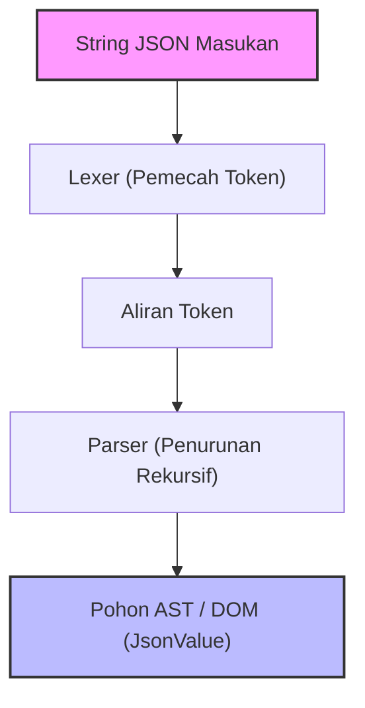
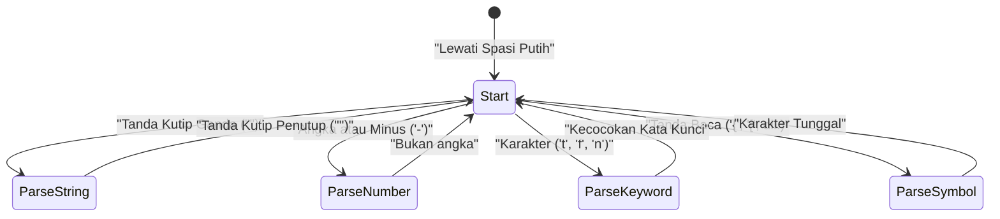

Dalam pengembangan web dan komunikasi antar sistem, bahasa deskripsi data yang paling banyak digunakan saat ini tidak diragukan lagi adalah **JSON (JavaScript Object Notation)**. Di luar sana, parser JSON yang sangat baik dan berkecepatan tinggi seperti `RapidJSON` dan `simdjson` sudah ada. Dalam praktiknya, mungkin hanya ada sedikit kesempatan untuk mengimplementasikan parser buatan sendiri ke dalam kode produksi, tetapi **"membuat parser JSON sendiri"** adalah materi yang sangat baik untuk mempelajari analisis sintaksis, manajemen memori, pemrosesan string, dan penyesuaian kinerja (performance tuning).

Pada artikel ini, kita akan menjelaskan secara detail proses membangun parser JSON yang cepat dan efisien dalam penggunaan memori dari nol, dengan memanfaatkan fitur-fitur modern dari C++17/C++20 (seperti `std::string_view`, `std::variant`, `std::from_chars`, dll).

---

## 1. Tinjauan Spesifikasi JSON (RFC 8259)

Spesifikasi JSON secara ketat didefinisikan dalam [RFC 8259](https://tools.ietf.org/html/rfc8259). Untuk menulis sebuah parser, kita perlu memahami spesifikasinya dengan benar terlebih dahulu.

Tipe data dalam JSON terbatas pada 6 jenis berikut:

1. **Object (Objek)**: Kumpulan pasangan kunci-nilai (key-value) string yang tidak berurutan. Dikelilingi oleh `{}`, dan setiap pasangan dipisahkan oleh `,`.
2. **Array (Larik)**: Daftar nilai yang berurutan. Dikelilingi oleh `[]`, dan setiap nilai dipisahkan oleh `,`.
3. **String (Untai)**: Urutan karakter Unicode yang dikelilingi oleh tanda kutip ganda `""`. Termasuk karakter escape menggunakan garis miring terbalik (backslash) `\`.
4. **Number (Angka)**: Bilangan bulat atau titik mengambang (floating-point). Tak terhingga (`Infinity`) atau bukan angka (`NaN`) tidak diperbolehkan.
5. **Boolean (Nilai kebenaran)**: `true` atau `false`.
6. **Null**: `null`.

Menurut spesifikasinya, karakter spasi putih (Spasi, Tab Horizontal, Line Feed, Carriage Return) dapat disisipkan di mana saja di antara token, dan kita perlu mengabaikan karakter-karakter tersebut saat melakukan analisis sintaksis.

---

## 2. Arsitektur Parser

Proses analisis sintaksis (Parsing) umumnya dibagi menjadi dua fase: **Analisis Leksikal (Lexical Analysis)** dan **Analisis Sintaksis (Syntactic Analysis)**.



1. **Lexer (Pemecah Token / Tokenizer)**: Membaca string mentah (array karakter) yang dimasukkan dari awal dan membaginya menjadi "unit terkecil yang bermakna (token)".
2. **Parser**: Membaca serangkaian token yang diterima dari lexer, dan membangun struktur pohon (Pohon DOM: Document Object Model) sesuai dengan aturan tata bahasa.

Dalam implementasi kali ini, untuk meningkatkan efisiensi memori, lexer dirancang untuk tidak menyalin string, melainkan menyimpan penunjuk (pointer) dan panjang (`std::string_view`) terhadap string masukan aslinya.

---

## 3. Desain Model AST (DOM) dan C++ Modern

Untuk merepresentasikan berbagai tipe data JSON dalam C++, kita akan memanfaatkan `std::variant` yang diperkenalkan pada C++17. `std::variant` adalah union yang aman terhadap tipe (type-safe), sehingga sangat cocok untuk merepresentasikan data JSON yang memiliki pengetikan dinamis.

```cpp
#include <string>
#include <vector>
#include <map>
#include <variant>
#include <memory>
#include <string_view>

// Deklarasi maju
class JsonValue;

// Mendefinisikan tipe data JSON
using JsonNull   = std::nullptr_t;
using JsonBool   = bool;
using JsonNumber = double;
using JsonString = std::string;
using JsonArray  = std::vector<JsonValue>;
using JsonObject = std::map<std::string, JsonValue>;

// Menggunakan std::variant agar dapat menyimpan salah satu dari tipe-tipe ini
using JsonVariant = std::variant<
    JsonNull,
    JsonBool,
    JsonNumber,
    JsonString,
    JsonArray,
    JsonObject
>;

class JsonValue {
public:
    // Konstruktor bawaan diinisialisasi dengan Null
    JsonValue() : m_value(nullptr) {}
    
    // Konstruktor yang mengizinkan konversi implisit dari setiap tipe
    template <typename T>
    JsonValue(T&& val) : m_value(std::forward<T>(val)) {}

    // Metode pembantu untuk pengecekan tipe
    bool isNull() const { return std::holds_alternative<JsonNull>(m_value); }
    bool isBool() const { return std::holds_alternative<JsonBool>(m_value); }
    bool isNumber() const { return std::holds_alternative<JsonNumber>(m_value); }
    bool isString() const { return std::holds_alternative<JsonString>(m_value); }
    bool isArray() const { return std::holds_alternative<JsonArray>(m_value); }
    bool isObject() const { return std::holds_alternative<JsonObject>(m_value); }

    // Metode pembantu untuk mendapatkan nilai
    template <typename T>
    const T& get() const {
        return std::get<T>(m_value);
    }

private:
    JsonVariant m_value;
};
```

Dengan merancang seperti di atas, kita dapat mengekspresikan struktur data rekursif seperti `JsonArray` dan `JsonObject` secara ringkas dan aman (pada beberapa implementasi pustaka standar C++, penggunaan tipe yang tidak lengkap di dalam `std::variant` dibatasi, sehingga terkadang memerlukan alokasi heap menggunakan smart pointer, tetapi kompiler terbaru sering kali dapat menjalankan kode di atas).

---

## 4. Implementasi Lexer (Penganalisis Leksikal)

Peran lexer adalah membaca string dan memotongnya menjadi token. Pertama, mari kita definisikan jenis-jenis tokennya.

```cpp
enum class TokenType {
    Null,
    True,
    False,
    Number,
    String,
    LBrace,    // {
    RBrace,    // }
    LBracket,  // [
    RBracket,  // ]
    Colon,     // :
    Comma,     // ,
    EndOfFile  // EOF
};

struct Token {
    TokenType type;
    std::string_view value;
};
```

Jika kita memvisualisasikan transisi status internal lexer dengan Mermaid, maka akan terlihat seperti berikut ini.



Bodi utama dari implementasi lexer adalah sebagai berikut. Sambil mengabaikan spasi putih, program ini akan melakukan percabangan (pernyataan `switch` atau `if`) berdasarkan karakter saat ini.

```cpp
class Lexer {
public:
    explicit Lexer(std::string_view source) : m_source(source), m_position(0) {}

    Token nextToken() {
        skipWhitespace();

        if (isAtEnd()) {
            return { TokenType::EndOfFile, "" };
        }

        char c = peek();

        switch (c) {
            case '{': advance(); return { TokenType::LBrace, "{" };
            case '}': advance(); return { TokenType::RBrace, "}" };
            case '[': advance(); return { TokenType::LBracket, "[" };
            case ']': advance(); return { TokenType::RBracket, "]" };
            case ':': advance(); return { TokenType::Colon, ":" };
            case ',': advance(); return { TokenType::Comma, "," };
            case '"': return lexString();
            default:
                if (c == '-' || std::isdigit(c)) {
                    return lexNumber();
                } else if (std::isalpha(c)) {
                    return lexKeyword();
                }
                throw std::runtime_error("Karakter tidak terduga");
        }
    }

private:
    std::string_view m_source;
    size_t m_position;

    bool isAtEnd() const { return m_position >= m_source.length(); }
    char peek() const { return m_source[m_position]; }
    void advance() { m_position++; }

    void skipWhitespace() {
        while (!isAtEnd()) {
            char c = peek();
            if (c == ' ' || c == '\t' || c == '\n' || c == '\r') {
                advance();
            } else {
                break;
            }
        }
    }

    Token lexString() {
        advance(); // Lewati tanda kutip awal
        size_t start = m_position;
        while (!isAtEnd() && peek() != '"') {
            // Pemrosesan karakter escape (seperti \" atau \\) seharusnya dilakukan secara ketat di sini
            if (peek() == '\\') {
                advance(); // Lewati backslash escape
            }
            advance();
        }
        
        if (isAtEnd()) throw std::runtime_error("String tidak diakhiri");
        
        std::string_view strVal = m_source.substr(start, m_position - start);
        advance(); // Lewati tanda kutip penutup
        return { TokenType::String, strVal };
    }

    Token lexNumber() {
        size_t start = m_position;
        while (!isAtEnd() && (std::isdigit(peek()) || peek() == '.' || peek() == 'e' || peek() == 'E' || peek() == '+' || peek() == '-')) {
            advance();
        }
        return { TokenType::Number, m_source.substr(start, m_position - start) };
    }

    Token lexKeyword() {
        size_t start = m_position;
        while (!isAtEnd() && std::isalpha(peek())) {
            advance();
        }
        std::string_view word = m_source.substr(start, m_position - start);
        
        if (word == "true") return { TokenType::True, word };
        if (word == "false") return { TokenType::False, word };
        if (word == "null") return { TokenType::Null, word };
        
        throw std::runtime_error("Kata kunci tidak dikenal");
    }
};
```

Poin penting di sini adalah bahwa nilai untai (String) dan angka (Number) diekstrak sebagai `std::string_view`. Akibatnya, pada tahap lexer, **tidak ada alokasi memori dinamis (alokasi heap) atau penyalinan yang terjadi sama sekali**. Ini adalah desain penting yang berhubungan langsung dengan performa.

---

## 5. Implementasi Parser (Penganalisis Sintaksis): Penurunan Rekursif (Recursive Descent)

Setelah lexer selesai, selanjutnya adalah giliran parser. Karena tata bahasa JSON adalah tata bahasa LL(1), ini sangat cocok dengan **Penurunan Rekursif (Recursive Descent Parsing)**, di mana kita dapat menentukan fungsi mana yang harus dipanggil selanjutnya "hanya dengan melihat 1 token saat ini".

```cpp
class Parser {
public:
    explicit Parser(std::string_view source) : m_lexer(source) {
        m_currentToken = m_lexer.nextToken();
    }

    JsonValue parse() {
        JsonValue result = parseValue();
        if (m_currentToken.type != TokenType::EndOfFile) {
            throw std::runtime_error("Token tambahan setelah elemen akar");
        }
        return result;
    }

private:
    Lexer m_lexer;
    Token m_currentToken;

    void consumeToken() {
        m_currentToken = m_lexer.nextToken();
    }

    void expectAndConsume(TokenType expectedType) {
        if (m_currentToken.type != expectedType) {
            throw std::runtime_error("Token tidak terduga");
        }
        consumeToken();
    }

    JsonValue parseValue() {
        switch (m_currentToken.type) {
            case TokenType::Null:
                consumeToken();
                return JsonValue(nullptr);
            case TokenType::True:
                consumeToken();
                return JsonValue(true);
            case TokenType::False:
                consumeToken();
                return JsonValue(false);
            case TokenType::Number:
                return parseNumber();
            case TokenType::String:
                return parseString();
            case TokenType::LBrace:
                return parseObject();
            case TokenType::LBracket:
                return parseArray();
            default:
                throw std::runtime_error("Nilai tidak valid");
        }
    }

    JsonValue parseNumber() {
        std::string_view numStr = m_currentToken.value;
        consumeToken();
        
        double value = 0.0;
        // Menggunakan std::from_chars dari C++17 untuk mem-parse dengan cepat
        auto [ptr, ec] = std::from_chars(numStr.data(), numStr.data() + numStr.size(), value);
        if (ec != std::errc()) {
            throw std::runtime_error("Format angka tidak valid");
        }
        return JsonValue(value);
    }

    JsonValue parseString() {
        // Idealnya, pemrosesan dekode urutan escape (seperti \n, \uXXXX) dilakukan di sini,
        // dan kemudian membangun std::string sebenarnya.
        std::string str(m_currentToken.value);
        consumeToken();
        return JsonValue(str);
    }

    JsonValue parseArray() {
        consumeToken(); // Mengonsumsi '['
        JsonArray array;
        
        if (m_currentToken.type == TokenType::RBracket) {
            consumeToken(); // Array kosong
            return JsonValue(array);
        }

        while (true) {
            array.push_back(parseValue());
            if (m_currentToken.type == TokenType::Comma) {
                consumeToken();
            } else if (m_currentToken.type == TokenType::RBracket) {
                consumeToken();
                break;
            } else {
                throw std::runtime_error("Diharapkan ',' atau ']' di dalam array");
            }
        }
        return JsonValue(array);
    }

    JsonValue parseObject() {
        consumeToken(); // Mengonsumsi '{'
        JsonObject object;

        if (m_currentToken.type == TokenType::RBrace) {
            consumeToken(); // Objek kosong
            return JsonValue(object);
        }

        while (true) {
            if (m_currentToken.type != TokenType::String) {
                throw std::runtime_error("Diharapkan kunci string di dalam objek");
            }
            
            std::string key(m_currentToken.value);
            consumeToken();
            
            expectAndConsume(TokenType::Colon);
            
            JsonValue value = parseValue();
            object[key] = value;
            
            if (m_currentToken.type == TokenType::Comma) {
                consumeToken();
            } else if (m_currentToken.type == TokenType::RBrace) {
                consumeToken();
                break;
            } else {
                throw std::runtime_error("Diharapkan ',' atau '}' di dalam objek");
            }
        }
        return JsonValue(object);
    }
};
```

Parser penurunan rekursif memiliki korespondensi satu-satu (1 banding 1) antara struktur kode dan tata bahasa JSON (BNF), sehingga menghasilkan kode yang intuitif dan mudah dibaca. Sebagai contoh, di dalam `parseObject`, sintaksis dianalisis secara berurutan mulai dari kunci (String) -> titik dua (Colon) -> nilai (Value).

---

## 6. Teknik Optimasi Performa

Jika hanya mengimplementasikan parser sederhana, kita tidak dapat menyaingi pustaka praktis yang ada. Berikut ini kami perkenalkan beberapa teknik optimasi yang menjadi ciri khas C++.

### 6.1. Arsitektur Tanpa Salinan (Zero-Copy) dan `std::string_view`
Sebagian besar kebuntuan (bottleneck) performa parser terdapat pada "penyalinan string" dan "alokasi memori heap dinamis".
Jika kita banyak menggunakan `std::string`, setiap kali membuat sub-string, alokasi memori akan terjadi. Untuk mencegah hal ini, lexer dirancang menggunakan `std::string_view` secara ekstensif.
Waktu pembuatan `std::string_view` tidak bergantung pada panjang string $L$, dan dapat diselesaikan dalam waktu $O(1)$.

### 6.2. Optimasi Parsing Angka (`std::from_chars`)
Fungsi standar `std::stod` dan `sscanf` beroperasi dengan bergantung pada pengaturan lokal (Locale) saat ini, sehingga secara internal hal ini memperoleh kunci (lock) untuk kontrol eksklusif, dan overhead lokalisasi pun terjadi.
Fungsi `std::from_chars` yang diperkenalkan pada C++17 tidak bergantung pada lokal dan tidak melibatkan penyalinan memori, sehingga membanggakan performa luar biasa dalam mem-parse angka. Jika jumlah digit adalah $M$, kompleksitas waktu akan menjadi $O(M)$.

### 6.3. Alokasi Memori dan `std::pmr` (Polymorphic Memory Resources)
Selama pembuatan AST, banyak alokasi memori berukuran kecil (fragmentasi) terjadi karena pembuatan simpul (node) oleh `std::vector` dan `std::map`.
Untuk menghindari hal ini, penggunaan `std::pmr::monotonic_buffer_resource` pada C++17 sebagai alokator khusus akan sangat efektif. Dengan mengalokasikan satu blok memori besar di awal hanya satu kali, kemudian mengambil memori dengan sekadar memajukan pointer (penunjuk) dari blok tersebut, biaya alokasi akan menjadi hampir nol.

### 6.4. Pemanfaatan SIMD (Lanjutan)
Pada parser tercanggih seperti `simdjson`, instruksi SIMD seperti AVX2 dan NEON digunakan untuk memindai 32 bita atau 64 bita string sekaligus. Hal ini secara drastis mempercepat tindakan melewatkan spasi putih atau pencarian tanda kutip. Implementasi pada artikel ini merupakan pemindaian karakter per karakter, namun jika Anda ingin mencapai tingkat performa lebih tinggi lagi, pemrograman tanpa cabang (branchless programming) dan SIMD akan menjadi suatu keharusan.

---

## 7. Evaluasi Kompleksitas dan Algoritma

Mari kita evaluasi kompleksitas algoritma parser ini.
Asumsikan total panjang string JSON yang dimasukkan adalah $N$ bita.

**Kompleksitas Waktu (Time Complexity):**
Lexer merujuk setiap karakter dalam jumlah waktu konstan (biasanya 1 kali), dan parser melakukan jumlah pemrosesan yang konstan untuk setiap token. Pelacakan balik (backtracking atau membaca kembali) sama sekali tidak terjadi. Oleh karena itu, secara keseluruhan kompleksitas waktu akan menjadi waktu linear (linear time).

$$
T(N) = O(N)
$$

**Kompleksitas Ruang (Space Complexity):**
Memori yang dialokasikan untuk membangun pohon AST (DOM) berbanding lurus dengan jumlah elemen dalam string JSON. Meskipun kita mempertimbangkan skenario terburuk (misalnya: array bersarang dalam jumlah besar `[[[[...]]]]`), jumlah memori yang dibutuhkan tetap berada pada kelipatan konstan dan tidak melebihi ukuran masukan $N$.

$$
Space(N) \le C \times N \implies O(N)
$$

Namun, dalam parser penurunan rekursif (recursive descent parsing), memori call stack (tumpukan panggilan) yang dikonsumsi berbanding lurus dengan kedalaman bersarangnya JSON (Depth). Untuk kedalaman $D$, diperlukan memori stack $O(D)$. Karena berisiko menyebabkan Stack Overflow jika diberikan input JSON bersarang tanpa batas yang bersifat berbahaya (malicious), parser yang praktis perlu menetapkan batas atas kedalaman rekursi (misalnya: 256 atau 512), atau menyesuaikan alurnya dengan mengubah rekursi menjadi perulangan (loop).

---

## 8. Kesimpulan

Pada artikel ini, kita telah menjelaskan langkah-langkah untuk membuat parser JSON sendiri dari nol menggunakan C++.
- Menggunakan **lexer** untuk membagi string menjadi token, dan mengurangi penyalinan yang sia-sia dengan `std::string_view`.
- Menggunakan penurunan rekursif (recursive descent) pada **parser** untuk mengubah token menjadi AST (`std::variant`).
- Memperhatikan **performa** dengan menerapkan `std::from_chars` dan strategi manajemen memori.

Pengalaman dalam membaca dan memahami spesifikasi sebuah bahasa kemudian mengubahnya menjadi kode akan meningkatkan keahlian (skill) Anda sebagai seorang programmer. Kami harap Anda menggunakan artikel ini sebagai pijakan (batu loncatan) untuk mengembangkan parser atau serializer (pembangkit string JSON) Anda sendiri, dan menantang diri Anda untuk melakukan optimasi lebih lanjut (seperti memperkenalkan alokator kustom atau integrasi SIMD).
