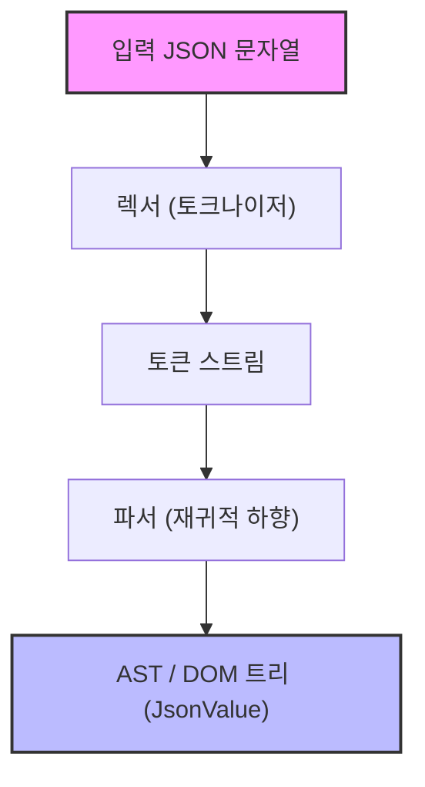
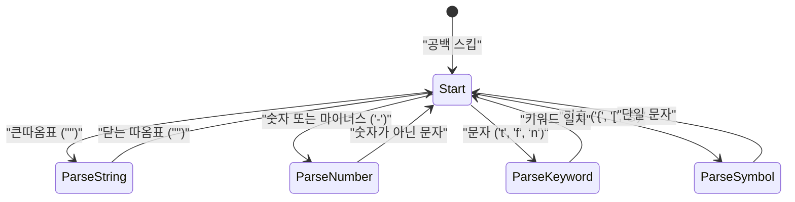

웹 개발이나 시스템 간 통신에서 현재 가장 널리 사용되는 데이터 기술 언어라고 하면 단연코 **JSON (JavaScript Object Notation)**일 것입니다. 세상에는 `RapidJSON`이나 `simdjson` 같은 매우 우수하고 빠른 JSON 파서가 이미 존재합니다. 실무에서 직접 만든 파서를 프로덕션 코드에 투입할 기회는 적을지 모르지만, **"JSON 파서를 직접 만들어 보는 것"**은 구문 분석, 메모리 관리, 문자열 처리, 그리고 성능 튜닝을 배우는 데 있어 매우 훌륭한 주제입니다.

본 기사에서는 C++17/C++20의 모던 기능(`std::string_view`, `std::variant`, `std::from_chars` 등)을 십분 활용하여, 빠르고 메모리 효율이 높은 JSON 파서를 처음부터 구축하는 과정을 상세히 해설합니다.

---

## 1. JSON 사양(RFC 8259) 복습

JSON의 사양은 [RFC 8259](https://tools.ietf.org/html/rfc8259)에 엄밀하게 정의되어 있습니다. 파서를 작성하기 위해서는 먼저 사양을 올바르게 이해할 필요가 있습니다.

JSON의 데이터 타입은 다음 6가지로 제한됩니다.

1. **Object (객체)**: 문자열 키와 값 쌍의 순서 없는 집합. `{}`로 둘러싸이며, 각 쌍은 `,`로 구분됩니다.
2. **Array (배열)**: 값의 순서가 있는 목록. `[]`로 둘러싸이며, 값은 `,`로 구분됩니다.
3. **String (문자열)**: 큰따옴표 `""`로 둘러싸인 유니코드 문자 시퀀스. 백슬래시 `\`에 의한 이스케이프를 포함합니다.
4. **Number (숫자)**: 정수 또는 부동소수점 수. 무한대(`Infinity`)나 비수(`NaN`)는 허용되지 않습니다.
5. **Boolean (진릿값)**: `true` 또는 `false`.
6. **Null**: `null`.

사양상 공백 문자(Space, Horizontal Tab, Line Feed, Carriage Return)는 토큰 사이의 임의의 위치에 삽입될 수 있으며, 이들을 무시하면서 구문을 분석해야 합니다.

---

## 2. 파서의 아키텍처

구문 분석(Parsing) 과정은 일반적으로 **어휘 분석(Lexical Analysis)**과 **구문 분석(Syntactic Analysis)**이라는 두 가지 단계로 나뉩니다.



1. **렉서(Lexer / Tokenizer)**: 입력된 원시 문자열(문자 배열)을 처음부터 읽어 들여 "의미 있는 최소 단위(토큰)"로 분할합니다.
2. **파서(Parser)**: 렉서로부터 받은 토큰 열을 읽어 들여, 문법 규칙에 따라 트리 구조(DOM 트리: Document Object Model)를 구축합니다.

이번 구현에서는 메모리 효율을 높이기 위해, 렉서는 문자열을 복사하지 않고 원본 입력 문자열에 대한 포인터와 길이(`std::string_view`)를 유지하도록 설계합니다.

---

## 3. AST (DOM) 모델의 설계와 모던 C++

C++에서 JSON의 각종 데이터 타입을 표현하기 위해, C++17에 도입된 `std::variant`를 활용합니다. `std::variant`는 타입 안전한 공용체(Union)이며, 동적 타이핑을 갖는 JSON 데이터 표현에 최적입니다.

```cpp
#include <string>
#include <vector>
#include <map>
#include <variant>
#include <memory>
#include <string_view>

// 전방 선언
class JsonValue;

// JSON 데이터 타입 정의
using JsonNull   = std::nullptr_t;
using JsonBool   = bool;
using JsonNumber = double;
using JsonString = std::string;
using JsonArray  = std::vector<JsonValue>;
using JsonObject = std::map<std::string, JsonValue>;

// std::variant를 사용하여 어느 하나라도 유지할 수 있도록 함
using JsonVariant = std::variant<
    JsonNull,
    JsonBool,
    JsonNumber,
    JsonString,
    JsonArray,
    JsonObject
>;

class JsonValue {
public:
    // 기본 생성자는 Null로 초기화
    JsonValue() : m_value(nullptr) {}
    
    // 각 타입으로부터의 암시적 변환을 허용하는 생성자
    template <typename T>
    JsonValue(T&& val) : m_value(std::forward<T>(val)) {}

    // 타입 판별 헬퍼 메서드
    bool isNull() const { return std::holds_alternative<JsonNull>(m_value); }
    bool isBool() const { return std::holds_alternative<JsonBool>(m_value); }
    bool isNumber() const { return std::holds_alternative<JsonNumber>(m_value); }
    bool isString() const { return std::holds_alternative<JsonString>(m_value); }
    bool isArray() const { return std::holds_alternative<JsonArray>(m_value); }
    bool isObject() const { return std::holds_alternative<JsonObject>(m_value); }

    // 값 가져오기 헬퍼 메서드
    template <typename T>
    const T& get() const {
        return std::get<T>(m_value);
    }

private:
    JsonVariant m_value;
};
```

위와 같이 설계함으로써, 재귀적인 데이터 구조인 `JsonArray`나 `JsonObject`를 간결하고 안전하게 표현할 수 있습니다(일부 C++ 표준 라이브러리 구현에서는 `std::variant` 내에서 불완전한 타입의 사용이 제한될 수 있어 스마트 포인터를 이용한 힙 할당이 필요한 경우도 있지만, 최신 컴파일러에서는 위 코드로 동작하는 경우가 많습니다).

---

## 4. 렉서(어휘 분석기)의 구현

렉서의 역할은 문자열을 읽어 토큰으로 잘라내는 것입니다. 먼저 토큰의 종류를 정의합니다.

```cpp
enum class TokenType {
    Null,
    True,
    False,
    Number,
    String,
    LBrace,    // {
    RBrace,    // }
    LBracket,  // [
    RBracket,  // ]
    Colon,     // :
    Comma,     // ,
    EndOfFile  // EOF
};

struct Token {
    TokenType type;
    std::string_view value;
};
```

렉서의 내부 상태 전이를 Mermaid로 시각화하면 다음과 같습니다.



렉서의 구현 본체는 다음과 같습니다. 공백을 스킵하면서 현재 문자에 따라 분기(switch 문 또는 if 문)를 수행합니다.

```cpp
class Lexer {
public:
    explicit Lexer(std::string_view source) : m_source(source), m_position(0) {}

    Token nextToken() {
        skipWhitespace();

        if (isAtEnd()) {
            return { TokenType::EndOfFile, "" };
        }

        char c = peek();

        switch (c) {
            case '{': advance(); return { TokenType::LBrace, "{" };
            case '}': advance(); return { TokenType::RBrace, "}" };
            case '[': advance(); return { TokenType::LBracket, "[" };
            case ']': advance(); return { TokenType::RBracket, "]" };
            case ':': advance(); return { TokenType::Colon, ":" };
            case ',': advance(); return { TokenType::Comma, "," };
            case '"': return lexString();
            default:
                if (c == '-' || std::isdigit(c)) {
                    return lexNumber();
                } else if (std::isalpha(c)) {
                    return lexKeyword();
                }
                throw std::runtime_error("Unexpected character");
        }
    }

private:
    std::string_view m_source;
    size_t m_position;

    bool isAtEnd() const { return m_position >= m_source.length(); }
    char peek() const { return m_source[m_position]; }
    void advance() { m_position++; }

    void skipWhitespace() {
        while (!isAtEnd()) {
            char c = peek();
            if (c == ' ' || c == '\t' || c == '\n' || c == '\r') {
                advance();
            } else {
                break;
            }
        }
    }

    Token lexString() {
        advance(); // 초기 따옴표 스킵
        size_t start = m_position;
        while (!isAtEnd() && peek() != '"') {
            // 이스케이프 문자(\" 나 \\ 등)의 처리는 본래 여기서 엄밀하게 수행함
            if (peek() == '\\') {
                advance(); // 이스케이프 백슬래시 스킵
            }
            advance();
        }
        
        if (isAtEnd()) throw std::runtime_error("Unterminated string");
        
        std::string_view strVal = m_source.substr(start, m_position - start);
        advance(); // 닫는 따옴표 스킵
        return { TokenType::String, strVal };
    }

    Token lexNumber() {
        size_t start = m_position;
        while (!isAtEnd() && (std::isdigit(peek()) || peek() == '.' || peek() == 'e' || peek() == 'E' || peek() == '+' || peek() == '-')) {
            advance();
        }
        return { TokenType::Number, m_source.substr(start, m_position - start) };
    }

    Token lexKeyword() {
        size_t start = m_position;
        while (!isAtEnd() && std::isalpha(peek())) {
            advance();
        }
        std::string_view word = m_source.substr(start, m_position - start);
        
        if (word == "true") return { TokenType::True, word };
        if (word == "false") return { TokenType::False, word };
        if (word == "null") return { TokenType::Null, word };
        
        throw std::runtime_error("Unknown keyword");
    }
};
```

여기서 포인트는 문자열(String)이나 숫자(Number)의 값을 `std::string_view`로 잘라내고 있다는 점입니다. 이를 통해 렉서 단계에서는 **어떠한 동적 메모리 할당(힙 할당)이나 복사도 발생하지 않습니다**. 이는 성능과 직결되는 중요한 설계입니다.

---

## 5. 구문 분석기(파서)의 구현: 재귀적 하향 구문 분석

렉서가 완성되면 다음은 드디어 파서입니다. JSON의 문법은 LL(1) 문법이기 때문에 "현재 토큰을 1개 보는 것"만으로 다음에 어떤 함수를 호출해야 할지 결정할 수 있는 **재귀적 하향 구문 분석(Recursive Descent Parsing)**과 매우 궁합이 잘 맞습니다.

```cpp
class Parser {
public:
    explicit Parser(std::string_view source) : m_lexer(source) {
        m_currentToken = m_lexer.nextToken();
    }

    JsonValue parse() {
        JsonValue result = parseValue();
        if (m_currentToken.type != TokenType::EndOfFile) {
            throw std::runtime_error("Extra tokens after root element");
        }
        return result;
    }

private:
    Lexer m_lexer;
    Token m_currentToken;

    void consumeToken() {
        m_currentToken = m_lexer.nextToken();
    }

    void expectAndConsume(TokenType expectedType) {
        if (m_currentToken.type != expectedType) {
            throw std::runtime_error("Unexpected token");
        }
        consumeToken();
    }

    JsonValue parseValue() {
        switch (m_currentToken.type) {
            case TokenType::Null:
                consumeToken();
                return JsonValue(nullptr);
            case TokenType::True:
                consumeToken();
                return JsonValue(true);
            case TokenType::False:
                consumeToken();
                return JsonValue(false);
            case TokenType::Number:
                return parseNumber();
            case TokenType::String:
                return parseString();
            case TokenType::LBrace:
                return parseObject();
            case TokenType::LBracket:
                return parseArray();
            default:
                throw std::runtime_error("Invalid value");
        }
    }

    JsonValue parseNumber() {
        std::string_view numStr = m_currentToken.value;
        consumeToken();
        
        double value = 0.0;
        // C++17의 std::from_chars를 사용하여 고속으로 파싱
        auto [ptr, ec] = std::from_chars(numStr.data(), numStr.data() + numStr.size(), value);
        if (ec != std::errc()) {
            throw std::runtime_error("Invalid number format");
        }
        return JsonValue(value);
    }

    JsonValue parseString() {
        // 본래는 여기서 이스케이프 시퀀스(\n, \uXXXX 등)의 디코딩 처리를 수행하고,
        // 실제 std::string을 생성함.
        std::string str(m_currentToken.value);
        consumeToken();
        return JsonValue(str);
    }

    JsonValue parseArray() {
        consumeToken(); // '[' 소비
        JsonArray array;
        
        if (m_currentToken.type == TokenType::RBracket) {
            consumeToken(); // 빈 배열
            return JsonValue(array);
        }

        while (true) {
            array.push_back(parseValue());
            if (m_currentToken.type == TokenType::Comma) {
                consumeToken();
            } else if (m_currentToken.type == TokenType::RBracket) {
                consumeToken();
                break;
            } else {
                throw std::runtime_error("Expected ',' or ']' in array");
            }
        }
        return JsonValue(array);
    }

    JsonValue parseObject() {
        consumeToken(); // '{' 소비
        JsonObject object;

        if (m_currentToken.type == TokenType::RBrace) {
            consumeToken(); // 빈 객체
            return JsonValue(object);
        }

        while (true) {
            if (m_currentToken.type != TokenType::String) {
                throw std::runtime_error("Expected string key in object");
            }
            
            std::string key(m_currentToken.value);
            consumeToken();
            
            expectAndConsume(TokenType::Colon);
            
            JsonValue value = parseValue();
            object[key] = value;
            
            if (m_currentToken.type == TokenType::Comma) {
                consumeToken();
            } else if (m_currentToken.type == TokenType::RBrace) {
                consumeToken();
                break;
            } else {
                throw std::runtime_error("Expected ',' or '}' in object");
            }
        }
        return JsonValue(object);
    }
};
```

재귀적 하향 파서는 코드 구조와 JSON의 문법(BNF)이 1대1로 대응하기 때문에 직관적이고 읽기 쉬운 코드가 됩니다. 예를 들어 `parseObject`에서는 키(String) -> 콜론(Colon) -> 값(Value) 순서로 구문을 분석하고 있습니다.

---

## 6. 성능 최적화 기법

단순한 파서를 구현한 것만으로는 실용적인 라이브러리를 이길 수 없습니다. C++ 특유의 최적화 기법을 몇 가지 소개합니다.

### 6.1. 제로 카피(Zero-Copy) 아키텍처와 `std::string_view`
파서 성능 병목의 대부분은 "문자열 복사"와 "힙 메모리 동적 할당"에 있습니다.
`std::string`을 다용하면 부분 문자열을 만들 때마다 메모리 할당이 발생합니다. 이를 방지하기 위해 렉서에서는 철저하게 `std::string_view`를 사용했습니다.
`std::string_view`의 구축 시간은 문자열 길이 $L$에 의존하지 않고 $O(1)$로 완료됩니다.

### 6.2. 숫자 파싱 최적화 (`std::from_chars`)
표준의 `std::stod`나 `sscanf`는 현재 로케일(Locale) 설정에 의존하여 동작하기 때문에 내부에서 상호 배제를 위한 락(lock)을 획득하거나 지역화 오버헤드가 발생합니다.
C++17에 도입된 `std::from_chars`는 로케일에 독립적이고 메모리 복사가 수반되지 않으므로 숫자 파싱에서 압도적인 성능을 자랑합니다. 시간 복잡도는 자릿수를 $M$이라 할 때 $O(M)$이 됩니다.

### 6.3. 메모리 할당과 `std::pmr` (Polymorphic Memory Resources)
AST 구축 시, `std::vector`나 `std::map`의 노드 생성에 의해 대량의 작은 할당(단편화)이 발생합니다.
이를 회피하기 위해 C++17의 `std::pmr::monotonic_buffer_resource`를 커스텀 할당자로 채택하는 것이 효과적입니다. 사전에 큰 메모리 블록을 한 번만 확보하고, 거기서부터 포인터만 전진시켜 메모리를 잘라내기 때문에 할당 비용이 거의 제로가 됩니다.

### 6.4. SIMD 활용 (Advanced)
`simdjson` 같은 최첨단 파서에서는 AVX2나 NEON 같은 SIMD 명령을 사용하여 한 번에 32바이트나 64바이트의 문자열을 스캔합니다. 이를 통해 공백 스킵이나 따옴표 탐색을 극적으로 고속화하고 있습니다. 본 기사의 구현은 문자 단위의 스캔이지만, 더 높은 경지를 목표로 한다면 브랜치리스(분기 없는) 프로그래밍과 SIMD가 필수가 됩니다.

---

## 7. 계산 복잡도와 알고리즘 평가

본 파서의 알고리즘적 복잡성을 평가합니다.
입력되는 JSON 문자열의 전체 길이를 $N$ 바이트라고 합시다.

**시간 복잡도 (Time Complexity):**
렉서는 각 문자를 상수 번(일반적으로 1번)만 참조하고, 파서는 각 토큰에 대해 상수 번의 처리를 수행합니다. 백트래킹(다시 읽기)은 일절 발생하지 않습니다. 따라서 전체적인 시간 복잡도는 선형 시간이 됩니다.

$$
T(N) = O(N)
$$

**공간 복잡도 (Space Complexity):**
AST(DOM 트리)를 구축하기 위해 확보되는 메모리는 JSON 문자열의 요소 수에 비례합니다. 최악의 경우(예: 거대한 중첩 배열 `[[[[...]]]]`)를 고려해도 필요한 메모리 양은 입력 크기 $N$을 넘지 않는 상수 배 안에 수렴합니다.

$$
Space(N) \le C \times N \implies O(N)
$$

단, 재귀적 하향 구문 분석에서는 JSON의 중첩 깊이(Depth)에 비례하여 콜 스택을 소비합니다. 깊이 $D$에 대해 스택 메모리 $O(D)$가 필요합니다. 악의적인 무한 중첩 JSON이 주어지면 Stack Overflow를 일으킬 위험성이 있으므로, 실용적인 파서에서는 재귀 깊이에 상한(예: 256이나 512 등)을 두거나 재귀를 루프로 전개하는 연구가 필요합니다.

---

## 8. 요약

본 기사에서는 C++를 사용하여 처음부터 JSON 파서를 직접 만드는 절차를 해설했습니다.
- **렉서**를 통해 문자열을 토큰으로 분할하고, `std::string_view`로 불필요한 복사를 억제한다.
- **파서**에서 재귀적 하향 구문 분석을 사용하여 토큰을 AST(`std::variant`)로 변환한다.
- **성능**을 의식하여 `std::from_chars`나 메모리 관리 전략을 적용한다.

언어의 사양을 읽고 이해하며, 그것을 코드로 녹여내는 경험은 프로그래머로서의 기술을 한 단계 끌어올려 줍니다. 이 기사를 발판 삼아, 꼭 여러분의 손으로 독자적인 파서나 시리얼라이저(JSON 문자열 생성)를 확장하고, 더욱 발전된 최적화(커스텀 할당자 도입이나 SIMD화 등)에 도전해 보시기 바랍니다.
