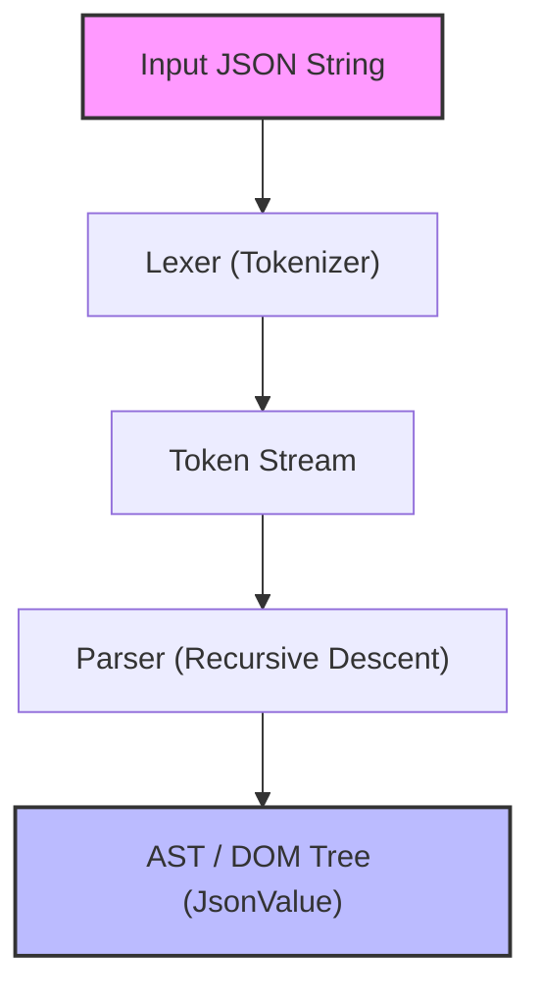
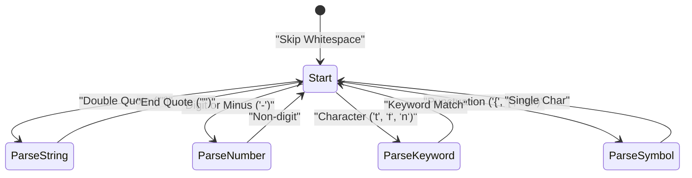

Web開発やシステム間通信において、現在最も広く使われているデータ記述言語といえば、間違いなく **JSON (JavaScript Object Notation)** でしょう。世の中には `RapidJSON` や `simdjson` などの非常に優秀で高速なJSONパーサーが既に存在します。実務において自作のパーサーをプロダクションコードに投入する機会は少ないかもしれませんが、**「JSONパーサーを自作すること」**は、構文解析、メモリ管理、文字列処理、そしてパフォーマンスチューニングを学ぶ上で非常に優れた題材です。

本記事では、C++17/C++20のモダンな機能（`std::string_view`, `std::variant`, `std::from_chars` など）を駆使し、高速かつメモリ効率の高いJSONパーサーをゼロから構築する過程を詳細に解説します。

---

## 1. JSON仕様（RFC 8259）のおさらい

JSONの仕様は [RFC 8259](https://tools.ietf.org/html/rfc8259) で厳密に定義されています。パーサーを書くためには、まず仕様を正しく理解する必要があります。

JSONのデータ型は以下の6種類に限られます。

1. **Object（オブジェクト）**: 文字列のキーと値のペアの順序なし集合。`{}` で囲まれ、各ペアは `,` で区切られます。
2. **Array（配列）**: 値の順序付きリスト。`[]` で囲まれ、値は `,` で区切られます。
3. **String（文字列）**: ダブルクォート `""` で囲まれたUnicode文字のシーケンス。バックスラッシュ `\` によるエスケープを含みます。
4. **Number（数値）**: 整数または浮動小数点数。無限大（`Infinity`）や非数（`NaN`）は許容されていません。
5. **Boolean（真偽値）**: `true` または `false`。
6. **Null**: `null`。

仕様上、空白文字（Space, Horizontal Tab, Line Feed, Carriage Return）は、トークンの間の任意の場所に挿入可能であり、これらを無視しながら構文を解析する必要があります。

---

## 2. パーサーのアーキテクチャ

構文解析（Parsing）のプロセスは、一般的に**字句解析（Lexical Analysis）**と**構文解析（Syntactic Analysis）**の2つのフェーズに分かれます。



1. **レキサー（Lexer / Tokenizer）**: 入力された生の文字列（文字の配列）を先頭から読み込み、「意味のある最小単位（トークン）」に分割します。
2. **パーサー（Parser）**: レキサーから受け取ったトークンの列を読み込み、文法規則に従って木構造（DOMツリー：Document Object Model）を構築します。

今回の実装では、メモリ効率を高めるために、レキサーは文字列のコピーを行わず、元の入力文字列に対するポインタと長さ（`std::string_view`）を保持するように設計します。

---

## 3. AST (DOM) モデルの設計とモダンC++

C++でJSONの各種データ型を表現するために、C++17で導入された `std::variant` を活用します。`std::variant` は型安全な共用体（Union）であり、動的な型付けを持つJSONデータの表現に最適です。

```cpp
#include <string>
#include <vector>
#include <map>
#include <variant>
#include <memory>
#include <string_view>

// 前方宣言
class JsonValue;

// JSONのデータ型を定義
using JsonNull   = std::nullptr_t;
using JsonBool   = bool;
using JsonNumber = double;
using JsonString = std::string;
using JsonArray  = std::vector<JsonValue>;
using JsonObject = std::map<std::string, JsonValue>;

// std::variantを用いて、いずれか1つの型を保持できるようにする
using JsonVariant = std::variant<
    JsonNull,
    JsonBool,
    JsonNumber,
    JsonString,
    JsonArray,
    JsonObject
>;

class JsonValue {
public:
    // デフォルトコンストラクタはNullで初期化
    JsonValue() : m_value(nullptr) {}
    
    // 各型からの暗黙の変換を許可するコンストラクタ
    template <typename T>
    JsonValue(T&& val) : m_value(std::forward<T>(val)) {}

    // 型判定のヘルパーメソッド
    bool isNull() const { return std::holds_alternative<JsonNull>(m_value); }
    bool isBool() const { return std::holds_alternative<JsonBool>(m_value); }
    bool isNumber() const { return std::holds_alternative<JsonNumber>(m_value); }
    bool isString() const { return std::holds_alternative<JsonString>(m_value); }
    bool isArray() const { return std::holds_alternative<JsonArray>(m_value); }
    bool isObject() const { return std::holds_alternative<JsonObject>(m_value); }

    // 値取得のヘルパーメソッド
    template <typename T>
    const T& get() const {
        return std::get<T>(m_value);
    }

private:
    JsonVariant m_value;
};
```

上記のように設計することで、再帰的なデータ構造である `JsonArray` や `JsonObject` を簡潔かつ安全に表現できます（一部のC++標準ライブラリの実装では `std::variant` 内での不完全型の使用が制限されるため、スマートポインタを用いたヒープアロケーションが必要な場合もありますが、最新のコンパイラでは上記で動作することが多いです）。

---

## 4. レキサー（字句解析器）の実装

レキサーの役割は、文字列を読んでトークンに切り出すことです。まずはトークンの種類を定義します。

```cpp
enum class TokenType {
    Null,
    True,
    False,
    Number,
    String,
    LBrace,    // {
    RBrace,    // }
    LBracket,  // [
    RBracket,  // ]
    Colon,     // :
    Comma,     // ,
    EndOfFile  // EOF
};

struct Token {
    TokenType type;
    std::string_view value;
};
```

レキサーの内部状態遷移をMermaidで可視化すると、以下のようになります。



レキサーの実装本体は以下のようになります。空白をスキップしながら、現在の文字に応じて分岐（switch文またはif文）を行います。

```cpp
class Lexer {
public:
    explicit Lexer(std::string_view source) : m_source(source), m_position(0) {}

    Token nextToken() {
        skipWhitespace();

        if (isAtEnd()) {
            return { TokenType::EndOfFile, "" };
        }

        char c = peek();

        switch (c) {
            case '{': advance(); return { TokenType::LBrace, "{" };
            case '}': advance(); return { TokenType::RBrace, "}" };
            case '[': advance(); return { TokenType::LBracket, "[" };
            case ']': advance(); return { TokenType::RBracket, "]" };
            case ':': advance(); return { TokenType::Colon, ":" };
            case ',': advance(); return { TokenType::Comma, "," };
            case '"': return lexString();
            default:
                if (c == '-' || std::isdigit(c)) {
                    return lexNumber();
                } else if (std::isalpha(c)) {
                    return lexKeyword();
                }
                throw std::runtime_error("Unexpected character");
        }
    }

private:
    std::string_view m_source;
    size_t m_position;

    bool isAtEnd() const { return m_position >= m_source.length(); }
    char peek() const { return m_source[m_position]; }
    void advance() { m_position++; }

    void skipWhitespace() {
        while (!isAtEnd()) {
            char c = peek();
            if (c == ' ' || c == '\t' || c == '\n' || c == '\r') {
                advance();
            } else {
                break;
            }
        }
    }

    Token lexString() {
        advance(); // Skip initial quote
        size_t start = m_position;
        while (!isAtEnd() && peek() != '"') {
            // エスケープ文字（\" や \\ など）の処理は本来ここで厳密に行う
            if (peek() == '\\') {
                advance(); // エスケープのバックスラッシュをスキップ
            }
            advance();
        }
        
        if (isAtEnd()) throw std::runtime_error("Unterminated string");
        
        std::string_view strVal = m_source.substr(start, m_position - start);
        advance(); // Skip closing quote
        return { TokenType::String, strVal };
    }

    Token lexNumber() {
        size_t start = m_position;
        while (!isAtEnd() && (std::isdigit(peek()) || peek() == '.' || peek() == 'e' || peek() == 'E' || peek() == '+' || peek() == '-')) {
            advance();
        }
        return { TokenType::Number, m_source.substr(start, m_position - start) };
    }

    Token lexKeyword() {
        size_t start = m_position;
        while (!isAtEnd() && std::isalpha(peek())) {
            advance();
        }
        std::string_view word = m_source.substr(start, m_position - start);
        
        if (word == "true") return { TokenType::True, word };
        if (word == "false") return { TokenType::False, word };
        if (word == "null") return { TokenType::Null, word };
        
        throw std::runtime_error("Unknown keyword");
    }
};
```

ここでのポイントは、文字列（String）や数値（Number）の値を `std::string_view` として切り出している点です。これにより、レキサーの段階では**一切の動的メモリ確保（ヒープアロケーション）やコピーが発生しません**。これはパフォーマンスに直結する重要な設計です。

---

## 5. 構文解析器（パーサー）の実装：再帰的降下構文解析

レキサーが完成したら、次はいよいよパーサーです。JSONの文法はLL(1)文法であるため、「現在のトークンを1つ見るだけ」で次にどの関数を呼び出すべきかを決定できる**再帰的降下構文解析（Recursive Descent Parsing）**と非常に相性が良いです。

```cpp
class Parser {
public:
    explicit Parser(std::string_view source) : m_lexer(source) {
        m_currentToken = m_lexer.nextToken();
    }

    JsonValue parse() {
        JsonValue result = parseValue();
        if (m_currentToken.type != TokenType::EndOfFile) {
            throw std::runtime_error("Extra tokens after root element");
        }
        return result;
    }

private:
    Lexer m_lexer;
    Token m_currentToken;

    void consumeToken() {
        m_currentToken = m_lexer.nextToken();
    }

    void expectAndConsume(TokenType expectedType) {
        if (m_currentToken.type != expectedType) {
            throw std::runtime_error("Unexpected token");
        }
        consumeToken();
    }

    JsonValue parseValue() {
        switch (m_currentToken.type) {
            case TokenType::Null:
                consumeToken();
                return JsonValue(nullptr);
            case TokenType::True:
                consumeToken();
                return JsonValue(true);
            case TokenType::False:
                consumeToken();
                return JsonValue(false);
            case TokenType::Number:
                return parseNumber();
            case TokenType::String:
                return parseString();
            case TokenType::LBrace:
                return parseObject();
            case TokenType::LBracket:
                return parseArray();
            default:
                throw std::runtime_error("Invalid value");
        }
    }

    JsonValue parseNumber() {
        std::string_view numStr = m_currentToken.value;
        consumeToken();
        
        double value = 0.0;
        // C++17の std::from_chars を使用して高速にパース
        auto [ptr, ec] = std::from_chars(numStr.data(), numStr.data() + numStr.size(), value);
        if (ec != std::errc()) {
            throw std::runtime_error("Invalid number format");
        }
        return JsonValue(value);
    }

    JsonValue parseString() {
        // 本来はここでエスケープシーケンス（\n, \uXXXX など）のデコード処理を行い、
        // 実体の std::string を構築する。
        std::string str(m_currentToken.value);
        consumeToken();
        return JsonValue(str);
    }

    JsonValue parseArray() {
        consumeToken(); // '[' を消費
        JsonArray array;
        
        if (m_currentToken.type == TokenType::RBracket) {
            consumeToken(); // 空配列
            return JsonValue(array);
        }

        while (true) {
            array.push_back(parseValue());
            if (m_currentToken.type == TokenType::Comma) {
                consumeToken();
            } else if (m_currentToken.type == TokenType::RBracket) {
                consumeToken();
                break;
            } else {
                throw std::runtime_error("Expected ',' or ']' in array");
            }
        }
        return JsonValue(array);
    }

    JsonValue parseObject() {
        consumeToken(); // '{' を消費
        JsonObject object;

        if (m_currentToken.type == TokenType::RBrace) {
            consumeToken(); // 空オブジェクト
            return JsonValue(object);
        }

        while (true) {
            if (m_currentToken.type != TokenType::String) {
                throw std::runtime_error("Expected string key in object");
            }
            
            std::string key(m_currentToken.value);
            consumeToken();
            
            expectAndConsume(TokenType::Colon);
            
            JsonValue value = parseValue();
            object[key] = value;
            
            if (m_currentToken.type == TokenType::Comma) {
                consumeToken();
            } else if (m_currentToken.type == TokenType::RBrace) {
                consumeToken();
                break;
            } else {
                throw std::runtime_error("Expected ',' or '}' in object");
            }
        }
        return JsonValue(object);
    }
};
```

再帰的降下パーサーは、コードの構造とJSONの文法（BNF）が1対1に対応するため、直感的で読みやすいコードになります。例えば `parseObject` では、キー（String） -> コロン（Colon） -> 値（Value）の順序で構文を解析しています。

---

## 6. パフォーマンス最適化のテクニック

単純なパーサーを実装しただけでは、実用的なライブラリに勝つことはできません。C++ならではの最適化テクニックをいくつか紹介します。

### 6.1. Zero-Copyアーキテクチャと `std::string_view`
パーサーのパフォーマンスボトルネックの大部分は「文字列のコピー」と「ヒープメモリの動的確保」にあります。
`std::string` を多様すると、部分文字列を作るたびにメモリアロケーションが発生します。これを防ぐために、レキサーでは徹底して `std::string_view` を使用しました。
`std::string_view` の構築時間は文字列の長さ $L$ に依存せず $O(1)$ で完了します。

### 6.2. 数値パースの最適化 (`std::from_chars`)
標準の `std::stod` や `sscanf` は、現在のロケール（Locale）設定に依存して動作するため、内部で排他制御用のロックを取得したり、ローカライゼーションのオーバーヘッドが発生したりします。
C++17で導入された `std::from_chars` は、ロケール非依存かつメモリコピーを伴わないため、数値のパースにおいて圧倒的なパフォーマンスを誇ります。時間計算量は桁数を $M$ としたとき $O(M)$ となります。

### 6.3. メモリアロケーションと `std::pmr` (Polymorphic Memory Resources)
ASTの構築時、`std::vector` や `std::map` のノード生成によって大量の小さなアロケーション（フラグメンテーション）が発生します。
これを回避するために、C++17の `std::pmr::monotonic_buffer_resource` をカスタムアロケータとして採用することが有効です。事前に大きなメモリブロックを一度だけ確保し、そこからポインタを進めるだけでメモリを切り出すため、アロケーションコストがほぼゼロになります。

### 6.4. SIMDの活用 (Advanced)
`simdjson` などの最先端のパーサーでは、AVX2やNEONなどのSIMD命令を用いて、一度に32バイトや64バイトの文字列をスキャンします。これにより、空白のスキップやクォーテーションの探索を劇的に高速化しています。本記事の実装は文字単位のスキャンですが、更なる極みを目指す場合はブランチレス（分岐のない）プログラミングとSIMDが必須となります。

---

## 7. 計算量とアルゴリズムの評価

本パーサーのアルゴリズム的な複雑性を評価します。
入力されるJSON文字列の全体の長さを $N$ バイトとします。

**時間計算量 (Time Complexity):**
レキサーは各文字を定数回（通常は1回）だけ参照し、パーサーは各トークンに対して定数回の処理を行います。バックトラッキング（再読み込み）は一切発生しません。したがって、全体的な時間計算量は線形時間となります。

$$
T(N) = O(N)
$$

**空間計算量 (Space Complexity):**
AST（DOMツリー）を構築するために確保されるメモリは、JSON文字列の要素数に比例します。最悪のケース（例：巨大なネスト配列 `[[[[...]]]]`）を考慮しても、必要なメモリ量は入力サイズ $N$ を超えない定数倍に収まります。

$$
Space(N) \le C \times N \implies O(N)
$$

ただし、再帰的降下構文解析では、JSONのネストの深さ（Depth）に比例してコールスタックを消費します。深さ $D$ に対してスタックメモリ $O(D)$ が必要です。悪意のある無限ネストJSONを与えられると Stack Overflow を引き起こす危険性があるため、実用的なパーサーでは、再帰の深さに上限（例: 256や512など）を設けるか、再帰をループに展開する工夫が必要です。

---

## 8. まとめ

本記事では、C++を用いてゼロからJSONパーサーを自作する手順を解説しました。
- **レキサー**によって文字列をトークンに分割し、`std::string_view` で無駄なコピーを抑える。
- **パーサー**で再帰的降下構文解析を用いてトークンをAST（`std::variant`）に変換する。
- **パフォーマンス**を意識して、`std::from_chars` やメモリ管理戦略を適用する。

言語の仕様を読み解き、それをコードに落とし込む経験は、プログラマーとしてのスキルを一段引き上げてくれます。この記事を足掛かりに、ぜひご自身の手で独自のパーサーやシリアライザー（JSON文字列の生成）を拡張し、さらなる最適化（カスタムアロケータの導入やSIMD化など）に挑戦してみてください。
