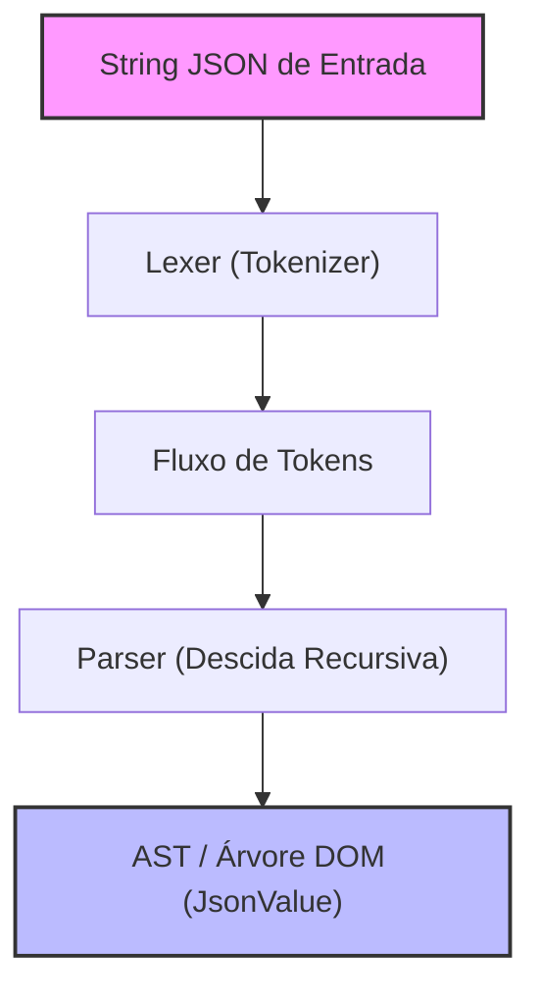
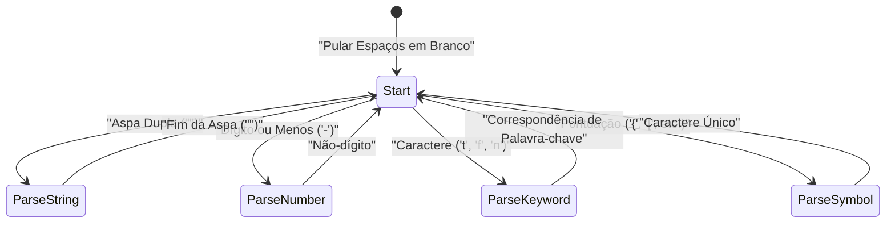

No desenvolvimento web e na comunicação entre sistemas, a linguagem de descrição de dados mais amplamente utilizada hoje é sem dúvida o **JSON (JavaScript Object Notation)**. Já existem no mundo parsers JSON excelentes e de alta velocidade como o `RapidJSON` e o `simdjson`. Embora na prática as oportunidades de implantar um parser criado por você mesmo em código de produção sejam raras, **"criar o próprio parser JSON"** é um excelente material de estudo para aprender sobre análise sintática (parsing), gerenciamento de memória, processamento de strings e otimização de desempenho.

Neste artigo, explicarei detalhadamente o processo de construção do zero de um parser JSON rápido e com alta eficiência de memória, aproveitando os recursos modernos do C++17/C++20 (como `std::string_view`, `std::variant`, `std::from_chars`, etc.).

---

## 1. Revisão da especificação JSON (RFC 8259)

A especificação do JSON é estritamente definida na [RFC 8259](https://tools.ietf.org/html/rfc8259). Para escrever um parser, primeiro você precisa entender corretamente a especificação.

Os tipos de dados do JSON são limitados aos seguintes 6 tipos:

1. **Object (Objeto)**: Uma coleção não ordenada de pares de chave (string) e valor. É cercado por `{}` e cada par é separado por `,`.
2. **Array (Matriz/Arranjo)**: Uma lista ordenada de valores. É cercada por `[]` e os valores são separados por `,`.
3. **String (Cadeia de caracteres)**: Uma sequência de caracteres Unicode cercada por aspas duplas `""`. Inclui escapes com a barra invertida `\`.
4. **Number (Número)**: Número inteiro ou de ponto flutuante. Infinito (`Infinity`) ou não-número (`NaN`) não são permitidos.
5. **Boolean (Booleano)**: `true` ou `false`.
6. **Null (Nulo)**: `null`.

De acordo com a especificação, caracteres de espaço em branco (Space, Horizontal Tab, Line Feed, Carriage Return) podem ser inseridos em qualquer lugar entre os tokens, e é necessário analisar a sintaxe enquanto se ignora esses caracteres.

---

## 2. Arquitetura do Parser

O processo de análise (Parsing) é geralmente dividido em duas fases: **Análise Léxica (Lexical Analysis)** e **Análise Sintática (Syntactic Analysis)**.



1. **Lexer (Analisador Léxico / Tokenizer)**: Lê a string bruta (matriz de caracteres) de entrada a partir do início e a divide em "unidades mínimas com significado (tokens)".
2. **Parser (Analisador Sintático)**: Lê a sequência de tokens recebida do lexer e constrói uma estrutura em árvore (Árvore DOM: Document Object Model) seguindo as regras gramaticais.

Na implementação atual, para aumentar a eficiência de memória, o lexer será projetado de forma a não copiar strings, mantendo um ponteiro e o comprimento (`std::string_view`) da string de entrada original.

---

## 3. Design do modelo AST (DOM) e C++ moderno

Para representar os vários tipos de dados do JSON em C++, utilizaremos o `std::variant`, introduzido no C++17. O `std::variant` é uma união (Union) com segurança de tipos, sendo ideal para representar dados JSON que possuem tipagem dinâmica.

```cpp
#include <string>
#include <vector>
#include <map>
#include <variant>
#include <memory>
#include <string_view>

// Declaração antecipada (Forward declaration)
class JsonValue;

// Definição dos tipos de dados do JSON
using JsonNull   = std::nullptr_t;
using JsonBool   = bool;
using JsonNumber = double;
using JsonString = std::string;
using JsonArray  = std::vector<JsonValue>;
using JsonObject = std::map<std::string, JsonValue>;

// Usando std::variant para permitir manter qualquer um dos tipos
using JsonVariant = std::variant<
    JsonNull,
    JsonBool,
    JsonNumber,
    JsonString,
    JsonArray,
    JsonObject
>;

class JsonValue {
public:
    // O construtor padrão inicializa como Null
    JsonValue() : m_value(nullptr) {}
    
    // Construtor que permite a conversão implícita de cada tipo
    template <typename T>
    JsonValue(T&& val) : m_value(std::forward<T>(val)) {}

    // Métodos auxiliares para verificação de tipo
    bool isNull() const { return std::holds_alternative<JsonNull>(m_value); }
    bool isBool() const { return std::holds_alternative<JsonBool>(m_value); }
    bool isNumber() const { return std::holds_alternative<JsonNumber>(m_value); }
    bool isString() const { return std::holds_alternative<JsonString>(m_value); }
    bool isArray() const { return std::holds_alternative<JsonArray>(m_value); }
    bool isObject() const { return std::holds_alternative<JsonObject>(m_value); }

    // Métodos auxiliares para obtenção de valor
    template <typename T>
    const T& get() const {
        return std::get<T>(m_value);
    }

private:
    JsonVariant m_value;
};
```

Projetando dessa forma, é possível expressar de forma concisa e segura as estruturas de dados recursivas `JsonArray` e `JsonObject` (em algumas implementações da biblioteca padrão do C++, o uso de tipos incompletos dentro de `std::variant` é restrito, podendo exigir a alocação de heap com ponteiros inteligentes, mas em compiladores modernos, o código acima geralmente funciona perfeitamente).

---

## 4. Implementação do Lexer (Analisador Léxico)

O papel do lexer é ler a string e extrair tokens. Primeiro, definiremos os tipos de tokens.

```cpp
enum class TokenType {
    Null,
    True,
    False,
    Number,
    String,
    LBrace,    // {
    RBrace,    // }
    LBracket,  // [
    RBracket,  // ]
    Colon,     // :
    Comma,     // ,
    EndOfFile  // EOF
};

struct Token {
    TokenType type;
    std::string_view value;
};
```

Visualizando as transições de estado internas do lexer com Mermaid, teremos algo assim:



O corpo da implementação do lexer é o seguinte. Ele pula espaços em branco e se ramifica (usando uma instrução switch ou if) dependendo do caractere atual.

```cpp
class Lexer {
public:
    explicit Lexer(std::string_view source) : m_source(source), m_position(0) {}

    Token nextToken() {
        skipWhitespace();

        if (isAtEnd()) {
            return { TokenType::EndOfFile, "" };
        }

        char c = peek();

        switch (c) {
            case '{': advance(); return { TokenType::LBrace, "{" };
            case '}': advance(); return { TokenType::RBrace, "}" };
            case '[': advance(); return { TokenType::LBracket, "[" };
            case ']': advance(); return { TokenType::RBracket, "]" };
            case ':': advance(); return { TokenType::Colon, ":" };
            case ',': advance(); return { TokenType::Comma, "," };
            case '"': return lexString();
            default:
                if (c == '-' || std::isdigit(c)) {
                    return lexNumber();
                } else if (std::isalpha(c)) {
                    return lexKeyword();
                }
                throw std::runtime_error("Unexpected character"); // "Caractere inesperado"
        }
    }

private:
    std::string_view m_source;
    size_t m_position;

    bool isAtEnd() const { return m_position >= m_source.length(); }
    char peek() const { return m_source[m_position]; }
    void advance() { m_position++; }

    void skipWhitespace() {
        while (!isAtEnd()) {
            char c = peek();
            if (c == ' ' || c == '\t' || c == '\n' || c == '\r') {
                advance();
            } else {
                break;
            }
        }
    }

    Token lexString() {
        advance(); // Pula a aspa inicial
        size_t start = m_position;
        while (!isAtEnd() && peek() != '"') {
            // O tratamento de caracteres de escape (como \" ou \\) deveria ser feito rigorosamente aqui
            if (peek() == '\\') {
                advance(); // Pula a barra invertida do escape
            }
            advance();
        }
        
        if (isAtEnd()) throw std::runtime_error("Unterminated string"); // "String não finalizada"
        
        std::string_view strVal = m_source.substr(start, m_position - start);
        advance(); // Pula a aspa final
        return { TokenType::String, strVal };
    }

    Token lexNumber() {
        size_t start = m_position;
        while (!isAtEnd() && (std::isdigit(peek()) || peek() == '.' || peek() == 'e' || peek() == 'E' || peek() == '+' || peek() == '-')) {
            advance();
        }
        return { TokenType::Number, m_source.substr(start, m_position - start) };
    }

    Token lexKeyword() {
        size_t start = m_position;
        while (!isAtEnd() && std::isalpha(peek())) {
            advance();
        }
        std::string_view word = m_source.substr(start, m_position - start);
        
        if (word == "true") return { TokenType::True, word };
        if (word == "false") return { TokenType::False, word };
        if (word == "null") return { TokenType::Null, word };
        
        throw std::runtime_error("Unknown keyword"); // "Palavra-chave desconhecida"
    }
};
```

O ponto aqui é que os valores de strings (String) e números (Number) são extraídos como `std::string_view`. Com isso, durante a fase do lexer, **não ocorre nenhuma alocação dinâmica de memória (heap allocation) ou cópia**. Trata-se de um design fundamental e diretamente ligado ao desempenho.

---

## 5. Implementação do Parser (Analisador Sintático): Análise Sintática de Descida Recursiva

Após a conclusão do lexer, agora é finalmente a vez do parser. Como a gramática do JSON é uma gramática LL(1), ela combina perfeitamente com a **Análise Sintática de Descida Recursiva (Recursive Descent Parsing)**, na qual é possível decidir qual função chamar em seguida "observando apenas um token atual".

```cpp
class Parser {
public:
    explicit Parser(std::string_view source) : m_lexer(source) {
        m_currentToken = m_lexer.nextToken();
    }

    JsonValue parse() {
        JsonValue result = parseValue();
        if (m_currentToken.type != TokenType::EndOfFile) {
            throw std::runtime_error("Extra tokens after root element"); // "Tokens extras após o elemento raiz"
        }
        return result;
    }

private:
    Lexer m_lexer;
    Token m_currentToken;

    void consumeToken() {
        m_currentToken = m_lexer.nextToken();
    }

    void expectAndConsume(TokenType expectedType) {
        if (m_currentToken.type != expectedType) {
            throw std::runtime_error("Unexpected token"); // "Token inesperado"
        }
        consumeToken();
    }

    JsonValue parseValue() {
        switch (m_currentToken.type) {
            case TokenType::Null:
                consumeToken();
                return JsonValue(nullptr);
            case TokenType::True:
                consumeToken();
                return JsonValue(true);
            case TokenType::False:
                consumeToken();
                return JsonValue(false);
            case TokenType::Number:
                return parseNumber();
            case TokenType::String:
                return parseString();
            case TokenType::LBrace:
                return parseObject();
            case TokenType::LBracket:
                return parseArray();
            default:
                throw std::runtime_error("Invalid value"); // "Valor inválido"
        }
    }

    JsonValue parseNumber() {
        std::string_view numStr = m_currentToken.value;
        consumeToken();
        
        double value = 0.0;
        // Utilizando std::from_chars do C++17 para uma análise (parsing) rápida
        auto [ptr, ec] = std::from_chars(numStr.data(), numStr.data() + numStr.size(), value);
        if (ec != std::errc()) {
            throw std::runtime_error("Invalid number format"); // "Formato de número inválido"
        }
        return JsonValue(value);
    }

    JsonValue parseString() {
        // Originalmente, a decodificação das sequências de escape (\n, \uXXXX, etc.) seria feita aqui,
        // para construir a std::string real.
        std::string str(m_currentToken.value);
        consumeToken();
        return JsonValue(str);
    }

    JsonValue parseArray() {
        consumeToken(); // Consome '['
        JsonArray array;
        
        if (m_currentToken.type == TokenType::RBracket) {
            consumeToken(); // Array vazio
            return JsonValue(array);
        }

        while (true) {
            array.push_back(parseValue());
            if (m_currentToken.type == TokenType::Comma) {
                consumeToken();
            } else if (m_currentToken.type == TokenType::RBracket) {
                consumeToken();
                break;
            } else {
                throw std::runtime_error("Expected ',' or ']' in array"); // "Esperado ',' ou ']' no array"
            }
        }
        return JsonValue(array);
    }

    JsonValue parseObject() {
        consumeToken(); // Consome '{'
        JsonObject object;

        if (m_currentToken.type == TokenType::RBrace) {
            consumeToken(); // Objeto vazio
            return JsonValue(object);
        }

        while (true) {
            if (m_currentToken.type != TokenType::String) {
                throw std::runtime_error("Expected string key in object"); // "Esperada chave de string no objeto"
            }
            
            std::string key(m_currentToken.value);
            consumeToken();
            
            expectAndConsume(TokenType::Colon);
            
            JsonValue value = parseValue();
            object[key] = value;
            
            if (m_currentToken.type == TokenType::Comma) {
                consumeToken();
            } else if (m_currentToken.type == TokenType::RBrace) {
                consumeToken();
                break;
            } else {
                throw std::runtime_error("Expected ',' or '}' in object"); // "Esperado ',' ou '}' no objeto"
            }
        }
        return JsonValue(object);
    }
};
```

O parser de descida recursiva resulta em um código intuitivo e fácil de ler porque a estrutura do código corresponde perfeitamente 1 para 1 com a gramática JSON (BNF). Por exemplo, em `parseObject`, a sintaxe é analisada na ordem: Chave (String) -> Dois-pontos (Colon) -> Valor (Value).

---

## 6. Técnicas de Otimização de Desempenho

Apenas implementar um parser simples não o fará superar as bibliotecas práticas. Apresentarei a seguir algumas técnicas de otimização exclusivas do C++.

### 6.1. Arquitetura Zero-Copy e `std::string_view`
A maior parte do gargalo de desempenho de um parser reside em "cópias de strings" e "alocações dinâmicas de memória no heap".
O uso excessivo de `std::string` causará alocações de memória cada vez que uma substring for criada. Para evitar isso, utilizamos extensivamente `std::string_view` no lexer.
O tempo de construção de um `std::string_view` é concluído em $O(1)$, independentemente do comprimento da string $L$.

### 6.2. Otimização do Parsing de Números (`std::from_chars`)
As funções padrão `std::stod` ou `sscanf` operam dependendo das configurações atuais de localidade (Locale), o que pode resultar na aquisição de travas (locks) para exclusão mútua internamente ou gerar sobrecargas de localização (overhead).
O `std::from_chars` introduzido no C++17 é independente de localidade e não envolve cópia de memória, ostentando portanto um desempenho formidável no parsing de números. A complexidade de tempo é $O(M)$, sendo $M$ o número de dígitos.

### 6.3. Alocação de Memória e `std::pmr` (Polymorphic Memory Resources)
Durante a construção da AST, ocorre uma grande quantidade de pequenas alocações (fragmentação) devido à criação de nós de `std::vector` e `std::map`.
Para evitar isso, é eficaz adotar `std::pmr::monotonic_buffer_resource` do C++17 como um alocador customizado. Ele aloca um grande bloco de memória previamente e de uma só vez; depois disso, a memória é fatiada simplesmente avançando um ponteiro, de forma que o custo de alocação torna-se praticamente zero.

### 6.4. Aproveitando SIMD (Avançado)
Em parsers de última geração como o `simdjson`, são utilizadas instruções SIMD, como AVX2 ou NEON, para rastrear strings de 32 ou 64 bytes de uma só vez. Isso acelera drasticamente o salto de espaços em branco ou a procura por aspas. A implementação deste artigo faz o rastreamento caractere por caractere, mas se você buscar ir ainda mais longe, a programação branchless (sem ramificações) e o uso de SIMD são essenciais.

---

## 7. Avaliação de Complexidade e Algoritmo

Vamos avaliar a complexidade algorítmica deste parser.
Consideramos o comprimento total da string JSON de entrada como $N$ bytes.

**Complexidade de Tempo (Time Complexity):**
O lexer referencia cada caractere um número constante de vezes (geralmente uma), e o parser realiza processamento de tempo constante para cada token. Não há ocorrência de backtracking (releitura). Portanto, a complexidade de tempo global é linear.

$$
T(N) = O(N)
$$

**Complexidade de Espaço (Space Complexity):**
A memória alocada para construir a AST (Árvore DOM) é proporcional à quantidade de elementos na string JSON. Mesmo no pior dos casos (por exemplo: um enorme array aninhado `[[[[...]]]]`), a quantidade de memória necessária permanecerá dentro de um múltiplo constante do tamanho da entrada $N$.

$$
Space(N) \le C \times N \implies O(N)
$$

No entanto, no parsing de descida recursiva, a pilha de chamadas (call stack) é consumida proporcionalmente à profundidade (Depth) de aninhamento do JSON. Uma memória de pilha de $O(D)$ é requerida para uma profundidade $D$. Dado que passar um JSON malicioso aninhado infinitamente tem o risco de causar um Stack Overflow, um parser prático precisa implementar um limite na profundidade de recursão (ex: 256 ou 512) ou desenrolar a recursão em loops.

---

## 8. Conclusão

Neste artigo, explicamos os passos para criar um parser JSON do zero em C++.
- Com o **lexer**, a string é dividida em tokens e a cópia inútil é reduzida usando `std::string_view`.
- No **parser**, usa-se a análise sintática de descida recursiva para converter tokens numa AST (`std::variant`).
- Focando em **desempenho**, aplicações como `std::from_chars` e estratégias de gerenciamento de memória são utilizadas.

A experiência de ler e interpretar uma especificação de linguagem e implementá-la em código elevará suas habilidades como programador. Usando este artigo como ponto de partida, tente estender seu próprio parser ou serializador (geração de strings JSON) e aventurar-se em otimizações ainda maiores (como introduzir um alocador customizado ou implementação de SIMD).
