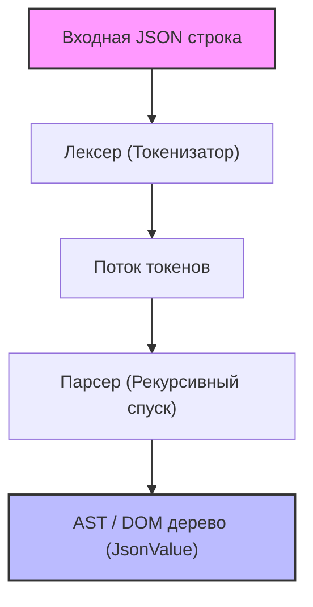
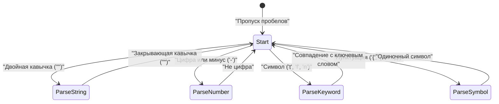

В веб-разработке и межсистемных коммуникациях в настоящее время наиболее широко используемым языком описания данных, несомненно, является **JSON (JavaScript Object Notation)**. В мире уже существуют отличные и очень быстрые парсеры JSON, такие как `RapidJSON` и `simdjson`. На практике возможность внедрения парсера собственной разработки в продакшн-код выпадает редко, но **"создание собственного JSON парсера"** — это превосходная тема для изучения синтаксического анализа, управления памятью, обработки строк и оптимизации производительности.

В этой статье подробно описывается процесс создания быстрого и эффективного с точки зрения использования памяти парсера JSON с нуля, с использованием современных возможностей C++17/C++20 (таких как `std::string_view`, `std::variant`, `std::from_chars`).

---

## 1. Обзор спецификации JSON (RFC 8259)

Спецификация JSON строго определена в [RFC 8259](https://tools.ietf.org/html/rfc8259). Чтобы написать парсер, сначала нужно правильно понять эту спецификацию.

Типы данных в JSON ограничены следующими шестью видами:

1. **Object (Объект)**: Неупорядоченный набор пар ключ-значение, где ключом выступает строка. Заключается в `{}`, а каждая пара разделяется запятой `,`.
2. **Array (Массив)**: Упорядоченный список значений. Заключается в `[]`, а значения разделяются запятой `,`.
3. **String (Строка)**: Последовательность символов Unicode, заключенная в двойные кавычки `""`. Включает экранирование с помощью обратного слеша `\`.
4. **Number (Число)**: Целое число или число с плавающей точкой. Бесконечность (`Infinity`) или не число (`NaN`) не допускаются.
5. **Boolean (Логическое значение)**: `true` или `false`.
6. **Null**: `null`.

Согласно спецификации, пробельные символы (Space, Horizontal Tab, Line Feed, Carriage Return) могут вставляться в любое место между токенами, и при синтаксическом анализе их необходимо игнорировать.

---

## 2. Архитектура парсера

Процесс синтаксического анализа (Parsing) обычно делится на две фазы: **лексический анализ (Lexical Analysis)** и **синтаксический анализ (Syntactic Analysis)**.



1. **Лексер (Lexer / Tokenizer)**: Считывает введенную сырую строку (массив символов) с начала и разделяет ее на "наименьшие значимые единицы (токены)".
2. **Парсер (Parser)**: Считывает последовательность токенов, полученных от лексера, и строит древовидную структуру (DOM дерево: Document Object Model) в соответствии с грамматическими правилами.

В нашей реализации, для повышения эффективности использования памяти, лексер не будет копировать строки, а будет сохранять указатель на исходную входную строку и ее длину (`std::string_view`).

---

## 3. Проектирование модели AST (DOM) и современный C++

Для представления различных типов данных JSON в C++ мы воспользуемся `std::variant`, представленным в C++17. `std::variant` — это типобезопасное объединение (Union), которое идеально подходит для представления данных JSON с динамической типизацией.

```cpp
#include <string>
#include <vector>
#include <map>
#include <variant>
#include <memory>
#include <string_view>

// Предварительное объявление
class JsonValue;

// Определение типов данных JSON
using JsonNull   = std::nullptr_t;
using JsonBool   = bool;
using JsonNumber = double;
using JsonString = std::string;
using JsonArray  = std::vector<JsonValue>;
using JsonObject = std::map<std::string, JsonValue>;

// Использование std::variant для хранения одного из типов
using JsonVariant = std::variant<
    JsonNull,
    JsonBool,
    JsonNumber,
    JsonString,
    JsonArray,
    JsonObject
>;

class JsonValue {
public:
    // Конструктор по умолчанию инициализирует значение как Null
    JsonValue() : m_value(nullptr) {}
    
    // Конструктор, позволяющий неявное преобразование из каждого типа
    template <typename T>
    JsonValue(T&& val) : m_value(std::forward<T>(val)) {}

    // Вспомогательные методы для проверки типа
    bool isNull() const { return std::holds_alternative<JsonNull>(m_value); }
    bool isBool() const { return std::holds_alternative<JsonBool>(m_value); }
    bool isNumber() const { return std::holds_alternative<JsonNumber>(m_value); }
    bool isString() const { return std::holds_alternative<JsonString>(m_value); }
    bool isArray() const { return std::holds_alternative<JsonArray>(m_value); }
    bool isObject() const { return std::holds_alternative<JsonObject>(m_value); }

    // Вспомогательный метод для получения значения
    template <typename T>
    const T& get() const {
        return std::get<T>(m_value);
    }

private:
    JsonVariant m_value;
};
```

Разработав структуру таким образом, мы можем лаконично и безопасно представлять рекурсивные структуры данных, такие как `JsonArray` и `JsonObject` (хотя некоторые реализации стандартной библиотеки C++ ограничивают использование неполных типов внутри `std::variant`, из-за чего может потребоваться выделение памяти в куче с помощью умных указателей, но в современных компиляторах описанный выше код часто работает).

---

## 4. Реализация лексера (лексического анализатора)

Задача лексера — чтение строки и выделение токенов. Сначала определим типы токенов.

```cpp
enum class TokenType {
    Null,
    True,
    False,
    Number,
    String,
    LBrace,    // {
    RBrace,    // }
    LBracket,  // [
    RBracket,  // ]
    Colon,     // :
    Comma,     // ,
    EndOfFile  // EOF
};

struct Token {
    TokenType type;
    std::string_view value;
};
```

Визуализация внутренних переходов состояний лексера с помощью Mermaid выглядит следующим образом:



Основная реализация лексера выглядит так. Мы пропускаем пробелы и выполняем ветвление (оператор switch или if) в зависимости от текущего символа.

```cpp
class Lexer {
public:
    explicit Lexer(std::string_view source) : m_source(source), m_position(0) {}

    Token nextToken() {
        skipWhitespace();

        if (isAtEnd()) {
            return { TokenType::EndOfFile, "" };
        }

        char c = peek();

        switch (c) {
            case '{': advance(); return { TokenType::LBrace, "{" };
            case '}': advance(); return { TokenType::RBrace, "}" };
            case '[': advance(); return { TokenType::LBracket, "[" };
            case ']': advance(); return { TokenType::RBracket, "]" };
            case ':': advance(); return { TokenType::Colon, ":" };
            case ',': advance(); return { TokenType::Comma, "," };
            case '"': return lexString();
            default:
                if (c == '-' || std::isdigit(c)) {
                    return lexNumber();
                } else if (std::isalpha(c)) {
                    return lexKeyword();
                }
                throw std::runtime_error("Unexpected character");
        }
    }

private:
    std::string_view m_source;
    size_t m_position;

    bool isAtEnd() const { return m_position >= m_source.length(); }
    char peek() const { return m_source[m_position]; }
    void advance() { m_position++; }

    void skipWhitespace() {
        while (!isAtEnd()) {
            char c = peek();
            if (c == ' ' || c == '\t' || c == '\n' || c == '\r') {
                advance();
            } else {
                break;
            }
        }
    }

    Token lexString() {
        advance(); // Пропуск начальной кавычки
        size_t start = m_position;
        while (!isAtEnd() && peek() != '"') {
            // Обработка escape-символов (например, \" или \\) должна быть строго реализована здесь
            if (peek() == '\\') {
                advance(); // Пропуск обратного слеша для экранирования
            }
            advance();
        }
        
        if (isAtEnd()) throw std::runtime_error("Unterminated string");
        
        std::string_view strVal = m_source.substr(start, m_position - start);
        advance(); // Пропуск закрывающей кавычки
        return { TokenType::String, strVal };
    }

    Token lexNumber() {
        size_t start = m_position;
        while (!isAtEnd() && (std::isdigit(peek()) || peek() == '.' || peek() == 'e' || peek() == 'E' || peek() == '+' || peek() == '-')) {
            advance();
        }
        return { TokenType::Number, m_source.substr(start, m_position - start) };
    }

    Token lexKeyword() {
        size_t start = m_position;
        while (!isAtEnd() && std::isalpha(peek())) {
            advance();
        }
        std::string_view word = m_source.substr(start, m_position - start);
        
        if (word == "true") return { TokenType::True, word };
        if (word == "false") return { TokenType::False, word };
        if (word == "null") return { TokenType::Null, word };
        
        throw std::runtime_error("Unknown keyword");
    }
};
```

Ключевой момент здесь заключается в том, что значения строк (String) и чисел (Number) извлекаются как `std::string_view`. Благодаря этому на этапе лексера **не происходит никакого динамического выделения памяти в куче (heap allocation) или копирования**. Это важное архитектурное решение, напрямую влияющее на производительность.

---

## 5. Реализация парсера (синтаксического анализатора): Рекурсивный спуск

Когда лексер готов, следующим шагом является парсер. Поскольку грамматика JSON является LL(1)-грамматикой, она отлично сочетается с **синтаксическим анализом методом рекурсивного спуска (Recursive Descent Parsing)**, при котором достаточно «посмотреть только на один текущий токен», чтобы определить, какую функцию вызывать следующей.

```cpp
class Parser {
public:
    explicit Parser(std::string_view source) : m_lexer(source) {
        m_currentToken = m_lexer.nextToken();
    }

    JsonValue parse() {
        JsonValue result = parseValue();
        if (m_currentToken.type != TokenType::EndOfFile) {
            throw std::runtime_error("Extra tokens after root element");
        }
        return result;
    }

private:
    Lexer m_lexer;
    Token m_currentToken;

    void consumeToken() {
        m_currentToken = m_lexer.nextToken();
    }

    void expectAndConsume(TokenType expectedType) {
        if (m_currentToken.type != expectedType) {
            throw std::runtime_error("Unexpected token");
        }
        consumeToken();
    }

    JsonValue parseValue() {
        switch (m_currentToken.type) {
            case TokenType::Null:
                consumeToken();
                return JsonValue(nullptr);
            case TokenType::True:
                consumeToken();
                return JsonValue(true);
            case TokenType::False:
                consumeToken();
                return JsonValue(false);
            case TokenType::Number:
                return parseNumber();
            case TokenType::String:
                return parseString();
            case TokenType::LBrace:
                return parseObject();
            case TokenType::LBracket:
                return parseArray();
            default:
                throw std::runtime_error("Invalid value");
        }
    }

    JsonValue parseNumber() {
        std::string_view numStr = m_currentToken.value;
        consumeToken();
        
        double value = 0.0;
        // Использование std::from_chars из C++17 для быстрого парсинга
        auto [ptr, ec] = std::from_chars(numStr.data(), numStr.data() + numStr.size(), value);
        if (ec != std::errc()) {
            throw std::runtime_error("Invalid number format");
        }
        return JsonValue(value);
    }

    JsonValue parseString() {
        // В идеале здесь должно выполняться декодирование escape-последовательностей (\n, \uXXXX и т.д.),
        // и создаваться фактический std::string.
        std::string str(m_currentToken.value);
        consumeToken();
        return JsonValue(str);
    }

    JsonValue parseArray() {
        consumeToken(); // Потребляем '['
        JsonArray array;
        
        if (m_currentToken.type == TokenType::RBracket) {
            consumeToken(); // Пустой массив
            return JsonValue(array);
        }

        while (true) {
            array.push_back(parseValue());
            if (m_currentToken.type == TokenType::Comma) {
                consumeToken();
            } else if (m_currentToken.type == TokenType::RBracket) {
                consumeToken();
                break;
            } else {
                throw std::runtime_error("Expected ',' or ']' in array");
            }
        }
        return JsonValue(array);
    }

    JsonValue parseObject() {
        consumeToken(); // Потребляем '{'
        JsonObject object;

        if (m_currentToken.type == TokenType::RBrace) {
            consumeToken(); // Пустой объект
            return JsonValue(object);
        }

        while (true) {
            if (m_currentToken.type != TokenType::String) {
                throw std::runtime_error("Expected string key in object");
            }
            
            std::string key(m_currentToken.value);
            consumeToken();
            
            expectAndConsume(TokenType::Colon);
            
            JsonValue value = parseValue();
            object[key] = value;
            
            if (m_currentToken.type == TokenType::Comma) {
                consumeToken();
            } else if (m_currentToken.type == TokenType::RBrace) {
                consumeToken();
                break;
            } else {
                throw std::runtime_error("Expected ',' or '}' in object");
            }
        }
        return JsonValue(object);
    }
};
```

Парсер рекурсивного спуска имеет интуитивно понятный и легко читаемый код, поскольку структура кода однозначно соответствует грамматике JSON (BNF). Например, в `parseObject` синтаксический анализ выполняется в порядке: Ключ (String) -> Двоеточие (Colon) -> Значение (Value).

---

## 6. Методы оптимизации производительности

Простая реализация парсера не сможет превзойти библиотеки, используемые на практике. Вот несколько методов оптимизации, характерных для C++.

### 6.1. Архитектура Zero-Copy и `std::string_view`
Большая часть узких мест производительности парсера связана с "копированием строк" и "динамическим выделением памяти в куче".
Если часто использовать `std::string`, каждый раз при создании подстроки будет происходить выделение памяти. Чтобы предотвратить это, мы использовали `std::string_view` в лексере.
Время создания `std::string_view` не зависит от длины строки $L$ и выполняется за $O(1)$.

### 6.2. Оптимизация парсинга чисел (`std::from_chars`)
Стандартные функции, такие как `std::stod` и `sscanf`, зависят от текущих настроек локали (Locale), из-за чего внутри них могут устанавливаться блокировки для взаимного исключения и возникать накладные расходы на локализацию.
Введенная в C++17 функция `std::from_chars` не зависит от локали и не требует копирования памяти, что обеспечивает невероятную производительность при парсинге чисел. Временная сложность составляет $O(M)$, где $M$ — количество цифр.

### 6.3. Выделение памяти и `std::pmr` (Polymorphic Memory Resources)
При построении AST создание узлов для `std::vector` или `std::map` приводит к большому числу мелких выделений памяти (фрагментации).
Чтобы избежать этого, эффективно использовать `std::pmr::monotonic_buffer_resource` из C++17 в качестве кастомного аллокатора. Он один раз выделяет большой блок памяти заранее и просто сдвигает указатель при необходимости новой памяти, благодаря чему затраты на выделение становятся практически нулевыми.

### 6.4. Использование SIMD (Продвинутый уровень)
В передовых парсерах, таких как `simdjson`, используются инструкции SIMD, например AVX2 или NEON, для сканирования строк блоками по 32 или 64 байта за раз. Это значительно ускоряет пропуск пробелов и поиск кавычек. Реализация в этой статье сканирует символ за символом, но если вы стремитесь к максимальной производительности, программирование без ветвлений (branchless) и SIMD являются обязательными.

---

## 7. Оценка сложности и алгоритма

Оценим алгоритмическую сложность данного парсера.
Пусть $N$ — общая длина входной строки JSON в байтах.

**Временная сложность (Time Complexity):**
Лексер обращается к каждому символу константное количество раз (обычно 1 раз), а парсер выполняет константное количество операций для каждого токена. Откат (перечитывание) не происходит. Таким образом, общая временная сложность является линейной.

$$
T(N) = O(N)
$$

**Пространственная сложность (Space Complexity):**
Память, выделенная для построения AST (DOM дерева), пропорциональна количеству элементов в строке JSON. Даже в худшем случае (например, при огромном количестве вложенных массивов `[[[[...]]]]`) требуемый объем памяти останется в пределах константы, умноженной на размер входных данных $N$.

$$
Space(N) \le C \times N \implies O(N)
$$

Однако при синтаксическом анализе методом рекурсивного спуска стек вызовов потребляется пропорционально глубине (Depth) вложенности JSON. Для глубины $D$ требуется память стека $O(D)$. Передача злонамеренного JSON с бесконечной вложенностью может вызвать переполнение стека (Stack Overflow), поэтому в практических парсерах необходимо установить ограничение на глубину рекурсии (например, 256 или 512) или преобразовать рекурсию в цикл.

---

## 8. Заключение

В этой статье мы рассмотрели шаги по созданию собственного парсера JSON на C++ с нуля.
- **Лексер** разделяет строку на токены, а использование `std::string_view` предотвращает лишнее копирование.
- **Парсер** использует синтаксический анализ методом рекурсивного спуска для преобразования токенов в AST (`std::variant`).
- С учетом **производительности** применяются такие решения, как `std::from_chars` и стратегии управления памятью.

Опыт разбора спецификации языка и ее преобразования в код поднимает навыки программиста на новый уровень. Используя эту статью как отправную точку, попробуйте расширить собственный парсер или сериализатор (генерация строк JSON) и попытаться реализовать дальнейшие оптимизации (например, внедрение кастомного аллокатора или SIMD).
