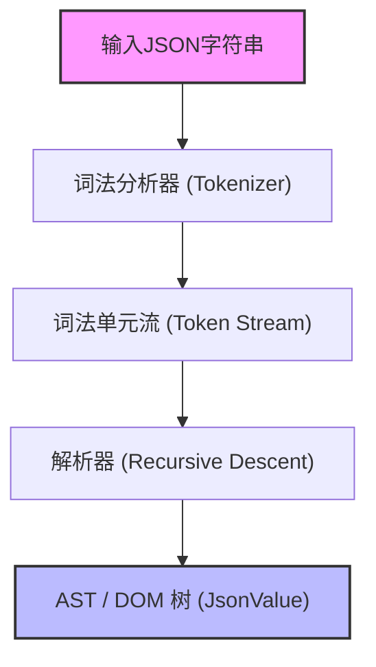
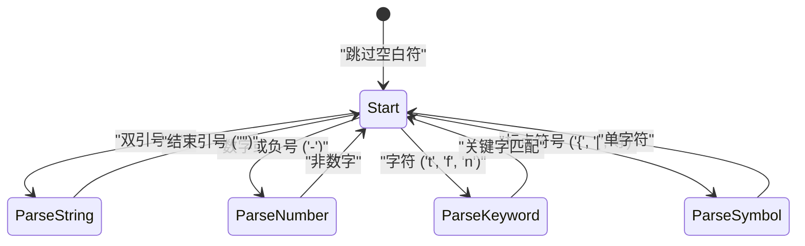

在Web开发和系统间通信中，目前最广泛使用的数据描述语言毫无疑问是 **JSON (JavaScript Object Notation)**。世上已经存在如 `RapidJSON` 和 `simdjson` 等非常优秀且高速的JSON解析器。在实际工作中，将自制的解析器投入生产代码的机会可能很少，但**“自制JSON解析器”**是学习语法解析、内存管理、字符串处理以及性能调优的绝佳题材。

本文将详细讲解如何充分利用C++17/C++20的现代特性（如 `std::string_view`、`std::variant`、`std::from_chars` 等），从零开始构建一个高速且内存高效的JSON解析器的过程。

---

## 1. JSON规范（RFC 8259）回顾

JSON的规范在 [RFC 8259](https://tools.ietf.org/html/rfc8259) 中有严格的定义。为了编写解析器，首先需要正确理解其规范。

JSON的数据类型仅限于以下6种：

1. **Object（对象）**: 字符串键和值对的无序集合。用 `{}` 括起来，每对之间用 `,` 分隔。
2. **Array（数组）**: 值的有序列表。用 `[]` 括起来，值之间用 `,` 分隔。
3. **String（字符串）**: 用双引号 `""` 括起来的Unicode字符序列。包含使用反斜杠 `\` 的转义字符。
4. **Number（数值）**: 整数或浮点数。不允许使用无穷大（`Infinity`）或非数字（`NaN`）。
5. **Boolean（布尔值）**: `true` 或 `false`。
6. **Null**: `null`。

在规范上，空白字符（空格、水平制表符、换行符、回车符）可以插入到词法单元（Token）之间的任意位置，我们需要在忽略这些空白字符的同时解析语法。

---

## 2. 解析器的架构

语法解析（Parsing）的过程通常分为**词法解析（Lexical Analysis）**和**语法解析（Syntactic Analysis）**两个阶段。



1. **词法分析器（Lexer / Tokenizer）**: 从头读取输入的原始字符串（字符数组），将其分割为“有意义的最小单位（Token）”。
2. **解析器（Parser）**: 读取从词法分析器接收到的Token序列，按照语法规则构建树状结构（DOM树：Document Object Model）。

在本次实现中，为了提高内存效率，词法分析器被设计为不进行字符串复制，而是保留指向原始输入字符串的指针和长度（`std::string_view`）。

---

## 3. AST (DOM) 模型的设计与现代C++

为了在C++中表示JSON的各种数据类型，我们将利用C++17引入的 `std::variant`。`std::variant` 是一种类型安全的联合体（Union），非常适合表示具有动态类型的JSON数据。

```cpp
#include <string>
#include <vector>
#include <map>
#include <variant>
#include <memory>
#include <string_view>

// 前向声明
class JsonValue;

// 定义JSON的数据类型
using JsonNull   = std::nullptr_t;
using JsonBool   = bool;
using JsonNumber = double;
using JsonString = std::string;
using JsonArray  = std::vector<JsonValue>;
using JsonObject = std::map<std::string, JsonValue>;

// 使用 std::variant，使其能够保持其中任意一种类型
using JsonVariant = std::variant<
    JsonNull,
    JsonBool,
    JsonNumber,
    JsonString,
    JsonArray,
    JsonObject
>;

class JsonValue {
public:
    // 默认构造函数初始化为Null
    JsonValue() : m_value(nullptr) {}
    
    // 允许从各类型隐式转换的构造函数
    template <typename T>
    JsonValue(T&& val) : m_value(std::forward<T>(val)) {}

    // 类型判断的辅助方法
    bool isNull() const { return std::holds_alternative<JsonNull>(m_value); }
    bool isBool() const { return std::holds_alternative<JsonBool>(m_value); }
    bool isNumber() const { return std::holds_alternative<JsonNumber>(m_value); }
    bool isString() const { return std::holds_alternative<JsonString>(m_value); }
    bool isArray() const { return std::holds_alternative<JsonArray>(m_value); }
    bool isObject() const { return std::holds_alternative<JsonObject>(m_value); }

    // 获取值的辅助方法
    template <typename T>
    const T& get() const {
        return std::get<T>(m_value);
    }

private:
    JsonVariant m_value;
};
```

通过上述设计，可以简洁且安全地表示 `JsonArray` 和 `JsonObject` 这种递归的数据结构（在某些C++标准库的实现中，可能会限制在 `std::variant` 中使用不完整类型，因此可能需要使用智能指针进行堆分配，但在最新的编译器中通常如上所述即可运行）。

---

## 4. 词法分析器（Lexer）的实现

词法分析器的作用是读取字符串并将其切分为Token。首先定义Token的种类。

```cpp
enum class TokenType {
    Null,
    True,
    False,
    Number,
    String,
    LBrace,    // {
    RBrace,    // }
    LBracket,  // [
    RBracket,  // ]
    Colon,     // :
    Comma,     // ,
    EndOfFile  // EOF
};

struct Token {
    TokenType type;
    std::string_view value;
};
```

用Mermaid将词法分析器的内部状态转换可视化如下所示：



词法分析器的核心实现如下所示。在跳过空白符的同时，根据当前字符进行分支（switch语句或if语句）。

```cpp
class Lexer {
public:
    explicit Lexer(std::string_view source) : m_source(source), m_position(0) {}

    Token nextToken() {
        skipWhitespace();

        if (isAtEnd()) {
            return { TokenType::EndOfFile, "" };
        }

        char c = peek();

        switch (c) {
            case '{': advance(); return { TokenType::LBrace, "{" };
            case '}': advance(); return { TokenType::RBrace, "}" };
            case '[': advance(); return { TokenType::LBracket, "[" };
            case ']': advance(); return { TokenType::RBracket, "]" };
            case ':': advance(); return { TokenType::Colon, ":" };
            case ',': advance(); return { TokenType::Comma, "," };
            case '"': return lexString();
            default:
                if (c == '-' || std::isdigit(c)) {
                    return lexNumber();
                } else if (std::isalpha(c)) {
                    return lexKeyword();
                }
                throw std::runtime_error("Unexpected character");
        }
    }

private:
    std::string_view m_source;
    size_t m_position;

    bool isAtEnd() const { return m_position >= m_source.length(); }
    char peek() const { return m_source[m_position]; }
    void advance() { m_position++; }

    void skipWhitespace() {
        while (!isAtEnd()) {
            char c = peek();
            if (c == ' ' || c == '\t' || c == '\n' || c == '\r') {
                advance();
            } else {
                break;
            }
        }
    }

    Token lexString() {
        advance(); // 跳过开头的引号
        size_t start = m_position;
        while (!isAtEnd() && peek() != '"') {
            // 转义字符（如 \" 或 \\ 等）的处理原本应该在这里严格进行
            if (peek() == '\\') {
                advance(); // 跳过转义的反斜杠
            }
            advance();
        }
        
        if (isAtEnd()) throw std::runtime_error("Unterminated string");
        
        std::string_view strVal = m_source.substr(start, m_position - start);
        advance(); // 跳过结尾的引号
        return { TokenType::String, strVal };
    }

    Token lexNumber() {
        size_t start = m_position;
        while (!isAtEnd() && (std::isdigit(peek()) || peek() == '.' || peek() == 'e' || peek() == 'E' || peek() == '+' || peek() == '-')) {
            advance();
        }
        return { TokenType::Number, m_source.substr(start, m_position - start) };
    }

    Token lexKeyword() {
        size_t start = m_position;
        while (!isAtEnd() && std::isalpha(peek())) {
            advance();
        }
        std::string_view word = m_source.substr(start, m_position - start);
        
        if (word == "true") return { TokenType::True, word };
        if (word == "false") return { TokenType::False, word };
        if (word == "null") return { TokenType::Null, word };
        
        throw std::runtime_error("Unknown keyword");
    }
};
```

这里的重点在于，将字符串（String）和数值（Number）的值作为 `std::string_view` 提取出来。这样一来，在词法分析阶段**完全不会发生动态内存分配（堆分配）或复制**。这是直接关系到性能的重要设计。

---

## 5. 语法解析器（Parser）的实现：递归下降解析

词法分析器完成后，接下来就是解析器了。由于JSON的语法是LL(1)语法，只需“查看当前的一个Token”就可以决定接下来应该调用哪个函数，这与**递归下降解析（Recursive Descent Parsing）**非常契合。

```cpp
class Parser {
public:
    explicit Parser(std::string_view source) : m_lexer(source) {
        m_currentToken = m_lexer.nextToken();
    }

    JsonValue parse() {
        JsonValue result = parseValue();
        if (m_currentToken.type != TokenType::EndOfFile) {
            throw std::runtime_error("Extra tokens after root element");
        }
        return result;
    }

private:
    Lexer m_lexer;
    Token m_currentToken;

    void consumeToken() {
        m_currentToken = m_lexer.nextToken();
    }

    void expectAndConsume(TokenType expectedType) {
        if (m_currentToken.type != expectedType) {
            throw std::runtime_error("Unexpected token");
        }
        consumeToken();
    }

    JsonValue parseValue() {
        switch (m_currentToken.type) {
            case TokenType::Null:
                consumeToken();
                return JsonValue(nullptr);
            case TokenType::True:
                consumeToken();
                return JsonValue(true);
            case TokenType::False:
                consumeToken();
                return JsonValue(false);
            case TokenType::Number:
                return parseNumber();
            case TokenType::String:
                return parseString();
            case TokenType::LBrace:
                return parseObject();
            case TokenType::LBracket:
                return parseArray();
            default:
                throw std::runtime_error("Invalid value");
        }
    }

    JsonValue parseNumber() {
        std::string_view numStr = m_currentToken.value;
        consumeToken();
        
        double value = 0.0;
        // 使用 C++17 的 std::from_chars 进行高速解析
        auto [ptr, ec] = std::from_chars(numStr.data(), numStr.data() + numStr.size(), value);
        if (ec != std::errc()) {
            throw std::runtime_error("Invalid number format");
        }
        return JsonValue(value);
    }

    JsonValue parseString() {
        // 原本应该在这里进行转义序列（如 \n, \uXXXX 等）的解码处理，
        // 并构建实际的 std::string。
        std::string str(m_currentToken.value);
        consumeToken();
        return JsonValue(str);
    }

    JsonValue parseArray() {
        consumeToken(); // 消耗 '['
        JsonArray array;
        
        if (m_currentToken.type == TokenType::RBracket) {
            consumeToken(); // 空数组
            return JsonValue(array);
        }

        while (true) {
            array.push_back(parseValue());
            if (m_currentToken.type == TokenType::Comma) {
                consumeToken();
            } else if (m_currentToken.type == TokenType::RBracket) {
                consumeToken();
                break;
            } else {
                throw std::runtime_error("Expected ',' or ']' in array");
            }
        }
        return JsonValue(array);
    }

    JsonValue parseObject() {
        consumeToken(); // 消耗 '{'
        JsonObject object;

        if (m_currentToken.type == TokenType::RBrace) {
            consumeToken(); // 空对象
            return JsonValue(object);
        }

        while (true) {
            if (m_currentToken.type != TokenType::String) {
                throw std::runtime_error("Expected string key in object");
            }
            
            std::string key(m_currentToken.value);
            consumeToken();
            
            expectAndConsume(TokenType::Colon);
            
            JsonValue value = parseValue();
            object[key] = value;
            
            if (m_currentToken.type == TokenType::Comma) {
                consumeToken();
            } else if (m_currentToken.type == TokenType::RBrace) {
                consumeToken();
                break;
            } else {
                throw std::runtime_error("Expected ',' or '}' in object");
            }
        }
        return JsonValue(object);
    }
};
```

递归下降解析器由于代码结构与JSON语法（BNF）一一对应，因此代码直观且易于阅读。例如，在 `parseObject` 中，按照 键（String） -> 冒号（Colon） -> 值（Value） 的顺序解析语法。

---

## 6. 性能优化技巧

仅仅实现一个简单的解析器，是无法胜过那些实用的库的。下面介绍几种C++特有的优化技巧。

### 6.1. 零拷贝架构 (Zero-Copy) 与 `std::string_view`
解析器的性能瓶颈很大程度上在于“字符串的复制”和“堆内存的动态分配”。
如果频繁使用 `std::string`，每次创建子字符串时都会发生内存分配。为了避免这种情况，词法分析器中彻底使用了 `std::string_view`。
`std::string_view` 的构造时间不依赖于字符串长度 $L$，能在 $O(1)$ 时间内完成。

### 6.2. 数值解析的优化 (`std::from_chars`)
标准的 `std::stod` 或 `sscanf` 的运行依赖于当前的区域设置（Locale），因此在内部会获取用于互斥控制的锁，并产生本地化的开销。
C++17引入的 `std::from_chars` 与区域设置无关且不伴随内存复制，因此在解析数值时具有压倒性的性能优势。如果位数为 $M$，则时间复杂度为 $O(M)$。

### 6.3. 内存分配与 `std::pmr` (Polymorphic Memory Resources)
在构建AST时，由于生成 `std::vector` 或 `std::map` 的节点，会产生大量微小的内存分配（内存碎片）。
为了避免这种情况，采用C++17的 `std::pmr::monotonic_buffer_resource` 作为自定义分配器是非常有效的。它只需预先一次性分配一块大内存块，然后仅通过移动指针来切分内存，因此分配成本几乎为零。

### 6.4. 活用 SIMD (Advanced)
在如 `simdjson` 等最先进的解析器中，会使用AVX2或NEON等SIMD指令，一次扫描32字节或64字节的字符串。通过这种方式，极大地加快了跳过空白符和寻找引号的速度。本文的实现是基于逐字符扫描的，但如果想追求极致性能，无分支（Branchless）编程和SIMD则是必不可少的。

---

## 7. 复杂度与算法评估

下面评估本解析器的算法复杂度。
假设输入的JSON字符串总长度为 $N$ 字节。

**时间复杂度 (Time Complexity):**
词法分析器对每个字符仅引用常数次（通常为1次），解析器对每个Token进行常数次的处理。完全不会发生回溯（重新读取）。因此，整体的时间复杂度为线性时间。

$$
T(N) = O(N)
$$

**空间复杂度 (Space Complexity):**
为了构建AST（DOM树）而分配的内存，与JSON字符串中的元素数量成正比。即使考虑到最坏的情况（例如：巨大嵌套的数组 `[[[[...]]]]`），所需的内存量也不会超过输入大小 $N$ 的常数倍。

$$
Space(N) \le C \times N \implies O(N)
$$

但是，在递归下降解析中，会与JSON嵌套的深度（Depth）成正比地消耗调用栈。对于深度 $D$，需要 $O(D)$ 的栈内存。如果输入恶意构造的无限嵌套JSON，就有引发栈溢出（Stack Overflow）的危险，因此在实用的解析器中，需要设置递归深度的上限（例如256或512等），或者设法将递归展开为循环。

---

## 8. 总结

本文讲解了使用C++从零开始自制JSON解析器的步骤：
- 通过**词法分析器（Lexer）**将字符串分割为Token，使用 `std::string_view` 抑制无谓的复制。
- 在**解析器（Parser）**中使用递归下降解析，将Token转换为AST（`std::variant`）。
- 注重**性能**，应用 `std::from_chars` 及内存管理策略。

解读语言规范并将其转化为代码的经验，能使程序员的技能提升一个层次。以本文为契机，请务必亲自动手扩展你自己的解析器或序列化器（生成JSON字符串），并挑战进一步的优化（如引入自定义分配器或SIMD化等）。
