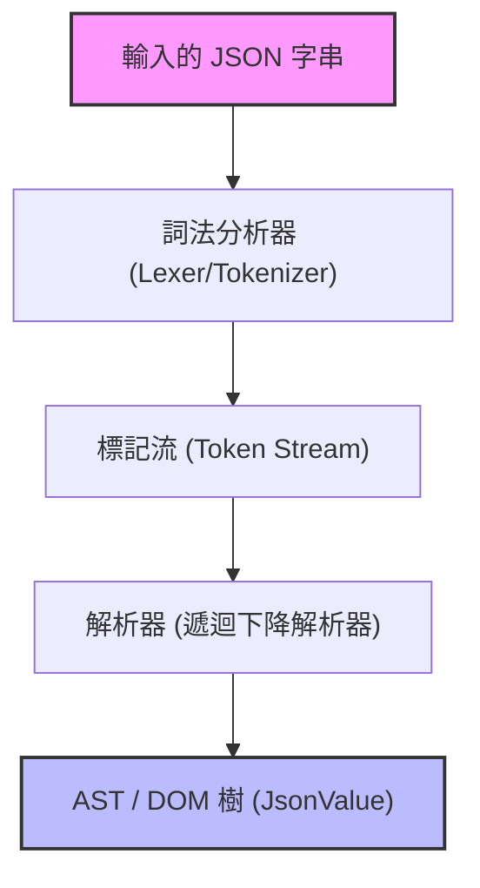
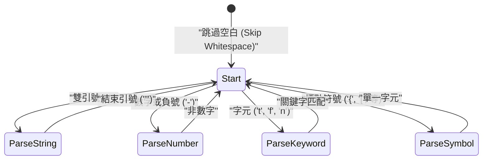

在網頁開發與系統間通訊中，目前最廣泛使用的資料描述語言，毫無疑問就是 **JSON (JavaScript Object Notation)**。雖然世上已經存在如 `RapidJSON` 或 `simdjson` 等非常優秀且高速的 JSON 解析器，在實務上將自製的解析器投入正式產品環境的機會或許不多，但**「自製 JSON 解析器」**卻是在學習語法分析、記憶體管理、字串處理以及效能調校上，非常出色的題材。

本文將詳細解說如何充分利用 C++17/C++20 的現代化功能（如 `std::string_view`、`std::variant`、`std::from_chars` 等），從零開始建構一個高速且記憶體效率極高的 JSON 解析器。

---

## 1. JSON 規範（RFC 8259）複習

JSON 的規範在 [RFC 8259](https://tools.ietf.org/html/rfc8259) 中有嚴格的定義。為了撰寫解析器，首先必須正確理解其規範。

JSON 的資料型別僅限於以下 6 種：

1. **Object（物件）**：字串鍵與值對應的無序集合。由 `{}` 包圍，各個鍵值對以 `,` 分隔。
2. **Array（陣列）**：值的有序列表。由 `[]` 包圍，值以 `,` 分隔。
3. **String（字串）**：由雙引號 `""` 包圍的 Unicode 字元序列。包含反斜線 `\` 的跳脫字元。
4. **Number（數值）**：整數或浮點數。不允許無限大（`Infinity`）或非數值（`NaN`）。
5. **Boolean（布林值）**：`true` 或 `false`。
6. **Null**：`null`。

在規範上，空白字元（Space, Horizontal Tab, Line Feed, Carriage Return）可以插入到標記（Token）之間的任何位置，我們必須在忽略這些字元的同時進行語法分析。

---

## 2. 解析器的架構

語法分析（Parsing）的過程，通常分為**詞法分析（Lexical Analysis）**與**語法分析（Syntactic Analysis）**兩個階段。



1. **詞法分析器（Lexer / Tokenizer）**：從頭讀取輸入的原始字串（字元陣列），將其分割成「具備意義的最小單位（標記/Token）」。
2. **解析器（Parser）**：讀取從詞法分析器接收到的標記序列，依照文法規則建構出樹狀結構（DOM 樹：文件物件模型）。

在本次的實作中，為了提升記憶體效率，詞法分析器不會複製字串，而是設計成只保留對原始輸入字串的指標與長度（`std::string_view`）。

---

## 3. AST (DOM) 模型的設計與現代 C++

為了在 C++ 中表示 JSON 的各種資料型別，我們將活用 C++17 引入的 `std::variant`。`std::variant` 是一種型別安全的聯合體（Union），非常適合用來表示具有動態型別特性的 JSON 資料。

```cpp
#include <string>
#include <vector>
#include <map>
#include <variant>
#include <memory>
#include <string_view>

// 前向宣告
class JsonValue;

// 定義 JSON 的資料型別
using JsonNull   = std::nullptr_t;
using JsonBool   = bool;
using JsonNumber = double;
using JsonString = std::string;
using JsonArray  = std::vector<JsonValue>;
using JsonObject = std::map<std::string, JsonValue>;

// 使用 std::variant，使其能夠保留其中一種型別
using JsonVariant = std::variant<
    JsonNull,
    JsonBool,
    JsonNumber,
    JsonString,
    JsonArray,
    JsonObject
>;

class JsonValue {
public:
    // 預設建構子初始化為 Null
    JsonValue() : m_value(nullptr) {}
    
    // 允許從各型別隱式轉換的建構子
    template <typename T>
    JsonValue(T&& val) : m_value(std::forward<T>(val)) {}

    // 型別判斷的輔助方法
    bool isNull() const { return std::holds_alternative<JsonNull>(m_value); }
    bool isBool() const { return std::holds_alternative<JsonBool>(m_value); }
    bool isNumber() const { return std::holds_alternative<JsonNumber>(m_value); }
    bool isString() const { return std::holds_alternative<JsonString>(m_value); }
    bool isArray() const { return std::holds_alternative<JsonArray>(m_value); }
    bool isObject() const { return std::holds_alternative<JsonObject>(m_value); }

    // 取值的輔助方法
    template <typename T>
    const T& get() const {
        return std::get<T>(m_value);
    }

private:
    JsonVariant m_value;
};
```

透過上述的設計，就能簡潔且安全地表達出遞迴式的資料結構 `JsonArray` 與 `JsonObject`（雖然在某些 C++ 標準函式庫的實作中，會限制在 `std::variant` 內使用不完整型別，這時可能需要使用智慧指標進行 Heap 配置，但在最新版的編譯器中，上述寫法大多能正常運作）。

---

## 4. 詞法分析器 (Lexer) 的實作

詞法分析器的角色是讀取字串並將其切割成標記（Token）。首先我們要定義標記的種類。

```cpp
enum class TokenType {
    Null,
    True,
    False,
    Number,
    String,
    LBrace,    // {
    RBrace,    // }
    LBracket,  // [
    RBracket,  // ]
    Colon,     // :
    Comma,     // ,
    EndOfFile  // EOF
};

struct Token {
    TokenType type;
    std::string_view value;
};
```

將詞法分析器的內部狀態轉換以 Mermaid 視覺化的話，會如下所示：



詞法分析器的實作本體如下。它會一邊跳過空白字元，一邊根據當前的字元進行分支（switch 敘述或 if 敘述）。

```cpp
class Lexer {
public:
    explicit Lexer(std::string_view source) : m_source(source), m_position(0) {}

    Token nextToken() {
        skipWhitespace();

        if (isAtEnd()) {
            return { TokenType::EndOfFile, "" };
        }

        char c = peek();

        switch (c) {
            case '{': advance(); return { TokenType::LBrace, "{" };
            case '}': advance(); return { TokenType::RBrace, "}" };
            case '[': advance(); return { TokenType::LBracket, "[" };
            case ']': advance(); return { TokenType::RBracket, "]" };
            case ':': advance(); return { TokenType::Colon, ":" };
            case ',': advance(); return { TokenType::Comma, "," };
            case '"': return lexString();
            default:
                if (c == '-' || std::isdigit(c)) {
                    return lexNumber();
                } else if (std::isalpha(c)) {
                    return lexKeyword();
                }
                throw std::runtime_error("Unexpected character");
        }
    }

private:
    std::string_view m_source;
    size_t m_position;

    bool isAtEnd() const { return m_position >= m_source.length(); }
    char peek() const { return m_source[m_position]; }
    void advance() { m_position++; }

    void skipWhitespace() {
        while (!isAtEnd()) {
            char c = peek();
            if (c == ' ' || c == '\t' || c == '\n' || c == '\r') {
                advance();
            } else {
                break;
            }
        }
    }

    Token lexString() {
        advance(); // 跳過開頭的引號
        size_t start = m_position;
        while (!isAtEnd() && peek() != '"') {
            // 本來應該在這裡嚴格處理跳脫字元（如 \" 或 \\ 等）
            if (peek() == '\\') {
                advance(); // 跳過跳脫字元的反斜線
            }
            advance();
        }
        
        if (isAtEnd()) throw std::runtime_error("Unterminated string");
        
        std::string_view strVal = m_source.substr(start, m_position - start);
        advance(); // 跳過結尾的引號
        return { TokenType::String, strVal };
    }

    Token lexNumber() {
        size_t start = m_position;
        while (!isAtEnd() && (std::isdigit(peek()) || peek() == '.' || peek() == 'e' || peek() == 'E' || peek() == '+' || peek() == '-')) {
            advance();
        }
        return { TokenType::Number, m_source.substr(start, m_position - start) };
    }

    Token lexKeyword() {
        size_t start = m_position;
        while (!isAtEnd() && std::isalpha(peek())) {
            advance();
        }
        std::string_view word = m_source.substr(start, m_position - start);
        
        if (word == "true") return { TokenType::True, word };
        if (word == "false") return { TokenType::False, word };
        if (word == "null") return { TokenType::Null, word };
        
        throw std::runtime_error("Unknown keyword");
    }
};
```

這裡的重點是，字串（String）或數值（Number）的值被擷取為 `std::string_view`。這表示在詞法分析器的階段，**完全不會發生任何動態記憶體配置（Heap Allocation）或複製**。這是與效能直接相關的重要設計。

---

## 5. 解析器（Parser）的實作：遞迴下降語法分析

詞法分析器完成後，接著就是解析器了。由於 JSON 的文法是 LL(1) 文法，因此與**遞迴下降語法分析（Recursive Descent Parsing）**非常契合。這種分析法只要「看著目前的單一標記」，就能決定接下來應該呼叫哪個函式。

```cpp
class Parser {
public:
    explicit Parser(std::string_view source) : m_lexer(source) {
        m_currentToken = m_lexer.nextToken();
    }

    JsonValue parse() {
        JsonValue result = parseValue();
        if (m_currentToken.type != TokenType::EndOfFile) {
            throw std::runtime_error("Extra tokens after root element");
        }
        return result;
    }

private:
    Lexer m_lexer;
    Token m_currentToken;

    void consumeToken() {
        m_currentToken = m_lexer.nextToken();
    }

    void expectAndConsume(TokenType expectedType) {
        if (m_currentToken.type != expectedType) {
            throw std::runtime_error("Unexpected token");
        }
        consumeToken();
    }

    JsonValue parseValue() {
        switch (m_currentToken.type) {
            case TokenType::Null:
                consumeToken();
                return JsonValue(nullptr);
            case TokenType::True:
                consumeToken();
                return JsonValue(true);
            case TokenType::False:
                consumeToken();
                return JsonValue(false);
            case TokenType::Number:
                return parseNumber();
            case TokenType::String:
                return parseString();
            case TokenType::LBrace:
                return parseObject();
            case TokenType::LBracket:
                return parseArray();
            default:
                throw std::runtime_error("Invalid value");
        }
    }

    JsonValue parseNumber() {
        std::string_view numStr = m_currentToken.value;
        consumeToken();
        
        double value = 0.0;
        // 使用 C++17 的 std::from_chars 進行高速解析
        auto [ptr, ec] = std::from_chars(numStr.data(), numStr.data() + numStr.size(), value);
        if (ec != std::errc()) {
            throw std::runtime_error("Invalid number format");
        }
        return JsonValue(value);
    }

    JsonValue parseString() {
        // 本來應該在這裡進行跳脫序列（\n, \uXXXX 等）的解碼處理，
        // 並建構實際的 std::string。
        std::string str(m_currentToken.value);
        consumeToken();
        return JsonValue(str);
    }

    JsonValue parseArray() {
        consumeToken(); // 消耗 '['
        JsonArray array;
        
        if (m_currentToken.type == TokenType::RBracket) {
            consumeToken(); // 空陣列
            return JsonValue(array);
        }

        while (true) {
            array.push_back(parseValue());
            if (m_currentToken.type == TokenType::Comma) {
                consumeToken();
            } else if (m_currentToken.type == TokenType::RBracket) {
                consumeToken();
                break;
            } else {
                throw std::runtime_error("Expected ',' or ']' in array");
            }
        }
        return JsonValue(array);
    }

    JsonValue parseObject() {
        consumeToken(); // 消耗 '{'
        JsonObject object;

        if (m_currentToken.type == TokenType::RBrace) {
            consumeToken(); // 空物件
            return JsonValue(object);
        }

        while (true) {
            if (m_currentToken.type != TokenType::String) {
                throw std::runtime_error("Expected string key in object");
            }
            
            std::string key(m_currentToken.value);
            consumeToken();
            
            expectAndConsume(TokenType::Colon);
            
            JsonValue value = parseValue();
            object[key] = value;
            
            if (m_currentToken.type == TokenType::Comma) {
                consumeToken();
            } else if (m_currentToken.type == TokenType::RBrace) {
                consumeToken();
                break;
            } else {
                throw std::runtime_error("Expected ',' or '}' in object");
            }
        }
        return JsonValue(object);
    }
};
```

遞迴下降解析器因為程式碼結構與 JSON 的文法（BNF）呈現一對一的對應關係，因此會變成直覺且易讀的程式碼。例如在 `parseObject` 中，語法解析是依照鍵（String） -> 冒號（Colon） -> 值（Value）的順序進行的。

---

## 6. 效能最佳化技巧

僅實作一個單純的解析器，是無法勝過實用等級的函式庫的。在此介紹幾個 C++ 特有的最佳化技巧。

### 6.1. 零複製 (Zero-Copy) 架構與 `std::string_view`
解析器效能瓶頸的絕大部份，在於「字串複製」與「Heap 記憶體的動態配置」。
若大量使用 `std::string`，每次建立子字串時都會發生記憶體配置。為防止這種情況，我們在詞法分析器中徹底使用了 `std::string_view`。
`std::string_view` 的建構時間不取決於字串的長度 $L$，能在 $O(1)$ 內完成。

### 6.2. 數值解析的最佳化 (`std::from_chars`)
標準函式庫的 `std::stod` 或 `sscanf`，會依賴於當前的語系（Locale）設定來運作，因此會在內部取得互斥鎖（Lock），或是產生在地化的額外負擔。
C++17 引入的 `std::from_chars`，由於不依賴語系設定，也不伴隨記憶體複製，因此在解析數值時具備壓倒性的效能。若將位數設為 $M$，時間複雜度為 $O(M)$。

### 6.3. 記憶體配置與 `std::pmr` (Polymorphic Memory Resources)
建構 AST 時，會因為 `std::vector` 或 `std::map` 的節點生成，產生大量小型的記憶體配置（記憶體碎片化）。
為了迴避這個問題，採用 C++17 的 `std::pmr::monotonic_buffer_resource` 作為自訂配置器（Custom Allocator）會非常有效。因為它只會事先配置一次大型的記憶體區塊，之後只需移動指標來切割記憶體，讓記憶體配置成本降至幾乎為零。

### 6.4. 活用 SIMD (進階)
在 `simdjson` 等最先進的解析器中，會使用 AVX2 或 NEON 等 SIMD 指令，一次掃描 32 位元組或 64 位元組的字串。這能讓跳過空白或是尋找引號的速度大幅飆升。本文的實作是採字元單位的掃描，但若是想追求極限，無分支（Branchless）程式設計與 SIMD 是不可或缺的。

---

## 7. 複雜度與演算法評估

接著來評估本解析器演算法層面的複雜度。
假設輸入的 JSON 字串總長度為 $N$ 位元組。

**時間複雜度 (Time Complexity):**
詞法分析器對每個字元只會參照常數次（通常是 1 次），而解析器對每個標記也只會進行常數次的處理。完全不會發生回溯（Backtracking/重新讀取）。因此，整體的 時間複雜度 為線性時間。

$$
T(N) = O(N)
$$

**空間複雜度 (Space Complexity):**
為了建構 AST（DOM 樹）所配置的記憶體，與 JSON 字串的元素數量成正比。即使考慮最壞的情況（例如：巨大的巢狀陣列 `[[[[...]]]]`），所需的記憶體量也會收斂在不超過輸入大小 $N$ 的常數倍以內。

$$
Space(N) \le C \times N \implies O(N)
$$

不過，在遞迴下降語法分析中，會消耗與 JSON 巢狀深度（Depth）成正比的呼叫堆疊（Call Stack）。對應深度 $D$，需要 $O(D)$ 的堆疊記憶體。如果被餵給惡意的無限巢狀 JSON，會有引發堆疊溢位（Stack Overflow）的危險。因此，在實用的解析器中，必須對遞迴深度設定上限（例如：256 或 512 等），或是將遞迴展開成迴圈。

---

## 8. 總結

本文解說了如何使用 C++ 從零開始自製 JSON 解析器的步驟。
- 透過**詞法分析器**將字串分割成標記，並使用 `std::string_view` 來抑制不必要的複製。
- 在**解析器**中使用遞迴下降語法分析，將標記轉換為 AST（`std::variant`）。
- 意識到**效能**，並應用 `std::from_chars` 與記憶體管理策略。

閱讀並理解語言規範，再將其落實為程式碼的經驗，能讓作為程式設計師的技能更上一層樓。請以這篇文章為墊腳石，務必嘗試親手擴充出自己專屬的解析器或序列化器（生成 JSON 字串），並挑戰進一步的最佳化（如導入自訂配置器或 SIMD 化等）。
