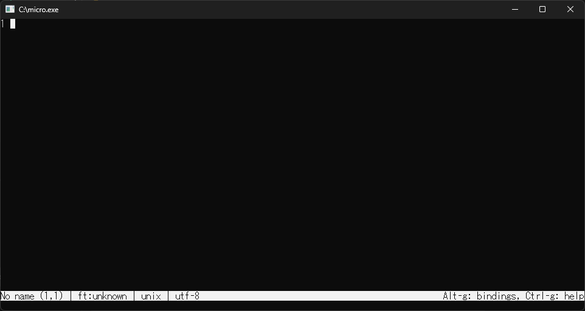

## microをダウンロードする
https://github.com/zyedidia/micro/releases

上記のリンクを開き、`Show all XX assets`(X部分は数字)をクリックして`micro-X.X.XX-win64.zip`(X部分は数字)をダウンロードする。
zipファイルを解凍して、ファイルを一式任意のフォルダーに配置する。

## 環境変数を設定する
コマンドプロンプトから`micro.exe`を使うためには、環境変数を設定する必要がある。

1. `Winキー` + `Rキー`を押して、`sysdm.cpl`と入力して`Enterキー`を押す。
2. `システムのプロパティ`の`システムのプロパティ`をクリックする。
3. `環境変数`をクリックする。
4. `システム環境変数`の`Path`を選択して`編集`をクリックする。
5. `新規`をクリックして、`micro.exe`が含まれるフォルダーのパスを追加する。
6. `OK`をクリックして、すべてのダイアログを閉じる。
7. コマンドプロンプトを再起動して、`nano`と入力して実行できるか確認する。

## microの使い方

コマンドプロンプトで`micro`と入力して実行すると、以下のような画面が表示される。

主な操作方法とショートカットキーは下記のとおりです。

| ショートカットキー | 操作 | 
|--------|-----| 
| Ctrl+Q | ファイルを閉じる | 
| Ctrl+S | ファイルを保存 | 
| Ctrl+O | ファイルを開く | 
| Ctrl+A | 全選択 | 
| Ctrl+X | 選択範囲切り取り | 
| Ctrl+C | 選択範囲コピー | 
| Ctrl+V | 貼り付け | 
| Ctrl+Z | 元に戻す | 
| Ctrl+Y | やり直し | 
| Ctrl+E | エディタコマンド実行 | 

## 参考
- [micro](https://micro-editor.github.io/)